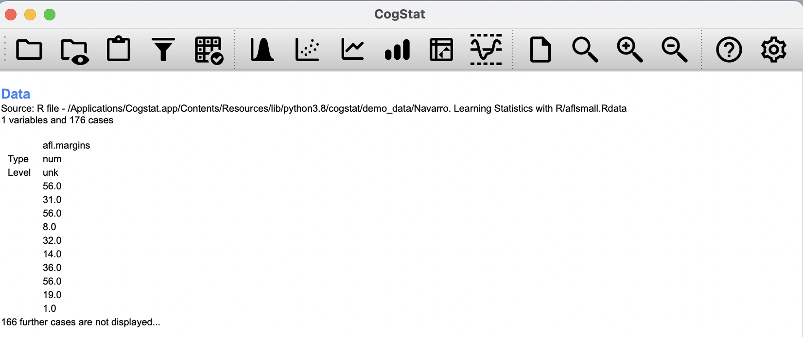
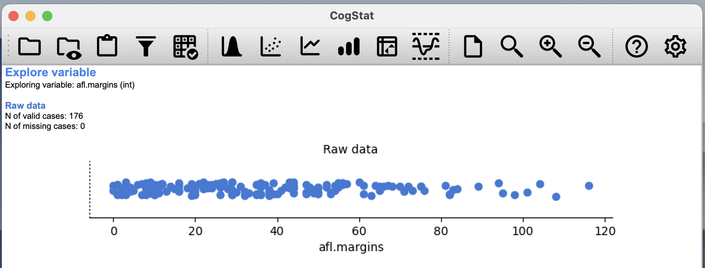
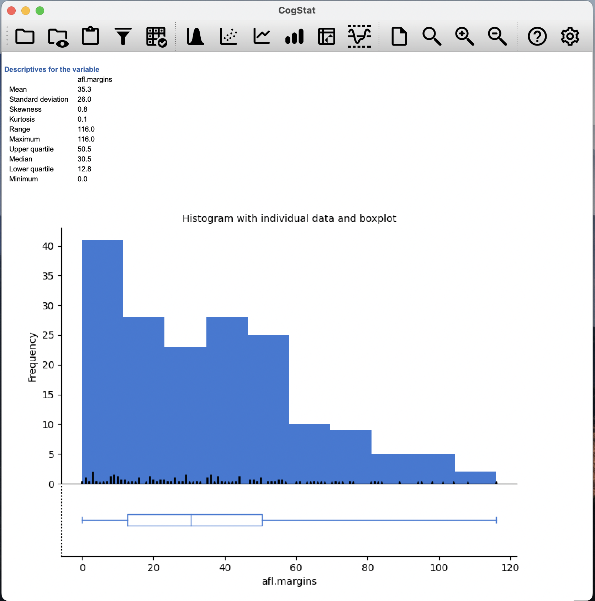
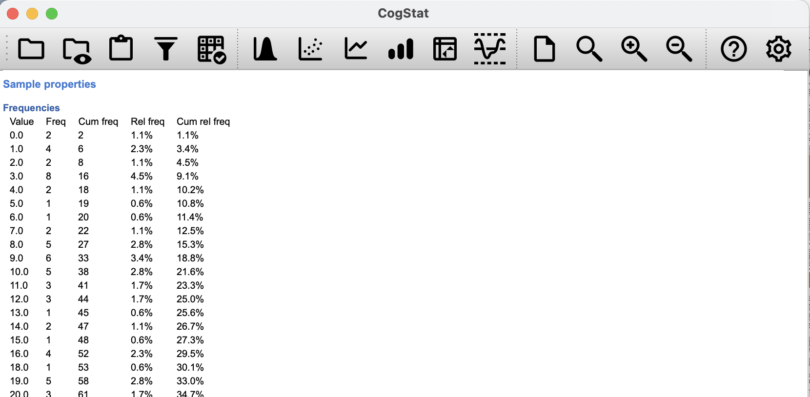

# (PART\*) DESCRIPTIVE STATISTICS{-}

# Exploring a variable

Any time you get a new data set to look at, one of the first things you might want to do is find ways of summarising the data in a compact, easily understood fashion. This is what **_descriptive statistics_** (as opposed to *inferential statistics*) is all about. In fact, to many people, the term "statistics" is synonymous with descriptive statistics.

The first dataset we'll be looking at is real data relating to the Australian Football League (AFL)^[Note for non-Australians: the AFL is an Australian rules football competition. You don't need to know anything about Australian rules in order to follow this section.]. To do this, let us load the [aflsmall.Rdata](resources/data/aflsmall.Rdata) file.

```{r loadaflsmall, out.width='70%', fig.align='center',echo=FALSE, fig.cap="This is what you would see after loading the dataset."}

```

CogStat will help you get familiar with some essential aspects of your variable, like:

- measures of central tendency (mean, median)
- measures of variability (range, minimum, maximum, standard deviation, quartiles)
- measures of "distortion" (skewness, kurtosis).

These will help you contextualise the results so the conclusions drawn from the variable will be valid.

To start understanding a variable, select
`Explore variable` so a pop-up appears. Move the name of the data you wish to analyse (in this case: `afl.margins`) from `Available variables` to `Selected variables`, then click `OK`.

```{r rawaflsmall, out.width='70%', fig.align='center',echo=FALSE, fig.cap="This is the first chart you will see exploring the raw shape of the data."}

```

The first piece of information here is $N$, which we will use to refer to the number of observations we're analysing. CogStat (or any other software for that matter) will only use valid data for calculations. Sometimes, mainly when working with survey data, you will have missing data points, the number of which you might have to mention in your written analysis. CogStat will quote these for you:

> `N of valid cases: 176`\
> `N of missing cases: 0`

```{r histogramaflsmall, out.width='70%', fig.align='center',echo=FALSE, fig.cap="Scrolling down, you'll see CogStat reporting all the descriptive measures while showing you a histogram to understand the shape of your data better. Drawing pictures of the data is an excellent way to convey the gist of what the data is trying to tell you; it's often instrumental to try to condense the data into a few simple summary statistics."}

```

In the rest of this chapter, we will explore what these measures mean and what they indicate.

## Measures of central tendency{#centraltendency}

In most situations, the first thing that you'll want to calculate is a measure of **_central tendency_**. That is, you'd like to know something about the "average" or "middle" of your data lies.

### The mean{#mean}

The **mean** of a set of observations is just a normal, old-fashioned (arithmetic) average: add all of the values up and then divide by the total number of values. The first five AFL margins were 56, 31, 56, 8 and 32 (which CogStat will quote to you when loading the data, see Figure \@ref(fig:loadaflsmall)), so the mean of these observations is just:
$$
\frac{56 + 31 + 56 + 8 + 32}{5} = \frac{183}{5} = 36.60
$$
Of course, this definition of the mean isn't news to anyone: averages (i.e. means) are used so often in everyday life that this is quite familiar.

We used $N$ to denote the number of observations. Now let's attach a label to the observations themselves. It's traditional to use $X$ for this, and to use subscripts to indicate which observation we're actually talking about. That is, we'll use $X_1$ to refer to the first observation, $X_2$ to refer to the second observation, and so on, all the way up to $X_N$ for the last one. The following table lists the 5 observations in the `afl.margins` variable, along with the mathematical symbol used to refer to it, and the actual value that the observation corresponds to:

```{r echo=FALSE}
knitr::kable(rbind(
              c("winning margin, game 1", "$X_1$", "56 points"),
              c("winning margin, game 2", "$X_2$", "31 points"),
              c("winning margin, game 3", "$X_3$", "56 points"),
              c("winning margin, game 4", "$X_4$", "8 points"),
              c("winning margin, game 5", "$X_5$", "32 points")),
col.names = c("the observation", "its symbol", "the observed value"),
  booktabs = TRUE)

```

Okay, now let's try to write a formula for the mean. By tradition, we use $\bar{X}$ as the notation for the mean. So the calculation for the mean could be expressed using the following formula:
$$
\bar{X} = \frac{X_1 + X_2 + ... + X_{N-1} + X_N}{N}
$$
This formula is entirely correct, but it's terribly long, so we make use of the **_summation symbol_** $\scriptstyle\sum$ to shorten it.^[The choice to use $\Sigma$ to denote summation isn't arbitrary: it's the Greek upper case letter sigma, which is the analogue of the letter S in that alphabet. Similarly, there's an equivalent symbol used to denote the multiplication of lots of numbers: because multiplications are also called "products", we use the $\Pi$ symbol for this; the Greek upper case pi, which is the analogue of the letter P.] If I want to add up the first five observations, I could write out the sum the long way, $X_1 + X_2 + X_3 + X_4 +X_5$ or I could use the summation symbol to shorten it to this:
$$
\sum_{i=1}^5 X_i
$$
Taken literally, this could be read as "the sum, taken over all $i$ values from 1 to 5, of the value $X_i$". But basically, what it means is "add up the first five observations". In any case, we can use this notation to write out the formula for the mean, which looks like this:
$$
\bar{X} = \frac{1}{N} \sum_{i=1}^N X_i 
$$

In all honesty, all this mathematical notation is just a fancy way of laying out the same things said in words: *add all the values up, and then divide by the total number of items*. The goal here was to try to make sure that everyone reading this book is clear on the notation that we'll be using throughout the book: $\bar{X}$ for the mean, $\scriptstyle\sum$ for the idea of summation, $X_i$ for the $i$th observation, and $N$ for the total number of observations. We're going to be re-using these symbols a fair bit, so you must understand them well enough to be able to "read" the equations and to be able to see what they're really saying.

CogStat calculates the mean automatically when exploring a variable using all valid data points, not just the first five. It will be part of the `Descriptives for the variable` section, as seen in Figure \@ref(fig:histogramaflsmall). The result for our variable is:

> `afl.margins`\
> `Mean 35.3`

### The median{#median}

The second measure of central tendency people use a lot is the **median**, and it's even easier to describe than the mean. The median of a set of observations is just the middle value^[*medianus* is Latin for "the one in the middle", originating from the word *medius*, meaning "the middle".]. As before, let's imagine we were interested only in the first 5 AFL winning margins: 56, 31, 56, 8 and 32. To figure out the median, we sort these numbers into ascending order:

$$
8, 31, \mathbf{32}, 56, 56
$$

From inspection, it's evident that the median value of these five observations is 32 since that's the middle one in the sorted list. Easy stuff. But what should we do if we were interested in the first six games rather than the first 5? Since the sixth game in the season had a winning margin of 14 points, our sorted list is now

$$
8, 14, \mathbf{31}, \mathbf{32}, 56, 56
$$

and there are *two* middle numbers, 31 and 32. The median is defined as the average of those two numbers, which is 31.5.

In the data set we loaded to CogStat, there were 176 valid cases, so we ought to have two middle numbers. The result in this case is (as seen in Figure \@ref(fig:histogramaflsmall)):

> `afl.margins`\
> `Median 30.5`

### Mean or median? What's the difference?

```{r meanmedian, out.width='70%', fig.align='center', echo=FALSE, fig.cap="An illustration of the difference between how the mean and the median should be interpreted. The mean is basically the \"centre of gravity\" of the data set: if you imagine that the histogram of the data is a solid object, then the point on which you could balance it (as if on a see-saw) is the mean. In contrast, the median is the middle observation. Half of the observations are smaller, and half of the observations are larger."}
knitr::include_graphics("./resources/meanmedian.png")
```

Knowing how to calculate means and medians is only a part of the story. You also need to understand what each one is saying about the data, what that implies, and which one to choose. This is illustrated in Figure \@ref(fig:meanmedian); the mean is kind of like the "centre of gravity" of the data set, whereas the median is the "middle value" in the data. What this implies about which one you should use depends a little on what type of data you've got and what you're trying to achieve. As a rough guide:
 
- If your data are *[nominal scale](#nominalscale)*, you probably shouldn't be using either the mean or the median. Both the mean and the median rely on the idea that the numbers assigned to values are meaningful. If the numbering scheme is arbitrary, then it's probably best to use the mode (Section \@ref(mode)) instead.
- If your data are *[ordinal scale](#ordinalscale)*, you're more likely to want to use the median than the mean. The median only uses the order information in your data (i.e., which numbers are larger) but doesn't depend on the precise numbers involved. That's precisely the situation that applies when your data are ordinal scale. Conversely, the mean makes use of the precise numeric values assigned to the observations, so it's not appropriate for ordinal data.
- For *[interval](#intervalscale)* and *[ratio scale](#ratioscale)* data, either one is generally acceptable. Which one you pick depends a bit on what you're trying to achieve. The mean has the advantage of using all the information in the data (which is useful when you don't have a lot of data), but it's very susceptible to extreme values, as we'll see in Section \@ref(trimmedmean).

Let's expand on that last part a little. One consequence is that there are systematic differences between the mean and the median when the histogram is asymmetric (skewed; see Section \@ref(skewnesskurtosis)). This is illustrated in Figure \@ref(fig:meanmedian) notice that the median (right hand side) is located closer to the "body" of the histogram, whereas the mean (left hand side) gets dragged towards the "tail" (where the extreme values are). To give a concrete example, suppose Bob (income \$50,000), Kate (income \$60,000) and Jane (income \$65,000) are sitting at a table: the average income at the table is \$58,333 and the median income is \$60,000. Then Bill sits down with them (income \$100,000,000). The average income has now jumped to \$25,043,750 but the median rises only to \$62,500. If you're interested in looking at the overall income at the table, the mean might be the right answer; but if you're interested in what counts as a typical income at the table, the median would be a better choice here.

### Trimmed mean{#trimmedmean}

One of the fundamental rules of applied statistics is that the data are messy. Real life is never simple, so the data sets you obtain are never as straightforward as the statistical theory says.^[Or at least, the basic statistical theory. These days, a whole subfield of statistics called *robust statistics* tries to grapple with the messiness of real data and develop the theory that can cope with it.] This can have awkward consequences. To illustrate, consider this rather strange-looking data set:
$$
-100,2,3,4,5,6,7,8,9,10
$$
If you were to observe this in a real-life data set, you'd probably suspect that there is something odd about the $-100$ value. It's probably an **outlier**, a value that doesn't belong with the others. You might consider removing it from the data set entirely. In this particular case, it might be the right call. In real life, however, you don't always get such cut-and-dried examples. For instance, you might get this instead:
$$
-15,2,3,4,5,6,7,8,9,12
$$
The $-15$ looks suspicious, but not as much as that $-100$ did. In this case, it's a little trickier. It *might* be a legitimate observation; it might not.

When faced with a situation where some of the most extreme-valued observations might not be quite trustworthy, the mean is not necessarily a good measure of central tendency. It is highly sensitive to one or two extreme values and thus is not considered a *robust* measure. One remedy that we've seen is to use the median. A more general solution is to use a "trimmed mean". To calculate a trimmed mean, what you do is "discard" the most extreme examples on both ends (i.e., the largest and the smallest) and then take the mean of everything else. The goal is to preserve the best characteristics of the mean and the median: just like a median, you aren't highly influenced by extreme outliers, but like the mean, you "use" more than one of the observations.

Generally, we describe a trimmed mean in terms of the percentage of observations on either side that are discarded. So, for instance, a 10% trimmed mean discards the largest 10% of the observations *and* the smallest 10% of the observations and then takes the mean of the remaining 80% of the observations. Not surprisingly, the 0% trimmed mean is just the regular mean, and the 50% trimmed mean is the median. In that sense, trimmed means provide a whole family of central tendency measures that span the range from the mean to the median.

For our toy example above, we have 10 observations. So a 10% trimmed mean is calculated by ignoring the largest value (i.e. $12$) and the smallest value (i.e. $-15$) and taking the mean of the remaining values. 

> `Mean: 4.1`\
> `Median: 5.5`

That's a fairly substantial difference. But the mean is being influenced too much by the extreme values at either end of the data set, especially the $-15$ one.  If we take a 10% trimmed mean, we'll drop the extreme values on either side and take the mean of the rest: 

> `Mean: 5.5`

Which, in this case, gives exactly the same answer as the median.

Currently, there is no direct way for you to do that in CogStat, but you can certainly trim those outlying data points in your source file and re-load the data.

### Mode{#mode}

The **mode** of a sample is straightforward: it is the value that occurs most frequently.

In CogStat, you will see a **frequency table** (Figure \@ref(fig:freqaflsmall)) of the values in your data if you have `Frequencies` ticked in the `Explore variable` dialogue.

```{r freqaflsmall, out.width='70%', fig.align='center',echo=FALSE, fig.cap="The frequency table sorts non-nominal values from lowest to highest."}

```

While it's generally true that the mode is most often calculated when you have [nominal scale](#nominalscale) data -- because means and medians are useless for those sorts of variables --, there are some situations in which you do want to know the mode of an [ordinal](#ordinalscale), [interval](#intervalscale) or [ratio scale](#ratioscale) variable.

For instance, let's look at our `afl.margins` variable we loaded into CogStat. This variable is clearly ratio scale, and so in most situations the mean or the median is the measure of central tendency that you want. But consider this scenario... a friend of yours is offering a bet. They pick a football game at random, and (without knowing who is playing) you have to guess the *exact* margin. If you guess correctly, you win \$50. If you don't, you lose \$1. There are no consolation prizes for "almost" getting the right answer. You have to guess exactly the right margin^[This is called a "0-1 loss function", meaning that you either win (1) or you lose (0), with no middle ground.] For this bet, the mean and the median are completely useless to you. It is the mode that you should bet on. So, we look at the frequency table offered by the result set: the data suggest you should bet on a $3.0$ point margin, and since this was observed in 8 of the 176 games (4.5% of games -- the *relative frequency*), the odds are firmly in your favour.

## Measures of variability{#var}

The statistics that we've discussed so far all relate to *central tendency*. They all talk about which values are "in the middle" or "popular" in the data. However, central tendency is not the only type of summary statistic that we want to calculate. The second thing that we really want is a measure of the **variability** of the data. That is, how "spread out" are the data? How "far" away from the mean or median do the observed values tend to be? For now, let's assume that the data are interval or ratio scale, so we'll continue to use the `afl.margins` data. We'll use this data to discuss several different measures of spread, each with different strengths and weaknesses. 

### Range{#range}

The **range** of a variable is very simple: it's the largest value minus the smallest value. For the AFL winning margins data, the maximum value is $116$, and the minimum is $0$, so the range is:

$$116-0=\mathbf{116}$$

CogStat automatically calculates all these values (see Figure \@ref(fig:histogramaflsmall)), so there is nothing we need to do about this, only to understand what it implies.

Although the range is the simplest way to quantify the notion of "variability", it's one of the worst. Recall from our discussion of the mean that we want our summary measure to be robust. If the data set has one or two extremely bad values in it, we'd like our statistics not to be unduly influenced by these cases. Let us look once again at our toy example of a data set containing very extreme outliers:
$$
-100,2,3,4,5,6,7,8,9,10
$$

It is clear that the range is not robust since this has a range of $110$, but if the outlier was removed, we would have a range of only $8$.

### Interquartile range{#IQR}

The **interquartile range** (IQR) is like the range, but instead of calculating the difference between the largest and smallest value, it calculates the difference between the 25th and 75th quantile.

Probably you already know what a **quantile** is (or more commonly called **percentile**), but if not: the 10th percentile of a data set is the smallest number $x$ such that 10% of the data is less than $x$. In fact, we've already come across the idea: the median of a data set is its 50th quantile/percentile! **Quartile** is another specific term used for the 25th (lower), 50th (median), and 75th (upper) percentile, as it is splitting the data set into four (hence '*quart-*') equal parts.^[It'd be remiss if we didn't mention *quintiles*, which is splitting the data set into five equal parts, with the split points being the 20th, 40th, 60th, and 80th percentiles. And there are *tertiles* and *deciles* -- but now we're just getting sidetracked.]

CogStat provides you with both the 25th (`Lower quartile`) and 75th quantiles (`Upper quartile`):

> `Upper quartile: 50.5`\
> `Lower quartile: 12.8`

We can see that the interquartile range for the 2010 AFL winning margins data is:
$$
50.5 - 12.8 = \mathbf{37.7}
$$

While it's obvious how to interpret the range, it's a little less obvious how to interpret the IQR. The simplest way to think about it is like this: the interquartile range is the range spanned by the "middle half" of the data. That is, one quarter of the data falls below the 25th percentile, one quarter of the data is above the 75th percentile, leaving the "middle half" of the data lying in between the two. And the IQR is the range covered by that middle half.

### Mean absolute deviation{#aad}

The two measures we've looked at so far, the range and the interquartile range, both rely on the idea that we can measure the spread of the data by looking at quantiles. However, this isn't the only way to think about the problem. A different approach is to select some meaningful reference point (usually the mean or the median) and then report the "typical" deviations from that. What do we mean by "typical" deviation? Usually, the mean or median value of these deviations. In practice, this leads to two different measures, the "mean absolute deviation" (from the mean) and the "median absolute deviation" (from the median). The measure based on the median seems to be used in statistics and might be the better of the two, but it's less frequently used in psychology, per Danielle's observation. The measure based on the mean occasionally shows up in psychology; hence we will cover this measure in this chapter.

One useful thing about **mean absolute deviation** is that the name tells you exactly how to calculate it. Let's think about our AFL winning margins data, and once again we'll start by pretending that there's only 5 games in total, with winning margins of 56, 31, 56, 8 and 32. Since our calculations rely on an examination of the deviation from some reference point (in this case, the mean), the first thing we need to look up is the mean, $\bar{X}$. For these five observations, our mean is $\bar{X} = 36.6$. The next step is to convert each of our observations $X_i$ into a deviation score. We do this by calculating the difference between the observation $X_i$ and the mean $\bar{X}$. That is, the deviation score is defined to be $X_i - \bar{X}$. For the first observation in our sample, this is equal to $56 - 36.6 = 19.4$. The next step in the process is to convert these deviations to absolute deviations. Mathematically, we would denote the absolute value of $-3$ as $|-3|$, and so we say that $|-3| = 3$. We use the absolute value function here because we don't care whether the value is higher than the mean or lower than the mean; we're just interested in how *close* it is to the mean. To help make this process as obvious as possible, the table below shows these calculations for all five observations:

```{r echo=FALSE}
knitr::kable(rbind(
 c("winning margin, game 1", "$X_1$", "56 points"),
 c("winning margin, game 2", "$X_2$", "31 points"),
 c("winning margin, game 3", "$X_3$", "56 points"),
 c("winning margin, game 4", "$X_4$", "8 points"),
 c("winning margin, game 5", "$X_5$", "32 points")),
col.names = c("the observation", "its symbol", "the observed value"),
 booktabs = TRUE)

```

Now that we have calculated the absolute deviation score for every observation in the data set, we only have to calculate the mean of these scores. Let's do that:
$$
\frac{19.4 + 5.6 + 19.4 + 28.6 + 4.6}{5} = 15.52
$$
And we're done. The mean absolute deviation for these five scores is 15.52. 

However, while our calculations for this little example are at an end, we do have a couple of things left to talk about. Firstly, we should really try to write down a proper mathematical formula. But in order to do this, we need some mathematical notation to refer to the mean absolute deviation. Irritatingly, "mean absolute deviation" and "median absolute deviation" have the same acronym (MAD), which leads to a certain amount of ambiguity. What we'll do is use AAD instead, short for *average* absolute deviation. Now that we have some unambiguous notation, here's the formula that describes what we just calculated:
$$
\mbox{}(X) = \frac{1}{N} \sum_{i = 1}^N |X_i - \bar{X}|
$$

The last thing we must discuss is how to calculate AAD in CogStat. Currently, the software does not automatically compute this, and no manual interventions exist. This calculation might get added in a future release if needed, but if you bear with us for two more chapters, you'll see a more useful measure instead.

### Variance

Although the mean absolute deviation measure has its uses, it's not the best measure of variability. From a purely mathematical perspective, there are some solid reasons to prefer squared deviations over absolute deviations. With square deviations, we obtain a measure called **variance**.

The variance of a data set $X$ is sometimes written as $\mbox{Var}(X)$, but it's more commonly denoted $s^2$. The reason for this will become clearer shortly. The formula that we use to calculate the variance of a set of observations is as follows:
$$
\mbox{Var}(X) = \frac{1}{N} \sum_{i=1}^N \left( X_i - \bar{X} \right)^2
$$
$$\mbox{Var}(X) = \frac{\sum_{i=1}^N \left( X_i - \bar{X} \right)^2}{N}$$
As you can see, it's basically the same formula that we used to calculate the mean absolute deviation, except that instead of using "absolute deviations", we use "squared deviations". For this reason, the variance is sometimes referred to as the "mean square deviation".

Variances are *additive*. Here's what that means: suppose we have two variables ($X$ and $Y$), whose variances are $\mbox{Var}(X)$ and $\mbox{Var}(Y)$ respectively. Now imagine we want to define a new variable $Z$ that is the sum of the two, $Z = X+Y$. As it turns out, the variance of $Z$ is equal to $\mbox{Var}(X) + \mbox{Var}(Y)$. This is a *very* useful property, but it's not true of the other measures.

Now that we've got the basic idea let's look at a concrete example. Once again, let's use the first five AFL games as our data. If we follow the same approach that we took last time, we end up with the following table:

```{r echo=FALSE}
knitr::kable(rbind(c(1 , 56 , 19.4 , 376.36),
 c(2 , 31 , -5.6 , 31.36),
 c(3 , 56 , 19.4 , 376.36),
 c(4 , 8 , -28.6 , 817.96),
 c(5 , 32 , -4.6 , 21.16)),
col.names = c( 
 "$i$ [which game]",
 "$X_i$ [value]",
 "$X_i - \\bar{X}$ [deviation from mean]",
 "$(X_i - \\bar{X})^2$ [absolute squared deviation]"),
 booktabs = TRUE)
```

That last column contains all of our squared deviations, so all we have to do is average them.

$$
\frac{( 376.36 + 31.36 + 376.36 + 817.96 + 21.16 )}{5} = 324.64
$$

Exciting, isn't it? Now, let's tackle the burning question you're probably thinking: What does a variance of 324.64 mean? How do you *interpret* the variance? Descriptive statistics are supposed to describe things, after all, and right now, the variance is really just a gibberish number. Unfortunately, the reason why we haven't given you the human-friendly interpretation of the variance is that there really isn't one. This is the most serious problem with the variance. Although it has some elegant mathematical properties that suggest that it really is a fundamental quantity for expressing variation, it's utterly useless if you want to communicate with an actual human. Variances are completely uninterpretable in terms of the original variable. All the numbers have been squared, and they don't mean anything anymore. This is a huge issue.

CogStat will not attempt to interpret the variance nor will it give you the raw value. But the next chapter will show you another measure instead: the *standard deviation*.

### Standard deviation{#sd}

Suppose you would like to have a measure expressed in the same units as the data itself (i.e. points, not points-squared). What should you do? The solution to the problem is obvious: take the square root of the variance, known as the **standard deviation**, also called the "root mean squared deviation", or RMSD. This solves our problem fairly neatly: while nobody has a clue what "a variance of 324.68 points-squared" really means, it's much easier to understand "a standard deviation of 18.01 points" since it's expressed in the original units. It is traditional to refer to the standard deviation of a sample of data as $s$, though "**SD**" and "**Std dev.**" are also used at times. Because the standard deviation is equal to the square root of the variance, you probably won't be surprised to see that the formula is:
$$
s = \sqrt{ \frac{1}{N} \sum_{i=1}^N \left( X_i - \bar{X} \right)^2 }
$$

Because the standard deviation is derived from the variance, and the variance is a quantity that has little to no meaning that makes sense to us humans, the standard deviation doesn't have a simple interpretation. As a consequence, most of us rely on a simple rule of thumb: in general, you should expect 68% of the data to fall within 1 standard deviation (1 sigma) of the mean, 95% of the data to fall within 2 standard deviation (2 sigmas) of the mean, and 99.7% of the data to fall within 3 standard deviations (3 sigmas) of the mean. This rule tends to work pretty well most of the time, but it's not exact: it's actually calculated based on an *assumption* that the histogram is symmetric and "bell shaped", i.e. the data are *normally* distributed, which is an important concept that we'll discuss more in Chapter \@ref(probability).

So how do we interpret standard deviation? Basically, if the standard deviation is small (relatively closer to zero), then the data are clustered close to the mean. Conversely, if the standard deviation is large (relatively closer to the interquartile range), then the data are more spread out.

As you can tell from the AFL winning margins histogram in Figure \@ref(fig:histogramaflsmall), this isn't exactly true of our data! Even so, the rule is approximately correct. As it turns out, 65.3% of the AFL margins data fall within one standard deviation of the mean.

### Median absolute deviation {#mad}

The last measure of variability to talk about is the **median absolute deviation** (MAD). The basic idea behind MAD is identical to the one behind the mean absolute deviation (Section \@ref(aad)). The difference is that you use the median everywhere. 

This has a straightforward interpretation: every observation in the data set lies some distance away from the typical value (the median). So the MAD is an attempt to describe a *typical deviation from a typical value* in the data set. It wouldn't be unreasonable to interpret the MAD value of $19.5$ for our AFL data by saying something like this:

>The median winning margin in 2010 was 30.5, indicating that a typical game involved a winning margin of about 30 points. However, there was a fair amount of variation from game to game: the MAD value was 19.5, indicating that a typical winning margin would differ from this median value by about 19-20 points.

In the same way that the mean is very sensitive to extreme values, so is the standard deviation. So, in much the same way that people sometimes use the median as a "robust" way of calculating "something that is like the mean", it's not uncommon to use MAD as a method for calculating "something that is like the standard deviation". Unfortunately, the *raw* MAD value doesn't do this. Our raw MAD value is 19.5, and our standard deviation was 26.07. Under the assumption again that the data are normally distributed, you can multiply the raw MAD value by 1.4826 and obtain a number that is directly comparable to the standard deviation. That's really *not* true for our `afl.margins` data, so in this case I wouldn't try to use the MAD value this way.

As standard deviation is used almost all of the time in psychology research, CogStat will not be calculating MAD for you.

### Which measure to use?

We've discussed quite a few measures of spread (range, IQR, MAD, variance and standard deviation) and hinted at their strengths and weaknesses. Here's a quick summary:

- *Range*. Gives you the full spread of the data. It's very vulnerable to outliers, and as a consequence, it isn't often used unless you have good reasons to care about the extremes in the data.
- *Interquartile range*. Tells you where the "middle half" of the data sits. It's pretty robust and complements the median nicely. This is used a lot.
- *Mean absolute deviation*. Tells you how far "on average" the observations are from the mean. It's very interpretable but has a few minor issues that make it less attractive to statisticians than the standard deviation. Used sometimes, but not often.
- *Variance*. Tells you the average squared deviation from the mean. It's mathematically elegant and is probably the "right" way to describe variation around the mean, but it's completely uninterpretable because it doesn't use the same units as the data. Almost never used except as a mathematical tool, but it's buried "under the hood" of a very large number of statistical tools.
- *Standard deviation*. This is the square root of the variance. It's fairly elegant mathematically, and it's expressed in the same units as the data, so it can be interpreted pretty well. In situations where the mean is the measure of central tendency, this is the default. This is by far the most popular measure of variation. 
- *Median absolute deviation*. The typical (i.e., median) deviation from the median value. In the raw form, it's simple and interpretable; in the corrected form, it's a robust way to estimate the standard deviation for some kinds of data sets. Not used very often, but it does get reported sometimes.

In short, the IQR and the standard deviation are easily the two most common measures used to report the variability of the data. Still, there are situations in which range or other measures are used.

## Skewness and kurtosis{#skewnesskurtosis}

There are two more descriptive statistics that you will sometimes see reported in the psychological literature, known as **skewness** and **kurtosis**. In practice, neither is used nearly as frequently as the central tendency and variability measures we've discussed. Skewness is critical, so you see it mentioned a fair bit.

```{r skewness, fig.cap="An illustration of skewness. On the left we have a negatively skewed data set (skewness $= -.93$), in the middle we have a data set with no skew (technically, skewness $= -.006$), and on the right we have a positively skewed data set (skewness $= .93$).", echo=FALSE}
library(psych)

 x1 <- rbeta(n = 100000, shape1= 10, shape2 = 2)
 x2 <- rbeta(n = 100000, shape1= 10, shape2 = 10)
 x3 <- rbeta(n = 100000, shape1= 2, shape2 = 10)
 X <- list(x1,x2,x3)

 plot.new()
 old <- par(no.readonly = TRUE)
 par(mfrow=c(1,3))

 ttl = c("Negative Skew", "No Skew", "Positive Skew")

 for (i in 1:3) {

 hist(x = X[[i]],
 breaks = seq(0,1,.05),
 xlab = "",
 ylab = "",
 main = ttl[i],
 axes = FALSE,
 col = "cornflowerblue",
 border = "white",
 font.main = 1
 )

 }
 par( old )
```

Since it's the more interesting of the two, let's start by talking about the **skewness**. Skewness is basically a measure of asymmetry, and the easiest way to explain it is by drawing some pictures. As Figure \@ref(fig:skewness) illustrates, if the data tend to have a lot of extreme small values (i.e., the lower tail is "longer" than the upper tail) and not so many extremely large values (left panel), then we say that the data are *negatively skewed*. On the other hand, if there are more extremely large values than extremely small ones (right panel) we say that the data are *positively skewed*. That's the qualitative idea behind skewness. The actual formula for the skewness of a data set is as follows
$$
\mbox{skewness}(X) = \frac{1}{N \hat{\sigma}^3} \sum_{i=1}^N (X_i - \bar{X})^3
$$
where $N$ is the number of observations, $\bar{X}$ is the sample mean, and $\hat{\sigma}$ is the standard deviation (the "divide by $N-1$" version, that is).

Not surprisingly, it turns out that the AFL winning margins data is fairly skewed: $0.8$.

Put simply, **kurtosis** is a measure of the "pointiness" of a data set, as illustrated in Figure \@ref(fig:kurtosis).

```{r kurtosis, fig.cap="An illustration of kurtosis. On the left, we have a \"platykurtic\" data set (kurtosis = $-.95$), meaning that the data set is \"too flat\". In the middle we have a \"mesokurtic\" data set (kurtosis is almost exactly 0), which means that the pointiness of the data is just about right. Finally, on the right, we have a \"leptokurtic\" data set (kurtosis $= 2.12$) indicating that the data set is \"too pointy\". Note that kurtosis is measured with respect to a normal curve (black line)", echo=FALSE}

 #x1 <- c(rexp(n = 5000, rate =2), -rexp(n = 5000, rate =2) )
 x3 <- c(rnorm(n = 50000, mean =0, sd = 1), (runif(n = 50000)-.5)+rnorm(50000,0,.1) )*1.6
 x2 <- rnorm(n = 100000, mean = 0, sd = 1)*1.2
 x1 <- (runif(n = 100000) + rnorm(100000, mean =0, sd = .1) -.5)*4
 X <- list(x1,x2,x3)

 plot.new()
 old <- par(no.readonly = TRUE)
 par(mfrow=c(1,3))

 ttl = c( 'Platykurtic\n("too flat")','Mesokurtic', 'Leptokurtic\n("too pointy")')

 for (i in 1:3) {


 hist(x = X[[i]],
 breaks = seq(-20.5,20.5,.5),
 ylim =c(0,.45),
 xlim = c(-5,5),
 xlab = "",
 ylab = "",
 main = ttl[i],
 axes = FALSE,
 freq = FALSE,
 col = "cornflowerblue",
 font.main=1,
 border = "white"
 )

 lines(x <- seq(-4,4,.01), y = dnorm(x, mean(X[[i]]), sd(X[[i]])), 
 lwd = 2, lty = 1, col = "black")

 }
 par( old )

```

By convention, we say that the "normal curve" (black lines) has zero kurtosis, so the pointiness of a data set is assessed relative to this curve. In this Figure, the data on the left is not pointy enough, so the kurtosis is negative, and we call the data *platykurtic*. The data on the right are too pointy, so the kurtosis is positive and we say that the data is *leptokurtic*. But the data in the middle are just pointy enough, so we say that it is *mesokurtic* and has kurtosis zero. This is summarised in the table below:

```{r echo=FALSE}
knitr::kable(rbind(
 c("too flat" , "platykurtic", "negative"),
 c("just pointy enough", "mesokurtic", "zero"),
 c("too pointy", "leptokurtic", "positive")),

col.names = c("informal term", "technical name", "kurtosis value"),
 booktabs = TRUE)
```

The equation for kurtosis is similar in spirit to the formulas we've seen already for the variance and the skewness. Except that where the variance involved squared deviations and the skewness involved cubed deviations, the kurtosis involves raising the deviations to the fourth power:^[The "$-3$" part is something that statisticians tack on to ensure that the normal curve has kurtosis zero. It looks a bit funny, just sticking a "-3" at the end of the formula, but there are good mathematical reasons for doing this.]
$$
\mbox{kurtosis}(X) = \frac{1}{N \hat\sigma^4} \sum_{i=1}^N \left( X_i - \bar{X} \right)^4 - 3
$$

When reading the automatically calculated kurtosis value from our CogStat result set, we discover that the AFL winning margins data is just pointy enough: $0.1$.

## Summary: descriptives

We have covered some key aspects of how to summarise what we have learned about the data. As a summary, the following table lists the measures that CogStat will calculate for you, with a brief explanation of what they are and how they are used.

```{r echo=FALSE}
library(kableExtra)
knitr::kable(rbind(
              c("[Mean](#mean)", "35.3", "Average -- the \"centre of gravity\" of the data"),
              c("[Standard deviation](#sd)", "26.0", "How clustered is the data around the mean (smaller figure means more clustered, larger figure closer to interquartile range means more spread out)"),
              c("[Skewness](#skewnesskurtosis)", "0.8", "The assymetry of the data compared to a normal distribution (bell curve)"),
              c("[Kurtosis](#skewnesskurtosis)", "0.1", "Pointiness of the data. Smaller figure means more pointy, larger figure means less pointy"),
              c("[Range](#range)", "116.0", "The spread of the data set between the maximum and minimum values"),
              c("[Maximum](#range)", "116.0", "The highest value in the data set"),
              c("[Upper quartile](#IQR)", "50.5", "25% of the data points reside at and above this value"),
              c("[Median](#median)", "30.5", "This is the value of the data point in the middle (or the average of the two middle points in case of even number of data points). 50-50% of data points reside at above and below this value"),
              c("[Lower quartile](#IQR)", "12.8", "25% of the data points reside at and below this value"),
              c("[Minimum](#range)", "0.0", "The lowest value in the data set")
              ),
  col.names = c("", "afl.margins", "Meaning"),
  booktabs = TRUE,
  caption = "Descriptives for the variable",
  align = c("l", "c", "l")
  ) %>%
  column_spec(1, width_min = "1.5in")

```
