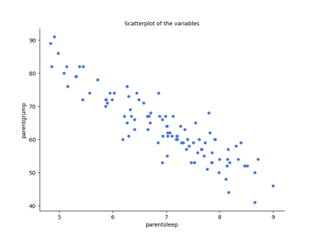
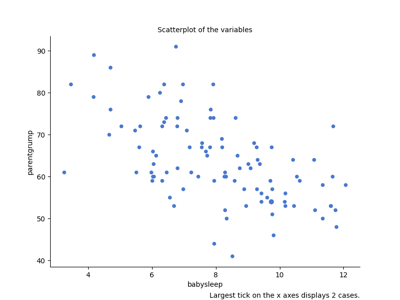
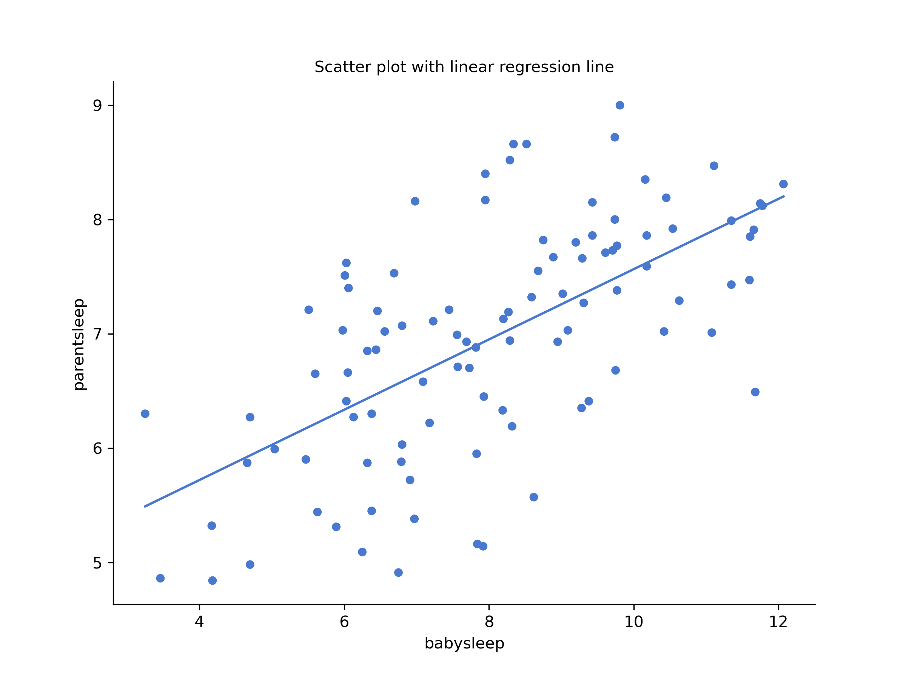

# Correlations{#correl}

Up to this point we have focused entirely on how to construct descriptive statistics for a single variable. What we haven't done is talked about how to describe the relationships *between* variables in the data. To do that, we want to talk mostly about the **correlation** between variables. But first, we need some data.

After spending so much time looking at the AFL data, let's turn to a topic close to every parent's heart: sleep. The following data set is fictitious, but based on real events. Suppose we're curious to find out how much a baby's sleeping habits affect the parent's mood. Let's say that we can rate parent grumpiness very precisely on a scale from 0 (not at all grumpy) to 100 (very, very grumpy). And, lets also assume that we've been measuring parent grumpiness, parent sleeping patterns and the baby's sleeping patterns for 100 days.

```{r loadparenthood, out.width='70%', fig.align='center',echo=FALSE, fig.cap="This is what you would see after loading the [parenthood.csv](resources/data/parenthood.csv) dataset."}

```

As described in Chapter \@ref(exploringavariable), we can get all the necessary descriptive statistics for all the variables: `parentsleep`, `babysleep` and `grumpiness`. Let's summarise all these into a neat little table.

```{r parenthoodtab, echo=FALSE}
knitr::kable(cbind(
                c("" , "Mean" , "Standard deviation" , "Skewness" , "Kurtosis" , "Range" , "Maximum", "Upper quartile" , "Median" , "Lower quartile" , "Minimum"),
                  c("`parentgrump`", 63.7, 10.0, 0.4, -0.0, 50.0, 91.0, 71.0, 62.0, 57.0, 41.0),
                  c("`parentsleep`" , 6.965, 1.011, -0.296, -0.649, 4.160, 9.000, 7.740, 7.030, 6.292, 4.840),
                  c("`babysleep`" , 8.049, 2.064, -0.024, -0.613, 8.820, 12.070, 9.635, 7.950, 6.425, 3.250)),
  col.names=c("", "Parent grumpiness", "Parent's hours slept", "Baby's hours slept"),
  caption = 'Descriptive statistics for the parenthood data.',
  booktabs = TRUE)
```

## The strength and direction of a relationship

```{r scatterparent1a, out.width='70%', fig.align='center',echo=FALSE, fig.cap="Scatterplot showing the relationship between `parentsleep` and `parentgrump`"}

```

```{r scatterparent1b, out.width='70%', fig.align='center',echo=FALSE, fig.cap="Scatterplot showing the relationship between `babysleep` and `parentgrump`"}

```

We can draw scatterplots to give us a general sense of how closely related two variables are. Ideally though, we might want to say a bit more about it than that. For instance, let's compare the relationship between `parentsleep` and `parentgrump` (Figure \@ref(fig:scatterparent1a) with that between `babysleep` and `parentgrump` (Figure \@ref(fig:scatterparent1b). When looking at these two plots side by side, it's clear that the relationship is *qualitatively* the same in both cases: more sleep equals less grump! However, it's also pretty obvious that the relationship between `parentsleep` and `parentgrump` is *stronger* than the relationship between `babysleep` and `parentgrump`. The plot on the left is "neater" than the one on the right. What it feels like is that if you want to predict what the parent's mood is, it'd help you a little bit to know how many hours the baby slept, but it'd be *more* helpful to know how many hours the parent slept. 

In contrast, let's consider Figure \@ref(fig:scatterparent1b) vs. Figure \@ref(fig:scatterparent2). If we compare the scatterplot of "`babysleep` v `parentgrump`" to the scatterplot of "``babysleep` v `parentsleep`", the overall strength of the relationship is the same, but the direction is different. That is, if the baby sleeps more, the parent gets *more* sleep (positive relationship, but if the baby sleeps more then the parent gets *less* grumpy (negative relationship).
 
```{r scatterparent2, out.width='70%', fig.align='center',echo=FALSE, fig.cap="Scatterplot showing the relationship between `babysleep` and `parentsleep`"}

```

## The correlation coefficient

We can make these ideas a bit more explicit by introducing the idea of a **correlation coefficient** (or, more specifically, **Pearson's correlation coefficient**), which is traditionally denoted by $r$. The correlation coefficient between two variables $X$ and $Y$ (sometimes denoted $r_{XY}$), which we'll define more precisely in the next section, is a measure that varies from $-1$ to $1$. When $r = -1$ it means that we have a perfect negative relationship, and when $r = 1$ it means we have a perfect positive relationship. When $r = 0$, there's no relationship at all. If you look at Figure \@ref(fig:corr), you can see several plots showing what different correlations look like.

```{r corr, fig.height=10, echo=FALSE, fig.cap="Illustration of the effect of varying the strength and direction of a correlation"}

library(MASS)

par(mfcol = c(4, 2)) # Create a 2 x 2 plotting matrix
# The next 4 plots created will be plotted next to each other


d.cor <- 0.0
out.0 <- as.data.frame(mvrnorm(100, mu = c(0,0), 
                             Sigma = matrix(c(1,d.cor,d.cor,1), ncol = 2), 
                             empirical = TRUE))

plot(out.0,frame.plot=FALSE, axes=FALSE,xlab=paste("r =",d.cor),ylab="")

d.cor <- 0.33
out.1 <- as.data.frame(mvrnorm(100, mu = c(0,0), 
                             Sigma = matrix(c(1,d.cor,d.cor,1), ncol = 2), 
                             empirical = TRUE))
plot(out.1,frame.plot=FALSE, axes=FALSE,xlab=paste("r =",d.cor),ylab="")

d.cor <- 0.66
out.2 <- as.data.frame(mvrnorm(100, mu = c(0,0), 
                             Sigma = matrix(c(1,d.cor,d.cor,1), ncol = 2), 
                             empirical = TRUE))
plot(out.2,frame.plot=FALSE, axes=FALSE,xlab=paste("r =",d.cor),ylab="")

d.cor <- 1
out.2 <- as.data.frame(mvrnorm(100, mu = c(0,0), 
                             Sigma = matrix(c(1,d.cor,d.cor,1), ncol = 2), 
                             empirical = TRUE))
plot(out.2,frame.plot=FALSE, axes=FALSE,xlab=paste("r =",d.cor),ylab="")

d.cor <- 0.0
out.0 <- as.data.frame(mvrnorm(100, mu = c(0,0), 
                             Sigma = matrix(c(1,d.cor,d.cor,1), ncol = 2), 
                             empirical = TRUE))

plot(out.0,frame.plot=FALSE, axes=FALSE,xlab=paste("r =",d.cor),ylab="")

d.cor <- -0.33
out.1 <- as.data.frame(mvrnorm(100, mu = c(0,0), 
                             Sigma = matrix(c(1,d.cor,d.cor,1), ncol = 2), 
                             empirical = TRUE))
plot(out.1,frame.plot=FALSE, axes=FALSE,xlab=paste("r =",d.cor),ylab="")

d.cor <- -0.66
out.2 <- as.data.frame(mvrnorm(100, mu = c(0,0), 
                             Sigma = matrix(c(1,d.cor,d.cor,1), ncol = 2), 
                             empirical = TRUE))
plot(out.2,frame.plot=FALSE, axes=FALSE,xlab=paste("r =",d.cor),ylab="")

d.cor <- -1
out.2 <- as.data.frame(mvrnorm(100, mu = c(0,0), 
                             Sigma = matrix(c(1,d.cor,d.cor,1), ncol = 2), 
                             empirical = TRUE))
plot(out.2,frame.plot=FALSE, axes=FALSE,xlab=paste("r =",d.cor),ylab="")

```


The formula for the Pearson's correlation coefficient can be written in several different ways. The simplest way to write down the formula is to break it into two steps. Firstly, let's introduce the idea of a **covariance**. The covariance between two variables $X$ and $Y$ is a generalisation of the notion of the variance; it's a mathematically simple way of describing the relationship between two variables that isn't terribly informative to humans:
$$
\mbox{Cov}(X,Y) = \frac{1}{N-1} \sum_{i=1}^N \left( X_i - \bar{X} \right) \left( Y_i - \bar{Y} \right)
$$
Because we're multiplying (i.e., taking the "product" of) a quantity that depends on $X$ by a quantity that depends on $Y$ and then averaging^[Just like we saw with the variance and the standard deviation, in practice we divide by $N-1$ rather than $N$.], you can think of the formula for the covariance as an "average cross product" between $X$ and $Y$. The covariance has the nice property that, if $X$ and $Y$ are entirely unrelated, then the covariance is exactly zero. If the relationship between them is positive (in the sense shown in Figure@reffig:corr) then the covariance is also positive; and if the relationship is negative then the covariance is also negative. In other words, the covariance captures the basic qualitative idea of correlation. Unfortunately, the raw magnitude of the covariance isn't easy to interpret: it depends on the units in which $X$ and $Y$ are expressed, and worse yet, the actual units that the covariance itself is expressed in are really weird. For instance, if $X$ refers to the `dan.sleep` variable (units: hours) and $Y$ refers to the `dan.grump` variable (units: grumps), then the units for their covariance are "hours $\times$ grumps". And I have no freaking idea what that would even mean. 

The Pearson correlation coefficient $r$ fixes this interpretation problem by standardising the covariance, in pretty much the exact same way that the $z$-score standardises a raw score: by dividing by the standard deviation. However, because we have two variables that contribute to the covariance, the standardisation only works if we divide by both standard deviations.^[This is an oversimplification, but it'll do for our purposes.]  In other words, the correlation between $X$ and $Y$ can be written as follows:
$$
r_{XY}  = \frac{\mbox{Cov}(X,Y)}{ \hat{\sigma}_X \ \hat{\sigma}_Y}
$$
By doing this standardisation, not only do we keep all of the nice properties of the covariance discussed earlier, but the actual values of $r$ are on a meaningful scale: $r= 1$ implies a perfect positive relationship, and $r = -1$ implies a perfect negative relationship.

## Interpreting a correlation {#interpretingcorrelations}
 
Naturally, in real life you don't see many correlations of 1. So how should you interpret a correlation of, say $r= .4$? The honest answer is that it really depends on what you want to use the data for, and on how strong the correlations in your field tend to be. A  friend of mine in engineering once argued that any correlation less than $.95$ is completely useless (I think he was exaggerating, even for engineering). On the other hand there are real cases -- even in psychology -- where you should really expect correlations that strong. For instance, one of the benchmark data sets used to test theories of how people judge similarities is so clean that any theory that can't achieve a correlation of at least $.9$ really isn't deemed to be successful. However, when looking for (say) elementary correlates of intelligence (e.g., inspection time, response time), if you get a correlation above $.3$ you're doing very very well. In short, the interpretation of a correlation depends a lot on the context. That said, the rough guide in Table \@ref(tab:interpretingcorrelations) is pretty typical.

```{r interpretingcorrelations, echo=FALSE}
knitr::kable(
rbind(
c("-1.0 to -0.9" ,"Very strong", "Negative"),
c("-0.9 to -0.7", "Strong", "Negative") ,
c("-0.7 to -0.4", "Moderate", "Negative") ,
c("-0.4 to -0.2", "Weak", "Negative"),
c("-0.2 to 0","Negligible", "Negative") ,
c("0 to 0.2","Negligible", "Positive"),
c("0.2 to 0.4", "Weak", "Positive"), 
c("0.4 to 0.7", "Moderate", "Positive"), 
c("0.7 to 0.9", "Strong", "Positive"), 
c("0.9 to 1.0", "Very strong", "Positive")), col.names=c("Correlation", "Strength", "Direction"),
  booktabs = TRUE, caption = "Rough guide to interpreting correlations")

```

However, something that can never be stressed enough is that you should *always* look at the scatterplot before attaching any interpretation to the data. A correlation might not mean what you think it means. The classic illustration of this is "Anscombe's Quartet" [@Anscombe1973], which is a collection of four data sets. Each data set has two variables, an $X$ and a $Y$. For all four data sets the mean value for $X$ is 9 and the mean for $Y$ is 7.5. The, standard deviations for all $X$ variables are almost identical, as are those for the the $Y$ variables. And in each case the correlation between $X$ and $Y$ is $r = 0.816$.

You'd think that these four data sets would look pretty similar to one another. They do not. If we draw scatterplots of $X$ against $Y$ for all four variables, as shown in Figure \@ref(fig:anscombe) we see that all four of these are *spectacularly* different to each other.

```{r anscombe, echo=FALSE, fig.cap="Anscombe's quartet. All four of these data sets have a Pearson correlation of $r = .816$, but they are qualitatively different from one another."}
par(mfcol = c(2, 2)) # Create a 2 x 2 plotting matrix

load("./resources/data/anscombesquartet.Rdata")

	oneCorPlot <- function(x,y,...) {
		
		plot(x,y,pch=19,col="black",...)
		
	}

oneCorPlot(X1,Y1,xlab="X1",ylab="Y1")


	oneCorPlot(X2,Y2,xlab="X2",ylab="Y2")


	oneCorPlot(X3,Y3,xlab="X3",ylab="Y3")


	oneCorPlot(X4,Y4,xlab="X4",ylab="Y4")


```

The lesson here, which so very many people seem to forget in real life is "*always graph your raw data*".


## Spearman's rank correlations

```{r rankcorrpic, fig.cap="The relationship between hours worked and grade received, for a toy data set consisting of only 10 students (each circle corresponds to one student). The dashed line through the middle shows the linear relationship between the two variables. This produces a strong Pearson correlation of $r = .91$. However, the interesting thing to note here is that there's actually a perfect monotonic relationship between the two variables: in this toy example at least, increasing the hours worked always increases the grade received, as illustrated by the solid line. This is reflected in a Spearman correlation of $rho = 1$. With such a small data set, however, it's an open question as to which version better describes the actual relationship involved. ", echo=FALSE}

describeImg <- list()
emphCol <- rgb(0,0,1)
emphColLight <- rgb(.5,.5,1)
emphGrey <- grey(.5)

eps <- TRUE
colour <- TRUE
width <- 7
	height <- 6
	
	# load data
	load("./resources/data/effort.Rdata")
	require(lsr)
	effort <- sortFrame(effort,hours)

	# draw the plot
	plot(effort$hours,effort$grade,type="b",col=ifelse(colour,emphCol,"black"),
		xlab="Hours Worked",ylab="Grade Received",xlim=c(0,80),ylim=c(0,100),
		pch=19,lwd=3)
	abline(coef=lm(grade~hours,effort)$coef,lty=2)
	

```

The Pearson correlation coefficient is useful for a lot of things, but it does have shortcomings. One issue in particular stands out: what it actually measures is the strength of the *linear* relationship between two variables. In other words, what it gives you is a measure of the extent to which the data all tend to fall on a single, perfectly straight line. Often, this is a pretty good approximation to what we mean when we say "relationship", and so the Pearson correlation is a good thing to calculation. Sometimes, it isn't. 

One very common situation where the Pearson correlation isn't quite the right thing to use arises when an increase in one variable $X$ really is reflected in an increase in another variable $Y$, but the nature of the relationship isn't necessarily linear. An example of this might be the relationship between effort and reward when studying for an exam. If you put in zero effort ($X$) into learning a subject, then you should expect a grade of 0% ($Y$). However, a little bit of effort will cause a *massive* improvement: just turning up to lectures means that you learn a fair bit, and if you just turn up to classes, and scribble a few things down so your grade might rise to 35%, all without a lot of effort. However, you just don't get the same effect at the other end of the scale. As everyone knows, it takes *a lot* more effort to get a grade of 90% than it takes to get a grade of 55%. What this means is that, if I've got data looking at study effort and grades, there's a pretty good chance that Pearson correlations will be misleading. 


To illustrate, consider the data plotted in Figure \@ref(fig:rankcorrpic), showing the relationship between hours worked and grade received for 10 students taking some class. The curious thing about this -- highly fictitious -- data set is that increasing your effort *always* increases your grade. It might be by a lot or it might be by a little, but increasing effort will never decrease your grade. The data are stored in `effort.Rdata`:
```
> load( "effort.Rdata" )
> who(TRUE)
   -- Name --   -- Class --   -- Size --
   effort       data.frame    10 x 2    
    $hours      numeric       10        
    $grade      numeric       10        
```
The raw data look like this:
```
> effort
   hours grade
1      2    13
2     76    91
3     40    79
4      6    14
5     16    21
6     28    74
7     27    47
8     59    85
9     46    84
10    68    88
```
If we run a standard Pearson correlation, it shows a strong relationship between hours worked and grade received,
```
> cor( effort$hours, effort$grade )
[1] 0.909402
```
but this doesn't actually capture the observation that increasing hours worked *always* increases the grade. There's a sense here in which we want to be able to say that the correlation is *perfect* but for a somewhat different notion of what a "relationship" is. What we're looking for is something that captures the fact that there is a perfect **_ordinal relationship_** here. That is, if student 1 works more hours than student 2, then we can guarantee that student 1 will get the better grade. That's not what a correlation of $r = .91$ says at all.

How should we address this? Actually, it's really easy: if we're looking for ordinal relationships, all we have to do is treat the data as if it were ordinal scale! So, instead of measuring effort in terms of "hours worked", lets rank all 10 of our students in order of hours worked. That is, student 1 did the least work out of anyone (2 hours) so they get the lowest rank (rank = 1). Student 4 was the next laziest, putting in only  6 hours of work in over the whole semester, so they get the next lowest rank (rank = 2). Notice that I'm using "rank =1" to mean "low rank". Sometimes in everyday language we talk about "rank = 1" to mean "top rank" rather than "bottom rank". So be careful: you can rank "from smallest value to largest value" (i.e., small equals rank 1) or you can rank "from largest value to smallest value" (i.e., large equals rank 1). In this case, I'm ranking from smallest to largest, because that's the default way that R does it. But in real life, it's really easy to forget which way you set things up, so you have to put a bit of effort into remembering! 

Okay, so let's have a look at our students when we rank them from worst to best in terms of effort and reward: 


| | rank (hours worked) | rank (grade received) |
|-|---------------------|-----------------------|
|student | 1 |   1 |   1 |
|student | 2  | 10   |10 |
|student | 3 |   6  |  6 |
|student | 4 |   2 |   2 |
|student | 5 |   3 |   3 |
|student | 6  |  5  |  5 |
|student | 7  |  4  |  4 |
|student | 8  |  8  |  8 |
|student | 9   | 7  |  7 |
|student | 10  |  9|    9

Hm. These are *identical*. The student who put in the most effort got the best grade, the student with the least effort got the worst grade, etc. We can get R to construct these rankings using the `rank()` function, like this:
```
> hours.rank <- rank( effort$hours )   # rank students by hours worked
> grade.rank <- rank( effort$grade )   # rank students by grade received
```
As the table above shows, these two rankings are identical, so if we now correlate them we get a perfect relationship:
```
> cor( hours.rank, grade.rank )
[1] 1
```
What we've just re-invented is **_Spearman's rank order correlation_**, usually denoted $\rho$ to distinguish it from the Pearson correlation $r$. We can calculate Spearman's $\rho$ using R in two different ways. Firstly we could do it the way I just showed, using the `rank()` function to construct the rankings, and then calculate the Pearson correlation on these ranks. However, that's way too much effort to do every time. It's much easier to just specify the `method` argument of the `cor()` function. 
```
> cor( effort$hours, effort$grade, method = "spearman")
[1] 1
```
The default value of the `method` argument is `"pearson"`, which is why we didn't have to specify it earlier on when we were doing Pearson correlations.

## Missing values in pairwise calculations

I mentioned earlier that the `cor()` function is a special case. It doesn't have an `na.rm` argument, because the story becomes a lot more complicated when more than one variable is involved. What it does have is an argument called `use` which does roughly the same thing, but you need to think  little more carefully about what you want this time. To illustrate the issues, let's open up a data set that has missing values, `parenthood2.Rdata`. This file contains the same data as the original parenthood data, but with some values deleted. It contains a single data frame, `parenthood2`:
```
> load( "parenthood2.Rdata" )
> print( parenthood2 )
  dan.sleep baby.sleep dan.grump day
1      7.59         NA        56   1
2      7.91      11.66        60   2
3      5.14       7.92        82   3
4      7.71       9.61        55   4
5      6.68       9.75        NA   5
6      5.99       5.04        72   6
BLAH BLAH BLAH
```
If I calculate my descriptive statistics using the `describe()` function
```
> describe( parenthood2 )
           var   n  mean    sd median trimmed   mad   min    max    BLAH
dan.sleep    1  91  6.98  1.02   7.03    7.02  1.13  4.84   9.00    BLAH
baby.sleep   2  89  8.11  2.05   8.20    8.13  2.28  3.25  12.07    BLAH
dan.grump    3  92 63.15  9.85  61.00   62.66 10.38 41.00  89.00    BLAH
day          4 100 50.50 29.01  50.50   50.50 37.06  1.00 100.00    BLAH
```
we can see from the `n` column that there are 9 missing values for `dan.sleep`, 11 missing values for `baby.sleep` and 8 missing values for `dan.grump`.^[It's worth noting that, even though we have missing data for each of these variables, the output doesn't contain any `NA` values. This is because, while `describe()` also has an `na.rm` argument, the default value for this function is `na.rm = TRUE`.] Suppose what I would like is a correlation matrix. And let's also suppose that I don't bother to tell R how to handle those missing values. Here's what happens:
```
> cor( parenthood2 )
           dan.sleep baby.sleep dan.grump day
dan.sleep          1         NA        NA  NA
baby.sleep        NA          1        NA  NA
dan.grump         NA         NA         1  NA
day               NA         NA        NA   1
```
Annoying, but it kind of makes sense. If I don't *know* what some of the values of `dan.sleep` and `baby.sleep` actually are, then I can't possibly *know* what the correlation between these two variables is either, since the formula for the correlation coefficient makes use of every single observation in the data set. Once again, it makes sense: it's just not particularly *helpful*.

To make R behave more sensibly in this situation, you need to specify the `use` argument to the `cor()` function. There are several different values that you can specify for this, but the two that we care most about in practice tend to be `"complete.obs"` and `"pairwise.complete.obs"`. If we specify `use = "complete.obs"`, R will completely ignore all cases (i.e., all rows in our `parenthood2` data frame) that have any missing values at all. So, for instance, if you look back at the extract earlier when I used the `head()` function, notice that observation 1 (i.e., day 1) of the `parenthood2` data set is missing the value for `baby.sleep`, but is otherwise complete? Well, if you choose `use = "complete.obs"` R will ignore that row completely: that is, even when it's trying to calculate the correlation between `dan.sleep` and `dan.grump`, observation 1 will be ignored, because the value of `baby.sleep` is missing for that observation. Here's what we get:
```
> cor(parenthood2, use = "complete.obs")
             dan.sleep baby.sleep   dan.grump         day
dan.sleep   1.00000000  0.6394985 -0.89951468  0.06132891
baby.sleep  0.63949845  1.0000000 -0.58656066  0.14555814
dan.grump  -0.89951468 -0.5865607  1.00000000 -0.06816586
day         0.06132891  0.1455581 -0.06816586  1.00000000
```


The other possibility that we care about, and the one that tends to get used more often in practice, is to set `use = "pairwise.complete.obs"`. When we do that, R only looks at the variables that it's trying to correlate when determining what to drop. So, for instance, since the only missing value for observation 1 of `parenthood2` is for `baby.sleep` R will only drop observation 1 when `baby.sleep` is one of the variables involved: and so R keeps observation 1 when trying to correlate  `dan.sleep` and `dan.grump`. When we do it this way, here's what we get:

```
> cor(parenthood2, use = "pairwise.complete.obs") 
             dan.sleep  baby.sleep    dan.grump          day
dan.sleep   1.00000000  0.61472303 -0.903442442 -0.076796665
baby.sleep  0.61472303  1.00000000 -0.567802669  0.058309485
dan.grump  -0.90344244 -0.56780267  1.000000000  0.005833399
day        -0.07679667  0.05830949  0.005833399  1.000000000
```

Similar, but not quite the same. It's also worth noting that the `correlate()` function (in the `lsr` package) automatically uses the "pairwise complete" method:
```
> correlate(parenthood2)

CORRELATIONS
============
- correlation type:  pearson 
- correlations shown only when both variables are numeric

           dan.sleep baby.sleep dan.grump    day
dan.sleep          .      0.615    -0.903 -0.077
baby.sleep     0.615          .    -0.568  0.058
dan.grump     -0.903     -0.568         .  0.006
day           -0.077      0.058     0.006      .
```

The two approaches have different strengths and weaknesses. The "pairwise complete" approach has the advantage that it keeps more observations, so you're making use of more of your data and (as we'll discuss in tedious detail in Chapter \@ref(estimation) and it improves the reliability of your estimated correlation. On the other hand, it means that every correlation in your correlation matrix is being computed from a slightly different set of observations, which can be awkward when you want to compare the different correlations that you've got. 
 
So which method should you use? It depends a lot on *why* you think your values are missing, and probably depends a little on how paranoid you are. For instance, if you think that the missing values were "chosen" completely randomly^[The technical term here is "missing completely at random" (often written MCAR for short). Makes sense, I suppose, but it does sound ungrammatical to me.] then you'll probably want to use the pairwise method. If you think that missing data are a cue to thinking that the whole observation might be rubbish (e.g., someone just selecting arbitrary responses in your questionnaire), but that there's no pattern to which observations are "rubbish" then it's probably safer to keep only those observations that are complete. If you think there's something systematic going on, in that some observations are more likely to be missing than others, then you have a much trickier problem to solve, and one that is beyond the scope of this book.
