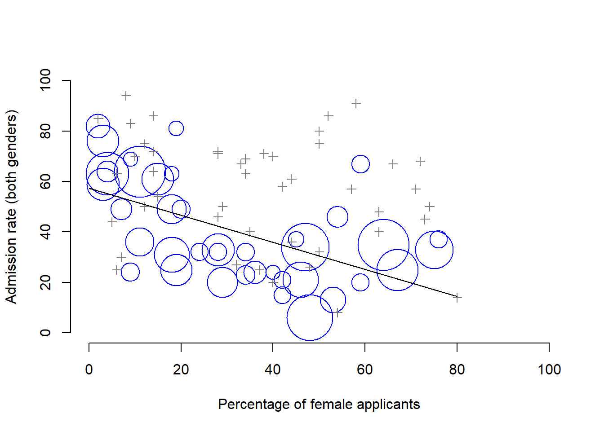

# (PART\*) INTRODUCTIONS {-}

# Why do we learn statistics?{#whywhywhy}

To the surprise of many students, statistics is a fairly significant part of a psychological education. To the surprise of no-one, statistics is very rarely the *favourite* part of one's psychological education. Not surprisingly, there's a pretty large proportion of the student base that isn't happy about the fact that psychology has so much statistics in it. A big part of this issue at hand relates to the very idea of statistics.

>*Why do you do statistics? Why don't scientists just use **common sense?***

The best answer is a really simple one: we don't trust ourselves enough. We worry that we're human, and susceptible to all of the biases, temptations and frailties that humans suffer from. Much of statistics is basically a safeguard. Using "common sense" to evaluate evidence means trusting gut instincts, relying on verbal arguments and on using the raw power of human reason to come up with the right answer. Most scientists don't think this approach is likely to work.

## The curse of belief bias{.unlisted .unnumbered}

Our minds are quite amazing things, and we seem to be capable of the most incredible feats of thought and reason. Psychologists have shown over the years is that we really do find it hard to be neutral, to evaluate evidence impartially and without being swayed by pre-existing biases. A good example of this is the ***belief bias effect*** in logical reasoning: if you ask people to decide whether a particular argument is logically valid (i.e., conclusion would be true if the premises were true), we tend to be influenced by the believability of the conclusion, even when we shouldn't. For instance, here's a valid argument where the conclusion is believable:

>No cigarettes are inexpensive (Premise 1) \
>Some addictive things are inexpensive (Premise 2)\
>Therefore, some addictive things are not cigarettes (Conclusion)

And here's a valid argument where the conclusion is not believable:

>No addictive things are inexpensive (Premise 1)\
>Some cigarettes are inexpensive (Premise 2)\
>Therefore, some cigarettes are not addictive (Conclusion)

The logical *structure* of argument #2 is identical to the structure of argument #1, and they're both valid. However, in the second argument, there are good reasons to think that premise 1 is incorrect, and as a result it's probably the case that the conclusion is also incorrect. But that's entirely irrelevant to the topic at hand: an argument is deductively valid if the conclusion is a logical consequence of the premises. That is, a valid argument doesn't have to involve true statements.

On the other hand, here's an invalid argument that has a believable conclusion:

>No addictive things are inexpensive (Premise 1)\
>Some cigarettes are inexpensive (Premise 2)\
>Therefore, some addictive things are not cigarettes (Conclusion)

And finally, an invalid argument with an unbelievable conclusion:

>No cigarettes are inexpensive (Premise 1)\
>Some addictive things are inexpensive (Premise 2)\
>Therefore, some cigarettes are not addictive (Conclusion)

Now, suppose that people really are perfectly able to set aside their pre-existing biases about what is true and what isn't, and purely evaluate an argument on its logical merits. We'd expect 100% of people to say that the valid arguments are valid, and 0% of people to say that the invalid arguments are valid. So if you ran an experiment looking at this, you'd expect to see data like this:

|  | conclusion feels true| conclusion feels false |
|-------- |:--------:|:--------:|
|argument is valid |100% say "valid"|100% say "valid"|
|argument is invalid|0% say "valid"|0% say "valid"|

If the psychological data looked like this (or even a good approximation to this), we might feel safe in just trusting our gut instincts. That is, it'd be perfectly okay just to let scientists evaluate data based on their common sense, and not bother with all this murky statistics stuff.

In a classic study, @Evans1983 ran an experiment looking at exactly this. What they found is that when pre-existing biases (i.e., beliefs) were in agreement with the structure of the data, everything went the way you'd hope:

|          | conclusion feels true| conclusion feels false |
|-------- |:--------:|:--------|
|argument is valid |92% say "valid"    |            |
|argument is invalid|           |8% say "valid"     |

Not perfect, but that's pretty good. But look what happens when our intuitive feelings about the truth of the conclusion run against the logical structure of the argument:

|          | conclusion feels true| conclusion feels false |
|-------- |:--------:|:--------:|
|argument is valid |92% say "valid"    |**46% say "valid"**   |
|argument is invalid|**92% say "valid"**  |8% say "valid"     |

Apparently, when people are presented with a strong argument that contradicts our pre-existing beliefs, we find it pretty hard to even perceive it to be a strong argument (people only did so 46% of the time). Even worse, when people are presented with a weak argument that agrees with our pre-existing biases, almost no-one can see that the argument is weak.

It's just *too easy* for us to "believe what we want to believe"; so if we want to "believe in the data" instead, we're going to need a bit of help to keep our personal biases under control. That's what statistics does: it helps keep us honest. 

## The Simpson's paradox – A cautionary tale{.unlisted .unnumbered}

In 1973, the University of California, Berkeley had some worries about the admissions of students into their postgraduate courses. Specifically, the thing that caused the problem was that the gender breakdown of their admissions, which looked like this:

|   | Number of applicants | Percent admitted |
|-------|:--------------------:|:----------------:|
|Males |8442 |46% |
|Females|4321 |35% |

Given that there were nearly 13,000 applicants, a difference of 9% in admission rates between males and females is just way too big to be a coincidence. When people started looking more carefully at the admissions data [@Bickel1975] on a department by department basis, it turned out that most of the departments actually had a slightly *higher* success rate for female applicants than for male applicants. Table \@ref(tab:simpsontable) shows the admission figures for the six largest departments:

```{r simpsontable, echo=FALSE, warning = FALSE}
simpson <- cbind(c("A", "B", "C", "D", "E", "F"), 
         c(825,560,325,417,191,272), 
         c("62%","63%","37%","33%","28%","6%"),
         c(108,25,593,375,393,341),
         c("82%","68%","34%","35%","24%","7%"))

knitr::kable(simpson, col.names = c("Department","Male Applicants", "Male Percent Admitted", "Female Applicants", "Female Percent admitted"), align="c", caption = "Admission figures for the six largest departments by gender")
```

Remarkably, most departments had a *higher* rate of admissions for females than for males! Yet the overall rate of admission across the university for females was *lower* than for males. How can this be? How can both of these statements be true at the same time?

Here's what's going on. Firstly, notice that the departments are *not* equal to one another in terms of their admission percentages: some departments (e.g., engineering, chemistry) tended to admit a high percentage of the qualified applicants, whereas others (e.g., English) tended to reject most of the candidates, even if they were high quality. So, among the six departments shown above, notice that department A is the most generous, followed by B, C, D, E and F in that order. Next, notice that males and females tended to apply to different departments. If we rank the departments in terms of the total number of male applicants, we get **A**>**B**>D>C>F>E (the "easy" departments are in bold). On the whole, males tended to apply to the departments that had high admission rates. Now compare this to how the female applicants distributed themselves. Ranking the departments in terms of the total number of female applicants produces a quite different ordering C>E>D>F>**A**>**B**. 

In other words, what these data seem to be suggesting is that the female applicants tended to apply to "harder" departments. And in fact, if we look at all Figure \@ref(fig:berkeley) we see that this trend is systematic, and quite striking. This effect is known as Simpson's paradox. It's not common, but it does happen in real life, and most people are very surprised by it when they first encounter it, and many people refuse to even believe that it's real. It is very real.

When doing research, there are *lots* of subtle, counterintuitive traps lying in wait for the unwary. Truth is sometimes cunningly hidden in the nooks and crannies of complicated data.

```{r berkeley, echo=FALSE, fig.cap="The Berkeley 1973 college admissions data. This figure plots the admission rate for the 85 departments that had at least one female applicant, as a function of the percentage of applicants that were female. The plot is a redrawing of Figure 1 from @Bickel1975. Circles plot departments with more than 40 applicants; the area of the circle is proportional to the total number of applicants. The crosses plot department with fewer than 40 applicants."}

```

Statistics only solves *part* of the problem. Remember that we started all this with the concern that Berkeley's admissions processes might be unfairly biased against female applicants. When we looked at the "aggregated" data, it did seem like the university was discriminating against women, but when we "disaggregate" and looked at the individual behaviour of all the departments, it turned out that the actual departments were, if anything, slightly biased in favour of women. The gender bias in total admissions was caused by the fact that women tended to self-select for harder departments. Postgraduate admissions are determined at the level of the individual department (and there are good reasons to do that), and at the level of individual departments, the decisions are more or less unbiased (the weak bias in favour of females at that level is small, and not consistent across departments). Since the university can't dictate which departments people choose to apply to, and the decision making takes place at the level of the department it can hardly be held accountable for any biases that those choices produce.

If we're interested in this from a more sociological and psychological perspective, we might want to ask *why* there are such strong gender differences in applications. Why do males tend to apply to engineering more often than females, and why is this reversed for the English department? And why is it it the case that the departments that tend to have a female-application bias tend to have lower overall admission rates than those departments that have a male-application bias? Might this not still reflect a gender bias, even though every single department is itself unbiased? It might. Suppose, hypothetically, that males preferred to apply to "hard sciences" and females prefer "humanities". And suppose further that the reason for why the humanities departments have low admission rates is because the government doesn't want to fund the humanities (Ph.D. places, for instance, are often tied to government funded research projects). Does that constitute a gender bias? Or just an unenlightened view of the value of the humanities? What if someone at a high level in the government cut the humanities funds because they felt that the humanities are "useless chick stuff". That seems pretty *blatantly* gender biased. None of this falls within the purview of statistics, but it matters to the research project. If you're interested in the overall structural effects of subtle gender biases, then you probably want to look at *both* the aggregated and disaggregated data. If you're interested in the decision making process at Berkeley itself then you're probably only interested in the disaggregated data. 

In short there are a lot of critical questions that you can't answer with statistics, but the answers to those questions will have a huge impact on how you analyse and interpret data. And this is the reason why you should always think of statistics as a *tool* to help you learn about your data, no more and no less. It's a powerful tool to that end, but there's no substitute for careful thought.

## Statistics in psychology{.unlisted .unnumbered}

We hope that the discussion above helped explain why science in general is so focused on statistics. But we're guessing that you have a lot more questions about what role statistics plays in psychology, and specifically why psychology classes always devote so many lectures to stats. So here's an attempt to answer a few of them...

**Why does psychology have so much statistics?**

The most important reason is that psychology is a statistical science. There's a saying used sometimes in physics, to the effect that "if your experiment needs statistics, you should have done a better experiment".

The "things" that we study are *people*. Real, complicated, gloriously messy people. The "things" of physics include object like electrons, and while there are all sorts of complexities that arise in physics, electrons don't have minds of their own. They don't have opinions, they don't differ from each other in weird and arbitrary ways, they don't get bored in the middle of an experiment, and they don't get angry at the experimenter and then deliberately try to sabotage the data set.

We teach statistics to you as psychologists because you need to be better at stats than physicists. They have the luxury of being able to say that because their objects of study are simple in comparison to the vast mess that confronts social scientists.

**Can't someone else do the statistics?**

To some extent, but not completely. It's true that you don't need to become a fully trained statistician just to do psychology, but you do need to reach a certain level of statistical competence. There's three reasons that every psychological researcher ought to be able to do basic statistics:

- Firstly, there's the fundamental reason: statistics is deeply intertwined with research design. If you want to be good at designing psychological studies, you need to at least understand the basics of stats.
- Secondly, if you want to be good at the psychological side of the research, then you need to be able to understand the psychological literature, right? But almost every paper in the psychological literature reports the results of statistical analyses. So if you really want to understand the psychology, you need to be able to understand what other people did with their data. And that means understanding a certain amount of statistics.
- Thirdly, there's a big practical problem with being dependent on other people to do all your statistics: statistical analysis is *expensive*. In almost any real life situation where you want to do psychological research, the cruel facts will be that you don't have enough money to afford a statistician. So the economics of the situation mean that you have to be self-sufficient.

Note that a lot of these reasons generalise beyond researchers. If you want to be a practicing psychologist and stay on top of the field, it helps to be able to read the scientific literature, which relies pretty heavily on statistics.

**I don't care about jobs, research, or clinical work. Do I need statistics?**

Statistics should matter to you in the same way that statistics should matter to *everyone*: we live in the 21st century, and data are *everywhere*. Frankly, given the world in which we live these days, a basic knowledge of statistics is pretty damn close to a survival tool! Which is the topic of the next section...

## There's more to research methods than statistics{.unlisted .unnumbered}

Most research methods courses will cover a lot of topics that relate much more to the pragmatics of research design, and in particular the issues that you encounter when trying to do research with humans. Most student fears relate to the statistics part of the course. Hopefully you are convinced that statistics matters, and more importantly, that it's not to be feared.

Introductory classes focus a lot on the statistics because you almost always find yourself needing statistics before you need the other research methods training. Why? Because almost all of your assignments in other classes will rely on statistical training, to a much greater extent than they rely on other methodological tools. It's not common for undergraduate assignments to require you to design your own study from the ground up (in which case you would need to know a lot about research design), but it is common for assignments to ask you to analyse and interpret data that were collected in a study that someone else designed (in which case you need statistics). In that sense, from the perspective of allowing you to do well in all your other classes, the statistics is more urgent.

But note that "urgent" is different from "important" -- they both matter. We really do want to stress that research design is just as important as data analysis, and this book does spend a fair amount of time on it. However, while statistics has a kind of universality, and provides a set of core tools that are useful for most types of psychological research, the research methods side isn't quite so universal. There are some general principles that everyone should think about, but a lot of research design is very idiosyncratic, and is specific to the area of research that you want to engage in. To the extent that it's the details that matter, those details don't usually show up in an introductory stats and research methods class.
