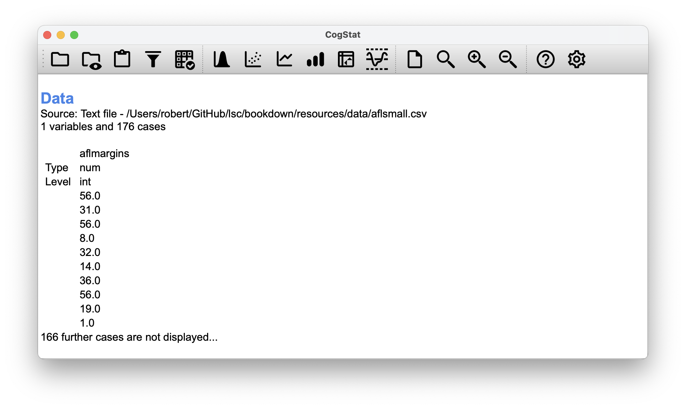
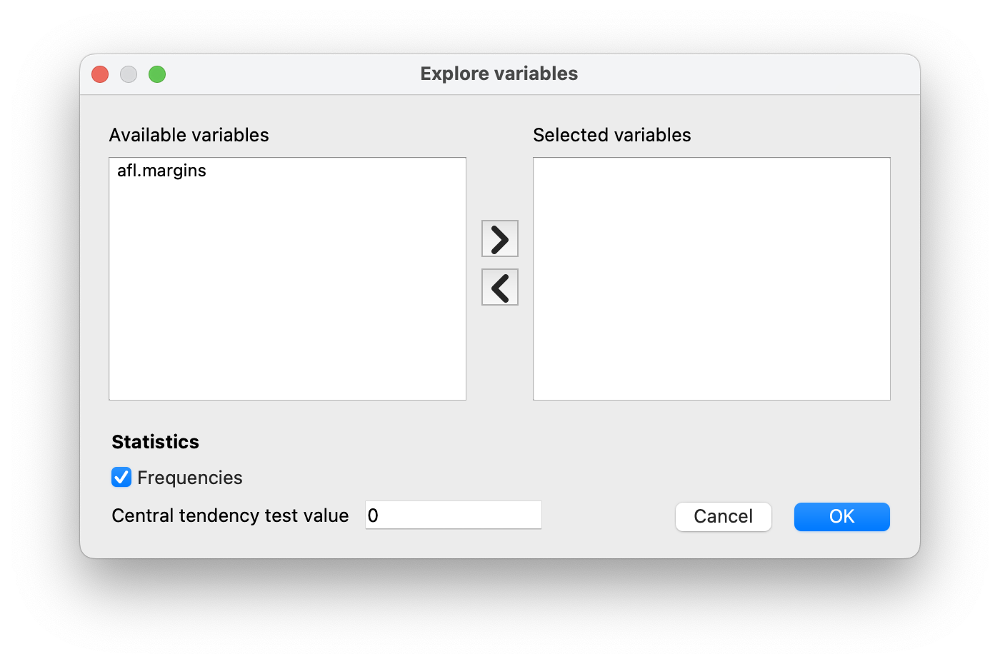
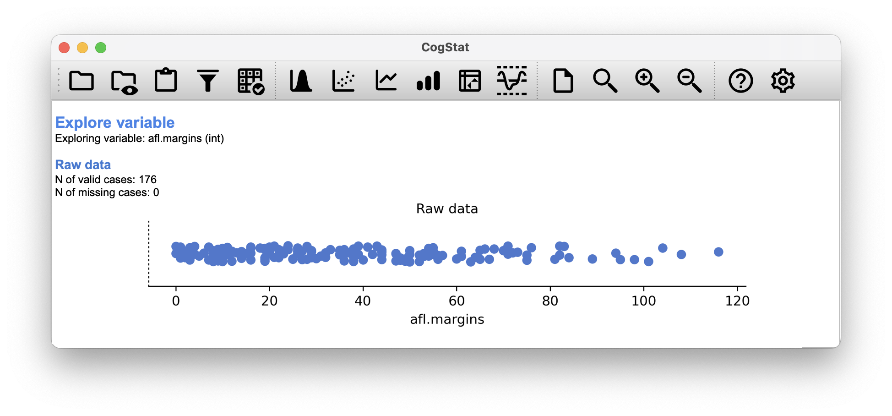
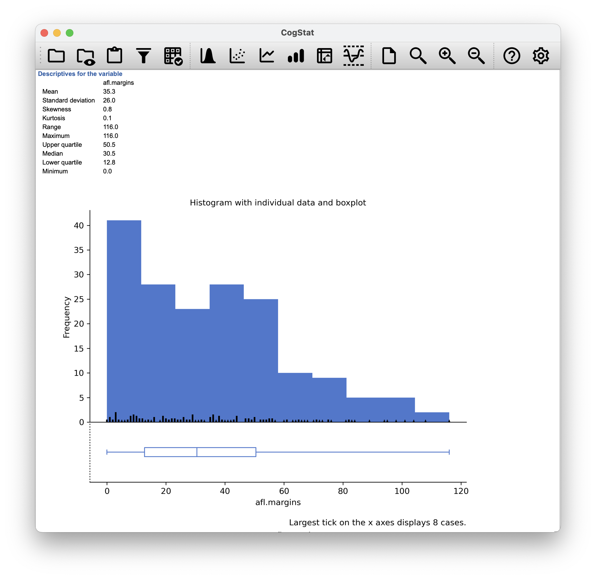
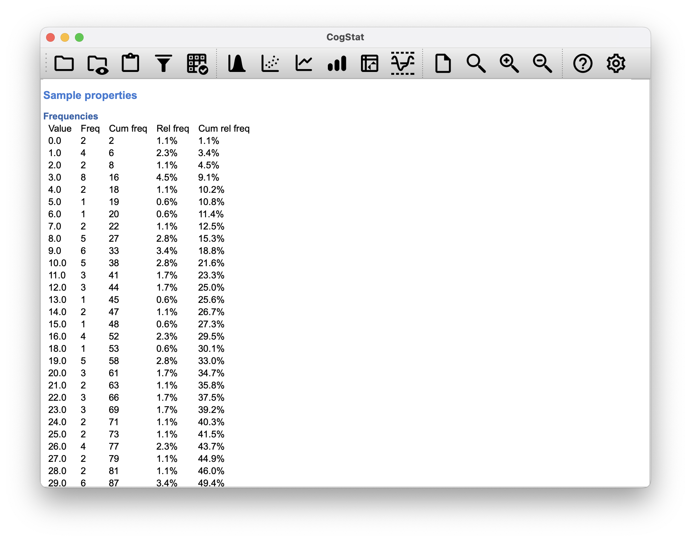
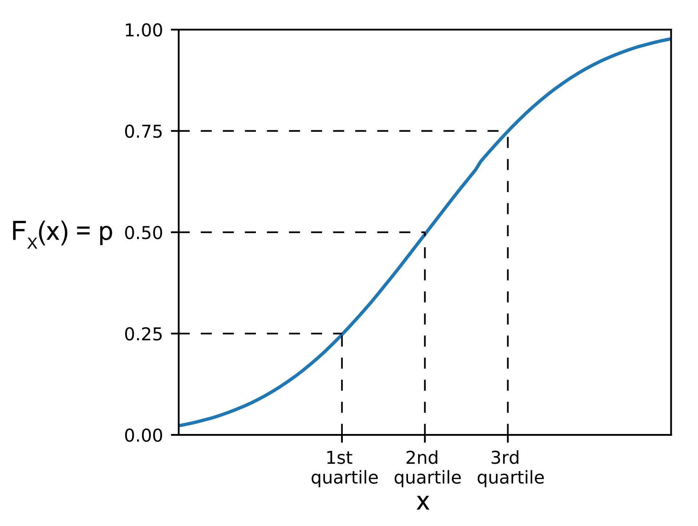

# (PART\*) DESCRIPTIVE STATISTICS{-}

```{r echo=FALSE}
library(kableExtra)
```

# Exploring a single variable{#exploringavariable}

Any time you get a new data set to look at, one of the first things you might want to do is find ways of summarising the data in a compact, easily understood fashion. This is what **descriptive statistics** (as opposed to *inferential statistics*) is all about. In fact, to many people, the term "statistics" is synonymous with descriptive statistics.

The first dataset we'll be looking at is real data relating to the Australian Football League (AFL)^[Note for non-Australians: the AFL is an Australian rules football competition. You don't need to know anything about Australian rules in order to follow this section.]. To do this, let us load the [aflsmall.csv](resources/data/aflsmall.csv) file.

```{r loadaflsmall, fig.align='center', echo=FALSE, fig.cap="Loading `aflsmall.csv`. This is what you would see after loading the dataset.", fig.scap="Loading `aflsmall.csv`"}

```

CogStat will help you get familiar with some essential aspects of your variable, like:

- measures of central tendency (mean, median)
- measures of variability (range, minimum, maximum, standard deviation, quartiles)
- measures of "distortion" (skewness, kurtosis).

These measures will help you contextualise the results so the conclusions drawn from the variable will be valid.

To start understanding a variable in CogStat, select `Explore variable` so a pop-up appears. Move the name of the data you wish to analyse (in this case: `aflmargins`) from `Available variables` to `Selected variables`, then click `OK` (Figure \@ref(fig:explorevariabledialog)).

```{r explorevariabledialog, fig.align='center',echo=FALSE, fig.cap="`Explore variable` dialogue."}

```

```{r rawaflsmall, fig.align='center', echo=FALSE, fig.scap="`Explore variable results` for the `aflsmall.csv` data set.", fig.cap="`Explore variable results` for the `aflsmall.csv` data set. This is the first chart you will see exploring the raw shape of the data."}

```

The first piece of information here is $N$, which we will use to refer to the number of observations we're analysing. CogStat (or any other software for that matter) will only use valid data for calculations. Sometimes, when working with survey data, you will have missing data points, the number of which you might have to mention in your report. CogStat will quote these for you:

> `N of valid cases: 176`\
> `N of missing cases: 0`

In the rest of this chapter, we will explore what these measures mean and what they indicate.

## Measures of central tendency{#centraltendency}

In most situations, the first thing that you'll want to calculate is a measure of **_central tendency_**. That is, you'd like to know something about the "average" or "middle" of your data lies.

```{r echo=FALSE, fig.align="center"}
library(ggplot2)

data_set_a <- rnorm(500, mean = 50, sd = 5)
data_set_b <- rnorm(500, mean = 50, sd = 30)

data <- data.frame(data_set_a, data_set_b)

ggplot(data, aes(x = data_set_a)) +
  # geom_density(aes(y = ..density..), fill = "#e6f0f0", alpha = 0.5) +
  geom_density(aes(x = data_set_b), fill = "#0096c8", alpha = 0.5) +
  geom_vline(xintercept = mean(data_set_a),
    linetype = "dashed", color = "black", size = 0.4) +
  ylab("Frequency") + xlab("") +
  theme_classic() +
  theme(legend.position = "none")
```

### The mean{#mean}

The first measure of *central tendency* is the mean, or arithmetic average. It is calculated by adding up all of the values in the data set and then divide the sum by the total number (count) of values.

::: {.definition #defmean name="Mean"}
The **mean** of a set of observations is the sum of the observations divided by the number of observations.
$$
\bar{X} = \frac{\sum_{i=1}^N X_i}{N}
$$
:::

:::{.example #exmean name="Mean"}
The first five AFL margins were 56, 31, 56, 8 and 32 (which CogStat will display when loading the data, see Figure \@ref(fig:loadaflsmall)), so the mean of these observations is just:
$$
\frac{56 + 31 + 56 + 8 + 32}{5} = \frac{183}{5} = 36.60
$$
:::

Of course, this definition of the mean isn't news to anyone: averages (i.e., means) are used so often in everyday life that this is quite familiar.

We used $N$ to denote the number of observations. Now let's attach a label to the observations themselves. It's traditional to use $X$ for this, and to use subscripts to indicate which observation we're actually talking about. That is, we'll use $X_1$ to refer to the first observation, $X_2$ to refer to the second observation, and so on, all the way up to $X_N$ for the last one. The following table lists the 5 observations in the `afl.margins` variable, along with the mathematical symbol used to refer to it, and the actual value that the observation corresponds to:

```{r echo=FALSE}
knitr::kable(rbind(
      c("winning margin, game 1", "$X_1$", "56 points"),
      c("winning margin, game 2", "$X_2$", "31 points"),
      c("winning margin, game 3", "$X_3$", "56 points"),
      c("winning margin, game 4", "$X_4$", "8 points"),
      c("winning margin, game 5", "$X_5$", "32 points")),
   col.names = c("Observation", "Symbol", "Observed value"),
   caption = NULL,
   label = "winningmargin",
   linesep = "",
   escape = FALSE,
   align = "lcc"
) %>%
  kable_styling(
   bootstrap_options = c("hover", "condensed", "responsive"),
   full_width = FALSE,
   position = "center",
   latex_options = c("HOLD_position", "repeat_header")
  )
```

Okay, now let's try to write a formula for the mean. The goal here is to try to make sure that everyone reading this book is clear on the notation that we'll be using throughout the book. By tradition, we use $\bar{X}$ as the notation for the mean, $\scriptstyle\sum$ for the idea of summation, $X_i$ for the $i$th observation, and $N$ for the total number of observations. We're going to be re-using these symbols a fair bit, so you must understand them well enough to be able to "read" the equations and to be able to see what they're really saying.

So the calculation for the mean could be expressed using the following formula:
$$
\bar{X} = \frac{X_1 + X_2 + ... + X_{N-1} + X_N}{N}
$$

This formula is entirely correct, but it's terribly long, so we make use of the summation symbol $\scriptstyle\sum$ to shorten it:
$$
\sum_{i=1}^5 X_i
$$

Taken literally, this could be read as "the sum, taken over all $i$ values from 1 to 5, of the value $X_i$". But basically, what it means is "add up the first five observations". In any case, we can use this notation to write out the formula for the mean, which looks like this:
$$
\bar{X} = \frac{1}{N} \sum_{i=1}^N X_i 
$$

In all honesty, all this mathematical notation is just a fancy way of laying out the same things said in words: *add all the values up, and then divide by the total number of items*.

:::: {.callout #summation data-latex="[Summation symbol: $\scriptstyle\sum$ and Product symbol: $\scriptstyle\prod$ notations]"}

```{=html}
<div class="callout-title">
Summation symbol: ∑ and Product symbol: ∏ notations
</div>
```

The summation symbol $\scriptstyle\sum$ is used to denote the operation of adding up a sequence of numbers. It is used to write out formulas in a concise way, and is used extensively in mathematics.

$$
\sum_{i=1}^n X_i = X_1 + X_2 + ... + X_{n-1} + X_n
$$
where $i$ is the *index of the observation*, which means that the index starts out at the given number, so in this case, at the first observation ($X_\mathbf{1}$). The index is incremented by 1 for each observation (even if $i>1$), so the next observation is $X_\mathbf{2}$, and so on, until the last observation, which is $X_\mathbf{n}$, as denoted above the symbol.

The choice to use $\Sigma$ to denote summation isn't arbitrary: it's the Greek upper case letter sigma, which is the analogue of the letter S in that alphabet.

Similarly, there's an equivalent symbol used to denote the multiplication of lots of numbers: because multiplications are also called "products", we use the $\Pi$ symbol for this; the Greek upper case pi, which is the analogue of the letter P.

Check out more examples of [summation notation](https://en.wikipedia.org/wiki/Summation#Capital-sigma_notation) and [product notation](https://en.wikipedia.org/wiki/Multiplication#Product_of_a_sequence) on Wikipedia.
::::

CogStat calculates the mean automatically when exploring a variable using all valid data points, not just the first five. It will be part of the `Descriptives for the variable` section, as seen in Figure \@ref(fig:histogramaflsmall). The result for our variable is:

> `afl.margins`\
> `Mean 35.3`

```{r histogramaflsmall, fig.align='center', echo=FALSE, fig.scap="Descriptive statistics and histogram for the `aflsmall.csv` data set.", fig.cap="Descriptive statistics and histogram for the `aflsmall.csv` data set. Scrolling down, you'll see CogStat reporting all the descriptive measures while showing you a histogram to understand the shape of your data better. Drawing pictures of the data is an excellent way to convey the gist of what the data is trying to tell you; it's often instrumental to try to condense the data into a few simple summary statistics."}

```

### The median{#median}

The second measure of *central tendency* people use a lot is the median^[*medianus* is Latin for "the one in the middle", originating from the word *medius*, meaning "the middle".], and it's even easier to describe than the mean. 

::: {.definition #defmedian name="Median"}
The **median** is the middle value in a set of observations that has been arranged in ascending or descending order.
:::

::: {.example #exmedian name="Median"}
As before, let's imagine we were interested only in the first 5 AFL winning margins: 56, 31, 56, 8 and 32. To figure out the median, we sort these numbers into ascending order. From inspection, it's evident that the median value of these five observations is 32 since that's the middle one in the sorted list. 

$$
8, 31, \mathbf{32}, 56, 56
$$

But what should we do if we were interested in the first six games rather than the first 5? Since the sixth game in the season had a winning margin of 14 points, our sorted list is now:

$$
8, 14, \mathbf{31}, \mathbf{32}, 56, 56
$$

and there are *two* middle numbers, $31$ and $32$. The median is defined as the average of those two numbers, which is $31.5$.
:::

In the data set we loaded to CogStat, there were 176 valid cases, so we ought to have two middle numbers. The result in this case is (as seen in Figure \@ref(fig:histogramaflsmall)):

> `afl.margins`\
> `Median 30.5`

### Mean or median? What's the difference?

```{r meanmedian, fig.align='center', echo=FALSE, fig.scap="An illustration of the difference between how the mean and the median should be interpreted.", fig.cap="An illustration of the difference between how the mean and the median should be interpreted. The mean is basically the \"centre of gravity\" of the data set: if you imagine that the histogram of the data is a solid object, then the point on which you could balance it (as if on a see-saw) is the mean. In contrast, the median is the middle observation. Half of the observations are smaller, and half of the observations are larger."}
knitr::include_graphics("./resources/image/meanmedian.png")
```

Knowing how to calculate means and medians is only a part of the story. You also need to understand what each one is saying about the data, what that implies, and which one to choose. This is illustrated in Figure \@ref(fig:meanmedian); the mean is kind of like the "centre of gravity" of the data set, whereas the median is where you'd cut it in half. What this implies about which one you should use depends a little on what type of data you've got and what you're trying to achieve. As a rough guide:
 
- If your data are *[nominal scale](#nominalscale)*, you shouldn't be using either the mean or the median. Both the mean and the median rely on the idea that the numbers assigned to values are meaningful (i.e., 1 means 1 of a unit of measure, and not simply a technical coding for "1: men, 2: women, 3: nonbinary ..."). If the numbering scheme is arbitrary, then use the mode (Section \@ref(mode)) instead.
- If your data are *[ordinal scale](#ordinalscale)*, you can to use the median but not the mean. The median only uses the order information in your data (i.e., which numbers are larger) which is the purpose of an ordinal scale. The mean makes use of the precise numeric values assigned to the observations beyond their order info, so it's not appropriate for ordinal data.
- For *[interval](#intervalscale)* and *[ratio scale](#ratioscale)* data, either one is generally acceptable. Which one you pick depends a bit on what you're trying to achieve. The mean has the advantage of using all the information in the data (which is useful when you don't have a lot of data), but it's very susceptible to extreme values, as we'll see in Chapter \@ref(trimmedmean).

Let's expand on that last part a little. One consequence is that there are systematic differences between the mean and the median when the histogram is asymmetric (skewed; see Chapter \@ref(skewnesskurtosis)). This is illustrated in Figure \@ref(fig:meanmedian) notice that the median (right hand side) is located closer to the "body" of the histogram, whereas the mean (left hand side) gets dragged towards the "tail" (where the extreme values are).

::: {.example #exmeanmedian name="Mean or median"}
Suppose Bob (income \$50,000), Kate (income \$60,000) and Jane (income \$65,000) are sitting at a table: the average income at the table is \$58,333 and the median income is \$60,000. Then Bill sits down with them (income \$100,000,000). The average income has now jumped to \$25,043,750 but the median rises only to \$62,500. If you're interested in looking at the overall income at the table, the mean might be the right answer; but if you're interested in what counts as a typical income at the table, the median would be a better choice here.
:::

### Trimmed mean{#trimmedmean}

::: {.example #exoutliers name="Outliers"}
Consider this rather strange-looking data set:
$$
-100,2,3,4,5,6,7,8,9,10
$$
If you were to observe this in a real-life data set, you'd probably suspect that there is something odd about the $-100$ value. It's probably an **outlier**, a value that doesn't belong with the others. You might consider removing it from the data set entirely. In this particular case, it might be the right call. However, you don't always get such cut-and-dried examples. For instance, you might get this instead:
$$
-15,2,3,4,5,6,7,8,9,12
$$
The $-15$ looks suspicious, but not as much as that $-100$ did. In this case, it's a little trickier. It *might* be a legitimate observation; it might not.
:::

When faced with a situation where some of the most extreme-valued observations might not be quite trustworthy, the mean is not necessarily a good measure of central tendency. It is highly sensitive to one or two extreme values and might not be a *robust* measure in all cases. One remedy is to use the median. An alternative solution is to use a **trimmed mean**. 

::: {.definition #deftrimmedmean name="Trimmed mean"}
A **trimmed mean** is a measure of central tendency, a type of average, that is calculated by discarding a certain percentage of the largest and smallest observations from the data, and then calculating the arithmetic average of the remaining observations.
:::

The goal is to preserve the best characteristics of the mean and the median: just like a median, you aren't highly influenced by extreme outliers. Generally, we describe a trimmed mean in terms of the percentage of observations on either side that are discarded. So, for instance, a 10% trimmed mean discards the largest 10% of the observations *and* the smallest 10% of the observations and then takes the mean of the remaining 80% of the observations. Not surprisingly, the 0% trimmed mean is just the regular mean, and the 50% trimmed mean is the median. In that sense, trimmed means provide a whole family of central tendency measures that span the range from the mean to the median.

::: {.example #extrimmedmean}
For our toy example above, we have 10 observations. So a 10% trimmed mean is calculated by ignoring the largest value (i.e. $12$) and the smallest value (i.e. $-15$) and taking the mean of the remaining values. 

> `Mean: 4.1`\
> `Median: 5.5`

That's a fairly substantial difference. But the mean is being influenced too much by the extreme values at either end of the data set, especially the $-15$ one.  If we take a 10% trimmed mean, we'll drop the extreme values on either side and take the mean of the rest: 

> `Mean: 5.5`

Which, in this case, gives exactly the same answer as the median.
:::

Currently, there is no direct way for you to do that in CogStat, but you can certainly trim those outlying data points in your source file and re-load the data.

### Mode{#mode}

::: {.definition #defmode name="Mode"}
The **mode** is a measure of central tendency that indicates the value that occurs most frequently in the data set.
:::

::: {.example #exmode name="Mode"}
Consider the following data set:

> 0, 1, 1, 2, 3, 5, 8, 13, 21

The mode would be 1, as it's the value the occurs most frequently. A **frequency table** helps you identify the mode in more complex datasets even if it's not calculated automatically.

> Value: Frequency (Relative frequency)\
> 0: 1 (11.1%)\
> 1: 2 (22.2%)\
> 2: 1 (11.1%)\
> 3: 1 (11.1%)\
> 5: 1 (11.1%)\
> 8: 1 (11.1%)\
> 13: 1 (11.1%)\
> 21: 1 (11.1%)\

:::

In CogStat, you will see a frequency table (Figure \@ref(fig:freqaflsmall)) of the values in your data if you have `Frequencies` ticked in the `Explore variable` dialogue.

```{r freqaflsmall, fig.align='center',echo=FALSE, fig.cap="The frequency table sorts non-nominal values from lowest to highest."}

```

While it's generally true that the mode is most often calculated when you have [nominal scale](#nominalscale) data -- because means and medians are useless for those sorts of variables --, there are some situations in which you do want to know the mode of an [ordinal](#ordinalscale), [interval](#intervalscale) or [ratio scale](#ratioscale) variable.

::: {.example #exmode2 name="Mode for ordinal, interval and ratio scale"}
Let's look at our `afl.margins` variable we loaded into CogStat. This variable is clearly ratio scale, and so in most situations the mean or the median is the measure of central tendency that you want. But consider that a friend of yours is offering a bet. They pick a football game at random, and without knowing who is playing you have to guess the *exact* margin. If you guess correctly, you win \$50. If you don't, you lose \$1. There are no consolation prizes for "almost" getting the right answer. You have to guess exactly the right margin^[This is called a "0-1 loss function", meaning that you either win (1) or you lose (0), with no middle ground.] For this bet, the mean and the median are completely useless to you. It is the mode that you should bet on. So, we look at the frequency table offered by the result set: the data suggest you should bet on a $3.0$ point margin, and since this was observed in 8 of the 176 games (4.5% of games -- the *relative frequency*), the odds are firmly in your favour.
:::

## Measures of variability{#var}

The statistics that we've discussed so far all relate to *central tendency*. They all talk about which values are "in the middle" or "popular" in the data. However, central tendency is not the only type of summary statistic that we want to calculate. The second thing that we really want is a measure of the **variability** (or, *dispersion*) of the data. That is, how "spread out" are the data? How "far" away from the mean or median do the observed values tend to be? 

```{r echo=FALSE, fig.cap="Data sets with the same mean but different dispersion.", fig.align="center"}
library(ggplot2)
ggplot(data, aes(x = data_set_a)) +
  geom_density(aes(y = ..density..), fill = "#e6f0f0", alpha = 0.5) +
  geom_density(aes(x = data_set_b), fill = "#0096c8", alpha = 0.5) +
  geom_vline(xintercept = mean(data_set_a),
    linetype = "dashed", color = "black", size = 0.4) +
  ylab("Frequency") + xlab("") +
  theme_classic() +
  theme(legend.position = "none")
```

For now, let's assume that the data are interval or ratio scale, so we'll continue to use the `afl.margins` data. We'll use this data to discuss several different measures of spread, each with different strengths and weaknesses. 

### Range{#range}

::: {.definition #defrange name="Range"}
As a measure of variability, the **range** of a variable is the difference between the largest and smallest observation in the data set.
$$
\text{Range}=\max(x)-\min(x)
$$
:::

::: {.example #exrange name="Range"}
For the AFL winning margins data, the maximum value is $116$, and the minimum is $0$, so the range is:
$$116-0=\mathbf{116}$$
:::

CogStat automatically calculates all these values (see Figure \@ref(fig:histogramaflsmall)), so there is nothing we need to do about this, only to understand what it implies.

Although the range is the simplest way to quantify the notion of variability, it's not a fit-for-all tool. Recall from our discussion of the mean that we want our summary measure to be robust. If the data set has one or two extremely "bad" values in it (i.e., *outliers*), we'd like our statistics not to be unduly influenced by these cases. 

::: {.example #exrange2 name="Range with outliers present"}
Let us look once again at our toy example of a data set containing very extreme outliers:
$$
-100,2,3,4,5,6,7,8,9,10
$$

It is clear that the range is not robust since this has a range of $110$, but if the outlier was removed, we would have a range of only $8$.
:::

:::: {.callout #calloutquantile data-latex="[Quantiles]"}
```{=html}
<div class="callout-title">
Quantiles
</div>
```
Quantiles are cut points that divide an ordered data set (or a distribution) into equal-sized groups of observations when the data is continuous. Or more generally, they cut a [probability distribution](#probability) to equally probable intervals (see Chapter \@ref(probability)).

For example, a data set of 40 observations can be divided into 4 equal-sized groups of 10 observations each.

```{r echo=FALSE}
library(kableExtra)
knitr::kable(
  data.frame(
    "Quantile" = c(1,2,3,4),
    "Observations" = c(10,10,10,10),
    "Lower bound" = c(1,11,21,31),
    "Upper bound" = c(10,20,30,40)
  ),
  col.names = c("Quantile", "Number of observations",
    "Lower bound", "Upper bound"),
  caption = NULL,
  booktabs = TRUE,
  digits = 0,
  align = "c",
  label="quantile",
  escape=FALSE
) %>%
  kableExtra::kable_styling(
    bootstrap_options = c("hover", "condensed", "responsive"),
    full_width = FALSE,
    latex_options = c("HOLD_position")
  )
```

This is called a ***quartile*** (i.e., 1/4). If we wanted to define in percentages, this would be able to define 25th, 50th and 75th ***percentiles*** of a data set. The *25th percentile* (*1st quartile* or *lower quartile*) holds the value in a distribution that is greater than 25% of the values and less than 75% of the values. The *50th percentile* (*2nd quartile*) is the *median*, and the *75th percentile* (*3rd quartile* or *upper quartile*) is the value that is greater than 75% of the values and less than 25% of the values.

```{r echo=FALSE, fig.align="center", out.width="45%", fig.cap="The 25th, 50th and 75th percentiles of a cumulative distribution of a normal distribution. (StevenJYang on [Wikipedia: Quartile](https://en.wikipedia.org/wiki/Quartile))"}

```

The data can be divided into other quantiles as well: e.g. a distribution cut in 5 equal-sized groups are called ***quintiles***, and a distribution cut in 10 equal-sized groups are called ***deciles***, and so on.

There are different methods to cutting discrete data into quantiles, but we're not going to discuss them here.
::::

### Interquartile range{#IQR}

The **interquartile range** (IQR) is similar to the range in terms of measuring variability, but instead of calculating the difference between the largest and smallest value, it calculates the difference between the 25th and 75th quantile, hence, somewhat minimising the effect of a few outliers.

::: {.definition #defIQR name="Interquartile range"}
The **interquartile range** (IQR) is the difference between the 25th and 75th quantile of a data set. It is a measure of variability that is less sensitive to outliers than the range.
:::

CogStat provides you with both the 25th (`Lower quartile`) and 75th quantiles (`Upper quartile`) automatically:

> `Upper quartile: 50.5`\
> `Lower quartile: 12.8`

::: {.example #exIQR name="Interquartile range"}
We can see that the interquartile range for the 2010 AFL winning margins data is:
$$
50.5 - 12.8 = \mathbf{37.7}
$$
:::

While it's obvious how to interpret the range, it's a little less obvious how to interpret the IQR. The simplest way to think about it is like this: the interquartile range is the range spanned by the "middle half" of the data, ignoring any data between $-\infty$ and $Q_1$, and between $Q_3$ and $+\infty$. That is, one quarter of the data falls below the 25th percentile, one quarter of the data is above the 75th percentile, leaving the "middle half" of the data lying in between the two. And the IQR is the range covered by this middle half.

:::: {.callout #boxplot data-latex="[Boxplots]"}
```{=html}
<div class="callout-title">
Boxplots
</div>
```
Boxplots (or “box and whiskers” plots) are a standardised method to display the distribution of a data set based on a five-number summary:

\nopagebreak

- the minimum and maximum (i.e., range), 
- first quartile and third quartile (i.e., IQR),
- and the median.

```{r echo=FALSE, fig.align="center", fig.cap="Boxplot explained", fig.show="hold", out.width="75%"}
set.seed(42)
data1 <- rnorm(50, mean = 10, sd = 2)
data2 <- rnorm(50, mean = 10, sd = 1.7)
outlier1 <- rnorm(1, mean = 18, sd = 0.2)
outlier2 <- rnorm(1, mean = 17, sd = 0.2)
data2 <- c(data2, outlier1, outlier2)
data_df <- data.frame(x=c(rep(1,length(data1)), rep(2,length(data2))), 
                      y=c(data1, data2),
                      group = c(rep("data1",length(data1)), rep("data2",length(data2))))
library(ggplot2)

ggplot(data=data_df, aes(x=x, y=y, group=group)) +
  geom_boxplot(
    stat = "boxplot",
    width = 0.4,
    coef = 2,
    outlier.shape = 1,
    outlier.color = "red",
    fatten = 3,
    notch=FALSE) +
  stat_boxplot(
    geom = "errorbar",
    width = 0.1,
    size = 0.5,
    color = "black",
    coef = 2
  ) +
  xlab("") + ylab("") +
  scale_y_continuous(limits=c(min(data1, data2) - 1, max(data1, data2) + 1)) +
  scale_x_continuous(breaks=c(1,2), labels=c("Basic", "With outliers")) +
  annotate("text", size = 5, x=1.4, y=quantile(data1, probs=c(0,1,0.25,0.75,0.5))[1], label = "Minimum", hjust=0) +
  annotate("text", size = 5, x=1.4, y=quantile(data1, probs=c(0,1,0.25,0.75,0.5))[2], label = "Maximum", hjust=0) +
  annotate("text", size = 5, x=1.3, y=quantile(data1, probs=c(0,1,0.25,0.75,0.5))[3], label = "Q1", hjust=0) +
  annotate("text", size = 5, x=1.3, y=quantile(data1, probs=c(0,1,0.25,0.75,0.5))[4], label = "Q3", hjust=0) +
  annotate("text", size = 5, x=1.3, y=quantile(data1, probs=c(0,1,0.25,0.75,0.5))[5], label = "Median", hjust=0) +
  annotate("segment", x=1.3, xend=1.1, y=quantile(data1, probs=c(0,1,0.25,0.75,0.5))[1], yend=quantile(data1, probs=c(0,1,0.25,0.75,0.5))[1], arrow=arrow(length=unit(0.15,"cm"))) +
  annotate("segment", x=1.3, xend=1.1, y=quantile(data1, probs=c(0,1,0.25,0.75,0.5))[2], yend=quantile(data1, probs=c(0,1,0.25,0.75,0.5))[2], arrow=arrow(length=unit(0.15,"cm"))) +
  annotate("text", size = 5, x=1.95, y=mean(c(outlier1, outlier2)), label = "Outliers", hjust=1) +
  theme_void(
    base_size = 15
  )
 
```

Like histograms, they're most suited for interval or ratio scale data. Some boxplots separate out those observations that are “suspiciously” distant from the rest of the data, i.e., the outliers. These are usually displayed with a circle or a dot.

::::

### Mean absolute deviation (average absolute deviation){#aad}

The two measures we've looked at so far, the range and the interquartile range, both rely on the idea that we can measure the spread of the data by looking at quantiles. However, this isn't the only way to think about the problem. A different approach is to select some meaningful reference point (usually the mean or the median) and then report the "typical" deviations from that. In practice, this leads to two different measures, the "mean absolute deviation" (from the mean) and the "median absolute deviation" (from the median). Irritatingly, "mean absolute deviation" and "median absolute deviation" have the same acronym (i.e., MAD), which leads to a certain amount of ambiguity. What we'll do is use *AAD* (*average absolute deviation*) for *mean absolute deviation*, while *MAD* will stand for *median absolute deviation*.

::: {.definition #defAAD name="Average absolute deviation"}
The **average absolute deviation** (AAD) is a measure of variability calculated as the average of the absolute difference between each observation and the *mean* of the data set.
$$
\text{AAD} = \frac{1}{n} \sum_{i=1}^n |X_i - \bar{X}|
$$
where $n$ is the number of observations, $X_i$ is the $i$th observation, and $\bar{X}$ is the mean of the data set.
:::

::: {.example #exAAD name="Average absolute deviation"}
Let's think about our AFL winning margins data, and once again we'll start by pretending that there's only 5 games in total, with winning margins of 56, 31, 56, 8 and 32. Our calculations rely on an examination of the deviation from some reference point, in this case, the mean.

1. The first thing we need to look up is the mean, $\bar{X}$. For these five observations, our mean is $\bar{X} = 36.6$.
1. The next step is to convert each of our observations $X_i$ into a deviation score. We do this by calculating the difference between the observation $X_i$ and the mean $\bar{X}$ (i.e., the deviation score: $X_i - \bar{X}$).
1. Then we convert these deviations to absolute deviations. Mathematically, we would denote the absolute value of $-3$ as $|-3|$, and so we say that $|-3| = 3$. We use the absolute value function here because we don't care whether the value is higher than the mean or lower than the mean; we're just interested in how *close* it is to the mean.

To help make this process as obvious as possible, the table below shows these calculations for all five observations:

```{r echo=FALSE}
knitr::kable(rbind(
 c("winning margin, game 1", "$X_1$", "56 points", "56 - 36.6 = 19.4", "19.4"),
 c("winning margin, game 2", "$X_2$", "31 points", "31 - 36.6 = -5.6", "5.6"),
 c("winning margin, game 3", "$X_3$", "56 points", "56 - 36.6 = 19.4",  "19.4"),
 c("winning margin, game 4", "$X_4$", "8 points", "8 - 36.6 = -28.6", "28.6"),
 c("winning margin, game 5", "$X_5$", "32 points", "32 - 36.6 = -4.6", "4.6")),
col.names = c("Observation", "Symbol", "Observed value", "Deviation score $X_i - \\bar{X}$", "Absolute d.s. $|X_i - \\bar{X}|$"),
 booktabs = TRUE, escape = FALSE) %>%
  kableExtra::kable_styling(
    bootstrap_options = c("hover", "condensed", "responsive"),
    full_width = F,
    position = "center",
    latex_options = c("HOLD_position", "scale_down")
    )
```


Now that we have calculated the absolute deviation score for every observation in the data set, we only have to calculate the mean of these scores. Let's do that:
$$
\frac{19.4 + 5.6 + 19.4 + 28.6 + 4.6}{5} = 15.52
$$
And we're done. The mean absolute deviation for these five scores is 15.52. 
:::

Currently, AAD is not calculated in CogStat, but you can calculate this with other statistics software. When this is added, we'll update this section.

### Median absolute deviation {#mad}

The basic idea behind *median absolute deviation* (MAD) is identical to the one behind the mean absolute deviation (Section \@ref(aad)). The difference is that you use the median. This has a straightforward interpretation: every observation in the data set lies some distance away from the typical value (the median). So the MAD is an attempt to describe a *typical deviation from a typical value* in the data set.

::: {.definition #defMAD name="Median absolute deviation"}
The **median absolute deviation** (MAD) is a measure of variability calculated as the average of the absolute difference between each observation and the *median* of the data set.

$$
\text{MAD} = \frac{1}{n} \sum_{i=1}^n |X_i - \text{median}(X)|
$$

where $n$ is the number of observations, $X_i$ is the $i$th observation, and $\text{median}(X)$ is the median of the data set.
:::

::: {.example #exMAD name="Median absolute deviation"}
Let's think about our AFL winning margins data, and once again we'll start by pretending that there's only 5 games in total, with winning margins of 56, 31, 56, 8 and 32. Our calculations rely on an examination of the deviation from some reference point, in this case, the median. The median for these five observations is $\text{median}(X) = 32$. We'll repeat the same steps as before with the [mean absolute deviation](#exAAD), and we'll have the following result:

$$
\text{MAD} = \frac{1}{5} \left( |56 - 32| + |31 - 32| + |56 - 32| + |8 - 32| + |32 - 32| \right) = 19.5
$$
:::

### Variance{#variance}

Variance isn't all too different from the [mean absolute deviation](#aad). The main difference is that we use squared deviations instead of absolute deviations. With squared deviations, we obtain a measure called **variance**.

::: {.definition #defVar name="Variance"}
**Variance** is a measure of variability calculated as the average of the *squared difference* between each observation and the *mean* of the data set.

$$
\mbox{Var}(X) = \frac{1}{n} \sum_{i=1}^n (X_i - \bar{X})^2
$$

where $n$ is the number of observations, $X_i$ is the $i$th observation, and $\bar{X}$ is the mean of the data set.
:::

:::: {.callout #calloutVar data-latex="[Population variance versus variance estimate]"}
```{=html}
<div class="callout-title">
Population variance versus variance estimate
</div>
```

If you are extremely lucky and have a data set that contains the entire population, then you can calculate the variance as given in Definition \@ref(def:defVar). This is called **population variance**. In this case the variance is denoted $\sigma^2$, the mean is denoted as $\mu$.

$$
\sigma^2 = \frac{1}{n} \sum_{i=1}^n (X_i - \mu)^2
$$

In research, however, you are most likely to have gathered data for merely a *sample* of the population. There is an alternative formula for this case. This is called **variance estimate**, or *estimated variance*, or *sample variance*, or *estimated population variance*, and is denoted $s^2$. The formula for the variance estimate is:

$$
s^2 = \frac{1}{n-1} \sum_{i=1}^n (X_i - \bar{X})^2
$$

where $n$ is the number of observations in the sample, $X_i$ is the $i$th observation, and $\bar{X}$ is the mean of the sample. You'll notice the difference is the denominator using $n-1$ instead of $n$.
::::

Variances are *additive*. Suppose we have two variables ($X$ and $Y$), whose variances are $\mbox{Var}(X)$ and $\mbox{Var}(Y)$ respectively. Now imagine we want to define a new variable $Z$ that is the sum of the two, $Z = X+Y$. As it turns out, the variance of $Z$ is equal to $\mbox{Var}(X) + \mbox{Var}(Y)$.

::: {.example #exVarAddit name="Additive property of the variance"}
Let's use the first five AFL games as our data. If we follow the same approach that we took last time, we end up with the following table:

```{r echo=FALSE}
library(kableExtra)
knitr::kable(rbind(c(1 , 56 , 19.4 , 376.36),
 c(2 , 31 , -5.6 , 31.36),
 c(3 , 56 , 19.4 , 376.36),
 c(4 , 8 , -28.6 , 817.96),
 c(5 , 32 , -4.6 , 21.16)),
col.names = c( 
 "$i$",
 "$X_i$",
 "$X_i - \\bar{X}$",
 "$(X_i - \\bar{X})^2$"),
 booktabs = TRUE, escape = FALSE, align = "llcc") %>%
  add_header_above(c("Which game" = 1, "Value" = 1, 
                     "Deviation from mean" = 1, 
                     "Absolute squared deviation" = 1)) %>%
  kable_styling(position = "center",
  latex_options = c("repeat_header", "HOLD_position", "scale_down"))
```

That last column contains all of our squared deviations, so all we have to do is average them.

$$
\frac{( 376.36 + 31.36 + 376.36 + 817.96 + 21.16 )}{5} = 324.64
$$
:::

Let's tackle the burning question you're probably thinking: how do you *interpret* the variance? Unfortunately, the reason why we haven't given you the human-friendly interpretation of the variance is that there really isn't one. It does have some elegant mathematical properties that suggest that it really is a fundamental quantity for expressing variation and spread. The reason for the difficulty is that all the numbers have been squared, and they don't necessarily mean anything in the original units. For example, if you're running an analysis on vitamin D levels in a study about mood disorders, you'll have a base unit of measure of nmol/L or ng/mL. If you square these numbers, you'll end up with a variance in nmol/L-squared or ng/mL-squared. This is a meaningless unit of measure on its own. However, variance is still a good measure to indicate a spread of data, and it's a good measure to use when comparing variances between different groups.

CogStat will not attempt to interpret the variance nor will it give you the raw value.

### Standard deviation{#sd}

Suppose you would like to have a measure expressed in the same units as the data itself (i.e. nmol/L, not nmol/L-squared). What should you do? The solution to the problem is obvious: take the square root of the variance, known as the **standard deviation** (usually shortened as *SD* or *Std dev.*), also called the *root mean squared deviation*, or RMSD. This solves our problem with variance fairly neatly: it's much easier to understand "a standard deviation of 18.01 nmol/L" since it's expressed in the original units.

::: {.definition #defSD name="Standard deviation"}
**Standard deviation** is the *square root* of the average of the *squared difference* between each observation and the *mean* of the data set.

$$
\mbox{SD} = \sqrt{ \frac{1}{n} \sum_{i=1}^n \left( X_i - \bar{X} \right)^2 }
$$
:::

:::: {.callout #calloutSD data-latex="[Population SD versus estimated SD]"}
```{=html}
<div class="callout-title">
Population SD versus estimated SD
</div>
```

Similarly to variance, we can differentiate the formula for a population-based standard deviation and a sample-based standard deviation.

The **population SD** is denoted $\sigma$, the mean is denoted as $\mu$.

$$
\sigma = \sqrt{ \frac{1}{n} \sum_{i=1}^n \left( X_i - \mu \right)^2 }
$$

For calculating a population *estimate* based on sample data, we use the **estimated standard deviation** ($s$) formula.

$$
s = \sqrt{ \frac{1}{n-1} \sum_{i=1}^n \left( X_i - \bar{X} \right)^2 }
$$

where $n$ is the number of observations in the sample, $X_i$ is the $i$th observation, and $\bar{X}$ is the mean of the sample. The denominator is $n-1$ instead of $n$.
::::

So how do we interpret standard deviation? Standard deviation has the same unit of measure as the observations, e.g., nmol/L, but just like variance, it doesn't have a simple interpretation either. The interpretation is based on the scale of the measurement. E.g. 3.5 can be big or small depending on the scale of measurement. For example, a 3.5 nmol/L SD value for vitamin D level suggests a fairly consistent measurement, considering 50-75 nmol/L is adequate, >75 is optimum, and <25 is deficient according to NHS UK guidelines^[https://www.southtees.nhs.uk/services/pathology/tests/vitamin-d/] in 2023. But an SD of 3.5 for a 5-level Likert scale is massive, indicating a less consistent data point and high variability.

There are different ways to standardise the SD. One way is to divide the SD by the mean, which gives you the **coefficient of variation** (CV). Another way is by utilizing $z$-scores which assumes the data are *normally* distributed, which is an important concept discussed in Chapter \@ref(probability). We'll discuss z-scores shortly in Chapter \@ref(zscore).

### Which measure to use?

We've discussed quite a few measures of spread and hinted at their strengths and weaknesses. Here's a quick summary:

- [*Range*](#range). Gives you the full spread of the data. It's very vulnerable to outliers, and as a consequence, it isn't often used unless you have good reasons to care about the extremes in the data.
- [*Interquartile range*](#IQR). Tells you where the "middle half" of the data sits. It's pretty robust and complements the median nicely. This is used a lot.
- [*Average absolute deviation*](#AAD). Tells you how far "on average" the observations are from the mean. It's very interpretable but has a few minor issues that make it less attractive to statisticians than the standard deviation. Used sometimes, but not often.
- [*Median absolute deviation*](#MAD). The typical deviation from the median value.
- [*Variance*](#variance). Tells you the average squared deviation from the mean. It's mathematically elegant and is probably the "right" way to describe variation around the mean, but it's completely uninterpretable because it doesn't use the same units as the data. Almost never used except as a mathematical tool, but it's buried "under the hood" of a very large number of statistical tools.
- [*Standard deviation*](#sd). This is the square root of the variance. It's fairly elegant mathematically, and it's expressed in the same units as the data, so it can be interpreted pretty well. In situations where the mean is the measure of central tendency, this is the default. This is by far the most popular measure of variation. 


In short, the IQR and the standard deviation are easily the two most common measures used to report the variability of the data. Still, there are situations in which range or other measures are used.

## Skewness and kurtosis{#skewnesskurtosis}

There are two more descriptive statistics that you will likely see reported in the psychological literature, known as **skewness** and **kurtosis**. These are measures of the shape of the distribution of the data.
```{r skewness, fig.scap="An illustration of skewness.", fig.cap="An illustration of skewness. On the left we have a negatively skewed data set (skewness $= -.93$), in the middle we have a data set with no skew (technically, skewness $= -.006$), and on the right we have a positively skewed data set (skewness $= .93$).", echo=FALSE, fig.align="center"}
library(psych)

 x1 <- rbeta(n = 100000, shape1= 10, shape2 = 2)
 x2 <- rbeta(n = 100000, shape1= 10, shape2 = 10)
 x3 <- rbeta(n = 100000, shape1= 2, shape2 = 10)
 X <- list(x1,x2,x3)

 plot.new()
 old <- par(no.readonly = TRUE)
 par(mfrow=c(1,3))

 ttl = c("Negative Skew", "No Skew", "Positive Skew")

 for (i in 1:3) {

 hist(x = X[[i]],
 breaks = seq(0,1,.05),
 xlab = "",
 ylab = "",
 main = ttl[i],
 axes = FALSE,
 col = "cornflowerblue",
 border = "white",
 font.main = 1
 )

 }
 par( old )
```

::: {.definition #defskewness name="Skewness"}
**Skewness** is a measure of assymetry of a distribution that compares the median and mean to the mode. A negative skew means the median and mean are smaller than the mode, resulting in a long tail on the left. A positive skew means the median and mean are larger than the mode, resulting in a long tail on the right. A skewness of 0 means the median and mean are equal to the mode, resulting in a symmetrical distribution.

$$
\mbox{skewness}(X) = \frac{1}{N \hat{\sigma}^3} \sum_{i=1}^N (X_i - \bar{X})^3
$$

where $N$ is the number of observations, $\bar{X}$ is the sample mean, and $\hat{\sigma}$ is the standard deviation (the "divide by $N-1$" version, that is).

:::

As Figure \@ref(fig:skewness) illustrates, if the data tend to have a lot of extreme small values (i.e., the lower tail is "longer" than the upper tail) and not so many extremely large values (left panel), then we say that the data are *negatively skewed*. On the other hand, if there are more extremely large values than extremely small ones (right panel) we say that the data are *positively skewed*.

Not surprisingly, it turns out that the AFL winning margins data is fairly skewed: $0.8$ (see Figure \@ref(fig:histogramaflsmall) depicting the analysis results from CogStat).

::: {.definition #defkurtosis name="Kurtosis"}
**Kurtosis** describes the degree of steepness of a distribution. A steep distribution is *leptokurtic* (positive kurtosis) distribution, a flat distribution is *platykurtic* (negative kurtosis), and the normal distribution is *mesokurtic* (kurtosis is 0).

$$
\mbox{kurtosis}(X) = \frac{1}{N \hat\sigma^4} \sum_{i=1}^N \left( X_i - \bar{X} \right)^4 - 3
$$

where $N$ is the number of observations, $\bar{X}$ is the sample mean, and $\hat{\sigma}$ is the standard deviation (the "divide by $N-1$" version, that is).
:::

**Kurtosis**, put simply, is a measure of the "pointiness" of a data set, as illustrated in Figure \@ref(fig:kurtosis).

```{r kurtosis, fig.cap="An illustration of kurtosis. On the left, we have a \"platykurtic\" data set (kurtosis = $-.95$), meaning that the data set is \"too flat\". In the middle we have a \"mesokurtic\" data set (kurtosis is almost exactly 0), which means that the pointiness of the data is just about right. Finally, on the right, we have a \"leptokurtic\" data set (kurtosis $= 2.12$) indicating that the data set is \"too pointy\". Note that kurtosis is measured with respect to a normal curve (black line)", echo=FALSE, fig.align="center"}

x3 <- c(rnorm(n = 50000, mean =0, sd = 1), (runif(n = 50000)-.5)+rnorm(50000,0,.1) )*1.6
x2 <- rnorm(n = 100000, mean = 0, sd = 1)*1.2
x1 <- (runif(n = 100000) + rnorm(100000, mean =0, sd = .1) -.5)*4
X <- list(x1,x2,x3)

plot.new()
old <- par(no.readonly = TRUE)
par(mfrow=c(1,3))

ttl = c( 'Platykurtic\n("too flat")','Mesokurtic', 'Leptokurtic\n("too pointy")')

for (i in 1:3) {

 hist(x = X[[i]],
 breaks = seq(-20.5,20.5,.5),
 ylim =c(0,.45),
 xlim = c(-5,5),
 xlab = "",
 ylab = "",
 main = ttl[i],
 axes = FALSE,
 freq = FALSE,
 col = "cornflowerblue",
 font.main=1,
 border = "white"
 )

 lines(x <- seq(-4,4,.01), y = dnorm(x, mean(X[[i]]), sd(X[[i]])), 
 lwd = 2, lty = 1, col = "black")

 }
 par( old )

```

When reading the automatically calculated kurtosis value from our CogStat result set, we discover that the AFL winning margins data is just pointy enough: $0.1$.

## Standard scores ($z$-score){#zscore}

Suppose a friend is creating a new questionnaire to measure "grumpiness". The survey has 50 questions, which you can answer in a grumpy way or not. Across a big sample (hypothetically, let's imagine a million people or so!), the data are fairly normally distributed, with the mean grumpiness score being 17 out of 50 questions answered in a grumpy way and the standard deviation is 5. In contrast, when we take the questionnaire, we answer 35 out of 50 questions in a grumpy way. So, how grumpy are we? One way to think about it would be to say that we have a grumpiness of 35/50, so you might say that we're 70% grumpy. But that's a bit weird when you think about it. Suppose our friend had phrased her questions a bit differently. In that case, people might have answered them differently, so the overall distribution of answers could easily move up or down depending on the precise way the questions were asked. So, we're only 70% grumpy *with respect to this set of survey questions*. Even if it's an excellent questionnaire, this isn't a very informative statement.

A simpler way around this is to describe our grumpiness by comparing us to other people. Shockingly, out of a sample of 1,000,000 people, only 159 people were as grumpy as us, suggesting that we're in the top 0.016% of people for grumpiness. This makes much more sense than trying to interpret the raw data. This idea -- that we should describe our grumpiness in terms of the overall distribution of the grumpiness of humans -- is the qualitative idea that standardisation attempts to get at. One way to do this is to describe everything in terms of percentiles. However, the problem with doing this is that "it's lonely at the top". 

Suppose that our friend had only collected a sample of 1000 people, and this time got a mean of 16 out of 50 with a standard deviation of 5. The problem is that, almost certainly, not a single person in that sample would be as grumpy as us.

However, all is not lost. A different approach is to convert our grumpiness score into a **standard score**, also referred to as a $z$-score. The standard score is defined as the number of standard deviations above the mean that my grumpiness score lies. To phrase it in "pseudo-maths", the standard score is calculated like this:
$$
\mbox{standard score} = \frac{\mbox{raw score} - \mbox{mean}}{\mbox{standard deviation}}
$$ 
In actual maths, the equation for the $z$-score is
$$
z_i = \frac{X_i - \bar{X}}{\hat\sigma}
$$
So, going back to the grumpiness data, we can now transform our raw grumpiness into a standardised grumpiness score. If the mean is 17 and the standard deviation is 5 then my standardised grumpiness score would be (in a bit simplistic way, since we haven't discussed estimations yet):
$$
z = \frac{35 - 17}{5} = 3.6
$$

To interpret this value, recall the rough heuristic from Chapter \@ref(sd): 99.7% of values are expected to lie within 3 standard deviations of the mean. So the fact that our grumpiness corresponds to a $z$ score of 3.6 indicates that we're very grumpy indeed. A theoretical percentile rank for grumpiness, would be $0.9998409$.^[Note that this is true given a normal distribution. More on that later.]

In addition to allowing you to interpret a raw score in relation to a larger population (and thereby allowing you to make sense of variables that lie on arbitrary scales), standard scores serve a second useful function. Standard scores can be compared to one another in situations where the raw scores can't. Suppose our friend also had another questionnaire that measured extraversion using a 24 items questionnaire. The overall mean for this measure turns out to be 13 with a standard deviation 4; and we scored a 2. As you can imagine, it doesn't make a lot of sense to compare this raw score of 2 on the extraversion questionnaire to our raw score of 35 on the grumpiness questionnaire. The raw scores for the two variables are "about" fundamentally different things, so this would be like comparing apples to oranges.

What about the standard scores? Well, this is a little different. If we calculate the standard scores, we get $z = (35-17)/5 = 3.6$ for grumpiness and $z = (2-13)/4 = -2.75$ for extraversion. These two numbers *can* be compared to each other.^[Though some caution is usually warranted. It's not always the case that one standard deviation on variable A corresponds to the same "kind" of thing as one standard deviation on variable B. Use common sense when trying to determine whether or not the $z$ scores of two variables can be meaningfully compared.] We'd be much less extraverted than most people ($z = -2.75$) and much grumpier than most people ($z = 3.6$): but the extent of our unusualness is much more extreme for grumpiness (since 3.6 is a bigger number than 2.75). Because each standardised score is a statement about where an observation falls *relative to its own population*, it *is* possible to compare standardised scores across completely different variables.


## Summary: descriptives

We have covered some key aspects of how to summarise what we have learned about the data. As a summary, the following table lists the measures that CogStat will calculate for you, with a brief explanation of what they are and how they are used.

```{r echo=FALSE}
knitr::kable(rbind(
              c("[Mean](#mean)", "35.3", "Average -- the \"centre of gravity\" of the data"),
              c("[Standard deviation](#sd)", "26.0", "How clustered is the data around the mean (smaller figure means more clustered, larger figure closer to interquartile range means more spread out)"),
              c("[Skewness](#skewnesskurtosis)", "0.8", "The assymetry of the data compared to a normal distribution (bell curve)"),
              c("[Kurtosis](#skewnesskurtosis)", "0.1", "Pointiness of the data. Smaller figure means more pointy, larger figure means less pointy"),
              c("[Range](#range)", "116.0", "The spread of the data set between the maximum and minimum values"),
              c("[Maximum](#range)", "116.0", "The highest value in the data set"),
              c("[Upper quartile](#IQR)", "50.5", "25% of the data points reside at and above this value"),
              c("[Median](#median)", "30.5", "This is the value of the data point in the middle (or the average of the two middle points in case of even number of data points). 50-50% of data points reside at above and below this value"),
              c("[Lower quartile](#IQR)", "12.8", "25% of the data points reside at and below this value"),
              c("[Minimum](#range)", "0.0", "The lowest value in the data set")
              ),
  col.names = c("<span style='min-width:1em'></span>", "<span style='min-width:1em'>afl.margins</span>", "Meaning"),
  booktabs = TRUE, linesep = "",
  caption = "Descriptives for the variable",
  align = c("l", "r", "l"),
  format = "markdown",
  escape = FALSE
)
```

We also discussed $z$-scores as very specific alternatives to percentiles in some cases, which will come in handy later on.