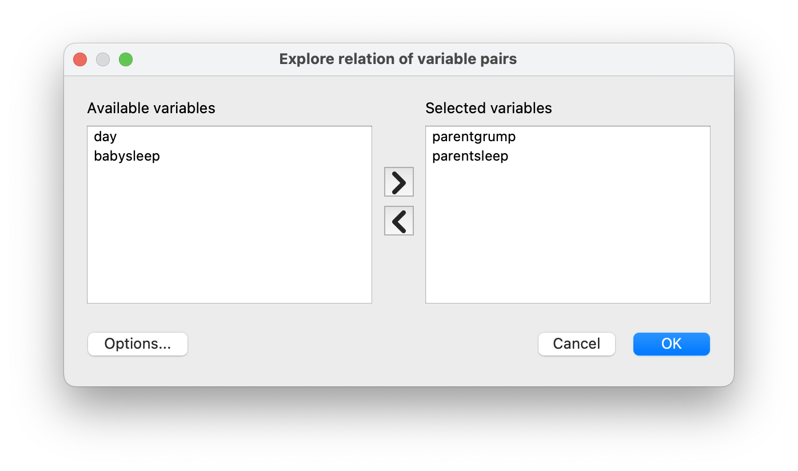
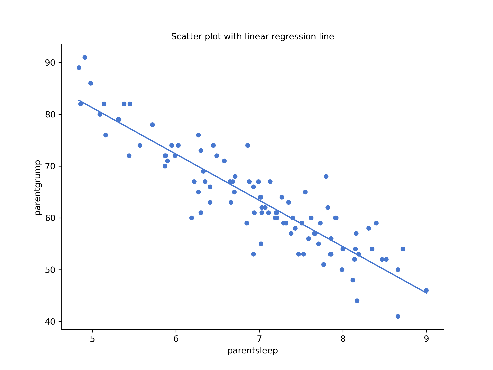
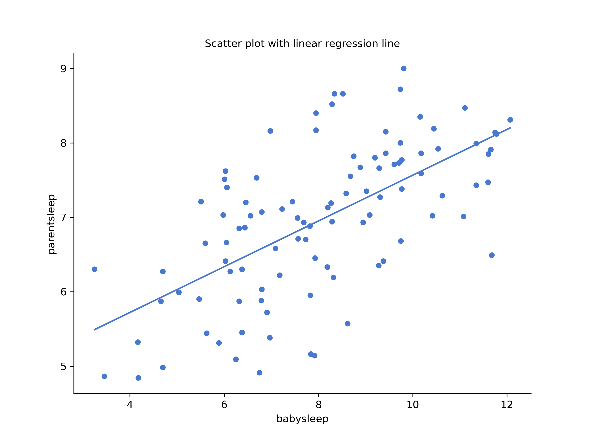
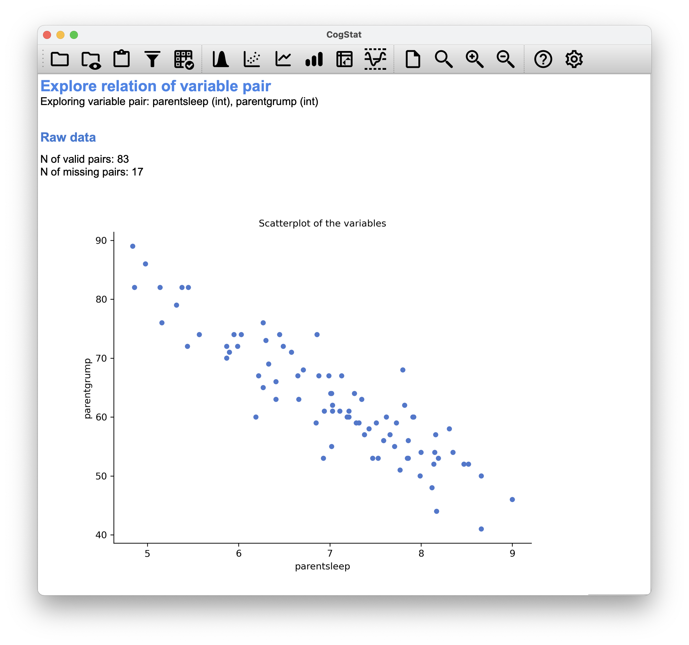
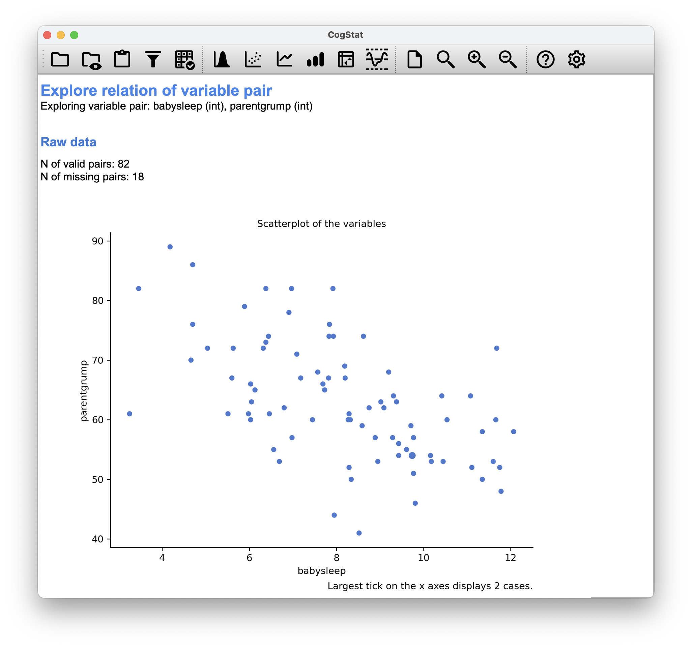
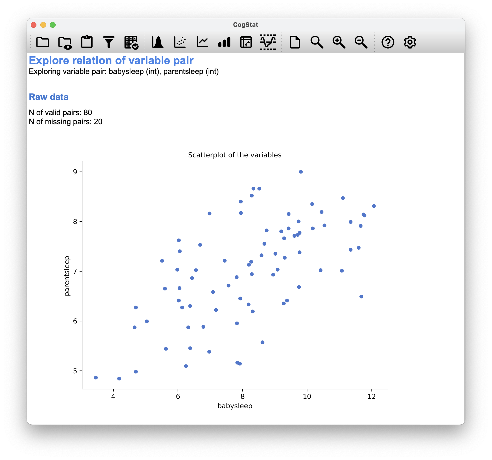

# Exploring a variable pair{#correl}

Up to this point, we have focused entirely on how to construct descriptive statistics for a single variable. What we have not done is talk about how to describe the relationships *between* variables in the data. To do that, we want to talk mainly about the **correlation** between variables. But first, we need some data.

After watching the AFL data, let's turn to a topic close to every parent's heart: sleep. The following data set is fictitious but based on real events. Suppose we're curious to determine how much a baby's sleeping habits affect the parent's mood. Let's say we can rate parent grumpiness very precisely on a scale from 0 (not at all grumpy) to 100 (very, very grumpy). And let's also assume that we've been measuring parent grumpiness, parent sleeping patterns, and the baby's sleeping patterns for 100 days.

```{r loadparenthood, out.width='100%', fig.align='center',echo=FALSE, fig.cap="This is what you would see after loading the [parenthood.csv](resources/data/parenthood.csv) dataset."}
knitr::include_graphics("resources/image/cogstatparenthoodload.png")
```

As described in Chapter \@ref(exploringavariable), we can get all the necessary descriptive statistics for all the variables: `parentsleep`, `babysleep` and `grumpiness`. Let's summarise all these into a neat little table.

```{r parenthoodtab, echo=FALSE}
knitr::kable(cbind(
 c("" , "Mean" , "Standard deviation" , "Skewness" , "Kurtosis" , "Range" , "Maximum", "Upper quartile" , "Median" , "Lower quartile" , "Minimum"),
 c("`parentgrump`", 63.7, 10.0, 0.4, -0.0, 50.0, 91.0, 71.0, 62.0, 57.0, 41.0),
 c("`parentsleep`" , 6.965, 1.011, -0.296, -0.649, 4.160, 9.000, 7.740, 7.030, 6.292, 4.840),
 c("`babysleep`" , 8.049, 2.064, -0.024, -0.613, 8.820, 12.070, 9.635, 7.950, 6.425, 3.250)),
 col.names=c("", "Parent grumpiness", "Parent's hours slept", "Baby's hours slept"),
 caption = 'Descriptive statistics for the parenthood data.',
 booktabs = TRUE,
 align = "lccc")
```

To start understanding the relationship between a pair of variables, select `Explore relation of variable pair` so a pop-up appears. Move the name of the two variables you wish to analyse (from `Available variables` to `Selected variables`, then click `OK`.

```{r cogstatexplorevariablepair, echo=FALSE, fig.align='center', out.width='100%'}

```

## The strength and direction of a relationship

```{r scatterparent1a, out.width='100%', fig.align='center',echo=FALSE, fig.cap="Scatterplot drawn by CogStat showing the relationship between `parentsleep` and `parentgrump`"}

```

```{r scatterparent1b, out.width='100%', fig.align='center',echo=FALSE, fig.cap="Scatterplot drawn by CogStat showing the relationship between `babysleep` and `parentgrump`"}
knitr::include_graphics("resources/image/babysleepgrumpplot.png")
```

We can draw scatterplots to give us a general sense of how closely related two variables are. Ideally, though, we might want to say a bit more about it than that. For instance, let's compare the relationship between `parentsleep` and `parentgrump` (Figure \@ref(fig:scatterparent1a) with that between `babysleep` and `parentgrump` (Figure \@ref(fig:scatterparent1b). When looking at these two plots side by side, it's clear that the relationship is *qualitatively* the same in both cases: more sleep equals less grump! However, it's also obvious that the relationship between `parentsleep` and `parentgrump` is *stronger* than between `babysleep` and `parentgrump`. The plot on the left is "neater" than on the right. It feels like if you want to predict the parent's mood, it will help you a little bit to know how many hours the baby slept, but it'd be *more* helpful to know how many hours the parent slept. 

In contrast, let's consider Figure \@ref(fig:scatterparent1b) vs. Figure \@ref(fig:scatterparent2). If we compare the scatterplot of "`babysleep` v `parentgrump`" to the scatterplot of "``babysleep` v `parentsleep`", the overall strength of the relationship is the same, but the direction is different. If the baby sleeps more, the parent gets *more* sleep (positive relationship, but if the baby sleeps more, then the parent gets *less* grumpy (negative relationship).
 
```{r scatterparent2, out.width='100%', fig.align='center',echo=FALSE, fig.cap="Scatterplot drawn by CogStat showing the relationship between `babysleep` and `parentsleep`"}

```

## The correlation coefficient{#pearson}

We can make these ideas a bit more explicit by introducing the idea of a **correlation coefficient** (or, more specifically, **Pearson's correlation coefficient**), which is traditionally denoted by $r$. The correlation coefficient between two variables $X$ and $Y$ (sometimes denoted $r_{XY}$), which we'll define more precisely in the next section, is a measure that varies from $-1$ to $1$. When $r = -1$, it means that we have a perfect negative relationship, and when $r = 1$, it means we have a perfect positive relationship. When $r = 0$, there's no relationship at all. If you look at Figure \@ref(fig:corr), you can see several plots showing what different correlations visually look like.

```{r corr, fig.height=10, echo=FALSE, fig.cap="Illustration of the effect of varying the strength and direction of a correlation", out.width='100%', fig.align='center'}

library(MASS)

par(mfcol = c(4, 2)) # Create a 2 x 2 plotting matrix
# The next 4 plots created will be plotted next to each other


d.cor <- 0.0
out.0 <- as.data.frame(mvrnorm(100, mu = c(0,0), 
 Sigma = matrix(c(1,d.cor,d.cor,1), ncol = 2), 
 empirical = TRUE))

plot(out.0, frame.plot=FALSE, axes=FALSE, xlab=paste("r =",d.cor), ylab="",
 col="#2b7bba", pch=20, cex=1.5)

d.cor <- 0.33
out.1 <- as.data.frame(mvrnorm(100, mu = c(0,0), 
 Sigma = matrix(c(1,d.cor,d.cor,1), ncol = 2), 
 empirical = TRUE))
plot(out.1,frame.plot=FALSE, axes=FALSE,xlab=paste("r =",d.cor),ylab="",
 col="#2b7bba", pch=20, cex=1.5)

d.cor <- 0.66
out.2 <- as.data.frame(mvrnorm(100, mu = c(0,0), 
 Sigma = matrix(c(1,d.cor,d.cor,1), ncol = 2), 
 empirical = TRUE))
plot(out.2,frame.plot=FALSE, axes=FALSE,xlab=paste("r =",d.cor),ylab="",
 col="#2b7bba", pch=20, cex=1.5)

d.cor <- 1
out.2 <- as.data.frame(mvrnorm(100, mu = c(0,0), 
 Sigma = matrix(c(1,d.cor,d.cor,1), ncol = 2), 
 empirical = TRUE))
plot(out.2,frame.plot=FALSE, axes=FALSE,xlab=paste("r =",d.cor),ylab="",
 col="#2b7bba", pch=20, cex=1.5)

d.cor <- 0.0
out.0 <- as.data.frame(mvrnorm(100, mu = c(0,0), 
 Sigma = matrix(c(1,d.cor,d.cor,1), ncol = 2), 
 empirical = TRUE))

plot(out.0,frame.plot=FALSE, axes=FALSE,xlab=paste("r =",d.cor),ylab="",
 col="#2b7bba", pch=20, cex=1.5)

d.cor <- -0.33
out.1 <- as.data.frame(mvrnorm(100, mu = c(0,0), 
 Sigma = matrix(c(1,d.cor,d.cor,1), ncol = 2), 
 empirical = TRUE))
plot(out.1,frame.plot=FALSE, axes=FALSE,xlab=paste("r =",d.cor),ylab="",
 col="#2b7bba", pch=20, cex=1.5)

d.cor <- -0.66
out.2 <- as.data.frame(mvrnorm(100, mu = c(0,0), 
 Sigma = matrix(c(1,d.cor,d.cor,1), ncol = 2), 
 empirical = TRUE))
plot(out.2,frame.plot=FALSE, axes=FALSE,xlab=paste("r =",d.cor),ylab="",
 col="#2b7bba", pch=20, cex=1.5)

d.cor <- -1
out.2 <- as.data.frame(mvrnorm(100, mu = c(0,0), 
 Sigma = matrix(c(1,d.cor,d.cor,1), ncol = 2), 
 empirical = TRUE))
plot(out.2,frame.plot=FALSE, axes=FALSE,xlab=paste("r =",d.cor),ylab="",
 col="#2b7bba", pch=20, cex=1.5)

```


The Pearson's correlation coefficient formula can be written in several ways. The simplest way to write down the formula is to break it into two steps. Firstly, let's introduce the idea of a **covariance**. The covariance between two variables $X$ and $Y$ is a generalisation of the notion of the variance. It is a mathematically simple way of describing the relationship between two variables that isn't terribly informative to humans:
$$
\mbox{Cov}(X,Y) = \frac{1}{N-1} \sum_{i=1}^N \left( X_i - \bar{X} \right) \left( Y_i - \bar{Y} \right)
$$
Because we're multiplying (i.e., taking the "product" of) a quantity that depends on $X$ by a quantity that depends on $Y$ and then averaging^[Just like we saw with the variance and the standard deviation, in practice, we divide by $N-1$ rather than $N$.], you can think of the formula for the covariance as an "average cross product" between $X$ and $Y$. The covariance has the nice property that, if $X$ and $Y$ are entirely unrelated, the covariance is exactly zero. If the relationship between them is positive (in the sense shown in Figure \@ref(fig:corr)), then the covariance is also positive. If the relationship is negative, then the covariance is also negative. In other words, the covariance captures the basic qualitative idea of correlation. Unfortunately, the raw magnitude of the covariance isn't easy to interpret: it depends on the units in which $X$ and $Y$ are expressed, and worse yet, the actual units in which the covariance is expressed are really weird. For instance, if $X$ refers to the `parentsleep` variable (units: hours) and $Y$ refers to the `parentgrump` variable (units: grumps), then the units for their covariance are "hours $\times$ grumps". And I have no freaking idea what that would even mean. 

The Pearson correlation coefficient $r$ fixes this interpretation problem by standardising the covariance in the same way that the $z$-score standardises a raw score: dividing by the standard deviation. However, because we have two variables that contribute to the covariance, the standardisation only works if we divide by both standard deviations.^[This is an oversimplification.] In other words, the correlation between $X$ and $Y$ can be written as follows:
$$
r_{XY} = \frac{\mbox{Cov}(X,Y)}{ \hat{\sigma}_X \ \hat{\sigma}_Y}
$$
By doing this standardisation, we keep all of the nice properties of the covariance discussed earlier, and the actual values of $r$ are on a meaningful scale: $r= 1$ implies a perfect positive relationship, and $r = -1$ implies a perfect negative relationship.

## Interpreting a correlation {#interpretingcorrelations}
 
Naturally, in real life, you don't see many correlations of 1. So how should you interpret a correlation of, say $r= .4$? The honest answer is that it really depends on what you want to use the data for, and on how strong the correlations in your field tend to be. A friend of Danielle's in engineering once argued that any correlation less than $.95$ is completely useless (he may have been exaggerating, even for engineering). On the other hand, there are real cases -- even in psychology -- where you should expect strong correlations. For instance, one of the benchmark data sets used to test theories of how people judge similarities is so clean that any theory that can't achieve a correlation of at least $.9$ isn't deemed successful. However, when looking for (say) elementary intelligence correlates (e.g., inspection time, response time), if you get a correlation above $.3$ you're doing very well. In short, the interpretation of a correlation depends a lot on the context. That said, the rough guide in Table \@ref(tab:interpretingcorrelations) is fairly typical.

```{r interpretingcorrelations, echo=FALSE}
knitr::kable(
rbind(
c("-1.0 to -0.9", "Very strong", "Negative"),
c("-0.9 to -0.7", "Strong", "Negative") ,
c("-0.7 to -0.4", "Moderate", "Negative") ,
c("-0.4 to -0.2", "Weak", "Negative"),
c("-0.2 to 0", "Negligible", "Negative") ,
c("0 to 0.2", "Negligible", "Positive"),
c("0.2 to 0.4", "Weak", "Positive"), 
c("0.4 to 0.7", "Moderate", "Positive"), 
c("0.7 to 0.9", "Strong", "Positive"), 
c("0.9 to 1.0", "Very strong", "Positive")),
 col.names=c("Correlation", "Strength", "Direction"),
 booktabs = TRUE, caption = "Rough guide to interpreting correlations",
 align = c("l", "c", "c"))
```

However, something that can never be stressed enough is that you should *always* look at the scatterplot before attaching any interpretation to the data. A correlation might not mean what you think it means. The classic illustration of this is "Anscombe's Quartet" [@Anscombe1973], which is a collection of four data sets. Each data set has two variables, an $X$ and a $Y$. For all four data sets, the mean value for $X$ is 9, and the mean for $Y$ is 7.5. The standard deviations for all $X$ variables are almost identical, as are the standard deviations for the $Y$ variables. And in each case the correlation between $X$ and $Y$ is $r = 0.816$.

You'd think that these four data sets would look pretty similar to one another. They do not. If we draw scatterplots of $X$ against $Y$ for all four variables, as shown in Figure \@ref(fig:anscombe) we see that all four of these are *spectacularly* different to each other.

```{r anscombe, echo=FALSE, fig.cap="Anscombe's quartet. All four of these data sets have a Pearson correlation of $r = .816$, but they are qualitatively different from one another.", out.width='100%', fig.align='center'}
par(mfcol = c(2, 2)) # Create a 2 x 2 plotting matrix

load("./resources/data/anscombesquartet.Rdata")

oneCorPlot <- function(x,y,...){plot(x,y,pch=19,col="#2b7bba",...)}

oneCorPlot(X1,Y1,xlab="X1",ylab="Y1")
oneCorPlot(X2,Y2,xlab="X2",ylab="Y2")
oneCorPlot(X3,Y3,xlab="X3",ylab="Y3")
oneCorPlot(X4,Y4,xlab="X4",ylab="Y4")

```

The lesson here, which so very many people seem to forget in real life, is "*always graph your raw data*".


## Spearman's rank correlations{#spearman}

```{r rankcorrpic, fig.cap="The relationship between hours worked and grade received for a toy data set consisting of only 10 students (each circle corresponds to one student). The dashed line through the middle shows the linear relationship between the two variables. This produces a strong Pearson correlation of $r = .91$. However, the interesting thing to note here is that there's actually a perfect monotonic relationship between the two variables: in this toy example, at least, increasing the hours worked always increases the grade received, as illustrated by the solid line. This is reflected in a Spearman correlation of $rho = 1$. With such a small data set, however, it's an open question as to which version better describes the actual relationship involved.", fig.align='center', echo=FALSE}

describeImg <- list()
emphCol <- rgb(0,0,1)
emphColLight <- rgb(.5,.5,1)
emphGrey <- grey(.5)

eps <- TRUE
colour <- TRUE
width <- 7
height <- 6

# load data
load("./resources/data/effort.Rdata")
suppressMessages(require(lsr))
effort <- sortFrame(effort, hours)

# draw the plot
plot(effort$hours, effort$grade, type = "b",
 col = ifelse(colour, emphCol, "#2b7bba"),
 xlab = "Hours Worked", ylab = "Grade Received",
 xlim = c(0,80), ylim = c(0, 100),
 pch = 19, lwd = 3)
abline(coef = lm(grade~hours, effort)$coef, lty = 2)
```

The Pearson correlation coefficient is useful for many things, but it has shortcomings. One particular issue stands out: what it actually measures is the strength of the *linear* relationship between two variables. In other words, it gives you a measure of the extent to which the data all tend to fall on a single, perfectly straight line. Often, this is a pretty good approximation to what we mean when we say "relationship", and so the Pearson correlation is a good thing to calculate. Sometimes, it isn't.

One very common situation where the Pearson correlation isn't quite the right thing to use arises when an increase in one variable $X$ really is reflected in an increase in another variable $Y$. However, the nature of the relationship isn't necessarily linear. An example of this might be the relationship between effort and reward when studying for an exam. If you put zero effort ($X$) into learning a subject, you should expect a grade of 0% ($Y$). However, a little bit of effort will cause a *massive* improvement: just turning up to lectures means that you learn a fair bit and if you just turn up to classes and scribble a few things down so your grade might rise to 35%, all without a lot of effort. However, you just don't get the same effect at the other end of the scale. As everyone knows, it takes *a lot* more effort to get a grade of 90% than it takes to get a grade of 55%. This means that if I've got data looking at study effort and grades, there's a good chance that Pearson correlations will be misleading.

To illustrate, consider the data plotted in Figure \@ref(fig:rankcorrpic), showing the relationship between hours worked and grade received for 10 students taking some classes. The curious thing about this -- highly fictitious -- data set is that increasing your effort *always* increases your grade. It might be by a lot or by a little, but increasing the effort will never decrease your grade. 

The data are stored in [`effort.csv`](resources/data/effort.csv). CogStat will calculate a standard Pearson correlation first[^Unless, of course, you set your measurement level in the second row of the CSV as `"ord"` (*ordinal*), because then you already tell the software that Pearson's $r$ does not make sense to look at.]. It shows a strong relationship between hours worked and grade received: $r = 0.909$. But this doesn't actually capture the observation that increasing hours worked *always* increases the grade. There's a sense here in which we want to say that the correlation is *perfect* but for a somewhat different notion of a "relationship". What we're looking for is something that captures the fact that there is a perfect **ordinal relationship** here. That is, if student 1 works more hours than student 2, then we can guarantee that student 1 will get a better grade. That's not what a correlation of $r = 0.91$ says at all.

How should we address this? Actually, it's really easy: if we're looking for ordinal relationships, all we have to do is treat the data as if it were an ordinal scale! So, instead of measuring effort in terms of "hours worked", let us rank all 10 of our students in order of hours worked. That is, student 1 did the least work out of anyone (2 hours), so they got the lowest rank (rank = 1). Student 4 was the next laziest, putting in only 6 hours of work over the whole semester, so they got the next lowest rank (rank = 2). Notice that we're using "rank = 1" to mean "low rank". Sometimes in everyday language, we talk about "rank = 1" to mean "top rank" rather than "bottom rank". So be careful: you can rank "from smallest value to largest value" (i.e., small equals rank 1), or you can rank "from largest value to smallest value" (i.e., large equals rank 1). In this case, we're ranking from smallest to largest. But in real life, it's really easy to forget which way you set things up, so you have to put a bit of effort into remembering!

Okay, so let's have a look at our students when we rank them from worst to best in terms of effort and reward:

```{r studenteffort, echo=FALSE}
knitr::kable(cbind(
 c("student 1", "student 2", "student 3", "student 4", "student 5", "student 6", "student 7", "student 8", "student 9", "student 10"),
 c(1, 10, 6, 2, 3, 5, 4, 8, 7, 9),
 c(1, 10, 6, 2, 3, 5, 4, 8, 7, 9)
 ),
 col.names = c("Student", "Rank (hours worked)", "Rank (grade received)"),
 booktabs = TRUE, align = "lcc")

```

Hm. These are *identical*. The student who put in the most effort got the best grade, the student with the least effort got the worst grade, etc. We can rank students by hours worked, then rank students by grade received, and these two rankings would be identical. So if we now correlate them, we get a perfect relationship: $1$.

We've just re-invented the **Spearman's rank order correlation**, usually denoted $\rho$ (pronounced: rho) to distinguish it from the Pearson correlation $r$. CogStat will use $r_{S}$ to denote rank order correlation.

CogStat will automatically calculate both Pearson's correlation and Spearman's rank order correlation for you if your measurement is not set in your source data (Figure \@ref(fig:cogstatcorrelationresult)). If you set the measurement type to "ordinal" in your source file, it will omit to calculate Pearson's correlation due to the above reasons.

```{r cogstatcorrelationresult, out.width='100%', fig.align='center',echo=FALSE, fig.cap="This is what you would see in CogStat after loading the `effort.csv` dataset."}
knitr::include_graphics("resources/image/cogstatcorrelationresult.png")
```

## Missing values in pairwise calculations{#missingvaluespair}

To illustrate the issues, let's open up a data set with missing values, [`parenthood_missing.csv`](resources/data/parenthood_missing.csv). This file contains the same data as the original parenthood data but with some values deleted. While the original source could contain an empty value or `NA`, CogStat will display `NaN` for these missing values (Figure \@ref(fig:parenthoodmissing)).

```{r parenthoodmissing, echo=FALSE, fig.align='center', out.width='100%', fig.cap="This is what you would see in CogStat after loading the `parenthood_missing.csv` dataset."}
knitr::include_graphics("resources/image/cogstatparenthood_missing.png")
```

Let's calculate descriptive statistics using the `Explore variable` function (See Chapter: \@ref(exploringavariable)):

```{r parenthoodmissingtab, echo=FALSE}
knitr::kable(cbind(
 c("" , "Mean" , "Standard deviation" , "Skewness" , "Kurtosis" , "Range" , "Maximum", "Upper quartile" , "Median" , "Lower quartile" , "Minimum"),
 c("`parentgrump`", 63.2, 9.8, 0.4, -0.2, 48.0, 89.0, 70.2, 61.0, 56.0, 41.0),
 c("`parentsleep`", 6.977, 1.015, -0.346, -0.647, 4.160, 9.000, 7.785, 7.030, 6.285, 4.840),
 c("`babysleep`", 8.114, 2.035, -0.096, -0.500, 8.820, 12.070, 9.610, 8.200, 6.460, 3.250)),
 col.names=c("", "Parent grumpiness", "Parent's hours slept", "Baby's hours slept"),
 caption = 'Descriptive statistics for the parenthood data with missing values. We can observe the slight difference in our statistics when we have missing values.',
 booktabs = TRUE,
 align = "lccc")
```

We can see that there are 9 missing values for `parentsleep` (`N of missing cases: 9`), 11 missing values for `babysleep` (`N of missing cases: 11`), and 8 missing values for `parentgrump` (`N of missing cases: 8`).

Whichever comparison you'd like to run (e.g., `parentsleep` vs. `parentgrump`), CogStat will automatically exclude the missing values from the calculation:

```{r parenthoodmissingcog1, echo=FALSE, fig.align='center', out.width='100%', fig.cap="17 missing pairs when comparing `parentsleep` and `parentgrump`"}

```

```{r parenthoodmissingcog2, echo=FALSE, fig.align='center', out.width='100%', fig.cap="18 missing pairs when comparing `babysleep` and `parentgrump`"}

```

```{r parenthoodmissingcog3, echo=FALSE, fig.align='center', out.width='100%', fig.cap="20 missing pairs when comparing `babysleep` and `parentsleep`"}

```

## Summary

In this chapter, we discussed how to measure the relationship between two variables. We introduced the concept of correlation and how to calculate it using CogStat. We also discussed the difference between **Pearson's correlation** (Chapter \@ref(pearson)) and **Spearman's rank order correlation** (Chapter \@ref(spearman)), and how CogStat will calculate it for you. Finally, we discussed how CogStat handles missing values (Chapter \@ref(missingvaluespair)) in pairwise calculations.

You might have been tempted to look at the regression coefficient, the linear regression formula etc. when exploring the results from CogStat. Don't worry, you'll have a chance to learn about these in Chapter \@ref(regression).