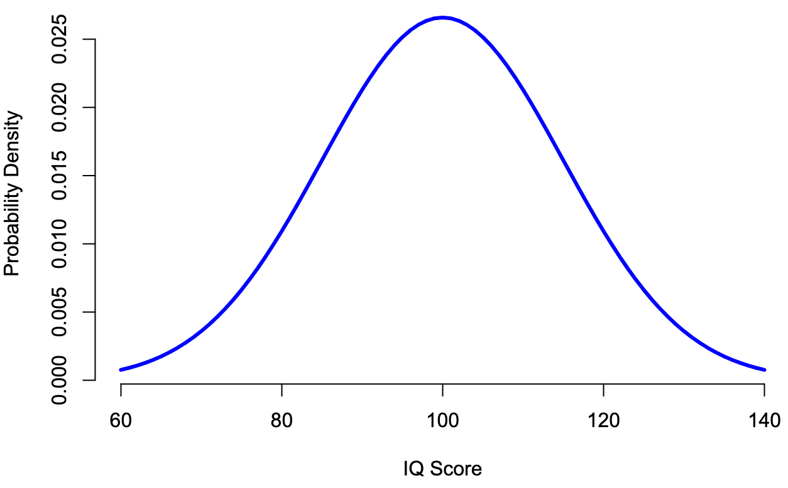
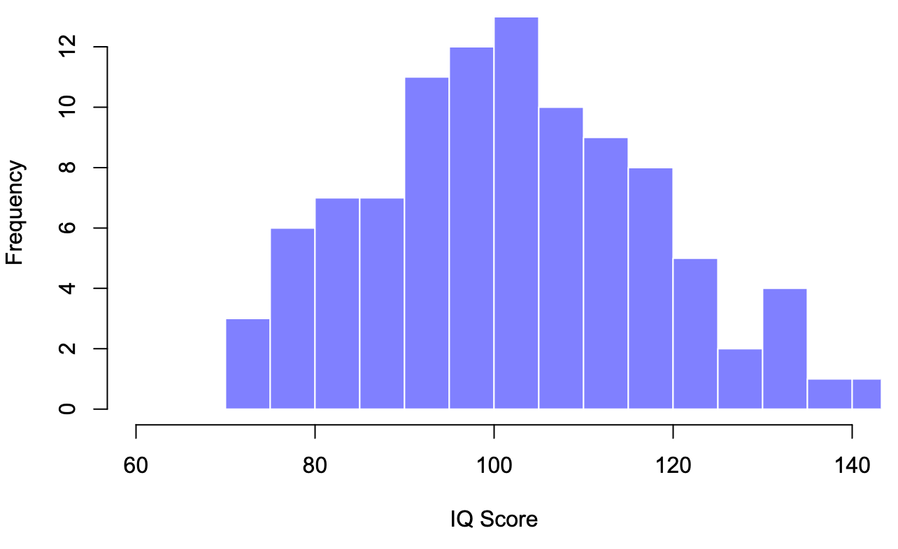
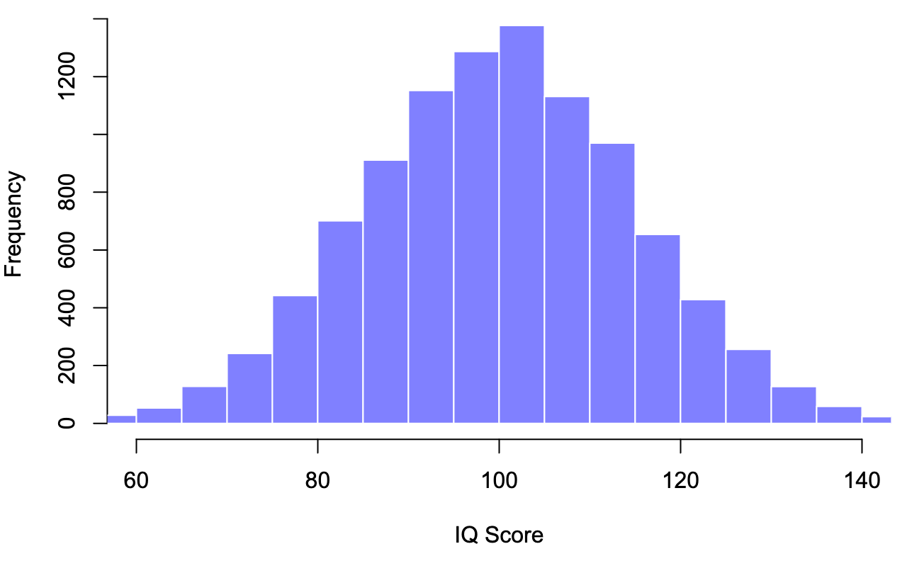
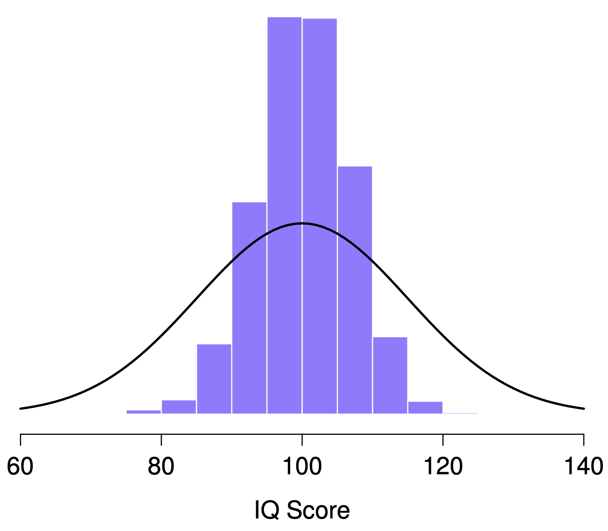
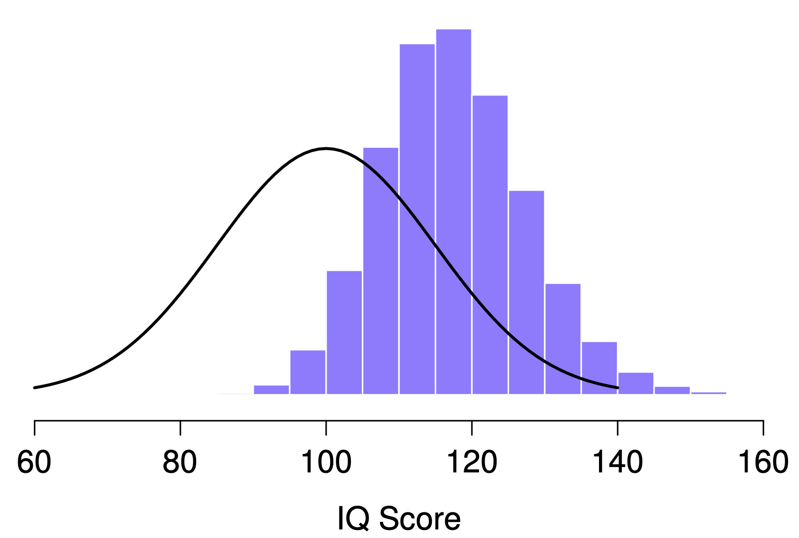
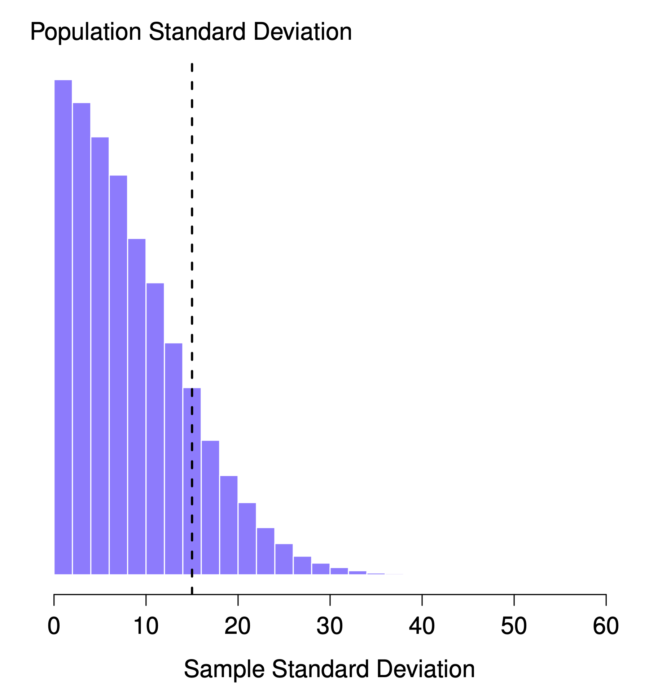
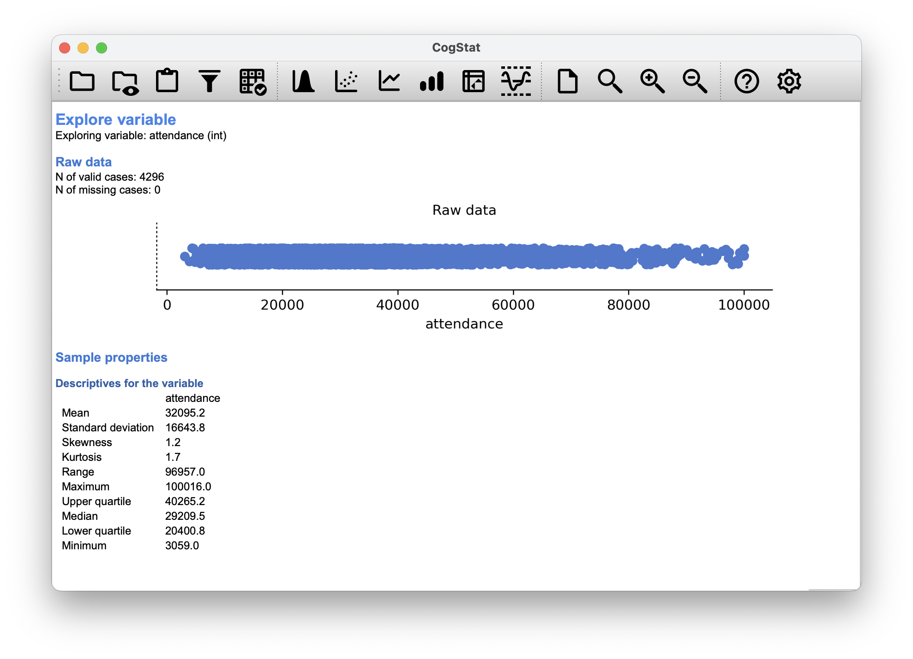

# Population, sampling, estimation{#estimation}

As discussed in Chapter \@ref(exploringavariable), the role of descriptive statistics is to concisely summarise what we *do* know. In contrast, inferential statistics aims to "learn what we do not know from what we do". Now that we have a foundation in probability theory, we are in a good position to think about the problem of statistical inference. What kinds of things would we like to learn about? And how do we learn them? These questions lie at the heart of inferential statistics and are traditionally divided into two "big ideas": estimation and hypothesis testing.

The goal of this chapter is to introduce sampling theory first because, later on, estimation theory doesn't make sense until you understand sampling.

## Samples, populations and sampling{#srs}

*All* learning requires you to make assumptions. Accepting this is true, our first task is to come up with some fairly general assumptions about data that make sense. If probability theory is the foundation upon which all statistical theory builds, **sampling theory** is the frame around which you can build the rest of the house. It plays a massive role in specifying the assumptions upon which your statistical inferences rely. And to talk about "making inferences" the way statisticians think about it, we need to be a bit more explicit about what it is that we're drawing inferences *from* (the sample) and what it is that we're drawing inferences *about* (the population).  

In almost every situation of interest, we have a **sample** of data available to us as researchers. We might have run an experiment with some number of participants; a polling company might have phoned some number of people to ask questions about voting intentions; etc. Regardless: the data set available to us is finite and incomplete. We can't possibly get every person in the world to do our experiment; a polling company doesn't have the time or the money to ring up every voter in the country etc. In our earlier discussion of descriptive statistics (Chapter \@ref(exploringavariable), this sample was the only thing we were interested in. Our only goal was to find ways of describing, summarising and graphing that sample. This is about to change.

### Defining a population{#pop}

A sample is a tangible thing. You can open up a data file, and there you have data from your sample. A **population**, on the other hand, is a more abstract idea. It refers to the set of all possible people, or all possible observations, that you want to draw conclusions about and is generally *much* bigger than the sample. In an ideal world, the researcher would begin the study with a clear idea of what the population of interest is since the process of designing a study and testing hypotheses about the data that it produces does depend on the population about which you want to make statements. However, that doesn't always happen in practice: usually, the researcher has a relatively vague idea of what the population is and designs the study as best they can on that basis. 

Sometimes it's easy to state the population of interest. For instance, in the "polling company" example that opened the chapter, the population consisted of all voters enrolled at the time of the study -- millions of people. The sample was a set of 1000 people belonging to that population. In most cases, the situation is much less simple. Determining the population of interest in a typical psychological experiment is a bit more complicated. Suppose we run an experiment using 100 undergraduate students as our participants. Our goal, as cognitive scientists, is to try to learn something about how the mind works. So, which of the following would count as "the population":

- All of the undergraduate psychology students at the University of Adelaide?
- Undergraduate psychology students in general, anywhere in the world?
- Australians currently living?
- Australians of similar ages to my sample?
- Anyone currently alive?
- Any human being, past, present or future?
- Any biological organism with sufficient intelligence operating in a terrestrial environment?
- Any intelligent being?

Each of these defines a real group of mind-possessing entities, all of which might be of interest, and it's not clear which one should be the true population of interest.

### Simple random samples

```{r srs1, fig.cap="Simple random sampling without replacement from a finite population", echo=FALSE, fig.align='center'}
knitr::include_graphics("resources/image/srs1.png")
```

Irrespective of how we define the population, the critical point is that the sample is a subset of the population. Our goal is to use our knowledge of the sample to draw inferences about the properties of the population. The relationship between the two depends on the *procedure* by which the sample was selected. This procedure is referred to as a **sampling method**, and it is important to understand why it matters.

To keep things simple, let's imagine that we have a bag containing 10 chips. Each chip has a unique letter printed on it, so we can distinguish between the 10 chips. The chips come in two colours, black and white. This set of chips is the population of interest, and it is depicted graphically on the left of Figure \@ref(fig:srs1). As you can see from looking at the picture, there are 4 black chips and 6 white chips, but of course, in real life, we wouldn't know that unless we looked in the bag. Now imagine you run the following "experiment": you shake up the bag, close your eyes, and pull out 4 chips without putting any of them back into the bag. First out comes the $a$ chip (black), then the $c$ chip (white), then $j$ (white) and then finally $b$ (black). If you wanted, you could then put all the chips back in the bag and repeat the experiment, as depicted on the right-hand side of Figure \@ref(fig:srs1). Each time you get different results, but the procedure is identical in each case. The fact that the same procedure can lead to different results each time, we refer to it as a *random* process.^[The proper mathematical definition of randomness is extraordinarily technical and way beyond the scope of this book. We'll be non-technical here and say that a process has an element of randomness to it whenever it is possible to repeat it and get different answers each time.] However, because we shook the bag before pulling any chips out, it seems reasonable to think that every chip has the same chance of being selected. A procedure in which every member of the population has the same chance of being selected is called a **simple random sample**. The fact that we did *not* put the chips back in the bag after pulling them out means that you can't observe the same thing twice, and in such cases, the observations are said to have been sampled **without replacement**. 

To help make sure you understand the importance of the sampling procedure, consider an alternative way the experiment could have been run. Suppose a 5-year-old had opened the bag and decided to pull out four black chips without putting any of them back in the bag. This *biased* sampling scheme is depicted in Figure \@ref(fig:brs). Now consider the evidentiary value of seeing 4 black chips and 0 white chips. Clearly, it depends on the sampling scheme. If you know that the sampling scheme is biased to select only black chips, then a sample that consists of only black chips doesn't tell you very much about the population! For this reason, statisticians really like it when a data set can be considered a simple random sample, because it makes the data analysis *much* easier.

```{r brs, fig.cap="Biased sampling without replacement from a finite population", echo=FALSE, fig.align='center'}
knitr::include_graphics("resources/image/brs.PNG")
```

(ref:srs2caption) Simple random sampling *with* replacement from a finite population

```{r srs2, fig.cap=paste("(ref:srs2caption)"), echo=FALSE, fig.align='center'}
knitr::include_graphics("resources/image/srs2.png")
```

A third procedure is worth mentioning. We close our eyes, shake the bag, and pull out a chip this time. This time, however, we record the observation and then put the chip back in the bag. Again we close our eyes, shake the bag, and pull out a chip. We then repeat this procedure until we have 4 chips. Data sets generated in this way are still simple random samples, but because we put the chips back in the bag immediately after drawing them, it is referred to as a sample **with replacement**. The difference between this situation and the first one is that it is possible to observe the same population member multiple times, as illustrated in Figure \@ref(fig:srs2).

Most psychology experiments tend to be sampling without replacement because the same person is not allowed to participate in the experiment twice. However, most statistical theories are based on the assumption that the data arise from a simple random sample *with* replacement. In real life, this very rarely matters. If the population of interest is large (e.g., has much more than 10 entities!), the difference between sampling with and without replacement is too small to be concerned with. The difference between simple random samples and biased samples, on the other hand, is not such an easy thing to dismiss.


### Most samples are not simple random samples

As you can see from the list of possible populations above, it is almost impossible to obtain a simple random sample from most populations of interest. A thorough discussion of other types of sampling schemes is beyond the scope of this book, but to give you a sense of what's out there, here's a list of a few of the more important ones:
 
- **Stratified sampling**. Suppose your population can be divided into several subpopulations, or *strata*. Perhaps you're running a study at different sites, for example. Instead of trying to sample randomly from the population as a whole, you try to collect a separate random sample from each stratum. Stratified sampling is sometimes easier to do than simple random sampling, especially when the population is already divided into distinct strata. It can also be more efficient than simple random sampling, especially when some subpopulations are rare. For instance, when studying schizophrenia, it would be much better to divide the population into two^[Nothing in life is that simple: there's not an obvious division of people into binary categories like "schizophrenic" and "not schizophrenic". But this isn't a clinical psychology text, so please forgive a few simplifications here and there.] strata (schizophrenic and not-schizophrenic), and then sample an equal number of people from each group. If you selected people randomly, you would get so few schizophrenic people in the sample that your study would be useless. This specific kind of stratified sampling is called *oversampling* because it deliberately attempts to over-represent rare groups.
- *Snowball sampling* is a technique that is especially useful when sampling from a "hidden" or hard-to-access population and is widespread in social sciences. For instance, suppose the researchers want to conduct an opinion poll among transgender people. The research team might only have contact details for a few trans folks, so the survey starts by asking them to participate (stage 1). At the end of the survey, the participants are asked to provide contact details for other people who might want to participate. In stage 2, those new contacts are surveyed. The process continues until the researchers have sufficient data. The advantage of snowball sampling is that it lets access data in situations that might otherwise be impossible to get any. On the statistical side, the main disadvantage is that the sample is highly non-random. On the real-life side, the disadvantage is that the procedure can be unethical if not handled well because hidden populations are often hidden for a reason. I chose transgender people as an example here to highlight this. If you weren't careful, you might end up outing people who don't want to be outed (very, very bad form), and even if you don't make that mistake, it can still be intrusive to use people's social networks to study them. It's undoubtedly tough to get people's informed consent *before* contacting them, yet in many cases, the simple act of contacting them and saying, "hi, we want to study you", can be hurtful. Social networks are complex, and just because you can use them to get data doesn't always mean you should.
- *Convenience sampling* is more or less what it sounds. The samples are chosen in a way that is convenient to the researcher, and not selected at random from the population of interest. Snowball sampling is one type of convenience sampling, but there are many others. A common example in psychology are studies that rely on undergraduate psychology students. These samples are generally non-random in two respects: firstly, reliance on undergraduate psychology students automatically means that your data are restricted to a single subpopulation. Secondly, the students usually get to pick which studies they participate in, so the sample is a self-selected subset of psychology students, not a randomly selected subset. In real life, most studies are convenience samples of one form or another. This is sometimes a severe limitation, but not always.

### How much does it matter if you don't have a simple random sample?

Okay, so real-world data collection tends not to involve nice simple random samples. Does that matter? A little thought should make it clear to you that it *can* matter if your data are not a simple random sample: think about the difference between Figures \@ref(fig:srs1) and \@ref(fig:brs). However, it's not quite as bad as it sounds. Some types of biased samples are entirely unproblematic. For instance, when using a stratified sampling technique, you *know* what the bias is because you created it deliberately, often to *increase* the effectiveness of your study. So in those situations, it's not a problem. Also, there are statistical techniques that you can use to adjust for the biases you've introduced, but they are not covered in this book.

More generally, it's important to remember that random sampling is a means to an end, not the end itself. Let's assume you've relied on a convenience sample; as such, you can assume it's biased. A bias in your sampling method is only a problem if it causes you to draw the wrong conclusions. When viewed from that perspective, I'd argue that we don't need the sample to be randomly generated in *every* respect: we only need it to be random for the psychologically-relevant phenomenon of interest. 

Suppose we're doing a study looking at working memory capacity. In study 1, we can sample randomly from all human beings currently alive, with one exception: we can only sample people born on a Monday. In study 2, we are able to sample randomly from the Australian population. We want to generalise my results to the population of all living humans. Which study is better? The answer, obviously, is study 1. Why? Because we have no reason to think that being "born on a Monday" has any interesting relationship to working memory capacity. In contrast, we can think of several reasons why "being Australian" might matter. Australia is a wealthy, industrialised country with a very well-developed education system. People growing up in that system will have had life experiences much more similar to the experiences of the people who designed the tests for working memory capacity. This shared experience might easily translate into similar beliefs about how to "take a test", a shared assumption about how psychological experimentation works, and so on. These things might actually matter. For instance, the "test-taking" style might have taught the Australian participants how to direct their attention exclusively on somewhat abstract test materials relative to people who haven't grown up in a similar environment, leading to a misleading picture of working memory capacity.

There are two points hidden in this discussion. Firstly, when designing your studies, you must consider what population you care about and try hard to sample in a way appropriate to that population. In practice, you're usually forced to put up with a "sample of convenience" (e.g., psychology lecturers sample psychology students because that's the least expensive way to collect data, and our coffers aren't exactly overflowing with gold). But you should at least spend some time thinking about the dangers of this practice.

Secondly, if you're criticising someone else's study because they've used a sample of convenience rather than laboriously sampling randomly from the entire human population, at least have the courtesy to offer a specific theory as to *how* this might have distorted the results. Remember, everyone in science knows this issue and does what they can to alleviate it. Merely pointing out that "the study only included people from group BLAH" is entirely unhelpful and borders on insulting the researchers, who are, *of course*, aware of the issue. They just don't happen to own the infinite supply of time and money required to construct the perfect sample. In short, if you want to offer a responsible critique of the sampling process, then be *helpful*.

### Population parameters and sample statistics

Let's consider a slightly different case by setting aside the thorny methodological issues associated with obtaining a random sample and my rather unfortunate tendency to rant about lazy methodological criticism. Up to this point, we have been talking about populations the way a scientist might: a population might be a group of people to a psychologist; to an ecologist, a population might be a group of bears. In most cases, the populations that scientists care about are tangible things that exist in the real world. Statisticians are interested in real-world data and actual science the same way scientists are. On the other hand, they also operate in the realm of pure abstraction as mathematicians do. Consequently, statistical theory tends to be a bit abstract in how a population is defined. In much the same way that psychological researchers operationalise our abstract theoretical ideas in terms of concrete measurements (Section \@ref(measurement), statisticians operationalise the concept of a "population" in terms of mathematical objects that they know how to work with. You've already come across these objects in Chapter \@ref(probability): they're called **probability distributions**.

The idea is quite simple. Let's say we're talking about IQ scores. To a psychologist, the population of interest is a group of actual humans with IQ scores. A statistician "simplifies" this by operationally defining the population as the probability distribution depicted in Figure \@ref(fig:IQdista). IQ tests are designed so that the average IQ is 100, the standard deviation of IQ scores is 15, and the distribution of IQ scores is normal. These values are referred to as the **population parameters** because they are characteristics of the entire population. That is, we say that the population mean $\mu$ is 100, and the population standard deviation $\sigma$ is 15.

```{r IQdista, fig.cap="The population distribution of IQ scores.", echo=FALSE, fig.align='center'}

```

Now let us run an experiment. We select 100 people at random and administer an IQ test, giving us a simple random sample from the population. The sample would consist of a collection of numbers like this:
```
 106 101 98 80 74 ... 107 72 100
```

```{r IQdistb, fig.cap="A sample of 100 observations drawn from the population distribution of IQ scores.", echo=FALSE, fig.align='center'}

```

Each IQ score is sampled from a normal distribution with a mean of 100 and a standard deviation of 15. So if we plot a histogram of the sample, we get something like the one shown in Figure \@ref(fig:IQdistb). As you can see, the histogram is *roughly* the proper shape, but it's a very crude approximation to the actual population distribution shown in Figure \@ref(fig:IQdista). When calculating the mean of the sample, we get a number that is relatively close to the population mean of 100 but not identical. In this case, it turns out that the people in the sample have a mean IQ of 98.5, and the standard deviation of their IQ scores is 15.9. These **sample statistics** are properties of our data set, and although they are reasonably similar to the actual population values, they are not the same. In general, sample statistics are the things you can calculate from your data set, and the population parameters are the things you want to learn about.

## The law of large numbers{#lawlargenumbers}

In the previous section, we discussed the results of one fictitious IQ experiment with a sample size of $N=100$. The results were somewhat encouraging: the true population mean was 100, and the sample mean of 98.5 was a reasonable approximation. In many scientific studies, that level of precision is perfectly acceptable, but in other situations, you need to be much more precise. If we want our sample statistics to be much closer to the population parameters, what can we do about it?

The obvious answer is to collect more data. Suppose that we ran a much larger experiment, this time measuring the IQs of 10,000 people. For an experiment with a sample size of `n = 10000`, and a population with `mean = 100` and `sd = 15`, we get the following distribution:

```{r IQdistc, fig.cap="A sample of 10,000 observations drawn from the population distribution of IQ scores.", echo=FALSE, fig.align='center'}

```

Large samples generally give you better information. It feels silly saying it because it's so bloody obvious that it shouldn't need to be said. It's such an obvious point that when Jacob Bernoulli -- one of the founders of probability theory -- formalised this idea back in 1713, he was kind of a jerk about it. Here's how he described the fact that we all share this intuition:

> *For even the most stupid of men, by some instinct of nature, by himself and without any instruction (which is a remarkable thing), is convinced that the more observations have been made, the less danger there is of wandering from one's goal.*  @Stigler1986

Okay, so the passage comes across as a bit condescending (not to mention sexist), but his main point is correct: it really does feel evident that more data will give you better answers. The question is, why is this so? Not surprisingly, this intuition we all share is correct, and statisticians refer to it as the **law of large numbers**. The law of large numbers is a mathematical law that applies to many different sample statistics, but the simplest way to think about it is as a law about averages. The sample mean is the most obvious example of a statistic that relies on averaging (because that's what the mean is -- an average), so let's look at that.

When applied to the sample mean, the law of large numbers states that as the sample gets larger, the sample mean tends to get closer to the true population mean. Or, to say it a little bit more precisely, as the sample size "approaches" infinity (written as $N \rightarrow \infty$) the sample mean approaches the population mean ($\bar{X} \rightarrow \mu$).^[Technically, the law of large numbers pertains to any sample statistic that can be described as an average of independent quantities. That's certainly true for the sample mean. However, it's also possible to write many other sample statistics as averages of one form or another. The variance of a sample, for instance, can be rewritten as an average and so is subject to the law of large numbers. The minimum value of a sample, however, cannot be written as an average of anything and is therefore not governed by the law of large numbers.] 

You won't be subject to proof that the law of large numbers is true, but it's one of the most important tools for statistical theory. The law of large numbers is the thing we can use to justify our belief that collecting more and more data will eventually lead us to the truth. For any particular data set, the sample statistics that we calculate from it will be wrong, but the law of large numbers tells us that if we keep collecting more data, those sample statistics will tend to get closer and closer to the true population parameters.


## Sampling distributions and the central limit theorem{#samplesandclt}

The law of large numbers is a potent tool, but it will not be good enough to answer all our questions. Among other things, it gives us a "long-run guarantee". In the long run, if we could collect an infinite amount of data, then the law of large numbers guarantees that our sample statistics will be correct. But as John Maynard Keynes famously argued in economics, a long-run guarantee is of little use in real life:

> *[The] long run is a misleading guide to current affairs. In the long run we are all dead. Economists set themselves too easy, too useless a task, if in tempestuous seasons they can only tell us, that when the storm is long past, the ocean is flat again.*  @Keynes1923

As in economics, so too in psychology and statistics. It is not enough to know that we will *eventually* arrive at the right answer when calculating the sample mean. Knowing that an infinitely large data set will tell me the exact value of the population mean is cold comfort when my *actual* data set has a sample size of $N=100$. In real life, then, we must know something about the behaviour of the sample mean when it is calculated from a more modest data set!

### Sampling distribution of the mean{#samplingdists}


With this in mind, let's abandon the idea that our studies will have sample sizes of 10000 and consider a very modest experiment indeed. This time around, we'll sample $N=5$ people and measure their IQ scores.

```
90  82  94  99  110
```

The mean IQ in this sample turns out to be exactly 95. Not surprisingly, this is much less accurate than the previous experiment. Now imagine that we decided to **replicate** the experiment. That is, we repeat the procedure as closely as possible: randomly sample 5 new people and measure their IQ.

```
78  88  111  111  117
```

This time around, the mean IQ in the sample is 101.

If we repeat the experiment 10 times, we obtain the results shown in Table \@ref(tab:replications), and as you can see, the sample mean varies from one replication to the next.

```{r replications, echo=FALSE}
library(kableExtra)
knitr::kable(data.frame(stringsAsFactors = FALSE,
NANA = c("Replication 1", "Replication 2", "Replication 3", "Replication 4",
         "Replication 5", "Replication 6", "Replication 7", "Replication 8",
         "Replication 9", "Replication 10"),
`Person 1` = c(90, 78, 111, 98, 105, 81, 100, 107, 86, 95),
`Person 2` = c(82, 88, 122, 96, 113, 89, 93, 100, 119, 126),
`Person 3` = c(94, 111, 91, 119, 103, 93, 108, 105, 108, 112),
`Person 4` = c(99, 111, 98, 99, 103, 85, 98, 117, 73, 120),
`Person 5` = c(110, 117, 86, 107, 98, 114, 133, 85, 116, 76),
`Sample Mean` = c(95, 101, 101.6, 103.8, 104.4, 92.4, 106.4, 102.8, 100.4,
            105.8)),
align = "lcccccc",
col.names = c("Replication", "Person 1", "Person 2", "Person 3", "Person 4",
              "Person 5", "Sample Mean"),
caption = "Ten replications of the IQ experiment, each with a sample size of $N=5$.",
booktabs = TRUE) %>%
  kable_styling(position = "center")
```

Suppose we decided to keep going in this fashion, replicating this "five IQ scores" experiment repeatedly. Every time we replicate the experiment, we write down the sample mean. Over time, we should be amassing a new data set in which every experiment generates a single data point. The first 10 observations from the data set are the sample means listed in Table \@ref(tab:replications), so our data set starts out like this:
```
95.0 101.0 101.6 103.8 104.4 ...
```
What if we should continue like this for 10,000 replications and then draw a histogram? As Figure \@ref(fig:sampdistmean) illustrates, the average of 5 IQ scores is usually between 90 and 110. But more importantly, what it highlights is that if we replicate an experiment over and over again, what we end up with is a *distribution* of sample means! This distribution has a particular name in statistics: the **sampling distribution of the mean**.

Sampling distributions are another important theoretical idea in statistics, and they're crucial for understanding the behaviour of small samples. For instance, when we ran the very first "five IQ scores" experiment, the sample mean turned out to be 95. What the sampling distribution in Figure \@ref(fig:sampdistmean) tells us, though, is that the "five IQ scores" experiment is not very accurate. If we repeat the experiment, the sampling distribution tells me that we can expect to see a sample mean anywhere between 80 and 120.

(ref:sampdistmeancap) The sampling distribution of the mean for the "five IQ scores experiment". If you sample 5 people at random and calculate their *average* IQ, you'll almost certainly get a number between 80 and 120, even though there are quite a lot of individuals who have IQs above 120 or below 80. For comparison, the black line plots the population distribution of IQ scores.

```{r sampdistmean, fig.cap=paste("(ref:sampdistmeancap)"), echo=FALSE, fig.align="center"}

```

### Sampling distributions exist for any sample statistic!

One thing to remember when thinking about sampling distributions is that *any* sample statistic you might care to calculate has a sampling distribution. For example, suppose that each time we replicated the "five IQ scores" experiment, we wrote down the largest IQ score in the experiment. This would give us a data set that started out like this:
```
110 117 122 119 113 ... 
```
Doing this over and over again would give a very different sampling distribution, namely the *sampling distribution of the maximum*. The sampling distribution of the maximum of 5 IQ scores is shown in Figure \@ref(fig:sampdistmax). Not surprisingly, if you pick 5 people at random and then find the person with the highest IQ score, they're going to have an above-average IQ. Most of the time, you'll end up with someone whose IQ is measured in the 100 to 140 range.

(ref:sampdistmaxcap) The sampling distribution of the *maximum* for the "five IQ scores experiment". If you sample 5 people at random and select the one with the highest IQ score, you'll probably see someone with an IQ between 100 and 140.

```{r sampdistmax, fig.cap=paste("(ref:sampdistmaxcap)"), echo=FALSE, fig.align="center"}

```


### The central limit theorem{#clt}

Here's an illustration of how the sampling distribution of the mean depends on the sample size. In each panel, there are 10,000 generated samples of IQ data and the mean IQ observed within each set. The histograms in these plots show the distribution of these means (i.e. the sampling distribution of the mean). Each individual IQ score was drawn from a normal distribution with mean 100 and standard deviation 15, which is shown as the solid black line).

```{r IQsampa, fig.cap="Each data set contained only a single observation, so the mean of each sample is just one person's IQ score. As a consequence, the sampling distribution of the mean is of course identical to the population distribution of IQ scores.", echo=FALSE}
width <- 4.5
height <- 4.5

# function to do all the work
plotSamples <- function(n, N) {
IQ <- rnorm(n, 100, 15 / sqrt(N))
hist(IQ, breaks = seq(10, 180, 5), border = "white", freq = FALSE,
     xlab = "IQ Score", ylab = "", xlim = c(60, 140),
     main = paste("Sample Size =", N), axes = FALSE,
     font.main = 1, ylim = c(0, .07)
     )
axis(1)
}

# population distribution
x <- 60:140
y <- dnorm(x, 100, 15)

# plot two different sample sizes
plotSamples(10000, 1)
lines(x, y, lwd = 2, col = "black", type = "l")
```

```{r IQsampb, fig.cap="When we raise the sample size to 2, the mean of any one sample tends to be closer to the population mean than a one person's IQ score, and so the histogram (i.e., the sampling distribution) is a bit narrower than the population distribution.", echo=FALSE}
width <- 4.5
height <- 4.5

# plot two different sample sizes
plotSamples(1000, 2)
lines(x, y, lwd = 2, col = "black", type = "l")
```

```{r IQsampc, fig.cap="By the time we raise the sample size to 10, we can see that the distribution of sample means tend to be fairly tightly clustered around the true population mean.", echo=FALSE}
width <- 4.5
height <- 4.5

# plot two different sample sizes
plotSamples(1000,10)
lines(x, y, lwd = 2, col = "black", type = "l")
```

At this point, you have a pretty good sense of what sampling distributions are, particularly the sampling distribution of the mean. In this section, let us talk about how the sampling distribution of the mean changes as a function of sample size. Intuitively, you already know part of the answer: if you only have a few observations, the sample mean is likely to be quite inaccurate: if you replicate a small experiment and recalculate the mean, you'll get a very different answer. In other words, the sampling distribution is quite broad. If you replicate a large experiment and recalculate the sample mean, you'll probably get the same answer you got last time, so the sampling distribution will narrow. You can see this visually in Figures \@ref(fig:IQsampa), \@ref(fig:IQsampb) and \@ref(fig:IQsampc): the bigger the sample size, the narrower the sampling distribution gets. We can quantify this effect by calculating the standard deviation of the sampling distribution, which is referred to as the **standard error**. The standard error of a statistic is often denoted SE, and since we're usually interested in the standard error of the sample *mean*, we often use the acronym SEM. As you can see just by looking at the picture, as the sample size $N$ increases, the SEM decreases.

However, there's something we've been glossing over so far. All examples up to this point have been based on the "IQ scores" experiments. And because IQ scores are roughly normally distributed, we've assumed that the population distribution is normal. What if it isn't normal? What happens to the sampling distribution of the mean? The remarkable thing is this: no matter what shape your population distribution is, as $N$ increases the sampling distribution of the mean starts to look more like a normal distribution. 

To give you a sense of this, let's run some simulations. We start with the "ramped" distribution shown in the histogram in Figure \@ref(fig:cltdemo). As you can see by comparing the triangular-shaped histogram to the bell curve plotted by the black line, the population distribution doesn't look very much like a normal distribution at all. Next, let us simulate the results of a large number of experiments. In each experiment, we draw $N=2$ samples from this distribution and then calculate the sample mean. Figure \@ref(fig:cltdemo) panel b plots the histogram of these sample means (i.e. the sampling distribution of the mean for $N=2$). This time, the histogram produces a $\cap$-shaped distribution: it's still not normal, but it's a lot closer to the black line than the population distribution in Figure \@ref(fig:cltdemo) panel a. When we increase the sample size to $N=4$, the sampling distribution of the mean is very close to normal (Figure \@ref(fig:cltdemo) panel c), and by the time we reach a sample size of $N=8$ it's almost perfectly normal. In other words, as long as your sample size isn't tiny, the sampling distribution of the mean will be approximately normal no matter what your population distribution looks like!

```{r cltdemo, fig.cap="A demonstration of the central limit theorem. In panel a, we have a non-normal population distribution; and panels b-d show the sampling distribution of the mean for samples of size 2, 4 and 8, for data drawn from the distribution in panel a. As you can see, even though the original population distribution is non-normal, the sampling distribution of the mean becomes pretty close to normal by the time you have a sample of even 4 observations. ", echo=FALSE, fig.show="hold", fig.align="center", out.width="50%"}
knitr::include_graphics(c(
     "resources/image/cltDemo-a.png",
     "resources/image/cltDemo-b.png",
     "resources/image/cltDemo-c.png",
     "resources/image/cltDemo-d.png"
     )
)
```

Based on these figures, it seems like we have evidence for all of the following claims about the sampling distribution of the mean:

- The mean of the sampling distribution is the same as the mean of the population
- The standard deviation of the sampling distribution (i.e., the standard error) gets smaller as the sample size increases
- The shape of the sampling distribution becomes normal as the sample size increases

As it happens, not only are all of these statements true, there is a very famous theorem in statistics that proves all three of them, known as the **central limit theorem**. Among other things, the central limit theorem tells us that if the population distribution has mean $\mu$ and standard deviation $\sigma$, then the sampling distribution of the mean also has mean $\mu$, and the standard error of the mean is 
$$
\mbox{SEM} = \frac{\sigma}{ \sqrt{N} }
$$ 

Because we divide the population standard devation $\sigma$ by the square root of the sample size $N$, the SEM gets smaller as the sample size increases. It also tells us that the shape of the sampling distribution becomes normal.^[As usual, we're being a bit sloppy here. The central limit theorem is a bit more general than this section implies. Like most introductory stats texts, we have discussed one situation where the central limit theorem holds: when you're taking an average across lots of independent events drawn from the same distribution. However, the central limit theorem is much broader than this. There's a whole class of things called "$U$-statistics", all of which satisfy the central limit theorem and therefore become normally distributed for large sample sizes. The mean is one such statistic, but it's not the only one.] 

This result is useful for all sorts of things. It tells us why large experiments are more reliable than small ones, and because it gives us an explicit formula for the standard error, it tells us *how much* more reliable a large experiment is. It tells us why the normal distribution is, well, *normal*. In real experiments, many of the things that we want to measure are averages of lots of different quantities (e.g. arguably, "general" intelligence as measured by IQ is an average of a large number of "specific" skills and abilities), and when that happens, the averaged quantity should follow a normal distribution. Because of this mathematical law, the normal distribution pops up over and over again in real data.

## Estimating population parameters{#pointestimates}

In all the IQ examples in the previous sections, we knew the population parameters ahead of time. As every undergraduate gets taught in their first lecture on the measurement of intelligence, IQ scores are *defined* to have mean 100 and standard deviation 15. However, this is a bit of a lie. How do we know that IQ scores have a true population mean of 100? Well, we know this because the people who designed the tests have administered them to very large samples, and have then "rigged" the scoring rules so that their sample has mean 100. That's not a bad thing of course: it's an important part of designing a psychological measurement. However, it's important to keep in mind that this theoretical mean of 100 only attaches to the population that the test designers used to design the tests. Good test designers will actually go to some lengths to provide "test norms" that can apply to lots of different populations (e.g., different age groups, nationalities etc.). 

This is very handy, but of course, almost every research project of interest involves looking at a different population of people to those used in the test norms. For instance, suppose you wanted to measure the effect of low-level lead poisoning on cognitive functioning in Port Pirie, a South Australian industrial town with a lead smelter. Perhaps you decide that you want to compare IQ scores among people in Port Pirie to a comparable sample in Whyalla, a South Australian industrial town with a steel refinery.^[Please note that if you were *actually* interested in this question, you would need to be a *lot* more careful than we are being here. You *can't* simply compare IQ scores in Whyalla to Port Pirie and assume that any differences are due to lead poisoning. Even if it were true that the only differences between the two towns corresponded to the different refineries (and it isn't, not by a long shot), you need to account for the fact that people already *believe* that lead pollution causes cognitive deficits: if you recall back to Chapter \@ref(researchdesign), this means that there are different demand effects for the Port Pirie sample than for the Whyalla sample. In other words, you might end up with an illusory group difference in your data, caused by the fact that people *think* that there is a real difference. It is pretty implausible to think that the locals wouldn't be well aware of what you were trying to do if a bunch of researchers turned up in Port Pirie with lab coats and IQ tests, and even less plausible to think that a lot of people would be pretty resentful of you for doing it. Those people won't be as cooperative in the tests. Other people in Port Pirie might be *more* motivated to do well because they don't want their home town to look bad. The motivational effects that would apply in Whyalla are likely to be weaker because people don't have any concept of "iron ore poisoning" in the same way that they have a concept for "lead poisoning". Psychology is *hard*.] Regardless of which town you're thinking about, it doesn't make a lot of sense simply to *assume* that the true population mean IQ is 100. No one has produced sensible norming data that can automatically be applied to South Australian industrial towns. We're going to have to **estimate** the population parameters from a sample of data. So how do we do this?

### Estimating the population mean

Suppose we go to Port Pirie and 100 of the locals are kind enough to sit through an IQ test. The average IQ score among these people turns out to be $\bar{X}=98.5$. So what is the true mean IQ for the entire population of Port Pirie? Obviously, we don't know the answer to that question. It could be $97.2$, but if could also be $103.5$. Our sampling isn't exhaustive so we cannot give a definitive answer. Nevertheless if I was forced at gunpoint to give a "best guess" I'd have to say $98.5$. That's the essence of statistical estimation: giving a best guess. 

In this example, estimating the unknown poulation parameter is straightforward. I calculate the sample mean, and I use that as my **estimate of the population mean**. It's pretty simple, and in the next section I'll explain the statistical justification for this intuitive answer. However, for the moment what I want to do is make sure you recognise that the sample statistic and the estimate of the population parameter are conceptually different things. A sample statistic is a description of your data, whereas the estimate is a guess about the population. With that in mind, statisticians often different notation to refer to them. For instance, if true population mean is denoted $\mu$, then we would use $\hat\mu$ to refer to our estimate of the population mean. In contrast, the sample mean is denoted $\bar{X}$ or sometimes $m$. However, in simple random samples, the estimate of the population mean is identical to the sample mean: if I observe a sample mean of $\bar{X} = 98.5$, then my estimate of the population mean is also $\hat\mu = 98.5$. To help keep the notation clear, here's a handy table:

```{r echo = FALSE}
library(kableExtra)
knitr::kable(cbind(`Symbol` = c("$\\bar{X}$", "$\\mu$", "$\\hat{\\mu}$"),
                   `What is it` = c("Sample mean", "True population mean",
                                    "Estimate of the population mean"),
                   `Do we know what it is` = c("Yes  calculated from the raw data",
                                              "Almost never known for sure",
                                              "Yes  identical to the sample mean")),
             caption="Notation for sample statistics and estimates of population parameters.",
             booktabs = TRUE, escape = FALSE) %>%
             kable_styling(position = "center")
```

### Estimating the population standard deviation

So far, estimation seems pretty simple, and you might wonder why you must read through all that stuff about sampling theory. In the case of the mean, our estimate of the population parameter (i.e. $\hat\mu$) turned out to be identical to the corresponding sample statistic (i.e. $\bar{X}$). However, that's not always true. To see this, let's construct an **estimate of the population standard deviation**, which we'll denote $\hat\sigma$. What shall we use as our estimate in this case? Your first thought might be that we could do the same thing we did when estimating the mean and just use the sample statistic as our estimate. That's almost the right thing to do, but not quite. Here's why:

Suppose we have a sample that contains a single observation. For this example, it helps to consider a sample where you have no intuitions about the true population values, so let's use something completely fictitious. Suppose the observation in question measures the *cromulence*^[The word *cromulent* was invented in a Simpsons episode in 1996 and, based on its context, might mean "possible", "acceptable", or "fine" according to @Cromulence. However, the whole point here is, we don't really know what it is.] of a shoe. It turns out that this shoe has a cromulence of 20. So here's our sample:

```
20
```

This is a legitimate sample, even if it has a sample size of $N=1$. It has a sample mean of 20, and because every observation in this sample is equal to the sample mean (obviously!), it has a sample standard deviation of 0. As a description of the *sample* this seems quite right: the sample contains a single observation, and therefore there is no variation observed within the sample. A sample standard deviation of $s = 0$ is the right answer here. But as an estimate of the *population* standard deviation, it feels completely insane, right? Admittedly, we don't know anything at all about what "cromulence" is, but we know something about data: the only reason that we don't see any variability in the *sample* is that the sample is too small to display any variation! So, if you have a sample size of $N=1$, it *feels* like the right answer is just to say "no idea at all".

Notice that you *don't* have the same intuition regarding the sample mean and the population mean. If forced to make the best guess about the population mean, it doesn't feel completely insane to guess that the population mean is 20. Sure, you probably wouldn't feel very confident in that guess because you have only one observation to work with, but it's still the best guess you can make. 

Let's extend this example a little. Suppose we now make a second observation. The data set now has $N=2$ observations of the cromulence of shoes, and the complete sample now looks like this:
```
20   22
```
This time around, our sample is *just* large enough for us to observe some variability: two observations is the bare minimum number needed for any variability to be observed! For our new data set, the sample mean is $\bar{X}=21$, and the sample standard deviation is $s=1$. What intuitions do we have about the population? Again, as far as the population mean goes, the best guess we can possibly make is the sample mean: if forced to guess, we'd probably say that the population mean cromulence is 21. What about the standard deviation? This is a little more complicated. The sample standard deviation is only based on two observations, and if you're at all like me you probably have the intuition that, with only two observations, we haven't given the population "enough of a chance" to reveal its true variability to us. It's not just that we suspect that the estimate is *wrong*: after all, with only two observations, we expect it to be wrong to some degree. The worry is that the error is *systematic*. Specifically, we suspect that the sample standard deviation is likely to be smaller than the population standard deviation.

(ref:sampdistsdcap) The sampling distribution of the sample standard deviation for a "two IQ scores" experiment. The true population standard deviation is 15 (dashed line), but as you can see from the histogram, the vast majority of experiments will produce a much smaller sample standard deviation than this. On average, this experiment would produce a sample standard deviation of only 8.5, well below the true value! In other words, the sample standard deviation is a *biased* estimate of the population standard deviation.

```{r sampdistsd, fig.cap=paste("(ref:sampdistsdcap)"), echo=FALSE, fig.align="center"}

```

This intuition feels right, but it would be nice to demonstrate this somehow. There are, in fact, mathematical proofs that confirm this intuition, but unless you have the right mathematical background, they don't help very much.

With that in mind, let's return to our IQ studies. Suppose the actual population mean IQ is 100 and the standard deviation is 15. Let's measure $N=2$ IQ scores and calculate the sample standard deviation. If we do this repeatedly and plot a histogram of these sample standard deviations, we have the **sampling distribution of the standard deviation** (Figure \@ref(fig:sampdistsd)). Even though the true population standard deviation is 15, the average of the *sample* standard deviations is only 8.5. Notice that this is a very different result from what we found in Figure \@ref(fig:IQsampb) when we plotted the sampling distribution of the mean. If you look at that sampling distribution, what you see is that the population mean is 100, and the average of the sample means is also 100.

Now let's extend the simulation. Instead of restricting ourselves to the situation where we have a sample size of $N=2$, let's repeat the exercise for sample sizes from 1 to 10. If we plot the average sample mean and average sample standard deviation as a function of sample size, you get the results shown in Figure \@ref(fig:estimatorbias). On the left side (panel a), you see the average sample mean, and on the right (panel b), the average standard deviation. The two plots are quite different: *on average*, the average sample mean is equal to the population mean. It is an **unbiased estimator**, which is essentially why your best estimate for the population mean is the sample mean.^[Unbiasedness is a desirable characteristic for an estimator, but there are other things that matter besides bias. However, it's beyond the scope of this book to discuss this in any detail. Just note that there's some hidden complexity here.] The plot on the right is quite different: on average, the sample standard deviation $s$ is *smaller* than the population standard deviation $\sigma$. It is a **biased estimator**. In other words, if we want to make a "best guess" $\hat\sigma$ about the value of the population standard deviation $\sigma$, we should make sure our guess is a little bit larger than the sample standard deviation $s$.

(ref:estimatorbiascap) An illustration of the fact that the sample mean is an unbiased estimator of the population mean (panel a). Still, the sample standard deviation is a biased estimator of the population standard deviation (panel b). To generate the figure, we have 10,000 simulated data sets with 1 observation each, 10,000 more with 2 observations, and so on up to a sample size of 10. Each data set consisted of fake IQ data: the data were normally distributed with a true population mean of 100 and standard deviation 15. *On average*, the sample means turn out to be 100, regardless of sample size (panel a). However, the sample standard deviations turn out to be systematically too small (panel b), especially for small sample sizes.

```{r estimatorbias, fig.cap=paste("(ref:estimatorbiascap)"), echo=FALSE, fig.show="hold", fig.align="center", out.width="50%"}
knitr::include_graphics(c("resources/image/biasMean.png",
                          "resources/image/biasSD.png"))
```

The fix to this systematic bias turns out to be very simple. Here's how it works. Before tackling the standard deviation, let's look at the variance. If you recall from Chapter \@ref(var), the sample variance is defined as the average squared deviations from the sample mean. That is:
$$
s^2 = \frac{1}{N} \sum_{i=1}^N (X_i - \bar{X})^2
$$
The sample variance $s^2$ is a biased estimator of the population variance $\sigma^2$. But as it turns out, we only need to make a tiny tweak to transform this into an unbiased estimator. All we have to do is divide by $N-1$ rather than by $N$. If we do that, we obtain the following formula:
$$
\hat\sigma^2 = \frac{1}{N-1} \sum_{i=1}^N (X_i - \bar{X})^2 
$$
This is an unbiased estimator of the population variance $\sigma$, and why statistics software functions prefer $\hat\sigma^2$, not $s^2$ when calculating variance. A similar story applies to the standard deviation. If we divide by $N-1$ rather than $N$, our estimate of the population standard deviation becomes:
$$
\hat\sigma = \sqrt{\frac{1}{N-1} \sum_{i=1}^N (X_i - \bar{X})^2} 
$$
and when using statistics software, they calculate $\hat\sigma$, not $s$.^[While $\hat\sigma^2$ is an unbiased estimate of the population variance $\sigma^2$, when you take the square root, it turns out that $\hat\sigma$ is a biased estimator of the population standard deviation $\sigma$. So, why is $\hat\sigma$ biased? The technical answer is "because non-linear transformations (e.g. the square root) don't commute with expectation", but that just sounds like gibberish to everyone who hasn't taken a course in mathematical statistics. Fortunately, it doesn't matter for practical purposes. The bias is so small, and in real life, everyone uses $\hat\sigma$, and it works just fine. Sometimes mathematics is just annoying.]

One final point: in practice, many people refer to $\hat{\sigma}$ (i.e. the formula where we divide by $N-1$) as the *sample* standard deviation. Technically, this is incorrect: the *sample* standard deviation should be equal to $s$ (i.e. the formula where we divide by $N$). These aren't the same thing, either conceptually or numerically. One is a property of the sample, and the other is an estimated characteristic of the population. However, in almost every real-life application, what we care about is the estimate of the population parameter, and so people always report $\hat\sigma$ rather than $s$. This is the right number to report, of course. People tend to get a little bit imprecise about terminology when they write it up because "sample standard deviation" is shorter than "estimated population standard deviation". It's no big deal, and in practice, many do the same thing everyone else does. Nevertheless, it's important to keep the two *concepts* separate: it's never a good idea to confuse "known properties of your sample" with "guesses about the population from which it came". The moment you start thinking that $s$ and $\hat\sigma$ are the same things, you start doing exactly that.

To finish this section off, here's another couple of tables to help keep things clear:

```{r echo=FALSE}
library(kableExtra)
knitr::kable(data.frame(stringsAsFactors=FALSE,
                   Symbol = c("$s$", "$\\sigma$", "$\\hat{\\sigma}$", "$s^2$",
                              "$\\sigma^2$", "$\\hat{\\sigma}^2$"),
              What.is.it = c("Sample standard deviation",
                              "Population standard deviation",
                              "Estimate of the population standard deviation", "Sample variance",
                              "Population variance",
                              "Estimate of the population variance"),
   Do.we.know.what.it.is = c("Yes - calculated from the raw data",
                              "Almost never known for sure",
                              "Yes - but not the same as the sample standard deviation",
                              "Yes - calculated from the raw data",
                              "Almost never known for sure",
                              "Yes -  but not the same as the sample variance")
),
col.names = c("Symbol", "What is it?", "Do we know what it is?"),
booktabs = TRUE, escape = FALSE, linesep = "") %>%
     kable_styling(position = "center") %>%
     kable_styling(latex_options = "scale_down")
```

## Estimating a confidence interval{#ci}

Up to this point in this chapter, we've outlined the basics of sampling theory which statisticians rely on to make guesses about population parameters based on a sample of data. As this discussion illustrates, one of the reasons we need all this sampling theory is that every data set leaves us with some uncertainty, so our estimates are never going to be perfectly accurate. The thing missing from this discussion is an attempt to *quantify* the amount of uncertainty that attaches to our estimate. It's not enough to guess that the mean IQ of undergraduate psychology students is, say, 115. We also want to be able to say something that expresses the degree of certainty that we have in our guess. For example, it would be nice to say that there is a 95\% chance that the true mean lies between 109 and 121. The name for this is a **confidence interval** for the mean. Armed with an understanding of sampling distributions, constructing a confidence interval for the mean is quite easy.

Suppose the true population mean is $\mu$ and the standard deviation is $\sigma$. Our study has $N$ participants whose mean IQ is $\bar{X}$. We know from our discussion of the central limit theorem (Section \@ref(clt)) that the sampling distribution of the mean is approximately normal. We also know from our discussion of the normal distribution (Section \@ref(normal)) that there is a 95\% chance that a normally-distributed quantity will fall within two standard deviations of the true mean. To be more precise, between $-1.959964$ and $1.959964$, meaning the 2.5th and 97.5th percentiles of the normal distribution. So the *more* correct answer is that there is a 95\% chance that a normally-distributed quantity will fall within *1.96 standard deviations* of the true mean. 

Next, recall that the standard deviation of the sampling distribution is referred to as the *standard error*, and the standard error of the mean is written as SEM. When we put all these pieces together, we learn that there is a 95\% probability that the sample mean $\bar{X}$ that we have actually observed lies within 1.96 standard errors of the population mean. Mathematically, we write this as:
$$
\mu - \left( 1.96 \times \mbox{SEM} \right) \ \leq \ \bar{X}\ \leq \ \mu + \left( 1.96 \times \mbox{SEM} \right) 
$$
where the SEM is equal to $\sigma / \sqrt{N}$, and we can be 95\% confident that this is true. However, that's not answering the question that we're actually interested in.

The equation above tells us what we should expect about the sample mean, given that we know the population parameters. What we *want* is to have this work the other way around: we want to know what we should believe about the population parameters, given that we have observed a particular sample. However, it's not too difficult to do this. Using a little high school algebra, a sneaky way to rewrite our equation is like this:
$$
\bar{X} - \left( 1.96 \times \mbox{SEM} \right) \ \leq \ \mu \ \leq \ \bar{X} + \left( 1.96 \times \mbox{SEM}\right)
$$

What this is telling is that the range of values has a 95\% probability of containing the population mean $\mu$. We refer to this range as a **95\% confidence interval**, denoted $\mbox{CI}_{95}$.

In short, as long as $N$ is sufficiently large -- large enough for us to believe that the sampling distribution of the mean is normal -- then we can write this as our formula for the 95\% confidence interval:
$$
\mbox{CI}_{95} = \bar{X} \pm \left( 1.96 \times \frac{\sigma}{\sqrt{N}} \right)
$$

Of course, there's nothing special about the number 1.96: it just happens to be the multiplier you need to use if you want a 95\% confidence interval. If I'd wanted a 70\% confidence interval, you have to calculate the 15th and 85th quantiles of the normal distribution, which are $-1.036433$ and $1.036433$. So the formula for $\mbox{CI}_{70}$ would be the same as the formula for $\mbox{CI}_{95}$ except that we'd use 1.04 as our magic number rather than 1.96.

### A slight mistake in the formula

The formula above for the 95\% confidence interval is approximately correct, but we glossed over an important detail in the discussion. Notice that it requires you to use the standard error of the mean, SEM, which in turn requires you to use the true population standard deviation $\sigma$. Yet, in Chapter \@ref(pointestimates), we stressed the fact that we don't actually *know* the true population parameters. Because we don't know the true value of $\sigma$, we have to use an estimate of the population standard deviation $\hat{\sigma}$ instead. This is pretty straightforward to do, but this has the consequence that we need to use the quantiles of the $t$-distribution rather than the normal distribution to calculate our magic number. And the answer depends on the sample size.

When $N$ is very large, we get roughly the same value using $t$-distribution that we would if we used a normal distribution. But when $N$ is small, we get a much bigger number when we use the $t$ distribution.

```{r echo=FALSE}
library(kableExtra)
knitr::kable(cbind(c("$N=10000$","$N=10$"),
                   c("$1.959964$", "$1.959964$"),
                   c("$1.960201$", "$2.262157$")),
        col.names = c("Sample size", "Normal distribution", "$t$-distribution"),
        caption = "97.5th percentile.",
        booktabs = TRUE, escape = FALSE) %>%
     kable_styling(position = "center")
```

There's nothing too mysterious about what's happening here. Bigger values mean that the confidence interval is wider, indicating that we're more uncertain about the true value of $\mu$. When we use the $t$-distribution instead of the normal distribution, we get bigger numbers, indicating that we have more uncertainty. And why do we have that extra uncertainty? Well, because our estimate of the population standard deviation $\hat\sigma$ might be wrong. And if it is wrong, it implies that we are a bit less sure about what our sampling distribution of the mean actually looks like. This uncertainty ends up getting reflected in a wider confidence interval.


### Interpreting a confidence interval

The hardest thing about confidence intervals is understanding what they *mean*. Whenever people first encounter confidence intervals, the first instinct is almost always to say that "there is a 95\% probability that the true mean lies inside the confidence interval". It's simple, and it seems to capture the common sense idea of what it means to say that I am "95\% confident". Unfortunately, it's not quite right. 

The intuitive definition relies very heavily on your personal *beliefs* about the value of the population mean. "I am 95\% confident because those are my beliefs." In everyday life, that's perfectly okay, but if you remember back to Chapter \@ref(probabilitymeaning), you'll notice that talking about personal belief and confidence is a Bayesian idea. Speaking as a Bayesian, there is no problem with the idea that the phrase "95\% probability" is allowed to refer to a personal belief. However, confidence intervals are *not* Bayesian tools. Like everything else in this chapter, confidence intervals are *frequentist* tools. And if you use frequentist methods, then it's not appropriate to attach a Bayesian interpretation to them. If you use frequentist methods, you must adopt frequentist interpretations.

(ref:cirepcap) 95% confidence intervals. The top (panel a) shows 50 simulated replications of an experiment in which we measure the IQs of 10 people. The dot marks the location of the sample mean, and the line shows the 95% confidence interval. In total 47 of the 50 confidence intervals do contain the true mean (i.e., 100), but the three intervals marked with asterisks do not. The lower graph (panel b) shows a similar simulation, but this time we simulate replications of an experiment that measures the IQs of 25 people.

```{r cirep, fig.cap=paste("(ref:cirepcap)"), echo=FALSE, fig.align='center', fig.show="hold"}
knitr::include_graphics(c("resources/image/confIntReplicatedA.png",
                          "resources/image/confIntReplicatedB.png"))
```

The critical difference here is that the Bayesian claim makes a probability statement about the *population mean* (i.e. it refers to our uncertainty about the population mean), which is not allowed under the frequentist interpretation of probability because you can't "replicate" a population. In the frequentist claim, the population mean is fixed, and no probabilistic claims can be made about it. Confidence intervals, however, are repeatable, so we can replicate experiments. Therefore a frequentist is allowed to talk about the probability that the *confidence interval* (a random variable) contains the true mean; but is not allowed to talk about the probability that the *true population mean* (not a repeatable event) falls within the confidence interval.

This might seem a little pedantic, but it does matter. It matters because the difference in interpretation leads to a difference in mathematics. There is a Bayesian alternative to confidence intervals, known as **credible intervals**. In most situations, credible intervals are quite similar to confidence intervals, but in other cases, they are drastically different. We'll talk more about the Bayesian perspective in Chapter \@ref(bayes).


## Population parameter estimations in CogStat

With CogStat, you don't have to worry about calculating confidence intervals by hand. The program does it for you. In the following example, we'll use the same data sets as in the previous sections. But this time, we'll see how CogStat calculates the 95% confidence interval parameters for both the mean and the standard deviation.

So, for example, let us load the `afl24.csv` file and explore the `attendance` variable with the `Explore variable` tool.

```{r, echo=FALSE, fig.cap="Sample properties for `attendance`", fig.align='center'}

```

CogStat gives you the *sample properties* as discussed in Chapter \@ref(exploringavariable), but it also gives the *population parameter estimations*. The estimates for the population mean and standard deviation are calculated automatically at 95\% confidence interval level, giving you the low (2.5th percentile) and high (97.5th percentile) values.

```{r, echo=FALSE, fig.cap="Population parameter estimates for `attendance`", fig.align='center'}
knitr::include_graphics("resources/image/cogstatattendancepopulation.png")
```


## Summary

In this chapter, we've covered two main topics. The first half of the chapter talks about sampling theory, and the second half talks about how we can use sampling theory to construct estimates of the population parameters. The section breakdown looks like this:

- Basic ideas about samples, sampling and populations (Section \@ref(srs))
- Statistical theory of sampling: the law of large numbers (Section \@ref(lawlargenumbers)), sampling distributions and the central limit theorem (Section \@ref(samplesandclt)).
- Estimating means and standard deviations (Section \@ref(pointestimates))
- Estimating a confidence interval (Section \@ref(ci))

As always, there are a lot of topics related to sampling and estimation that aren't covered in this book, but for an introductory psychology class, this is fairly comprehensive. For most applied researchers, you won't need much more theory than this.

One big question we haven't discussed in this chapter is what you do when you don't have a simple random sample. There is a lot of statistical theory you can draw on to handle this situation, but it's well beyond the scope of this book.