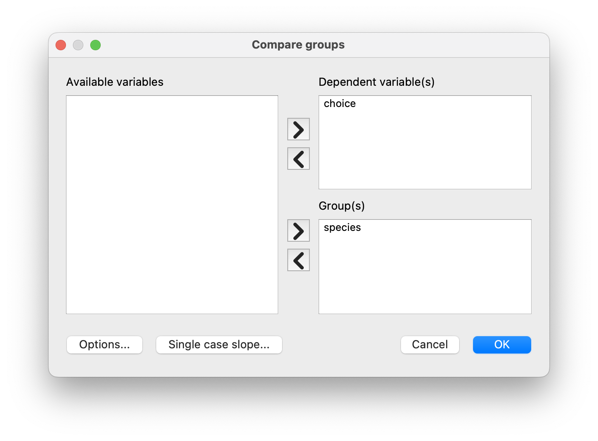
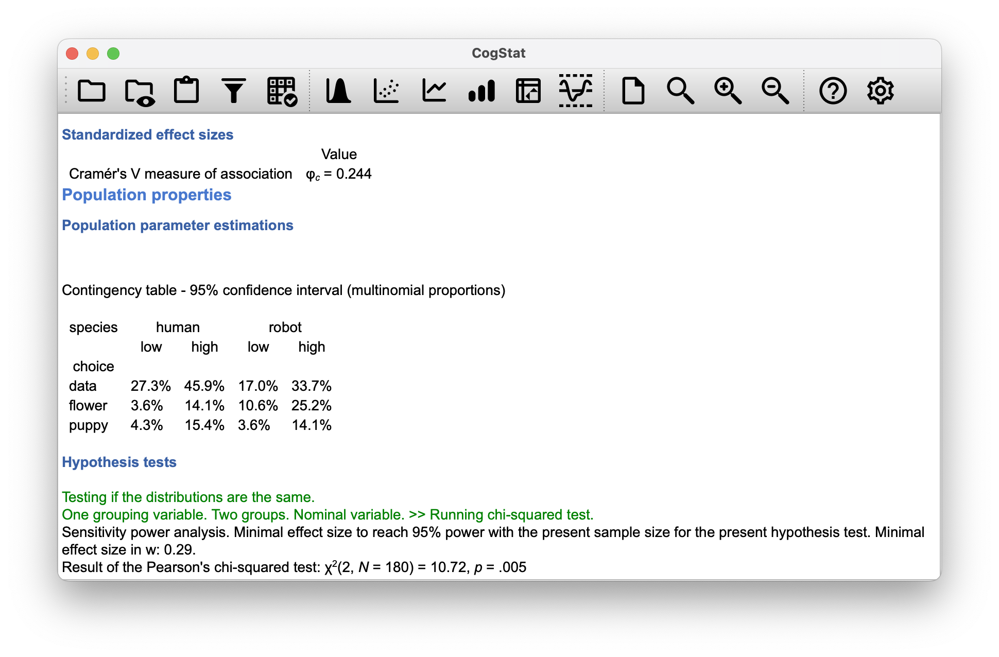

# (PART\*) STATISTICAL TOOLS{-}

# Categorical data analysis{#chisquare}

Now that we've got the basic theory behind hypothesis testing, it's time to start looking at specific tests commonly used in psychology that CogStat will automatically run for you during analysis. We'll start with "$\chi^2$ tests" (pronounced as 'chi square') in this chapter and "$t$-tests" (Chapter \@ref(ttest)) in the next one. Both of these tools are very frequently used in scientific practice for comparing groups. While they're not as powerful as "analysis of variance" (Chapter \@ref(anova)) and "regression" (Chapter \@ref(regression)), they're much easier to understand.

The term "categorical data" is the term preferred by data analysis people, but it's just another name for "nominal scale data". To refresh your memory on data types, please revisit our introductory chapter on scales of measurement and types of variables (see Chapter \@ref(scales)).

In any case, **categorical data analysis** refers to a collection of tools that you can use when your data are nominal scale. We can use many tools for categorical data analysis, but this chapter only covers a few of the more common ones.

## The $\chi^2$ goodness-of-fit test{#goftest}

The $\chi^2$ goodness-of-fit test is one of the oldest hypothesis tests around: it was invented by Karl Pearson around the turn of the century [@Pearson1900], with some corrections made later by Sir Ronald Fisher [@Fisher1922]. Let's start with some psychology to introduce the statistical problem it addresses.

Over the years, there have been a lot of studies showing that humans have a lot of difficulties in simulating randomness. Try as we might to "act" random, we *think* in terms of patterns and structure, and so when asked to "do something at random", what people do is anything but random. Consequently, the study of human randomness (or non-randomness, as the case may be) opens up a lot of deep psychological questions about how we think about the world. With this in mind, let's consider a very simple study. Suppose we asked people to imagine a shuffled deck of cards and mentally pick one card from this imaginary deck "at random". After they've chosen one card, we ask them to select a second one mentally. For both choices, we're going to look at the suit (hearts, clubs, spades or diamonds) that people chose. After asking, say, $N=200$ people to do this, we'd like to look at the data and figure out whether or not the cards that people pretended to select were random. The data are contained in the [`cards.csv`](resources/data/cards.csv) file, which we will load into CogStat. For the moment, let's just focus on the first choice that people made (`choice_1`).

```{r cogstatloadcards, echo=FALSE, fig.cap="Loading the cards.csv data and running `Explore variable` command on `choice_1`", fig.align="center", out.width="100%", fig.show="hold"}
knitr::include_graphics(c("resources/cogstatloadcards.png",
                  "resources/cogstatcardsdescrhisto.png"))
```

**Important note:**
CogStat currently doesn't support single-variable hypothesis testing for nominal scale data. However, this chapter will still be useful for you to understand the tools used in hypothesis testing, and you can use them as described here in other software packages.

We can see that the data are nominal scale, so we'll use the $\chi^2$ goodness-of-fit test to analyze them. We'll also use the "Fisher's exact test" option, which is a more powerful version of the $\chi^2$ test that is appropriate when the sample size is small (less than 40). We'll also use the "Bonferroni correction" option, which is a way of correcting for multiple comparisons. We'll talk more about this in Chapter \@ref(multcomp). For now, let's just run the analysis.

That little frequency table in Figure \@ref(fig:cogstatloadcards) is quite helpful. Looking at it, there's a bit of a hint that people *might* be more likely to select hearts than clubs, but it's not completely obvious just from looking at it whether that's really true, or if this is just due to chance. So we'll probably have to do some kind of statistical analysis to find out, which is what we're going to talk about in the next section.

A quick side-note here: the mathematical notation of observations (i.e. an element in the data set) is $0_i$, where $O$ stands for observation (but could very well be the traditional $X$ or $Y$ etc.) and $i$ is the index of the observation. So $0_1$ is the first observation, $0_2$ is the second observation, and so on.

### The null hypothesis and the alternative hypothesis

Our research hypothesis is that "people don't choose cards randomly". What we're going to want to do now is translate this into some statistical hypotheses, and construct a statistical test of those hypotheses. The test is **Pearson's $\chi^2$ goodness of fit test**.

As is so often the case, we have to begin by carefully constructing our null hypothesis. In this case, it's pretty easy. First, let's state the null hypothesis in words.

> **Null hypothesis** ($H_0$): All four suits are chosen with equal probability.

Now, because this is statistics, we have to be able to say the same thing mathematically. Let's use the notation $P_j$ to refer to the true *probability* that the $j$-th suit is chosen. If the null hypothesis is true, then each of the four suits has a 25\% chance of being selected: in other words, our null hypothesis claims that $P_1 = 0.25$, $P_2 = 0.25$, $P_3 = 0.25$ and finally that $P_4 = 0.25$. We can use $P$ to refer to the probabilities corresponding to our null hypothesis. So if we let the vector $P = (P_1, P_2, P_3, P_4)$ refer to the collection of probabilities that describe our null hypothesis, then we have

$$
H_0: {P} = (0.25, 0.25, 0.25, 0.25)
$$

If the experimental task were for people to imagine they were drawing from a deck that had twice as many clubs as any other suit, then the null hypothesis would correspond to something like $P = (0.4, 0.2, 0.2, 0.2)$. As long as the probabilities are all positive numbers, and they all sum to 1, then it's a perfectly legitimate choice for the null hypothesis. However, the most common use of the goodness of fit test is to test a null hypothesis that all categories are equally likely, so we'll stick to that for our example.

What about our alternative hypothesis, $H_1$? We're interested in demonstrating that the probabilities involved aren't all identical (that is, people's choices weren't entirely random). As a consequence, the "human-friendly" versions of our hypotheses look like this:

> **Null hypothesis** ($H_0$): All four suits are chosen with equal probability.  
> **Alternative hypothesis** ($H_1$): At least one of the suit-choice probabilities *isn't* 0.25.

and the "mathematician friendly" version is

```{r echo=FALSE}
knitr::kable(data.frame(stringsAsFactors=FALSE,
       H_0 = c("$P = (0.25, 0.25, 0.25, 0.25)$"),
       H_1 = c("$P \\neq (0.25,0.25,0.25,0.25)$")),
       col.names = c("$H_0$", "$H_1$"), align = "cc")
```

### The "goodness of fit" test statistic

What we now want to do is construct a test of the null hypothesis. As always, if we want to test $H_0$ against $H_1$, we will need a test statistic. The basic trick that a goodness of fit test uses is to construct a test statistic that measures how "close" the data are to the null hypothesis. If the data don't resemble what you'd "expect" to see if the null hypothesis were true, then it probably isn't true.

So, what would we expect to see if the null hypothesis were true? Or, to use the correct terminology, what are the **expected frequencies**?

There are $N=200$ observations, and (if the null is true) the probability of any one of them choosing a heart is $P_3 = 0.25$, so we're expecting $200 \times 0.25 = 50$ hearts, right? Or, more specifically, if we let $E_i$ refer to "the number of category $i$ responses that we're expecting if the null is true", then
$$
E_i = N \times P_i
$$

Clearly, what we want to do is compare the *expected* number of observations in each category ($E_i$) with the *observed* number of observations in that category ($O_i$). And on the basis of this comparison, we ought to be able to come up with a good test statistic. To start with, let's calculate the difference between what the null hypothesis expected us to find and what we actually did find. That is, we calculate the "observed minus expected" difference score, $O_i - E_i$. This is illustrated in the following table.

```{r echo=FALSE}
knitr::kable(data.frame(stringsAsFactors=FALSE,
NANA = c("Expected frequency", "Observed frequency",
         "Difference score"),
NANA = c("$E_i$", "$O_i$", "$O_i - E_i$"),
club = c(50, 35, -15),
diamondsuit = c(50, 51, 1),
heartsuit = c(50, 64, 14),
spadesuit = c(50, 50, 0)
), col.names = c("", "", "$\\clubsuit$", "$\\diamondsuit$",
               "$\\heartsuit$", "$\\spadesuit$"))

```

It's clear that people chose more hearts and fewer clubs than the null hypothesis predicted. However, a moment's thought suggests that these raw differences aren't quite what we're looking for. Intuitively, it feels like it's just as bad when the null hypothesis predicts too few observations (which is what happened with hearts) as it is when it predicts too many (which is what happened with clubs). So it's a bit weird that we have a negative number for clubs and a positive number for hearts.

One easy way to fix this is to square everything so that we now calculate the squared differences, $(E_i - O_i)^2$.

```{r echo=FALSE}
knitr::kable(data.frame(stringsAsFactors=FALSE,
NANA = c("Expected frequency", "Observed frequency",
         "Difference score", "Squared differences"),
NANA = c("$E_i$", "$O_i$", "$O_i - E_i$", "$\\left(O_i - E_i\\right)^2$"),
club = c(50, 35, -15, 225),
diamondsuit = c(50, 51, 1, 1),
heartsuit = c(50, 64, 14, 196),
spadesuit = c(50, 50, 0, 0)),
col.names = c("", "", "$\\clubsuit$", "$\\diamondsuit$",
               "$\\heartsuit$", "$\\spadesuit$"))
```

Now we're making progress. Now, we've got a collection of numbers that are big whenever the null hypothesis makes a lousy prediction (clubs and hearts) but small whenever it makes a good one (diamonds and spades). 

Next, let's also divide all these numbers by the expected frequency $E_i$, so we're calculating $\frac{(E_i-O_i)^2}{E_i}$. Since $E_i = 50$ for all categories in our example, it's not a very interesting calculation, but let's do it anyway.

```{r echo=FALSE}
knitr::kable(data.frame(stringsAsFactors=FALSE,
NANA = c("Expected frequency", "Observed frequency",
         "Difference score", "Squared differences",
         "Squared differences divided by expected frequency"),
NANA = c("$E_i$", "$O_i$", "$O_i - E_i$",
         "$\\left(O_i - E_i\\right)^2$",
         "$\\frac{\\left(O_i - E_i\\right)^2}{E_i}$"),
club = c(50, 35, -15, 225, "4.5"),
diamondsuit = c(50, 51, 1, 1, "0.02"),
heartsuit = c(50, 64, 14, 196, "3.92"),
spadesuit = c(50, 50, 0, 0, "0")),
col.names = c("", "", "$\\clubsuit$", "$\\diamondsuit$",
               "$\\heartsuit$", "$\\spadesuit$"),
align = "llccc")
```

In effect, what we've got here are four different "error" scores, each one telling us how big a "mistake" the null hypothesis made when we tried to use it to predict our observed frequencies. So, in order to convert this into a useful test statistic, one thing we could do is just add these numbers up. We get
$$
X^2 = 8.42
$$

The result is called the **goodness of fit** statistic, conventionally referred to either as $X^2$ or GOF. If we let $k$ refer to the total number of categories (i.e. $k=4$ for our cards data), then the $X^2$ statistic is given by the following formula:
$$
X^2 = \sum_{i=1}^k \frac{(O_i - E_i)^2}{E_i}
$$

Intuitively, it's clear that if $X^2$ is small, then the observed data $O_i$ are very close to what the null hypothesis predicted $E_i$, so we're going to need a large $X^2$ statistic in order to reject the null. As we've seen from our calculations, we've got a value of $X^2 = 8.44$ in our cards data set. So now the question becomes, is this a big enough value to reject the null?

### The sampling distribution of the GOF statistic (advanced)

To determine whether or not a particular value of $X^2$ is large enough to justify rejecting the null hypothesis, we will need to figure out what the sampling distribution for $X^2$ would be if the null hypothesis were true. If you want to cut to the chase and are willing to take it on faith that the sampling distribution is a **chi-squared ($\chi^2$) distribution** with $k-1$ degrees of freedom, you can skip the rest of this section. However, if you want to understand *why* the goodness of fit test works the way it does, read on.

Let's suppose that the null hypothesis is true. If so, then the true probability that an observation falls in the $i$-th category is $P_i$. After all, that's the definition of our null hypothesis. If you think about it, this is kind of like saying that "nature" decides whether or not the observation ends up in category $i$ by flipping a weighted coin (i.e. one where the probability of getting a head is $P_j$). And therefore, we can think of our observed frequency $O_i$ by imagining that nature flipped $N$ of these coins (one for each observation in the data set). And exactly $O_i$ of them came up heads. Obviously, this is a pretty weird way to think about the experiment. But it reminds you that we've seen this scenario before. It's exactly the same set-up that gave rise to the binomial distribution in Section \@ref(binomial). In other words, if the null hypothesis is true, then it follows that our observed frequencies were generated by sampling from a binomial distribution:
$$
O_i \sim \mbox{Binomial}(P_i, N)
$$
Now, if you remember from our discussion of the central limit theorem (Section \@ref(clt)), the binomial distribution starts to look pretty much identical to the normal distribution, especially when $N$ is large and when $P_i$ isn't *too* close to 0 or 1. 

In other words, as long as $N \times P_i$ is large enough -- or, to put it another way, when the expected frequency $E_i$ is large enough -- the theoretical distribution of $O_i$ is approximately normal. Better yet, if $O_i$ is normally distributed, then so is $(O_i - E_i)/\sqrt{E_i}$ ... since $E_i$ is a fixed value, subtracting off $E_i$ and dividing by $\sqrt{E_i}$ changes the mean and standard deviation of the normal distribution.

Okay, so now let's have a look at what our goodness of fit statistic actually *is*. What we're doing is taking a bunch of things that are normally distributed, squaring them, and adding them up. As we discussed in Section \@ref(otherdists), when you take a bunch of things that have a standard normal distribution (i.e. mean 0 and standard deviation 1), square them, then add them up, then the resulting quantity has a chi-square distribution. So now we know that the null hypothesis predicts that the sampling distribution of the goodness of fit statistic is a chi-square distribution.

There's one last detail to talk about, namely the degrees of freedom. If you remember back to Section \@ref(otherdists), if the number of things you're adding up is $k$, then the degrees of freedom for the resulting chi-square distribution is $k$. Yet, at the start of this section, we said that the actual degrees of freedom for the chi-square goodness of fit test is $k-1$. What's up with that? The answer here is that what we're supposed to be looking at is the number of genuinely *independent* things that are getting added together. And, even though there are $k$ things that we're adding, only $k-1$ of them are truly independent; and so the degrees of freedom are actually only $k-1$.

### Degrees of freedom

```{r manychi, fig.cap="Chi-square distributions with different values for the \"degrees of freedom\".", echo=FALSE, fig.align="center"}
chiSqImg <- list()
emphCol <- rgb(0,0,1)
emphColLight <- rgb(.5,.5,1)
emphGrey <- grey(.5)

eps <- TRUE
colour <- TRUE

width <- 8
height <- 6
plot.new()
plot.window( xlim=c(0,10), ylim=c(0,.25))
axis(1)
title(xlab="Value")

x <- seq(0,10,.1)

lines(x, dchisq(x,df=3),col=ifelse(colour,emphCol,"black"),
      lwd=3, lty=1 )
lines(x, dchisq(x,df=4),col=ifelse(colour,emphCol,"black"),
      lwd=3, lty=2 )
lines(x, dchisq(x,df=5),col=ifelse(colour,emphCol,"black"),
      lwd=3, lty=3 )

legend(7,.22,legend=c("df = 3","df = 4","df = 5"), lty=1:3, 
      lwd=3, col=ifelse(colour,emphCol,"black"), bty="n" )
```

When discussing the chi-square distribution in Section \@ref(otherdists), we didn't elaborate on what "**degrees of freedom**" actually *mean*. Looking at Figure \@ref(fig:manychi), you can see that if we change the degrees of freedom, then the chi-square distribution changes shape substantially. But what exactly *is* it? It's the number of "normally distributed variables" that we are squaring and adding together. But, for most people, that's kind of abstract and not entirely helpful. What we really need to do is try to understand degrees of freedom in terms of our data. So here goes.

The basic idea behind degrees of freedom is quite simple: you calculate it by counting up the number of distinct "quantities" that are used to describe your data; and then subtracting off all of the "constraints" that those data must satisfy.^[This, again, is an over-simplification. It works nicely for quite a few situations, but every now and then, we'll come across degrees of freedom values that aren't whole numbers. Don't let this worry you too much -- when you come across this, just remind yourself that "degrees of freedom" is actually a bit of a messy concept. For an introductory class, it's usually best to stick to the simple story.] This is a bit vague, so let's use our `cards.csv` data as a concrete example.

We describe our data using four numbers, $O_1$, $O_2$, $O_3$ and $O_4$ corresponding to the observed frequencies of the four different categories (hearts, clubs, diamonds, spades). These four numbers are the *random outcomes* of our experiment. But, the experiment has a fixed constraint built into it: the sample size $N$.^[In practice, the sample size isn't always fixed... e.g. we might run the experiment over a fixed period of time, and the number of people participating depends on how many people show up. That doesn't matter for the current purposes.] That is, if we know how many people chose hearts, how many chose diamonds and how many chose clubs, then we'd be able to figure out exactly how many chose spades. In other words, although our data are described using four numbers, they only actually correspond to $4-1 = 3$ degrees of freedom. A slightly different way of thinking about it is to notice that there are four *probabilities* that we're interested in (again, corresponding to the four different categories), but these probabilities must sum to one, which imposes a constraint. Therefore, the degrees of freedom is $4-1 = 3$. Regardless of whether you want to think about it in terms of the observed frequencies or in terms of the probabilities, the answer is the same. In general, when running the chi-square goodness of fit test for an experiment involving $k$ groups, then the degrees of freedom will be $k-1$.


### Testing the null hypothesis 

```{r goftest, fig.cap="Illustration of how the hypothesis testing works for the chi-square goodness of fit test.", echo=FALSE, fig.align="center"}
width <- 9
height <- 6
fileName <- "chiSqTest.eps"

max.val <- 14
plot.new()
plot.window( xlim=c(0,max.val), ylim=c(0,.25))
axis(1)
title(xlab="Value of the GOF Statistic")

df <- 3

crit.val <- qchisq(.95,df)

x <- seq(crit.val,max.val,.1)
x <- c(x,max.val)
y <- dchisq(x,df)
polygon( c(x[1], x, x[length(x)]), c(0,y,0), 
	col=ifelse(colour,emphCol,"black"),
	density=10, lwd=2 )
x <- seq(0,max.val,.1)
lines(x, dchisq(x,df=df),col="black", 
	lwd=3, lty=1 )

lines( 8.44, 0, pch=19, col="black", type="p" )

arrows( x1=crit.val,x0=6,y0=.145,y1=.026)
arrows( x1=8.44,x0=10,y0=.115,y1=.021)

text(6,.16,"The critical value is 7.81")
text(10.5,.13,"The observed GOF value is 8.44")
```

The final step in constructing our hypothesis test is to figure out what the rejection region is. That is, what values of $X^2$ would lead us to reject the null hypothesis? As we saw earlier, large values of $X^2$ imply that the null hypothesis has done a poor job of predicting the data from our experiment, whereas small values of $X^2$ imply that it's actually done pretty well. Therefore, a pretty sensible strategy would be to say there is some critical value, such that if $X^2$ is bigger than the critical value, we reject the null; but if $X^2$ is smaller than this value, we retain the null.

In other words, to use the language we introduced in Chapter \@ref(hypothesistesting), the chi-squared goodness of fit test is always a **one-sided test**. If we want our test to have a significance level of $\alpha = .05$ (that is, we are willing to tolerate a Type I error rate of 5\%), then we have to choose our critical value so that there is only a 5\% chance that $X^2$ could get to be that big if the null hypothesis is true. Meaning that we want the 95th percentile of the sampling distribution. This is illustrated in Figure \@ref(fig:goftest). So if our $X^2$ statistic is bigger than 7.814728, then we can reject the null hypothesis. Since we calculated that before (i.e. $X^2 = 8.44$), we can reject the null.

The corresponding $p$-value is 0.03774185. This is the probability of getting a value of $X^2$ as big as 8.44, or bigger, if the null hypothesis is true. Since this is less than our significance level of $\alpha = .05$, we can reject the null hypothesis.

And that's it, basically. You now know **Pearson's $\chi^2$ test for the goodness of fit**.

### How to report the results of the test{#chisqreport}

If we wanted to write this result up for a paper or something, the conventional way to report this would be to write something like this:

> Of the 200 participants in the experiment, 64 selected hearts for their first choice, 51 selected diamonds, 50 selected spades, and 35 selected clubs. A chi-square goodness of fit test was conducted to test whether the choice probabilities were identical for all four suits. The results were significant ($\chi^2(3) = 8.44, p<.05$), suggesting that people did not select suits purely at random.

This is pretty straightforward, and hopefully it seems pretty unremarkable. There are a few things that you should note about this description:

- *The statistical test is preceded by descriptive statistics*. That is, we told the reader something about what the data looked like before going on to do the test. In general, this is good practice: remember that your reader doesn't know your data anywhere near as well as you do. So unless you describe it to them adequately, the statistical tests won't make sense to them.
- *The description tells you what the null hypothesis being tested is*. Writers don't always do this, but it's often a good idea in those situations where some ambiguity exists; or when you can't rely on your readership being intimately familiar with the statistical tools you're using. Quite often, the reader might not know (or remember) all the details of the test that your using, so it's a kind of politeness to "remind" them! As far as the goodness of fit test goes, you can usually rely on a scientific audience knowing how it works (since it's covered in most intro stats classes). However, it's still a good idea to explicitly state the null hypothesis (briefly!) because the null hypothesis can differ depending on your test. For instance, in the cards example our null hypothesis was that all the four suit probabilities were identical (i.e. $P_1 = P_2 = P_3 = P_4 = 0.25$), but there's nothing special about that hypothesis. We could just as easily have tested the null hypothesis that $P_1 = 0.7$ and $P_2 = P_3 = P_4 = 0.1$ using a goodness of fit test. So it's helpful to the reader to explain your null hypothesis to them. Also, we described the null hypothesis in words, not in maths. That's perfectly acceptable. You can describe it in maths if you like, but since most readers find words easier to read than symbols, most writers tend to describe the null using words if they can.
- *A "stat block" is included*. When reporting the results of the test itself, We didn't just say that the result was significant; we included a "stat block" (i.e. the dense mathematical-looking part in the parentheses), which reports all the "raw" statistical data. For the chi-square goodness of fit test, the information that gets reported is the test statistic (that the goodness of fit statistic was 8.44), the information about the distribution used in the test ($\chi^2$ with 3 degrees of freedom, which is usually shortened to $\chi^2(3)$), and then the information about whether the result was significant (in this case $p<.05$). The particular information that needs to go into the stat block is different for every test, and so each time we introduce a new test, we'll show you what the stat block should look like. The general principle is that you should always provide enough information so that the reader can check the test results themselves if they really want to.
- *The results are interpreted*. In addition to indicating that the result was significant, we provided an interpretation of the result (i.e. that people didn't choose randomly). This is also a kindness to the reader because it tells them what they should believe about your data. If you don't include something like this, it's tough for your reader to understand what's going on.^[To some people, this advice might sound odd or at least in conflict with the "usual" advice on how to write a technical report. Students are typically told that the "results" section of a report is for describing the data and reporting statistical analysis, and the "discussion" section provides interpretation. That's true as far as it goes, but people often interpret it way too literally. Provide a quick and simple interpretation of the data in the results section so that the reader understands what the data are telling us. Then, in the discussion, try to tell a bigger story; about how my results fit the rest of the scientific literature. In short, don't let the "interpretation goes in the discussion" advice turn your results section into incomprehensible garbage. Being understood by your reader is *much* more important.]

As with everything else, your overriding concern should be that you *explain* things to your reader.

### A comment on statistical notation (advanced)

If you've been reading very closely, there is one thing about how we wrote up the chi-square test in the last section that might be bugging you a little bit. There's something that feels a bit wrong with writing "$\chi^2(3) = 8.44$", you might be thinking. After all, it's the goodness of fit statistic that is equal to 8.44, so shouldn't I have written $X^2 = 8.44$ or maybe GOF$=8.44$? This seems to be conflating the *sampling distribution* (i.e. $\chi^2$ with $df = 3$) with the *test statistic* (i.e. $X^2$). You figured it was a typo since $\chi$ and $X$ look pretty similar. Oddly, it's not. Writing $\chi^2(3) = 8.44$ is essentially a highly condensed way of writing "the sampling distribution of the test statistic is $\chi^2(3)$, and the value of the test statistic is 8.44".

In one sense, this is kind of stupid. There are *lots* of different test statistics out there that have a chi-square sampling distribution: the $X^2$ statistic that we've used for our goodness of fit test is only one of many (albeit one of the most commonly encountered ones). In a sensible, perfectly organised world, we'd *always* have a separate name for the test statistic and the sampling distribution: that way, the stat block itself would tell you precisely what it was that the researcher had calculated. Sometimes this happens.

For instance, the test statistic used in the Pearson goodness of fit test is written $X^2$; but there's a closely related test known as the $G$-test^[Complicating matters, the $G$-test is a special case of a whole class of tests that are known as *likelihood ratio tests*.] \cite{Sokal1994}, in which the test statistic is written as $G$. As it happens, the Pearson goodness of fit test and the $G$-test both test the same null hypothesis; and the sampling distribution is exactly the same (i.e. chi-square with $k-1$ degrees of freedom). If we'd done a $G$-test for the cards data rather than a goodness of fit test, then we'd have ended up with a test statistic of $G = 8.65$, which is slightly different from the $X^2 = 8.44$; and produces a slightly smaller $p$-value of $p = .034$. Suppose that the convention was to report the test statistic, then the sampling distribution, and then the $p$-value. If that were true, then these two situations would produce different stat blocks: the original result would be written $X^2 = 8.44, \chi^2(3), p = .038$, whereas the new version using the $G$-test would be written as $G = 8.65, \chi^2(3), p = .034$. However, using the condensed reporting standard, the original result is written $\chi^2(3) = 8.44, p = .038$, and the new one is written $\chi^2(3) = 8.65, p = .034$, and so it's actually unclear which test was actually run.

So why don't we live in a world where the stat block's contents uniquely specify what tests were run? Any test statistic that follows a $\chi^2$ distribution is commonly called a "chi-square statistic"; anything that follows a $t$-distribution is called a "$t$-statistic" and so on. But, as the $X^2$ versus $G$ example illustrates, two different things with the same sampling distribution are still, well, different. Consequently, it's sometimes a good idea to be clear about what the actual test was that you ran, especially if you're doing something unusual. If you just say "chi-square test", it's unclear what test you're talking about. Although, since the two most common chi-square tests are the goodness of fit test and the independence test (Section \@ref(chisqindependence)), most readers with stats training can probably guess. Nevertheless, it's something to be aware of.


## The $\chi^2$ test of independence (or association){#chisqindependence}

The other day Danielle was watching an animated documentary examining the quaint customs of the natives of the planet *Chapek 9*. Apparently, in order to gain access to their capital city, a visitor must prove that they're a robot, not a human. In order to determine whether or not the visitor is human, they ask whether the visitor prefers puppies, flowers or large, properly formatted data files. But what if humans and robots have the same preferences? That probably wouldn't be a very good test then, would it? In order to determine whether or not a visitor is human, the natives of *Chapek 9* need to know whether or not the visitor's preferences are independent of their species. In other words, they need to know whether or not the visitor's preferences are associated with their species.

```{r cogstatloadchapek9, echo=FALSE, fig.align="center", fig.show="hold", fig.cap="Loading the [`chapek9.csv`](resources/data/chapek9.csv) data set into CogStat."}

```

In total, there are 180 entries in the data frame, one for each person (counting both robots and humans as "people") who was asked to make a choice. Specifically, there are 93 humans and 87 robots.

What we want to do is look at the `choices` broken down *by* `species`. That is, we need to cross-tabulate the data. We cannot use the `Pivot table` option in CogStat for strings, but we can use the `Compare groups` option instead. We'll use the `species` variable as the grouping variable and the `choices` variable as the variable to compare.

```{r cogstatchapek9, echo=FALSE, fig.align="center", fig.show="hold", fig.cap="Using the `Compare groups` dialogue to get some information about `choices` by `species`."}

```

The overwhelmingly preferred choice is the `data file`. You can see a visual representation of this in Figure \@ref(fig:cogstatchapek9mosaic).

```{r cogstatchapek9mosaic, echo=FALSE, fig.align="center", fig.cap="The mosaic plot of `choices` by `species`."}

```

Scrolling down, you can see the descriptives for the groups in the `Sample properties` section:

```{r cogstatchapek9descriptives, echo=FALSE, fig.align="center", fig.cap="The `Sample properties` section of the `Compare groups` results showing the contingency table we'll discuss later in this chapter."}

```

Let's put these results in a nice table for our discussion on the $\chi^2$ test of independence.

```{r echo=FALSE}
knitr::kable(cbind(
 c("", "Puppy", "Flower", "Data file", "Total"),
 c("Robot", 13, 30, 44, 87),
 c("Human", 15, 13, 65, 93),
 c("Total", 28, 43, 109, 180)),
 caption = "Cross-tabulation of `choices` by `species`",
 align = "lccc")
```

It's quite clear that most humans chose the data file, whereas the robots tended to be a lot more even in their preferences. Leaving aside the question of *why* humans might be more likely to choose the data file for the moment, first, we must determine if the discrepancy between human choices and robot choices in the data set is statistically significant.

### Constructing our hypothesis test

How do we analyse this data manually? Specifically, since our *research* hypothesis is that "humans and robots answer the question in different ways", how can we construct a test of the *null* hypothesis that "humans and robots answer the question the same way"? As before, we begin by establishing some notation to describe the data:

```{r echo=FALSE}
knitr::kable(data.frame(stringsAsFactors=FALSE,
NANA = c("Puppy", "Flower", "Data file", "Total"),
Robot = c("$O_{11}$", "$O_{21}$", "$O_{31}$", "$C_{1}$"),
Human = c("$O_{12}$", "$O_{22}$", "$O_{32}$", "$C_{2}$"),
Total = c("$R_{1}$", "$R_{2}$", "$R_{3}$", "$N$")
), col.names = c("", "Robot", "Human", "Total"))

```

In this notation, we say that $O_{ij}$ is a count (observed frequency) of the number of respondents that are of species $j$ (`robot` or `human`) who answered $i$ (`puppy`, `flower` or `data`) when asked to make a choice. The total number of observations is written $N$, as usual. Finally,  $R_i$ denotes the row totals (e.g. $R_1$ is the total number of people who chose the flower), and $C_j$ denotes the column totals (e.g., $C_1$ is the total number of robots). To use the terminology from another mathematical statistics textbook [@Hogg2005], we should technically refer to this situation as a **chi-square test of homogeneity**; and reserve the term **chi-square test of independence** for the situation where both the row and column totals are random outcomes of the experiment.

So now, let's think about what the null hypothesis says. If robots and humans are responding in the same way to the question, it means that the probability that "a robot says puppy" is the same as the probability that "a human says puppy", and so on for the other two possibilities. So, if we use $P_{ij}$ to denote "the probability that a member of species $j$ gives response $i$", then our null hypothesis is that:

```{r chapeknullhypo, echo=FALSE}
knitr::kable(rbind(
   c("", "$P_{11} = P_{12}$", "same probability of saying `puppy`"),
   c("", "$P_{21} = P_{22}$", "same probability of saying `flower`"),
   c("", "$P_{31} = P_{32}$", "same probability of saying `data file`")),
col.names = c("$H_0$:", "All of the following are true:", ""),
caption = "The null hypothesis for the $\\chi^2$ test of independence of the `chapek9` data set."
)
```

Since the null hypothesis claims that the true choice probabilities don't depend on the species of the person making the choice, we can let $P_i$ refer to this probability: e.g. $P_1$ is the true probability of choosing the puppy.

Next, in much the same way we did with the goodness of fit test, we need to calculate the expected frequencies. For each of the observed counts $O_{ij}$, we need to figure out what the null hypothesis would tell us to expect. Let's denote this expected frequency by $E_{ij}$. This time, it's a little bit trickier. If there are a total of $C_j$ people that belong to species $j$, and the true probability of anyone (regardless of species) choosing option $i$ is $P_i$, then the expected frequency is just: 
$$
E_{ij} = C_j \times P_i
$$

This is all very well and good, but we have a problem. Unlike the situation we had with the goodness of fit test, the null hypothesis doesn't specify a particular value for $P_i$. It's something we have to estimate (Chapter \@ref(estimation)) from the data! Fortunately, this is pretty easy to do. If 28 out of 180 people selected the flowers, then a natural estimate for the probability of choosing flowers is $28/180$, which is approximately $.16$. If we phrase this in mathematical terms, what we're saying is that our estimate for the probability of choosing option $i$ is just the row total divided by the total sample size:
$$
\hat{P}_i = \frac{R_i}{N}
$$ 

Therefore, our expected frequency can be written as the product (i.e. multiplication) of the row total and the column total, divided by the total number of observations:^[Technically, $E_{ij}$ here is an estimate, so we should probably write it $\hat{E}_{ij}$.]
$$
E_{ij} = \frac{R_i \times C_j}{N}
$$

Now that we've figured out how to calculate the expected frequencies, it's straightforward to define a test statistic following the same strategy we used in the goodness of fit test. It's pretty much the *same* statistic. For a contingency table with $r$ rows and $c$ columns, the equation that defines our $X^2$ statistic is 
$$ 
X^2 = \sum_{i=1}^r \sum_{j=1}^c \frac{({E}_{ij} - O_{ij})^2}{{E}_{ij}}
$$
The only difference is that we have to include two summation signs (i.e. $\sum$) to indicate that we're summing over both rows and columns. As before, large values of $X^2$ suggest that the null hypothesis provides a poor description of the data, whereas small values of $X^2$ indicate that it does a good job of accounting for the data. Therefore, just like last time, we want to reject the null hypothesis if $X^2$ is too large.

Not surprisingly, this statistic is $\chi^2$ distributed. All we need to do is figure out how many degrees of freedom are involved, which actually isn't too hard. You can think of the degrees of freedom as equal to the number of data points you're analysing minus the number of constraints. A contingency table with $r$ rows and $c$ columns contains a total of $r \times c$ observed frequencies, so that's the total number of observations. 

What about the constraints? Here, it's slightly trickier. The answer is always the same:
$$
df = (r-1)(c-1)
$$

But the explanation for *why* the degrees of freedom take this value is different depending on the experimental design. For the sake of argument, let's suppose that we had honestly intended to survey exactly 87 robots and 93 humans (column totals fixed by the experimenter) but left the row totals free to vary (row totals are random variables). Let's think about the constraints that apply here. Well, since we deliberately fixed the column totals, we have $c$ constraints right there. There's more to it than that. Remember how our null hypothesis had some free parameters (i.e. we had to estimate the $P_i$ values)? Those matter too. 

Every free parameter in the null hypothesis is rather like an additional constraint. So, how many of those are there? Well, since these probabilities have to sum to 1, there's only $r-1$ of these. So our total degree of freedom is:
$$
\begin{array}{rcl}
df &=& \mbox{(number of observations)} - \mbox{(number of constraints)} \\
&=& (rc) - (c + (r-1)) \\
&=& rc - c - r + 1 \\
&=& (r - 1)(c - 1)
\end{array}
$$

Alternatively, suppose that the only thing that the experimenter fixed was the total sample size $N$. That is, we quizzed the first 180 people that we saw, and it just turned out that 87 were robots and 93 were humans. This time around, our reasoning would be slightly different but would still lead us to the same answer. Our null hypothesis still has $r-1$ free parameters corresponding to the choice probabilities. Still, it now *also* has $c-1$ free parameters corresponding to the species probabilities because we'd also have to estimate the probability that a randomly sampled person turns out to be a robot.^[A problem many of us worry about in real life.] Finally, since we did fix the total number of observations $N$, that's one more constraint. So now we have, $rc$ observations, and $(c-1) + (r-1) + 1$ constraints. What does that give?
$$
\begin{array}{rcl}
df &=& \mbox{(number of observations)} - \mbox{(number of constraints)} \\
&=& rc - ( (c-1) + (r-1) + 1) \\
&=& rc - c - r + 1 \\
&=& (r - 1)(c - 1)
\end{array}
$$
Amazing.

### The test results in CogStat{#AssocTestInCogStat}

The test is automatically done in CogStat using the `Compare groups` feature. The result set will contain information about the sample and its properties, as seen in Figure \@ref(fig:cogstatchapek9descriptives). Further scrolling down, you'll see the effect size (which we will cover in a short while in Chapter \@ref(chisqeffectsize)). The last part of the result set is the hypothesis test itself (see Figure \@ref(fig:cogstatchapek9hypo)).

```{r cogstatchapek9hypo, fig.cap="Population properties and Hypothesis tests for the `chapek9.csv` data set.", echo=FALSE, fig.align="center", out.width="100%"}

```

Let us go through the `Hypothesis tests` section line by line.

```{r chihypohtml, echo=FALSE, results="asis"}
xfun::file_string("chihypohtml.html")
```

- `Testing if the distributions are the same.`: This, in plain English, tells us that we are testing for a null hypothesis where all distributions, or probabilities, are the same. It does not differ in essence from the $H_0$ we described more eloquently in Table \@ref(tab:chapeknullhypo).
- `One grouping variable.`: This says we are looking at only one variable by which we have dissected our data: `species`.
- `Two groups`: This tells us that we have two groups, `robot` and `human`.
- `Nominal variable.`: This tells us that the variable we are looking at is categorical.
- `Running chi-squared test.`: Well, this is obvious.

Let us ignore the details about the 95% confidence interval, minimal effect size w, and Cramér's V (Figure \@ref(fig:cogstatchapek9hypo)) for now. We will come back to them in Chapter \@ref(chisqeffectsize).

`Result of the Pearson's chi-squared test: `

$$
\chi^2(2, N = 180) = 10.72, p = 0.005
$$

The test result is 10.72, the degree of freedom is 2 with 180 observations, and the p-value is 0.005. This means that the null hypothesis is rejected at the 0.005 level of significance.

This output gives us enough information to write up the result:

> Pearson's $\chi^2$ revealed a significant association between species and choice ($\chi^2(2) = 10.72, p < .01$): robots appeared to be more likely to say that they prefer flowers, but the humans were more likely to say they prefer data.

Notice that, once again, we provided a little bit of interpretation to help the human reader understand what's going on with the data. This is a good habit to get into. It's also a good idea to report the effect size, which we will do in the next section.
