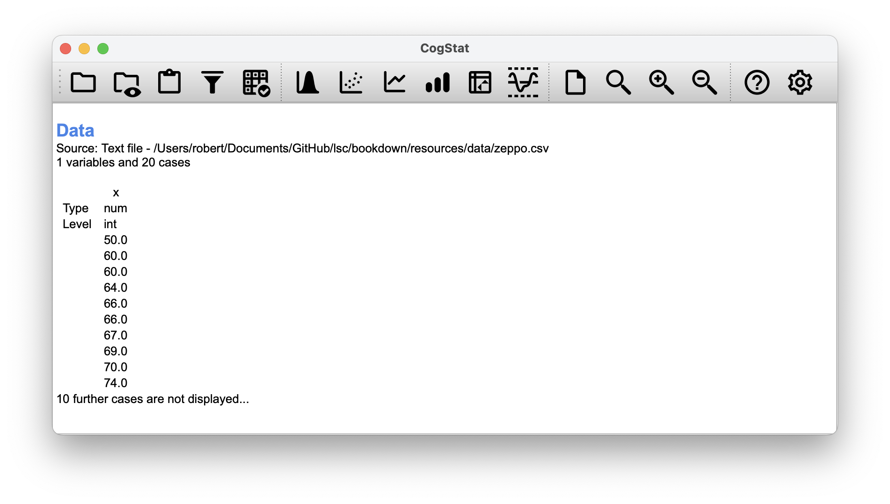
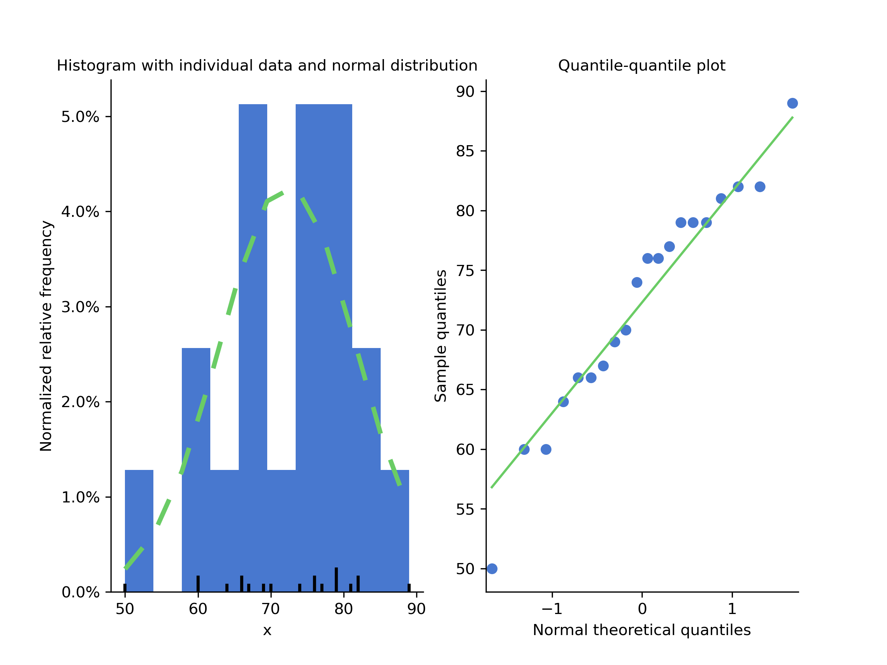

# Comparing two means{#ttest}

In the previous chapter, we covered the situation when your outcome variable is a nominal scale, and your predictor variable^[We won't cover multiple predictors until Chapter \@ref(regression)] is also a nominal scale. Many real-world situations have that character, so you'll find that chi-square tests are widely used.

However, you're much more likely to find yourself in a situation where your outcome variable is interval scale or higher, and you're interested in whether the outcome variable's average value is higher in one group or another. For instance, a psychologist might want to know if anxiety levels are higher among parents than non-parents; or if working memory capacity is reduced by listening to music (relative to not listening to music). In a medical context, we might want to know if a new drug increases or decreases blood pressure. An agricultural scientist might want to know whether adding phosphorus to Australian native plants will kill them. In all these situations, our outcome variable is a continuous interval or ratio scale variable; and our predictor is a binary "grouping" variable. In other words, we want to compare the *means of the two groups*.

The standard answer to the problem of comparing means is to use a $t$-test, which has several varieties depending on exactly what question you want to solve. As a consequence, the majority of this chapter focuses on different types of $t$-test:

-one sample $t$-tests are discussed in Section \@ref(onesamplettest),
-independent samples $t$-tests are discussed in Sections \@ref(studentttest) and \@ref(welchttest), and 
- paired samples $t$-tests are discussed in Section \@ref(pairedsamplesttest).

After that, we'll talk a bit about Cohen's $d$, which is the standard measure of effect size for a $t$-test (Section \@ref(cohensd)).

The later sections of the chapter focus on the assumptions of the $t$-tests and possible remedies if they are violated. However, before discussing any of these useful things, we'll start with a discussion of the $z$-test.


## The one-sample $z$-test

In this section, we'll discuss one of the most useless tests in all of statistics: the **$z$-test**. Seriously -- this test is seldom used in real life. Its only real purpose is that, when teaching statistics, it's a very convenient stepping stone towards the $t$-test, which is probably the most (over)used tool in all statistics.

Let's use a simple example to introduce the idea behind the $z$-test. A friend of Danielle's, Dr Zeppo, grades his introductory statistics class on a curve. Let's suppose that the average grade in his class is 67.5, and the standard deviation is 9.5. Of his many hundreds of students, it turns out that 20 of them also take psychology classes. Out of curiosity: do psychology students tend to get the same grades as everyone else (i.e. mean 67.5), or do they tend to score higher or lower? Let's explore this by looking at the [`zeppo.csv`](resources/data/zeppo.csv) data file by loading the file to CogStat.

```{r cogstatloadzeppo, echo=FALSE, fig.cap="The `zeppo.csv` data file loaded into CogStat."}

```

Let's explore the data a bit by looking at some summary statistics with the `Explore variable` function.

```{r cogstatexplorezeppo, echo=FALSE, fig.cap="The `Explore variable` function in CogStat."}
knitr::include_graphics("resources/cogstatexplorezeppo.png")
```

The mean is $72.3$. Hm. It *might* be that the psychology students are scoring a bit higher than normal: that sample mean of $\bar{X} = 72.3$ is a fair bit higher than the hypothesised population mean of $\mu = 67.5$, but on the other hand, a sample size of $N = 20$ isn't all that big. Maybe it's pure chance. 

To answer the question, it helps to be able to write down what it is that we know. Firstly, we know that the sample mean is $\bar{X} = 72.3$. If we assume that the psychology students have the same standard deviation as the rest of the class, then we can say that the population standard deviation is $\sigma = 9.5$. We'll also assume that since Dr Zeppo is grading to a curve, the psychology student grades are normally distributed.

Next, it helps to be clear about what we want to learn from the data. In this case, the research hypothesis relates to the *population* mean $\mu$ for the psychology student grades, which is unknown. Specifically, we want to know if $\mu = 67.5$ or not. Given that this is what we know, can we devise a hypothesis test to solve our problem? The data, along with the hypothesised distribution from which they are thought to arise, are shown in Figure \@ref(fig:zeppo). Not entirely obvious what the right answer is, is it? For this, we are going to need some statistics.

```{r zeppo, fig.cap="The theoretical distribution (dashed green line) from which the psychology student grades (blue bars) are generated in CogStat at the `Population properties` section of our result set.", echo=FALSE, fig.align="center", out.width="100%"}

```

The first step in constructing a hypothesis test is to be clear about what the null and alternative hypotheses are. This isn't too hard to do. Our null hypothesis, $H_0$, is that the true population mean $\mu$ for psychology student grades is 67.5\%; and our alternative hypothesis is that the population mean *isn't* 67.5\%. If we write this in mathematical notation, these hypotheses become,
$$
\begin{array}{ll}
H_0: & \mu = 67.5 \\
H_1: & \mu \neq 67.5
\end{array}
$$
though to be honest, this notation doesn't add much to our understanding of the problem, it's just a compact way of writing down what we're trying to learn from the data. The null hypotheses $H_0$ and the alternative hypothesis $H_1$ for our test are both illustrated in Figure \@ref(fig:ztesthyp). In addition to providing us with these hypotheses, the scenario outlined above provides us with a fair amount of background knowledge that might be useful. Specifically, there are two special pieces of information that we can add:

- The psychology grades are normally distributed.
- The true standard deviation of these scores $\sigma$ is known to be 9.5.

For the moment, we'll act as if these are absolutely trustworthy facts. In real life, this kind of absolutely trustworthy background knowledge doesn't exist, and so if we want to rely on these facts we'll just have make the *assumption* that these things are true. However, since these assumptions may or may not be warranted, we might need to check them. For now though, we'll keep things simple.

```{r ztesthyp,  fig.cap="Graphical illustration of the null and alternative hypotheses assumed by the one sample $z$-test (the two sided version, that is). The null and alternative hypotheses both assume that the population distribution is normal, and additionally assumes that the population standard deviation is known (fixed at some value $\\sigma_0$). The null hypothesis (left) is that the population mean $\\mu$ is equal to some specified value $\\mu_0$. The alternative hypothesis is that the population mean differs from this value, $\\mu \\neq \\mu_0$.", echo=FALSE, fig.align="center", out.width="100%"}

width <- 12
height <- 4

plotOne <- function(sigEx) {
        x <- seq(-4, 4, .1)
        y <- dnorm(x, 0, 1)
        plot.new()
        old <- par(no.readonly = TRUE)
        par(mfcol = c(1, 2), mfg = c(1, 1))

        plot.window(xlim = range(x),
                    ylim = range(y) * 1.2)

        # plot density
        lines(x, y, lw = 2)

        # lines and mean
        lines(x = c(0, 0), y = c(0, max(y)))
        text(x = 0, y = max(y) * 1.1,
             labels = expression(mu == mu[0])
        )

        # sd lines and text
        tmp <- dnorm(-1, 0, 1)
        lines(x = c(-1, 0), y = rep(tmp, 2))
        text(x = -2.25, y = tmp,
             labels = sigEx
         )

        axis(side = 1, labels = F)
        title(main = "null hypothesis", font.main = 1)
        title(xlab = "value of X", mgp = c(1, 1, 0))

        par(mfg = c(1, 2))

        plot.window( xlim = range(x), 
                 ylim = range(y)*1.2)


                y <- dnorm(x,-.75,1)

        # plot density
        lines(x, y, lw = 2)

        # lines and mean
        lines(x = c(0, 0), y = c(0, max(y)))
        text(x = 0, y = max(y) * 1.1,
             labels = expression(mu != mu[0])
         )

        # sd lines and text
        tmp <- dnorm(-1, 0, 1)
        lines(x = c(-1.75, -.75), y = rep(tmp, 2))
        text(x = -3, y = tmp,
             labels = sigEx
         )

        axis(side = 1, labels = F)
        title(main = "alternative hypothesis", font.main = 1)
        title(xlab = "value of X", mgp = c(1, 1, 0))

        par(old)
    }

# one sample z-test
sigEx <- expression(sigma == sigma[0])
plotOne(sigEx)
```

The next step is to figure out what would be a good choice for a diagnostic test statistic, something that would help us discriminate between $H_0$ and $H_1$. Given that the hypotheses all refer to the population mean $\mu$, you'd feel confident that the sample mean $\bar{X}$ would be a helpful place to start. We could look at the difference between the sample mean $\bar{X}$ and the value that the null hypothesis predicts for the population mean. In our example, that would mean we calculate $\bar{X} - 67.5$. More generally, if we let $\mu_0$ refer to the value that the null hypothesis claims is our population mean, then we'd want to calculate
$$
\bar{X} - \mu_0
$$
If this quantity equals or is very close to 0, things are looking good for the null hypothesis. If this quantity is a long way away from 0, then it looks less likely that the null hypothesis is worth retaining. But how far away from zero should it be for us to reject $H_0$?

To figure that out, we need to be a bit more sneaky, and we'll need to rely on those two pieces of background knowledge that I wrote down previously, namely that the raw data are normally distributed, and we know the value of the population standard deviation $\sigma$. If the null hypothesis is actually true, and the true mean is $\mu_0$, then these facts together mean that we know the complete population distribution of the data: a normal distribution with mean $\mu_0$ and standard deviation $\sigma$. Adopting the notation from Section \@ref(normal), a statistician might write this as:
$$
X \sim \mbox{Normal}(\mu_0,\sigma^2)
$$

Okay, if that's true, then what can we say about the distribution of $\bar{X}$? Well, as we discussed earlier (see Section \@ref(clt)), the sampling distribution of the mean $\bar{X}$ is also normal, and has mean $\mu$. But the standard deviation of this sampling distribution $\mbox{SE}({\bar{X}})$, which is called the *standard error of the mean*, is
$$
\mbox{SE}({\bar{X}}) = \frac{\sigma}{\sqrt{N}}
$$

In other words, if the null hypothesis is true then the sampling distribution of the mean can be written as follows:

$$
\bar{X} \sim \mbox{Normal}(\mu_0,\mbox{SE}({\bar{X}}))
$$

Now comes the trick. What we can do is convert the sample mean $\bar{X}$ into a standard score (Section \@ref(zscore)). This is conventionally written as $z$, but for let us refer to it as $z_{\bar{X}}$. (The reason for using this expanded notation is to help you remember that we're calculating standardised version of a sample mean, *not* a standardised version of a single observation, which is what a $z$-score usually refers to). When we do so, the $z$-score for our sample mean is 
$$
z_{\bar{X}} = \frac{\bar{X} - \mu_0}{\mbox{SE}({\bar{X}})}
$$
or, equivalently
$$
z_{\bar{X}} =  \frac{\bar{X} - \mu_0}{\sigma / \sqrt{N}}
$$
This $z$-score is our test statistic. The nice thing about using this as our test statistic is that like all $z$-scores, it has a standard normal distribution:
$$
z_{\bar{X}} \sim \mbox{Normal}(0,1)
$$

In other words, regardless of what scale the original data are on, the $z$-statistic itself always has the same interpretation: it's equal to the number of standard errors that separate the observed sample mean $\bar{X}$ from the population mean $\mu_0$ predicted by the null hypothesis. Better yet, regardless of what the population parameters for the raw scores actually are, the 5\% critical regions for $z$-test are always the same, as illustrated in Figures \@ref(fig:ztest1) and \@ref(fig:ztest2). And what this meant, way back in the days where people did all their statistics by hand, is that someone could publish a table like this:

```{r fig.cap = "Critical $z$ values", echo=FALSE}
knitr::kable(tibble::tribble(
                         ~V1,                ~V2,                ~V3,
                      ".1",      "1.644854",       "1.281552",
                      ".05",      "1.959964",       "1.644854",
                      ".01",      "2.575829",       "2.326348",
                      ".001",      "3.290527",       "3.090232"
  ), col.names = c("desired $\\alpha$ level", " two-sided test", " one-sided test"), align = 'ccc')
```

which in turn meant that researchers could calculate their $z$-statistic by hand, and then look up the critical value in a text book. That was an incredibly handy thing to be able to do back then.

```{r ztest2, fig.cap="Rejection regions for the two-sided $z$-test", echo=FALSE, fig.align="center", fig.show="hold", out.width="100%"}
  width <- 6
  height <- 4
  
  plot.new()
  plot.window( xlim=c(-3,3), ylim=c(0,.4) )
  
  crit <- qnorm(.975)
  x<-c(seq(crit,3,.01),3)
  y<-dnorm(x)
  polygon(c(x[1],x,3),c(0,y,0),
          col=ifelse(colour,emphColLight,emphGrey),
          density=10)
  
  crit <- qnorm(.025)
  x<-c(seq(-3,crit,.01),crit)
  y<-dnorm(x)
  polygon(c(x[1],x,crit),c(0,y,0),
          col=ifelse(colour,emphColLight,emphGrey),
          density=10)
  
  x <- seq(-3,3,.01)
  y <- dnorm(x)
  lines(x,y,lwd=3,col="black")

  axis(1,at=round(c(-3,crit,0,-crit,3),2),
       labels=c("",round(crit,2),"0",round(-crit,2),""))
  title(xlab="Value of z Statistic", main="Two Sided Test", font.main=1)
```

```{r ztest1, fig.cap="Rejection regions for the one-sided $z$-test", echo=FALSE, fig.align="center", out.width="100%"}
  plot.new()
  plot.window( xlim=c(-3,3), ylim=c(0,.4) )
  
  crit <- qnorm(.95)
  x<-c(seq(crit,3,.01),3)
  y<-dnorm(x)
  polygon(c(x[1],x,3),c(0,y,0),
          col=ifelse(colour,emphColLight,emphGrey),
          density=10)
  
  x <- seq(-3,3,.01)
  y <- dnorm(x)
  lines(x,y,lwd=3,col="black")
  
  axis(1,at=round(c(-3,0,crit,3),2),
       labels=c("","0",round(crit,2),""))
  title(xlab="Value of z Statistic", main="One Sided Test", font.main=1)
```

Now, as mentioned earlier, the $z$-test is almost never used in practice. However, the test is so incredibly simple that it's really easy to do one manually. Let's go back to the data from Dr Zeppo's class.

Let us re-run the `Explore variable` option, but now let us quote our null hypothesis as 67.5, as discussed above. To do that, we have to fill in `67.5` in our dialogue:

```{r centraltendencyexplorevar, echo=FALSE, fig.align="center", out.width="100%"}
knitr::include_graphics("resources/centraltendency.png")
```

Having loaded the `grades` data and explored the descriptive statistics, let us take note of a few data points from the `Descriptives for the variable` and the `Population parameter estimations` section of the CogStat output.

```{=html}
<div style="margin: 0 0 1.275em; border: 1px solid #ddd; padding:.85em 1em;">
 <h4 style="font-size:medium; font-weight:600; color:#3960a5;">Population parameter estimations</h4>
 <p>Present confidence interval values for the mean suppose normality.</p>
 <table>
 <thead>
 <tr>
 <th></th>
 <th>Point estimation</th>
 <th>95% confidence interval (low)</th>
 <th>95% confidence interval (high)</th>
 </tr>
 </thead>
 <tbody">
 <tr>
 <td>Mean</td>
 <td>72.3</td>
 <td>67.8</td>
 <td>76.8</td>
 </tr>
 <tr>
 <td>Standard deviation</td>
 <td>9.5</td>
 <td>7.2</td>
 <td>13.9</td>
 </tr>
 </table>
</div>
```
- The sample size is $20$ (we know this from the load screen (see Figure \@ref(fig:cogstatloadzeppo))).
- The *mean* is $72.3$.
- The point estimation for standard deviation is $9.5$.
- The null hypothesis is that the mean is $67.5$ (we set this in the dialogue).

Next, let's calculate the (true) standard error of the mean:

$$
\frac{9.5}{sqrt{20}} = 2.1243
$$

And finally, we calculate our $z$-score:

$$
\frac{72.3-67.5}{2.1243} = 2.2596
$$

At this point, we would traditionally look up the value 2.26 in our table of critical values. Our original hypothesis was two-sided (we didn't really have any theory about whether psychology students would be better or worse at statistics than other students), so our hypothesis test is two-sided (or two-tailed) also.

Looking at the little table shown earlier, we can see that 2.26 is bigger than the critical value of 1.96 that would be required to be significant at $\alpha = .05$ but smaller than the value of 2.58 that would be required to be significant at a level of $\alpha = .01$. Therefore, we can conclude that we have a significant effect, which we might write up by saying something like this:

> With a mean grade of 73.2 in the sample of psychology students, and assuming a true population standard deviation of 9.5, we can conclude that the psychology students have significantly different statistics scores to the class average ($z = 2.26$, $N=20$, $p<.05$). 

However, what if want an exact $p$-value? Well, back in the day, the tables of critical values were huge, so you could look up your actual $z$-value and find the smallest value of $\alpha$ for which your data would be significant (which, as discussed earlier, is the very definition of a $p$-value). However, we are here just to discuss the $z$-test in order for us to understand the $t$-test, so we will not go into the details of how to do this. However, if you are interested, you can find a table of critical values [here](https://www.statisticshowto.datasciencecentral.com/probability-and-statistics/z-table/). All in all, our $p$-value is $0.0238$.

All statistical tests make assumptions. Some tests make reasonable assumptions, while other tests do not. The one sample $z$-test makes three basic assumptions:

- *Normality*. As usually described, the $z$-test assumes that the true population distribution is normal.^[Strictly speaking, the $z$ test only requires that the sampling distribution of the mean be normally distributed; if the population is normal then it necessarily follows that the sampling distribution of the mean is also normal. However, as we saw when talking about the central limit theorem, it's entirely possible (even commonplace) for the sampling distribution to be normal even if the population distribution itself is non-normal. However, in light of the sheer ridiculousness of the assumption that the true standard deviation is known, there really isn't much point in going into details on this front!] is often pretty reasonable, and not only that, it's an assumption that we can check if we feel worried about it (see Section \@ref(shapiro)). 
- *Independence*. The second assumption of the test is that the observations in your data set are not correlated with each other or related to each other in some funny way. This isn't as easy to check statistically: it relies a bit on good experimental design. An obvious example of something that violates this assumption is a data set where you "copy" the same observation over and over again in your data file: so you end up with a massive "sample size" consisting of only one genuine observation. More realistically, you have to ask yourself if it's really plausible to imagine that each observation is an entirely random sample from the population you're interested in. In practice, this assumption is never met; but we try our best to design studies that minimise the problems of correlated data. 
- *Known standard deviation*. The third assumption of the $z$-test is that the true standard deviation of the population is known to the researcher. This is just stupid. In no real-world data analysis problem do you know the standard deviation $\sigma$ of some population but are completely ignorant about the mean $\mu$. In other words, this assumption is *always* wrong. 

In view of the stupidity of assuming that $\sigma$ is known, let's see if we can live without it. This takes us out of the dreary domain of the $z$-test and into the magical kingdom of the $t$-test, with unicorns, fairies, and leprechauns.

