# Comparing two means{#ttest}

In the previous chapter, we covered the situation when your outcome variable is a nominal scale, and your predictor variable^[We won't cover multiple predictors until Chapter \@ref(regression)] is also a nominal scale. Many real-world situations have that character, so you'll find that chi-square tests are widely used.

However, you're much more likely to find yourself in a situation where your outcome variable is interval scale or higher, and you're interested in whether the outcome variable's average value is higher in one group or another. For instance, a psychologist might want to know if anxiety levels are higher among parents than non-parents; or if working memory capacity is reduced by listening to music (relative to not listening to music). In a medical context, we might want to know if a new drug increases or decreases blood pressure. An agricultural scientist might want to know whether adding phosphorus to Australian native plants will kill them. In all these situations, our outcome variable is a continuous interval or ratio scale variable; and our predictor is a binary "grouping" variable. In other words, we want to compare the *means of the two groups*.

The standard answer to the problem of comparing means is to use a $t$-test, which has several varieties depending on exactly what question you want to solve. As a consequence, the majority of this chapter focuses on different types of $t$-test:

-one-sample $t$-tests are discussed in Chapter \@ref(onesamplettest),
-independent samples $t$-tests are discussed in Sections \@ref(studentttest) and \@ref(welchttest), and 
- paired samples $t$-tests are discussed in Chapter \@ref(pairedsamplesttest).

After that, we'll talk a bit about Cohen's $d$, which is the standard measure of effect size for a $t$-test (Section \@ref(cohensd)).

The later sections of the chapter focus on the assumptions of the $t$-tests and possible remedies if they are violated. However, before discussing any of these useful things, we'll start with a discussion of the $z$-test.


## The one-sample $z$-test

In this section, we'll discuss one of the most useless tests in all of statistics: the **$z$-test**. Seriously -- this test is seldom used in real life. Its only real purpose is that, when teaching statistics, it's a very convenient stepping stone towards the $t$-test, which is probably the most (over)used tool in all statistics.

Let's use a simple example to introduce the idea behind the $z$-test. A friend of Danielle's, Dr Zeppo, grades his introductory statistics class on a curve. Let's suppose that the average grade in his class is 67.5, and the standard deviation is 9.5. Of his many hundreds of students, it turns out that 20 of them also take psychology classes. Out of curiosity: do psychology students tend to get the same grades as everyone else (i.e. mean 67.5), or do they tend to score higher or lower? Let's explore this by looking at the [`zeppo.csv`](resources/data/zeppo.csv) data file by loading the file to CogStat.

```{r cogstatloadzeppo, echo=FALSE, fig.cap="The `zeppo.csv` data file loaded into CogStat."}
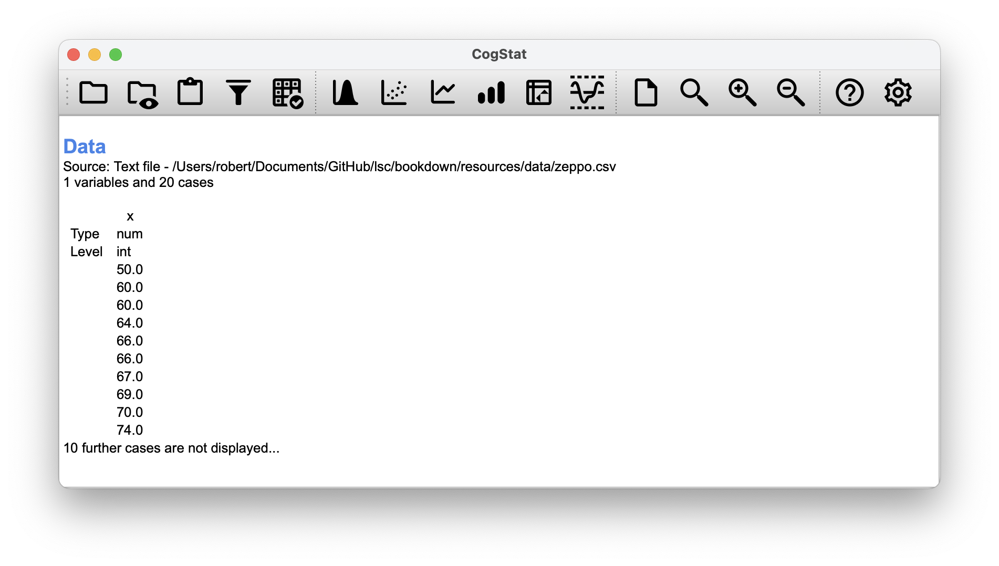
```

Let's explore the data a bit by looking at some summary statistics with the `Explore variable` function.

```{r cogstatexplorezeppo, echo=FALSE, fig.cap="The `Explore variable` function in CogStat."}
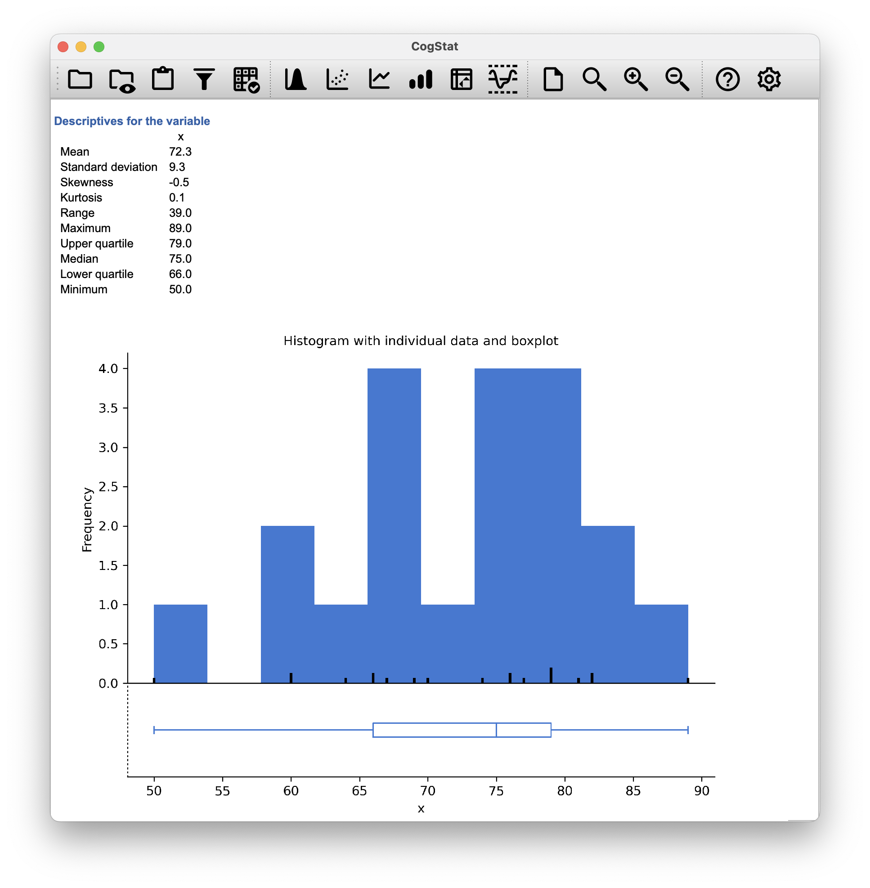
```

The mean is $72.3$. Hm. It *might* be that the psychology students are scoring a bit higher than normal: that sample mean of $\bar{X} = 72.3$ is a fair bit higher than the hypothesised population mean of $\mu = 67.5$, but on the other hand, a sample size of $N = 20$ isn't all that big. Maybe it's pure chance. 

To answer the question, it helps to be able to write down what it is that we know. Firstly, we know that the sample mean is $\bar{X} = 72.3$. If we assume that the psychology students have the same standard deviation as the rest of the class, then we can say that the population standard deviation is $\sigma = 9.5$. We'll also assume that since Dr Zeppo is grading to a curve, the psychology student grades are normally distributed.

Next, it helps to be clear about what we want to learn from the data. In this case, the research hypothesis relates to the *population* mean $\mu$ for the psychology student grades, which is unknown. Specifically, we want to know if $\mu = 67.5$ or not. Given that this is what we know, can we devise a hypothesis test to solve our problem? The data, along with the hypothesised distribution from which they are thought to arise, are shown in Figure \@ref(fig:zeppo). Not entirely obvious what the right answer is, is it? For this, we are going to need some statistics.

```{r zeppo, fig.cap="The theoretical distribution (dashed green line) from which the psychology student grades (blue bars) are generated in CogStat at the `Population properties` section of our result set.", echo=FALSE, fig.align="center", out.width="100%"}
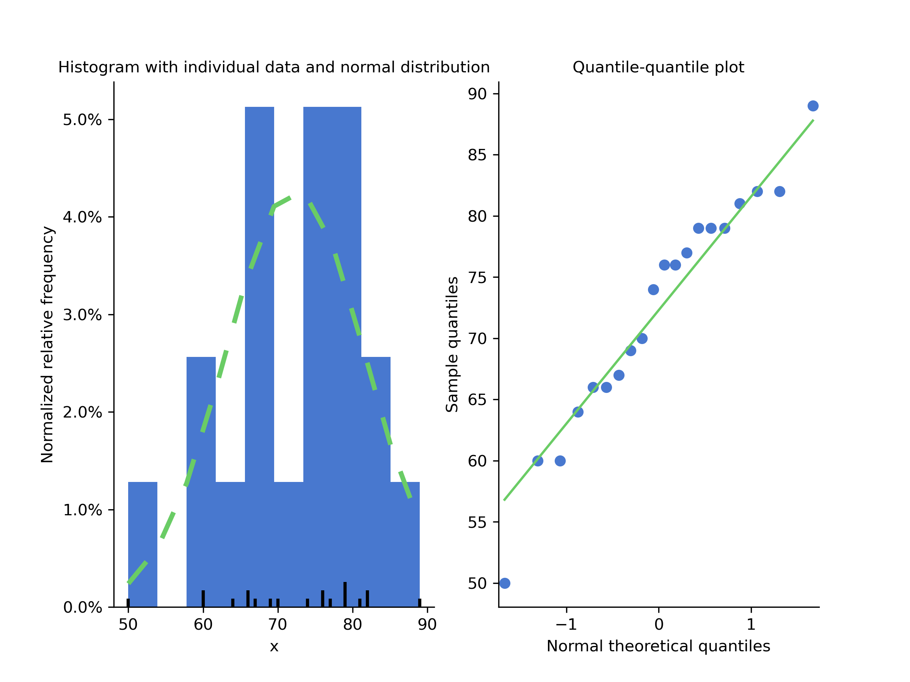
```

The first step in constructing a hypothesis test is to be clear about what the null and alternative hypotheses are. This isn't too hard to do. Our null hypothesis, $H_0$, is that the true population mean $\mu$ for psychology student grades is 67.5; and our alternative hypothesis is that the population mean *isn't* 67.5. If we write this in mathematical notation, these hypotheses become,
$$
\begin{array}{ll}
H_0: & \mu = 67.5 \\
H_1: & \mu \neq 67.5
\end{array}
$$
though to be honest, this notation doesn't add much to our understanding of the problem, it's just a compact way of writing down what we're trying to learn from the data. The null hypotheses $H_0$ and the alternative hypothesis $H_1$ for our test are both illustrated in Figure \@ref(fig:ztesthyp). In addition to providing us with these hypotheses, the scenario outlined above provides us with a fair amount of background knowledge that might be useful. Specifically, there are two special pieces of information that we can add:

- The psychology grades are normally distributed.
- The true standard deviation of these scores $\sigma$ is known to be 9.5.

For the moment, we'll act as if these are absolutely trustworthy facts. In real life, this kind of absolutely trustworthy background knowledge doesn't exist, and so if we want to rely on these facts we'll just have make the *assumption* that these things are true. However, since these assumptions may or may not be warranted, we might need to check them. For now though, we'll keep things simple.

```{r ztesthyp,  fig.cap="Graphical illustration of the null and alternative hypotheses assumed by the one-sample $z$-test (the two sided version, that is). The null and alternative hypotheses both assume that the population distribution is normal, and additionally assumes that the population standard deviation is known (fixed at some value $\\sigma_0$). The null hypothesis (left) is that the population mean $\\mu$ is equal to some specified value $\\mu_0$. The alternative hypothesis is that the population mean differs from this value, $\\mu \\neq \\mu_0$.", echo=FALSE, fig.align="center", out.width="100%"}

width <- 12
height <- 4

plotOne <- function(sigEx) {
        x <- seq(-4, 4, .1)
        y <- dnorm(x, 0, 1)
        plot.new()
        old <- par(no.readonly = TRUE)
        par(mfcol = c(1, 2), mfg = c(1, 1))

        plot.window(xlim = range(x),
                    ylim = range(y) * 1.2)

        # plot density
        lines(x, y, lw = 2)

        # lines and mean
        lines(x = c(0, 0), y = c(0, max(y)))
        text(x = 0, y = max(y) * 1.1,
             labels = expression(mu == mu[0])
        )

        # sd lines and text
        tmp <- dnorm(-1, 0, 1)
        lines(x = c(-1, 0), y = rep(tmp, 2))
        text(x = -2.25, y = tmp,
             labels = sigEx
         )

        axis(side = 1, labels = F)
        title(main = "null hypothesis", font.main = 1)
        title(xlab = "value of X", mgp = c(1, 1, 0))

        par(mfg = c(1, 2))

        plot.window( xlim = range(x), 
                 ylim = range(y)*1.2)


                y <- dnorm(x,-.75,1)

        # plot density
        lines(x, y, lw = 2)

        # lines and mean
        lines(x = c(0, 0), y = c(0, max(y)))
        text(x = 0, y = max(y) * 1.1,
             labels = expression(mu != mu[0])
         )

        # sd lines and text
        tmp <- dnorm(-1, 0, 1)
        lines(x = c(-1.75, -.75), y = rep(tmp, 2))
        text(x = -3, y = tmp,
             labels = sigEx
         )

        axis(side = 1, labels = F)
        title(main = "alternative hypothesis", font.main = 1)
        title(xlab = "value of X", mgp = c(1, 1, 0))

        par(old)
    }

# one-sample z-test
sigEx <- expression(sigma == sigma[0])
plotOne(sigEx)
```

The next step is to figure out what would be a good choice for a diagnostic test statistic, something that would help us discriminate between $H_0$ and $H_1$. Given that the hypotheses all refer to the population mean $\mu$, you'd feel confident that the sample mean $\bar{X}$ would be a helpful place to start. We could look at the difference between the sample mean $\bar{X}$ and the value that the null hypothesis predicts for the population mean. In our example, that would mean we calculate $\bar{X} - 67.5$. More generally, if we let $\mu_0$ refer to the value that the null hypothesis claims is our population mean, then we'd want to calculate
$$
\bar{X} - \mu_0
$$
If this quantity equals or is very close to 0, things are looking good for the null hypothesis. If this quantity is a long way away from 0, then it looks less likely that the null hypothesis is worth retaining. But how far away from zero should it be for us to reject $H_0$?

To figure that out, we need to be a bit more sneaky, and we'll need to rely on those two pieces of background knowledge shared previously, namely that the raw data are normally distributed, and we know the value of the population standard deviation $\sigma$. If the null hypothesis is actually true, and the true mean is $\mu_0$, then these facts together mean that we know the complete population distribution of the data: a normal distribution with mean $\mu_0$ and standard deviation $\sigma$. Adopting the notation from Chapter \@ref(normal), a statistician might write this as:
$$
X \sim \mbox{Normal}(\mu_0,\sigma^2)
$$

Okay, if that's true, then what can we say about the distribution of $\bar{X}$? Well, as we discussed earlier (see Chapter \@ref(clt)), the sampling distribution of the mean $\bar{X}$ is also normal, and has mean $\mu$. But the standard deviation of this sampling distribution $\mbox{SE}({\bar{X}})$, which is called the *standard error of the mean*, is
$$
\mbox{SE}({\bar{X}}) = \frac{\sigma}{\sqrt{N}}
$$

In other words, if the null hypothesis is true then the sampling distribution of the mean can be written as follows:

$$
\bar{X} \sim \mbox{Normal}(\mu_0,\mbox{SE}({\bar{X}}))
$$

Now comes the trick. What we can do is convert the sample mean $\bar{X}$ into a standard score (Section \@ref(zscore)). This is conventionally written as $z$, but for let us refer to it as $z_{\bar{X}}$. (The reason for using this expanded notation is to help you remember that we're calculating standardised version of a sample mean, *not* a standardised version of a single observation, which is what a $z$-score usually refers to). When we do so, the $z$-score for our sample mean is 
$$
z_{\bar{X}} = \frac{\bar{X} - \mu_0}{\mbox{SE}({\bar{X}})}
$$
or, equivalently
$$
z_{\bar{X}} =  \frac{\bar{X} - \mu_0}{\sigma / \sqrt{N}}
$$
This $z$-score is our test statistic. The nice thing about using this as our test statistic is that like all $z$-scores, it has a standard normal distribution:
$$
z_{\bar{X}} \sim \mbox{Normal}(0,1)
$$

In other words, regardless of what scale the original data are on, the $z$-statistic itself always has the same interpretation: it's equal to the number of standard errors that separate the observed sample mean $\bar{X}$ from the population mean $\mu_0$ predicted by the null hypothesis. Better yet, regardless of what the population parameters for the raw scores actually are, the 5\% critical regions for $z$-test are always the same, as illustrated in Figures \@ref(fig:ztest1) and \@ref(fig:ztest2). And what this meant, way back in the days where people did all their statistics by hand, is that someone could publish a table like this:

```{r fig.cap = "Critical $z$ values", echo=FALSE}
knitr::kable(tibble::tribble(
                         ~V1,                ~V2,                ~V3,
                      ".1",      "1.644854",       "1.281552",
                      ".05",      "1.959964",       "1.644854",
                      ".01",      "2.575829",       "2.326348",
                      ".001",      "3.290527",       "3.090232"
  ), col.names = c("desired $\\alpha$ level", " two-sided test", " one-sided test"), align = 'ccc')
```

which in turn meant that researchers could calculate their $z$-statistic by hand, and then look up the critical value in a text book. That was an incredibly handy thing to be able to do back then.

```{r ztest2, fig.cap="Rejection regions for the two-sided $z$-test", echo=FALSE, fig.align="center", fig.show="hold", out.width="100%"}
  width <- 6
  height <- 4
  
  plot.new()
  plot.window( xlim=c(-3,3), ylim=c(0,.4) )
  
  crit <- qnorm(.975)
  x<-c(seq(crit,3,.01),3)
  y<-dnorm(x)
  polygon(c(x[1],x,3),c(0,y,0),
          col=ifelse(colour,emphColLight,emphGrey),
          density=10)
  
  crit <- qnorm(.025)
  x<-c(seq(-3,crit,.01),crit)
  y<-dnorm(x)
  polygon(c(x[1],x,crit),c(0,y,0),
          col=ifelse(colour,emphColLight,emphGrey),
          density=10)
  
  x <- seq(-3,3,.01)
  y <- dnorm(x)
  lines(x,y,lwd=3,col="black")

  axis(1,at=round(c(-3,crit,0,-crit,3),2),
       labels=c("",round(crit,2),"0",round(-crit,2),""))
  title(xlab="Value of z Statistic", main="Two Sided Test", font.main=1)
```

```{r ztest1, fig.cap="Rejection regions for the one-sided $z$-test", echo=FALSE, fig.align="center", out.width="100%"}
  plot.new()
  plot.window( xlim=c(-3,3), ylim=c(0,.4) )
  
  crit <- qnorm(.95)
  x<-c(seq(crit,3,.01),3)
  y<-dnorm(x)
  polygon(c(x[1],x,3),c(0,y,0),
          col=ifelse(colour,emphColLight,emphGrey),
          density=10)
  
  x <- seq(-3,3,.01)
  y <- dnorm(x)
  lines(x,y,lwd=3,col="black")
  
  axis(1,at=round(c(-3,0,crit,3),2),
       labels=c("","0",round(crit,2),""))
  title(xlab="Value of z Statistic", main="One Sided Test", font.main=1)
```

Now, as mentioned earlier, the $z$-test is almost never used in practice. However, the test is so incredibly simple that it's really easy to do one manually. Let's go back to the data from Dr Zeppo's class. However, we're not going to use CogStat for the rest of this section, because it will automatically (and correctly) use the population parameter estimates, that will actually come in handy in the $t$-test section. So from now on, let's just follow the logic without the urge to try to replicate it.

- The sample size is $20$ (we know this from Figure \@ref(fig:cogstatloadzeppo)).
- The *mean* is $72.3$ (we know this from Figure \@ref(fig:cogstatexplorezeppo)).
- The point estimation for standard deviation is $9.5$ (we have to just believe this for the example's sake because we said so earlier).
- The null hypothesis is that the mean is $67.5$.

Next, let's calculate the (true) standard error of the mean:

$$
\frac{9.5}{\sqrt{20}} = 2.1243
$$

And finally, we calculate our $z$-score:

$$
\frac{72.3-67.5}{2.1243} = 2.2596
$$

At this point, we would traditionally look up the value 2.26 in our table of critical values. Our original hypothesis was two-sided (we didn't really have any theory about whether psychology students would be better or worse at statistics than other students), so our hypothesis test is two-sided (or two-tailed) also.

Looking at the little table shown earlier, we can see that 2.26 is bigger than the critical value of 1.96 that would be required to be significant at $\alpha = .05$ but smaller than the value of 2.58 that would be required to be significant at a level of $\alpha = .01$. Therefore, we can conclude that we have a significant effect, which we might write up by saying something like this:

> With a mean grade of 73.2 in the sample of psychology students, and assuming a true population standard deviation of 9.5, we can conclude that the psychology students have significantly different statistics scores to the class average ($z = 2.26$, $N=20$, $p<.05$). 

However, what if want an exact $p$-value? Well, back in the day, the tables of critical values were huge, so you could look up your actual $z$-value and find the smallest value of $\alpha$ for which your data would be significant (which, as discussed earlier, is the very definition of a $p$-value). However, we are here just to discuss the $z$-test in order for us to understand the $t$-test, so we will not go into the details of how to do this. However, if you are interested, you can find a table of critical values [here](https://www.statisticshowto.datasciencecentral.com/probability-and-statistics/z-table/). All in all, our $p$-value is $0.0238$.

All statistical tests make assumptions. Some tests make reasonable assumptions, while other tests do not. The one-sample $z$-test makes three basic assumptions:

- *Normality*. As usually described, the $z$-test assumes that the true population distribution is normal.^[Strictly speaking, the $z$ test only requires that the sampling distribution of the mean be normally distributed; if the population is normal then it necessarily follows that the sampling distribution of the mean is also normal. However, as we saw when talking about the central limit theorem, it's entirely possible (even commonplace) for the sampling distribution to be normal even if the population distribution itself is non-normal. However, in light of the sheer ridiculousness of the assumption that the true standard deviation is known, there really isn't much point in going into details on this front!] is often pretty reasonable, and not only that, it's an assumption that we can check if we feel worried about it (see Chapter \@ref(shapiro)). 
- *Independence*. The second assumption of the test is that the observations in your data set are not correlated with each other or related to each other in some funny way. This isn't as easy to check statistically: it relies a bit on good experimental design. An obvious example of something that violates this assumption is a data set where you "copy" the same observation over and over again in your data file: so you end up with a massive "sample size" consisting of only one genuine observation. More realistically, you have to ask yourself if it's really plausible to imagine that each observation is an entirely random sample from the population you're interested in. In practice, this assumption is never met; but we try our best to design studies that minimise the problems of correlated data. 
- *Known standard deviation*. The third assumption of the $z$-test is that the true standard deviation of the population is known to the researcher. This is just stupid. In no real-world data analysis problem do you know the standard deviation $\sigma$ of some population but are completely ignorant about the mean $\mu$. In other words, this assumption is *always* wrong. 

In view of the stupidity of assuming that $\sigma$ is known, let's see if we can live without it. This takes us out of the dreary domain of the $z$-test and into the magical kingdom of the $t$-test, with unicorns, fairies, and leprechauns.

## The one-sample $t$-test{#onesamplettest}

It might not be safe to assume that the psychology student grades necessarily have the same standard deviation as the other students in Dr Zeppo's class. After all, if we were entertaining the hypothesis that they don't have the same mean, why should we assume they have the same standard deviation? In view of this, we must stop assuming we know the true value of $\sigma$. However, this violates the assumptions of the $z$-test, which brings us back to square one. However, we still have the raw data loaded into CogStat, and those can give us an *estimate* of the population standard deviation.

Having loaded the `grades` data and explored the descriptive statistics, let us take note of a few data points from the `Descriptives for the variable` and the `Population parameter estimations` section of the CogStat output. But first, let us re-run the `Explore variable` option, but now let us tell CogStat to use our null hypothesis of $67.5$. To do that, we have to fill in `67.5` in our dialogue:

```{r centraltendencyexplorevar, echo=FALSE, fig.align="center", out.width="100%"}
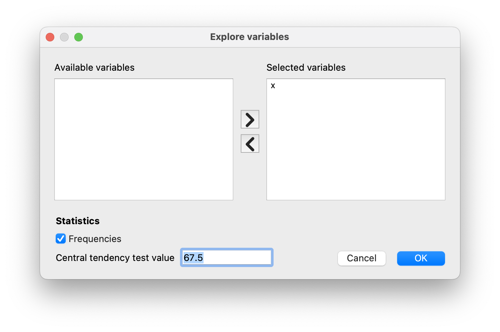
```

```{=html}
<div style="margin: 0 0 1.275em; border: 1px solid #ddd; padding:.85em 1em;">
 <h4 style="font-size:medium; font-weight:600; color:#3960a5;">Population parameter estimations</h4>
 <p>Present confidence interval values for the mean suppose normality.</p>
  <table style="border: none; background-color: white;">
     <tr>
          <td style="border: 0px; background-color: white;"></td>
          <td style="border: 0px; background-color: white;">Point estimation</td>
          <td style="border: 0px; background-color: white;">95% confidence interval (low)</td>
          <td style="border: 0px; background-color: white;">95% confidence interval (high)</td>
     </tr>
     <tr>
          <td style="border: 0px; background-color: white;">Mean</td>
          <td style="border: 0px; background-color: white;">72.3</td>
          <td style="border: 0px; background-color: white;">67.8</td>
          <td style="border: 0px; background-color: white;">76.8</td>
     </tr>
     <tr>
          <td style="border: 0px; background-color: white;">Standard deviation</td>
          <td style="border: 0px; background-color: white;">9.5</td>
          <td style="border: 0px; background-color: white;">7.2</td>
          <td style="border: 0px; background-color: white;">13.9</td>
     </tr>
  </table>
</div>
```

In other words, while we can't say that we *know* that $\sigma = 9.5$, we *can* say that $\hat\sigma = 9.5$. (Actually it's $9.520615$ but CogStat rounds it to one decimal when displayed, but it uses the exact value for any calculation.)

Because we are now relying on an *estimate* of the population standard deviation, we need to make some adjustment for the fact that we have some uncertainty about what the true population standard deviation actually is. Maybe our data are just a fluke ... maybe the true population standard deviation is 11, for instance. But if that were actually true, and we ran the $z$-test assuming $\sigma=11$, then the result would end up being *non-significant*. That's a problem, and it's one we're going to have to address.

```{r ttesthyponesample, fig.cap="Graphical illustration of the null and alternative hypotheses assumed by the (two sided) one-sample $t$-test. Note the similarity to the $z$-test. The null hypothesis is that the population mean $\\mu$ is equal to some specified value $\\mu_0$, and the alternative hypothesis is that it is not. Like the $z$-test, we assume that the data are normally distributed; but we do not assume that the population standard deviation $\\sigma$ is known in advance.", echo=FALSE, fig.align="center", out.width="100%"}
width <- 12
height <- 4

plotOne <- function( sigEx ) {
    x <- seq(-4,4,.1)
    y <- dnorm(x,0,1)
    plot.new()
    
    old <- par( no.readonly = TRUE )
    par( mfcol= c(1,2), mfg = c(1,1))
    plot.window( xlim = range(x), 
                 ylim = range(y)*1.2)
    # plot density
    lines( x ,y, lw =2 )

    # lines and mean
    lines(x=c(0,0), y = c(0,max(y)))
    text(x=0, y = max(y)*1.1, 
         labels= expression(mu == mu[0])
    )    
    # sd lines and text
    tmp <- dnorm(-1,0,1)
    lines(x=c(-1,0), y = rep(tmp,2))
    text(x=-2.25, y = tmp, 
         labels= sigEx
     )
    axis(side = 1, labels = F)
    title( main = "null hypothesis", font.main = 1)
    title( xlab = "value of X", mgp = c(1,1,0))
    par( mfg = c(1,2))

    plot.window( xlim = range(x), 
             ylim = range(y)*1.2)
            y <- dnorm(x,-.75,1)
    # plot density
    lines( x ,y, lw =2 )
    # lines and mean
    lines(x=c(0,0), y = c(0,max(y)))
    text(x=0, y = max(y)*1.1, 
         labels= expression(mu != mu[0])
     )    
     # sd lines and text
    tmp <- dnorm(-1,0,1)
    lines(x=c(-1.75,-.75), y = rep(tmp,2))
    text(x=-3, y = tmp, 
         labels= sigEx
     )
    axis(side = 1, labels = F)
    title( main = "alternative hypothesis", font.main = 1)
    title( xlab = "value of X", mgp = c(1,1,0))
    par(old)
}

# one-sample t-test
sigEx <- expression(sigma == "??")
plotOne( sigEx )
```

This ambiguity is annoying, and it was resolved in 1908 by a guy called William Sealy Gosset [@Student1908], who was working as a chemist for the Guinness brewery at the time [see @Box1987]. Because Guinness took a dim view of its employees publishing statistical analysis (apparently, they felt it was a trade secret), he published the work under the pseudonym "A Student", and to this day, the full name of the $t$-test is actually **Student's $t$-test**. The critical thing that Gosset figured out is how we should accommodate the fact that we aren't entirely sure what the true standard deviation is.^[Gosset only provided a partial solution: the general solution to the problem was provided by Sir Ronald Fisher.] The answer is that it subtly changes the sampling distribution.

In the $t$-test, our test statistic (now called a $t$-statistic) is calculated in exactly the same way as mentioned above. If our null hypothesis is that the true mean is $\mu$, but our sample has mean $\bar{X}$ and our estimate of the population standard deviation is $\hat{\sigma}$, then our $t$ statistic is:
$$
t = \frac{\bar{X} - \mu}{\hat{\sigma}/\sqrt{N} }
$$

The only thing that has changed in the equation is that instead of using the known true value $\sigma$, we use the estimate $\hat{\sigma}$. And if this estimate has been constructed from $N$ observations, then the sampling distribution turns into a $t$-distribution with $N-1$ **degrees of freedom** (df). The $t$ distribution is very similar to the normal distribution but has "heavier" tails, as discussed earlier in Chapter \@ref(otherdists) and illustrated in Figure \@ref(fig:ttestdist).

Notice, though, that as df gets larger, the $t$-distribution starts to look identical to the standard normal distribution. This is as it should be: if you have a sample size of $N = 70000000$, then your "estimate" of the standard deviation would be pretty much perfect, right? So, you should expect that for large $N$, the $t$-test would behave the same way as a $z$-test. And that's exactly what happens!

```{r ttestdist, fig.cap="The $t$ distribution with 2 degrees of freedom (left) and 10 degrees of freedom (right), with a standard normal distribution (i.e., mean 0 and std dev 1) plotted as dotted lines for comparison purposes. Notice that the $t$ distribution has heavier tails (higher kurtosis) than the normal distribution; this effect is quite exaggerated when the degrees of freedom are very small, but negligible for larger values. In other words, for large $df$ the $t$ distribution is essentially identical to a normal distribution.", echo=FALSE, fig.align="center", out.width="100%"}
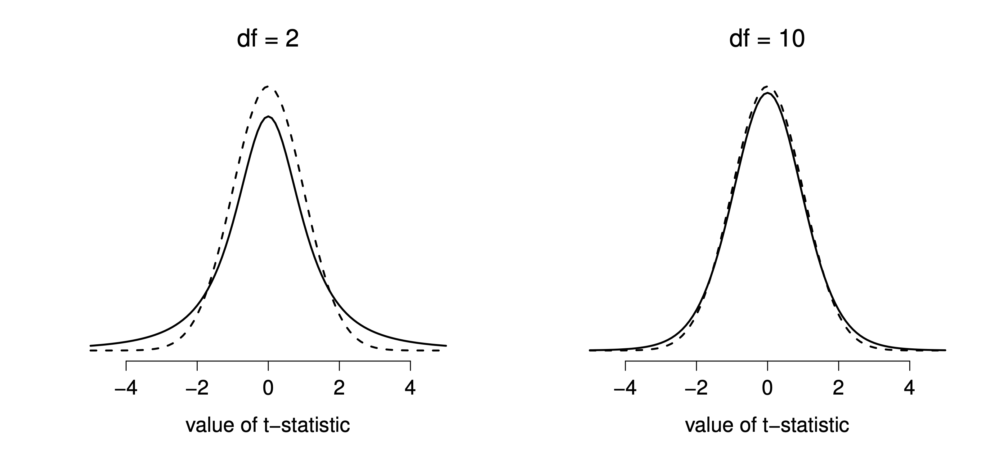
```

As you might expect, the mechanics of the $t$-test are almost identical to the mechanics of the $z$-test. So there's not much point in going through the tedious exercise of showing you how to do the calculations: it's pretty much identical to the calculations that we did earlier, except that we use the estimated standard deviation, and then we test our hypothesis using the $t$ distribution rather than the normal distribution.

So let's just do it quickly in CogStat: let's just go through the output. You can see that the `Population parameter estimations` stayed the same, so no need to quote them here again. However, let's see the `Hypothesis tests` results.

```{=html}
<div style="margin: 0 0 1.275em; border: 1px solid #ddd; padding:.85em 1em;">
     <p style="font-size:medium; font-weight:600; color:#3960a5;">Hypothesis tests</p>
     <p style="color:#008000;">Testing if mean deviates from the value 67.5.<br />
     Interval variable. &gt;&gt; Choosing one-sample t-test or Wilcoxon signed-rank test depending on the assumption.<br />
     Checking for normality.</p>
     <p style="color:black;">Shapiro-Wilk normality test in variable x:<span style="font-style:italic;">W</span> = 0.96, <span style="font-style:italic;">p</span> = .586</p>
     <p style="color:#008000;">Normality is not violated. &gt;&gt; Running one-sample t-test.</p>
     <p style="color:black;">Sensitivity power analysis. Minimal effect size to reach 95% power with the present sample size for the present hypothesis test. Minimal effect size in d: 0.85. </p>
     <p style="color:black;">One sample t-test against 67.5: <span style="font-style:italic;">t</span>(19) = 2.25, <span style="font-style:italic;">p</span> = .036</p>
     <p style="color:black;">Result of the Bayesian one sample t-test: BF<sub>10</sub> = 1.80, BF<sub>01</sub> = 0.56</p>
</div>
```

Let us go through them line by line.

- `Testing if mean deviates from the value 67.5.`: good, we are made sure we are testing against a null hypothesis of $\mu = 67.5$.
- `Interval variable. >> Choosing one-sample t-test or Wilcoxon signed-rank test depending on the assumption.`: this means that depending on normality (which is an assumption of both $z$ and $t$-tests), CogStat will choose either the $t$-test or the Wilcoxon signed-rank test. We will discuss the Wilcoxon signed-rank test later on.
- `Normality is not violated. >> Running one-sample t-test.`: this is good, because we know that the $t$-test is only valid if the data are normally distributed.
- `one-sample t-test against 67.5: t(19) = 2.25, p < .036`: this is the result of the $t$-test. The $t$-statistic is 2.25, and the $p$-value is 0.036. This means that we can reject the null hypothesis that $\mu = 67.5$ at the 5% level of significance. In other words, we can conclude that the mean of the sample is significantly different from 67.5.

Don't forget to take note of the Mean's 95% confidence interval values from the `Population parameter estimations`, and now we could report the result by saying something like this:

> With a mean grade of 72.3, the psychology students scored slightly higher than the average grade of 67.5 ($t(19) = 2.25$, $p<.05$); the 95\% confidence interval is [67.8, 76.8].

$t(19)$ is shorthand notation for a $t$-statistic that has 19 degrees of freedom. That said, it's often the case that people don't report the confidence interval, or do so using a much more compressed form. For instance, it's not uncommon to see the confidence interval included as part of the stat block, like this:

> $t(19) = 2.25$, $p<.05$, CI$_{95} = [67.8, 76.8]$

With that much jargon crammed into half a line, you know it must be really smart.

Okay, so what assumptions does the one-sample $t$-test make? Well, since the $t$-test is a $z$-test with the premise of known standard deviation removed, you shouldn't be surprised to see that it makes the same assumptions as the $z$-test, minus the one about the known standard deviation. That is

- *Normality*. We're still assuming that the population distribution is normal.
- *Independence*. Once again, we have to assume that the observations in our sample are generated independently of one another.

Overall, these two assumptions aren't terribly unreasonable, and as a consequence, the one-sample $t$-test is pretty widely used in practice as a way of comparing a sample mean against a hypothesised population mean.

## The independent samples $t$-test (Student test){#studentttest}

Although the one-sample $t$-test has its uses, it's not the most typical example of a $t$-test. A much more common situation arises when you've got two different groups of observations. In psychology, this tends to correspond to two different groups of participants, where each group corresponds to a different condition in your study. For each person in the study, you measure some outcome variable of interest, and the research question that you're asking is whether or not the two groups have the same population mean. This is the situation that the independent samples $t$-test is designed for. 

Suppose we have 33 students taking Dr Harpo's statistics lectures, and Dr Harpo doesn't grade to a curve. Actually, Dr Harpo's grading is a bit of a mystery, so we don't really know anything about what the average grade is for the class as a whole. There are two tutors for the class, Anastasia and Bernadette. There are $N_1 = 15$ students in Anastasia's tutorials, and $N_2 = 18$ in Bernadette's tutorials. The research question we're interested in is whether Anastasia or Bernadette is a better tutor, or if it doesn't make much of a difference. 

As usual, let's load the file [`harpo.csv`](resources/data/harpo.csv).

```{r harpodata, echo=FALSE, fig.align="center", out.width="100%"}
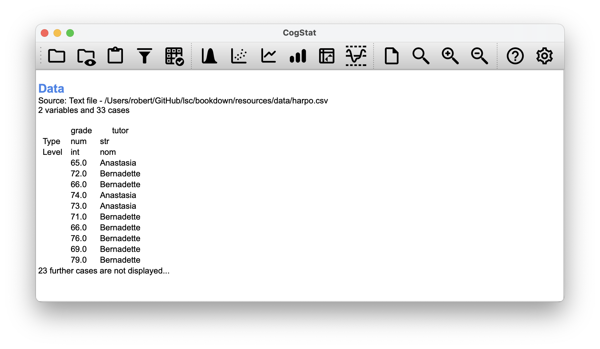
```

As we can see, we have two variables: `grade` and `tutor`. The `grade` variable is a numeric interval variable, containing the grades for all $N = 33$ students taking Dr Harpo's class; the `tutor` variable is a categorical (nominal) data that indicates who each student's tutor was. 

Let's run the `Compare groups` function so we can get some information about the grades by tutor.

```{r harpocompare, echo=FALSE, fig.align="center", out.width="100%", fig.show="hold", fig.cap="Comparing grades by tutor in CogStat for our `harpo` data set."}
knitr::include_graphics(c("resources/image/cogstatharpocomparedialog.png",
                         "resources/image/cogstatharposampleproperties.png"))
```

In the boxplot generated by CogStat, we have the grades, the means and corresponding confidence intervals. We can see that the grades for Anastasia's students are slightly higher than those for Bernadette's students. We can also see that the variance of the grades for Bernadette's students is slightly higher than that for Anastasia's students.

```{r harpoboxplot, fig.align="center", out.width="100%", echo=FALSE}
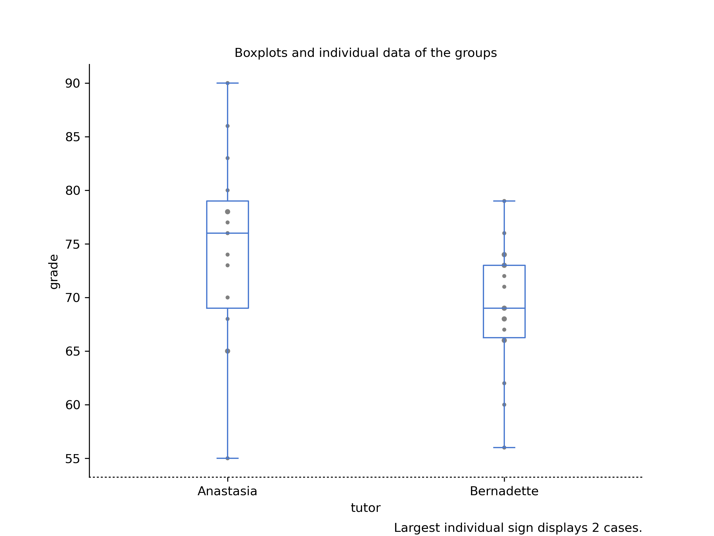
```

The **independent samples $t$-test** comes in two different forms, Student's and Welch's. The original Student $t$-test -- which is the one we'll describe in this section -- is the simpler of the two but relies on much more restrictive assumptions than the Welch $t$-test. Assuming for the moment that you want to run a two-sided test, the goal is to determine whether two "independent samples" of data are drawn from populations with the same mean (the null hypothesis) or different means (the alternative hypothesis).

When we say "independent" samples, what we really mean here is that there's no special relationship between observations in the two samples. This probably doesn't make a lot of sense right now, but it will be clearer when we come to talk about the paired samples $t$-test later on. For now, let's just point out that if we have an experimental design where participants are randomly allocated to one of two groups, and we want to compare the two groups' mean performance on some outcome measure, then an independent samples $t$-test (rather than a paired samples $t$-test) is what we're after.

Okay, so let's let $\mu_1$ denote the true population mean for group 1 (e.g., Anastasia's students), and $\mu_2$ will be the true population mean for group 2 (e.g., Bernadette's students),^[A funny question almost always pops up at this point: what the heck *is* the population being referred to in this case? Is it the set of students actually taking Dr Harpo's class (all 33 of them)? The set of people who might take the class (an unknown number) of them? Or something else? Does it matter which of these we pick? Technically yes, it does matter: if you change your definition of what the "real world" population actually is, then the sampling distribution of your observed mean $\bar{X}$ changes too. The $t$-test relies on the assumption that the observations are sampled at random from an infinitely large population, and to the extent that real life isn't like that, then the $t$-test can be wrong. In practice, however, this isn't usually a big deal: even though the assumption is almost always wrong, it doesn't lead to a lot of pathological behaviour from the test, so we tend to just ignore it.] and as usual, we'll let $\bar{X}_1$ and $\bar{X}_2$ denote the observed sample means for both of these groups. Our null hypothesis states that the two population means are identical ($\mu_1 = \mu_2$), and the alternative to this is that they are not ($\mu_1 \neq \mu_2$).

$$
\begin{array}{ll}
H_0: & \mu_1 = \mu_2  \\
H_1: & \mu_1 \neq \mu_2
\end{array}
$$

```{r ttesthyp, fig.cap="Graphical illustration of the null and alternative hypotheses assumed by the Student $t$-test. The null hypothesis assumes that both groups have the same mean $\\mu$, whereas the alternative assumes that they have different means $\\mu_1$ and $\\mu_2$. Notice that it is assumed that the population distributions are normal, and that, although the alternative hypothesis allows the group to have different means, it assumes they have the same standard deviation", echo=FALSE, fig.align="center", out.width="100%"}

    width <- 12
    height <- 4

    plotOne <- function( sd1 ) {
 
        Grade <- 40:100

        mu1 <- c(60, 75)
        mu0 <- 70
        sd0 <- 9

        plot.new()   # new figure window

        old <- par( no.readonly = TRUE )
    
        par( mfcol = c(1,2),  # array of two plots
             mfg = c(1,1) )   # start on the left

        ymax <- .07
        plot.window( xlim = range(Grade),
            ylim = c(0, ymax)
          )

        # null distribution
        lines( x = Grade, 
           y = ynull <- dnorm(Grade, mu0, sd0), 
           lw = 2 )

        axis(side = 1, at = seq(40,100,10), labels = F)

        text(x = mu0, y = max(ynull)*1.1, 
         expression(mu) , cex = 1.2)

        title( main = "null hypothesis", font.main = 1)
        title( xlab = "value of X", mgp = rep(1,3))

        par( mfg = c(1,2) ) 
        plot.window( xlim = range(Grade),
                 ylim = c(0, ymax) )


        # alternative distributions
        lines( x = Grade, 
           y = ya1 <- dnorm(Grade, mu1[1], sd1[1]), 
           lw = 2 )

        lines( x = Grade, 
           y = ya2 <- dnorm(Grade, mu1[2], sd1[2]), 
           lw = 2 )

        axis(side = 1, at = seq(40,100,10), labels = F)

        text(x = mu1[1], y = max(ya1)*1.1, 
         expression(mu[1]) , cex = 1.2)
        text(x = mu1[2], y = max(ya2)*1.1, 
         expression(mu[2]) , cex = 1.2)
    

        title( main = "alternative hypothesis", font.main = 1)
        title( xlab = "value of X", mgp = rep(1,3))
    
        par(old)
    
    }

    # print 
    sd1 <- c(6.5, 6.5)
    plotOne( sd1 )
```

To construct a hypothesis test that handles this scenario, we start by noting that if the null hypothesis is true, then the difference between the population means is *exactly* zero, 
$\mu_1 - \mu_2 = 0$

As a consequence, a diagnostic test statistic will be based on the difference between the two sample means. Because if the null hypothesis is true, then we'd expect 
$$
\bar{X}_1 - \bar{X}_2
$$
to be *pretty close* to zero. However, just like we saw with our one-sample tests (i.e. the one-sample $z$-test and the one-sample $t$-test) we have to be precise about exactly *how close* to zero this difference should be. And the solution to the problem is more or less the same one: we calculate a standard error estimate (SE), just like last time, and then divide the difference between means by this estimate. So our **$t$-statistic** will be of the form
$$
t = \frac{\bar{X}_1 - \bar{X}_2}{\mbox{SE}}
$$
We just need to figure out what this standard error estimate actually is. This is a bit trickier than was the case for either of the two tests we've looked at so far, so we need to go through it a lot more carefully to understand how it works.

In the original "Student $t$-test", we make the assumption that the two groups have the same population standard deviation: that is, regardless of whether the population means are the same, we assume that the population standard deviations are identical, $\sigma_1 = \sigma_2$. Since we're assuming that the two standard deviations are the same, we drop the subscripts and refer to both of them as $\sigma$.

How should we estimate this? How should we construct a single estimate of a standard deviation when we have two samples? The answer is, we take a *weighed* average of the *variance* estimates, which we use as our **pooled estimate of the variance**. The weight assigned to each sample is equal to the number of observations in that sample, minus 1.

$$
\begin{array}{rcl}
w_1 &=& N_1 - 1\\
w_2 &=& N_2 - 1
\end{array}
$$

Now that we've assigned weights to each sample, we calculate the pooled estimate of the variance by taking the weighted average of the two variance estimates, ${\hat\sigma_1}^2$ and ${\hat\sigma_2}^2$.

$$
\hat\sigma^2_p = \frac{w_1 {\hat\sigma_1}^2 + w_2 {\hat\sigma_2}^2}{w_1 + w_2}
$$

Finally, we convert the pooled variance estimate to a pooled standard deviation estimate, by taking the square root. This gives us the following formula for $\hat\sigma_p$,
$$
\hat\sigma_p = \sqrt{\frac{w_1 {\hat\sigma_1}^2 + w_2 {\hat\sigma_2}^2}{w_1 + w_2}}
$$

And if you mentally substitute $w_1 = N_1 -1$ and $w_2 = N_2 -1$ into this equation, you get a very ugly formula that actually seems to be the "standard" way of describing the pooled standard deviation estimate.

But let us describe it a bit differently:

Our data set actually corresponds to a set of $N$ observations, which are sorted into two groups. So let's use the notation $X_{ik}$ to refer to the grade received by the $i$-th student in the $k$-th tutorial group: that is, $X_{11}$ is the grade received by the first student in Anastasia's class, $X_{21}$ is her second student, and so on. And we have two separate group means $\bar{X}_1$ and $\bar{X}_2$, which we could "generically" refer to using the notation $\bar{X}_k$, i.e.,the mean grade for the $k$-th tutorial group. Since every single student falls into one of the two tutorials, and so we can describe their deviation from the group mean as the difference
$$
X_{ik} - \bar{X}_k
$$

So why not just use these deviations (i.e. the extent to which each student's grade differs from the mean grade in their tutorial)? Remember, a variance is just the average of a bunch of squared deviations.

$$
\frac{\sum_{ik} \left( X_{ik} - \bar{X}_k \right)^2}{N}
$$
where the notation "$\sum_{ik}$" is a lazy way of saying "calculate a sum by looking at all students in all tutorials", since each "$ik$" corresponds to one student. But, as we saw in Chapter \@ref(estimation), calculating the variance by dividing by $N$ produces a biased estimate of the population variance. And previously, we needed to divide by $N-1$ to fix this. However, the reason why this bias exists is because the variance estimate relies on the sample mean; and to the extent that the sample mean isn't equal to the population mean, it can systematically bias our estimate of the variance. But this time we're relying on *two* sample means! Does this mean that we've got more bias? Yes, yes it does. And does this mean we now need to divide by $N-2$ instead of $N-1$, in order to calculate our pooled variance estimate? Why, yes...
$$
\hat\sigma^2_p = \frac{\sum_{ik} \left( X_{ik} - \bar{X}_k \right)^2}{N -2}
$$
Oh, and if you take the square root of this then you get $\hat{\sigma}_p$, the pooled standard deviation estimate. In other words, the pooled standard deviation calculation is nothing special: it's not terribly different to the regular standard deviation calculation. 

Regardless of which way you want to think about it, we now have our pooled estimate of the standard deviation. From now on, we'll refer to this estimate as $\hat\sigma$. Let's now go back to thinking about the hypothesis test.

Our whole reason for calculating this pooled estimate was that we knew it would be helpful when calculating our *standard error* estimate. But, standard error of *what*? In the one-sample $t$-test, it was the standard error of the sample mean, $\mbox{SE}({\bar{X}})$, and since $\mbox{SE}({\bar{X}}) = \sigma / \sqrt{N}$ that's what the denominator of our $t$-statistic looked like. This time around, however, we have *two* sample means. And what we're interested in, specifically, is the the difference between the two $\bar{X}_1 - \bar{X}_2$. Consequently, the standard error that we need to divide by is in fact the **standard error of the difference** between means. As long as the two variables really do have the same standard deviation, then our estimate for the standard error is
$$
\mbox{SE}({\bar{X}_1 - \bar{X}_2}) = \hat\sigma \sqrt{\frac{1}{N_1} + \frac{1}{N_2}}
$$
and our $t$-statistic is therefore 
$$
t = \frac{\bar{X}_1 - \bar{X}_2}{\mbox{SE}({\bar{X}_1 - \bar{X}_2})}
$$

Just as we saw with our one-sample test, the sampling distribution of this $t$-statistic is a $t$-distribution as long as the null hypothesis is true, and all of the assumptions of the test are met. The degrees of freedom, however, is slightly different. As usual, we can think of the degrees of freedom to be equal to the number of data points minus the number of constraints. In this case, we have $N$ observations ($N_1$ in sample 1, and $N_2$ in sample 2), and 2 constraints (the sample means). So the total degrees of freedom for this test are $N-2$.

```{r cogstatharpohypo, fig.align="center", out.width="100%", echo=FALSE}
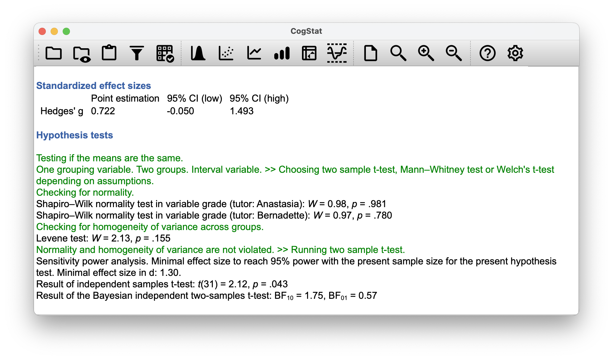
```

The output from CogStat has a very familiar form. Let's start to talk about the confidence interval, and for that, let's circle back to our `Population parameter estimations`:

```{=html}
<div style="margin: 0 0 1.275em; border: 1px solid #ddd; padding:.85em 1em;">
 <h4 style="font-size:medium; font-weight:600; color:#3960a5;">Population parameter estimations</h4>
 <p>Means<br />Present confidence interval values suppose normality.</p>
  <table style="border: none; background-color: white;">
     <tr>
          <td style="border: 0px; background-color: white;">tutor</td>
          <td style="border: 0px; background-color: white;">Point estimation</td>
          <td style="border: 0px; background-color: white;">95% CI (low)</td>
          <td style="border: 0px; background-color: white;">95% CI (high)</td>
     </tr>
     <tr>
          <td style="border: 0px; background-color: white;">Anastasia</td>
          <td style="border: 0px; background-color: white;">74.5</td>
          <td style="border: 0px; background-color: white;">69.5</td>
          <td style="border: 0px; background-color: white;">79.5</td>
     </tr>
     <tr>
          <td style="border: 0px; background-color: white;">Bernadette</td>
          <td style="border: 0px; background-color: white;">69.1</td>
          <td style="border: 0px; background-color: white;">66.2</td>
          <td style="border: 0px; background-color: white;">71.9</td>
     </tr>
          <tr>
          <td style="border: 0px; background-color: white;">Difference between the two groups:</td>
          <td style="border: 0px; background-color: white;">5.5</td>
          <td style="border: 0px; background-color: white;">0.2</td>
          <td style="border: 0px; background-color: white;">10.8</td>
     </tr>
  </table>
</div>
```

It's pretty important to be clear on what this confidence interval actually refers to: it is a confidence interval for the *difference* between the group means. In our example, Anastasia's students had an average grade of 74.5, and Bernadette's students had an average grade of 69.1, so the difference between the two sample means is 5.5 (due to rounding). But of course the difference between population means might be bigger or smaller than this. The confidence interval reported tells you that there's a 95\% chance that the true difference between means lies between 0.2 and 10.8.

In any case, the difference between the two groups is significant (just barely), so we might write up the result using text like this:

> The mean grade in Anastasia's class was 74.5 (SD = 8.7), whereas the mean in Bernadette's class was 69.1 (SD = 5.6). A Student's independent samples $t$-test showed that this 5.5 difference was significant ($t(31) = 2.12$, $p<.05$, $CI_{95} = [0.2, 10.8]$), suggesting that a genuine difference in learning outcomes has occurred.

At a bare minimum, you'd expect to see the $t$-statistic, the degrees of freedom and the $p$ value. So you should include something like this at a minimum: $t(31) = 2.1$, $p<.05$. If statisticians had their way, everyone would also report the confidence interval and probably the effect size measure too, because they are useful things to know. But real life doesn't always work the way statisticians want it to: you should make a judgment based on whether you think it will help your readers, and (if you're writing a scientific paper) the editorial standard for the journal in question. Some journals expect you to report effect sizes, others don't. Within some scientific communities it is standard practice to report confidence intervals, in other it is not. You'll need to figure out what your audience expects.

Before moving on to talk about the assumptions of the $t$-test, there's one additional point to make about the use of $t$-tests in practice. The first one relates to the sign of the $t$-statistic (that is, whether it is a positive number or a negative one).  One very common worry that students have when they start running their first $t$-test is that they often end up with negative values for the $t$-statistic, and don't know how to interpret it. On closer inspection, the students will notice that the confidence intervals also have the opposite signs. This is perfectly okay. The $t$-statistic calculated in CogStat is always of the form 
$$
t = \frac{\mbox{(mean 1)} -\mbox{(mean 2)}}{ \mbox{(SE)}}
$$
If "mean 1" is larger than "mean 2" the $t$ statistic will be positive, whereas if "mean 2" is larger then the $t$ statistic will be negative. Similarly, the confidence interval is the confidence interval for the difference "(mean 1) minus (mean 2)", which will be the reverse of what you'd get if you were calculating the confidence interval for the difference "(mean 2) minus (mean 1)".

Okay, that's pretty straightforward when you think about it, but now consider our $t$-test comparing Anastasia's class to Bernadette's class. Which one does CogStat call "mean 1" and which one should we call "mean 2"? Let's look at the order of how the data is presented. Anastasia goes first in all the result outputs. So, we would write 

>Anastasia's class had *higher* grades than Bernadette's class ($t(31)= 2.1, p=.04$). 

On the other hand, suppose the phrasing we wanted to use has Bernadette's class listed first. If so, it makes more sense to treat her class as group 1, and if so, the write up looks like this:

> Bernadette's class had *lower* grades than Anastasia's class ($t(31)= -2.1, p=.04$). 

Because we're talking about one group having "lower" scores this time around, it is more sensible to use the negative form of the $t$-statistic. It just makes it read more cleanly.

One last thing: please note that you *can't* do this for other types of test statistics. It works for $t$-tests, but it wouldn't be meaningful for  chi-square tests, $F$-tests. So don't overgeneralise this advice!

As always, our hypothesis test relies on some assumptions. For the Student t-test there are three assumptions, some of which we saw previously in the context of the one-sample $t$-test:

- *Normality*. Specifically, we assume that both groups are normally distributed.
- *Independence*. In the context of the Student test this has two aspects to it. Firstly, we assume that the observations within each sample are independent of one another (exactly the same as for the one-sample test). However, we also assume that there are no cross-sample dependencies. If, for instance, it turns out that you included some participants in both experimental conditions of your study (e.g. by accidentally allowing the same person to sign up to different conditions), then there are some cross sample dependencies that you'd need to take into account.
- *Homogeneity of variance* (also called "homoscedasticity"). The third assumption is that the population standard deviation is the same in both groups. CogStat tests this assumption using the Levene test automatically, as you've seen in the result output. But we'll talk about later on in the book (Section \@ref(levene)).

## The independent samples $t$-test (Welch test){#welchttest}

The biggest problem with using the Student test in practice is the third assumption in the previous section: it assumes that both groups have the same standard deviation (i.e. **homogeneity of variance**). This is rarely true in real life: if two samples don't have the same means, why should we expect them to have the same standard deviation? There's no reason to expect this assumption to be true. 

There is a different form of the $t$-test [@Welch1947] that does not rely on this assumption. A graphical illustration of what the **Welch $t$ test** assumes about the data is shown in Figure \@ref(fig:ttesthyp2), to provide a contrast with the Student test version in Figure \@ref(fig:ttesthyp). The Welch test is very similar to the Student test. For example, the $t$-statistic that we use in the Welch test is calculated in much the same way as for the Student test. That is, we take the difference between the sample means and then divide it by some estimate of the standard error of that difference:
$$
t = \frac{\bar{X}_1 - \bar{X}_2}{\mbox{SE}({\bar{X}_1 - \bar{X}_2})}
$$

The main difference is that the standard error calculations are different. If the two populations have different standard deviations, then it's utter nonsense to calculate a pooled standard deviation estimate because you're averaging apples and oranges. But you can still estimate the standard error of the difference between sample means; it just ends up looking different:
$$
\mbox{SE}({\bar{X}_1 - \bar{X}_2}) = \sqrt{ \frac{{\hat{\sigma}_1}^2}{N_1} + \frac{{\hat{\sigma}_2}^2}{N_2} }
$$

The second difference between Welch and Student is how the degrees of freedom are calculated. In the Welch test, the "degrees of freedom " doesn't have to be a whole number, and it doesn't correspond all that closely to the "number of data points minus the number of constraints" heuristic used to this point. The degrees of freedom are, in fact:
$$
\mbox{df} = \frac{ ({\hat{\sigma}_1}^2 / N_1 + {\hat{\sigma}_2}^2 / N_2)^2 }{ ({\hat{\sigma}_1}^2 / N_1)^2 / (N_1 -1 ) + ({\hat{\sigma}_2}^2 / N_2)^2 / (N_2 -1 ) } 
$$

What matters is that you'll see that the "df" value that pops out of a Welch test tends to be a little bit smaller than the one used for the Student test, and it doesn't have to be a whole number.

```{r ttesthyp2, fig.cap="Graphical illustration of the null and alternative hypotheses assumed by the Welch $t$-test. Like the Student test, we assume that both samples are drawn from a normal population. However, the alternative hypothesis no longer requires the two populations to have equal variance.", echo=FALSE, fig.align="center", out.width="100%"}
width <- 12
height <- 4

plotOne <- function( sd1 ) {

   Grade <- 40:100
   mu1 <- c(60, 75)
   mu0 <- 70
   sd0 <- 9
   plot.new()   # new figure window
   old <- par( no.readonly = TRUE )

   par( mfcol = c(1,2),  # array of two plots
        mfg = c(1,1) )   # start on the left
   ymax <- .07
   plot.window( xlim = range(Grade),
       ylim = c(0, ymax)
     )
   # null distribution
   lines( x = Grade, 
      y = ynull <- dnorm(Grade, mu0, sd0), 
      lw = 2 )
   axis(side = 1, at = seq(40,100,10), labels = F)
   text(x = mu0, y = max(ynull)*1.1, 
    expression(mu) , cex = 1.2)
   title( main = "null hypothesis", font.main = 1)
   title( xlab = "value of X", mgp = rep(1,3))
   par( mfg = c(1,2) ) 
   plot.window( xlim = range(Grade),
            ylim = c(0, ymax) )
   # alternative distributions
   lines( x = Grade, 
      y = ya1 <- dnorm(Grade, mu1[1], sd1[1]), 
      lw = 2 )
   lines( x = Grade, 
      y = ya2 <- dnorm(Grade, mu1[2], sd1[2]), 
      lw = 2 )
   axis(side = 1, at = seq(40,100,10), labels = F)
   text(x = mu1[1], y = max(ya1)*1.1, 
    expression(mu[1]) , cex = 1.2)
   text(x = mu1[2], y = max(ya2)*1.1, 
    expression(mu[2]) , cex = 1.2)
   title( main = "alternative hypothesis", font.main = 1)
   title( xlab = "value of X", mgp = rep(1,3))
   par(old)
}

# print 
sd1 <- c(6.5, 7.95)
plotOne( sd1 )
```

In most statistical software, you can choose to use the Welch test instead of the Student test. In CogStat, other parameters will decide whether the Welch test or the Student test is run. If you have two samples with different standard deviations, the Welch test will be run automatically. If you have two samples with the same standard deviation, the Student test will be run automatically. 

As we mentioned earlier, a Levene test can be used to probe for homogeneity of variance, and CogStat does just that! We generously skipped over calling this out in the previous chapter when discussing the results, but here's the time to look at those specific lines in the result set.

> Checking for homogeneity of variance across groups.  
> Levene test: $W$ = 2.13, $p$ = .155

If the Levene test is significant (i.e. $p < 0.05$), the Welch test will be run. If the Levene test is not significant (i.e. $p > 0.05$), the Student test will be run. In this case, the Levene test was not significant, so the Student test was run.

Should we run a Welch test on the same data, it would not be significant ($t(23.03) = 2.03$, $p = .054$). What does this mean? Should we panic? Is the sky burning? Probably not. The fact that one test is significant and the other isn't doesn't itself mean very much, especially since I kind of rigged the data so that this would happen. As a general rule, it's not a good idea to go out of your way to try to interpret or explain the difference between a $p$-value of .049 and a $p$-value of .051. If this sort of thing happens in real life, the *difference* in these $p$-values is almost certainly due to chance. What does matter is that you take a little bit of care in thinking about what test you use. The Student test and the Welch test have different strengths and weaknesses. If the two populations really do have equal variances, then the Student test is slightly more powerful (lower Type II error rate) than the Welch test. However, if they *don't* have the same variances, then the assumptions of the Student test are violated and you may not be able to trust it: you might end up with a higher Type I error rate. So it's a trade-off.

However, let us explore what CogStat would display in case the normality was not violated but the homogeneity of variance was! We've prepared a tweaked version of the data set, where the variances are different, but the normality is not violated: [`harpo_welch.csv`](resources/data/harpo_welch.csv). 

```{r harpowelch, fig.cap="CogStat result set when the Levene test is significant, hence a Welch test must be run.", echo=FALSE, fig.align="center", out.width="100%"}
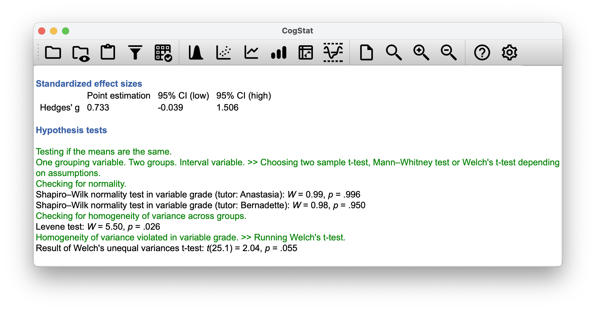
```

Note how the degree of freedom is now a decimal and not an integer. The data set however was just tweaked slightly, and not enough for the $p$ value to be low enough, so the Welch test is not significant. However, we just wanted to demonstrate that the Welch test is run in this case.

The assumptions of the Welch test are very similar to those made by the Student $t$-test, except that the Welch test does not assume homogeneity of variance. This leaves only the assumption of normality, and the assumption of independence. The specifics of these assumptions are the same for the Welch test as for the Student test.


## The paired-samples $t$-test{#pairedsamplesttest}

Regardless of whether we're talking about the Student test or the Welch test, an independent samples $t$-test is intended to be used in a situation where you have two samples that are, well, independent of one another. This situation arises naturally when participants are assigned randomly to one of two experimental conditions, but it provides a very poor approximation to other sorts of research designs. In particular, a repeated measures design -- in which each participant is measured (with respect to the same outcome variable) in both experimental conditions -- is not suited for analysis using independent samples $t$-tests.

For example, we might be interested in whether listening to music reduces people's working memory capacity. To that end, we could measure each person's working memory capacity in two conditions: with music, and without music. In an experimental design such as this one,^[This design is very similar to the one in Chapter \@ref(mcnemar) that motivated the McNemar test. This should be no surprise. Both are standard repeated measures designs involving two measurements. The only difference is that this time our outcome variable is interval scale (working memory capacity) rather than a binary, nominal scale variable (a yes-or-no question).] each participant appears in *both* groups. This requires us to approach the problem in a different way; by using the **paired samples $t$-test**. 

We'll use the data set this time from Dr Chico's class. In her class, students take two very challenging tests, one early in the semester and one later. Her theory is that the first test is a bit of a "wake-up call" for students: when they realise how hard her class really is, they'll work harder for the second test and get a better mark. Is she right? To test this, let's load the `chico.csv` file into CogStat.

The data frame `chico` contains three variables: an `id` nominal variable that identifies each student in the class, the `grade_test1` variable that records the student grade for the first test, and the `grade_test2` variable that has the grades for the second test. Let's take a quick look at the descriptive statistics. Since we are running a before and after test (like we already did in Chapter \@ref(mcnemar)), let's use the `Compare repeated measures variables` function.

```{r chico, fig.cap="CogStat descriptives and boxplot for the variables `grade_test1` and `grade_test2` in the Compare repeated measures variables function.", echo=FALSE, fig.align="center", out.width="100%", fig.show="hold"}
knitr::include_graphics(c("resources/image/cogstatchicodescr.png",
                          "resources/image/cogstatchicoboxplot.png"))
```

At a glance, it does seem like the class is a hard one (most grades are between 50 and 60), but it does look like there's an improvement from the first test to the second one.  We see that this impression seems to be supported. Across all 20 students, the mean grade for the first test is 56.98, but this rises to 58.38 for the second test. Although, given that the standard deviations are 6.45 and 6.24 respectively, it's starting to feel like maybe the improvement is just illusory; maybe just random variation. This impression is reinforced when you look at the means (i.e. horizontal blue line in the rectangle) and confidence intervals (i.e. the blue rectangles themselves) plotted in the boxplot. Looking at how wide those confidence intervals are, we'd be tempted to think that the apparent improvement in student performance is pure chance.

Nevertheless, this impression is wrong. To see why, take a look at the scatterplot of the grades for test 1 against the grades for test 2. Let us use CogStat's `Explore relation of variable pair` function, so we see a scatter plot with a linear regression line (shown in Figure \@ref(fig:pairedtb)).

```{r pairedtb, fig.cap="Scatterplot showing the individual grades for test 1 and test 2", echo=FALSE, fig.align="center", out.width="100%"}
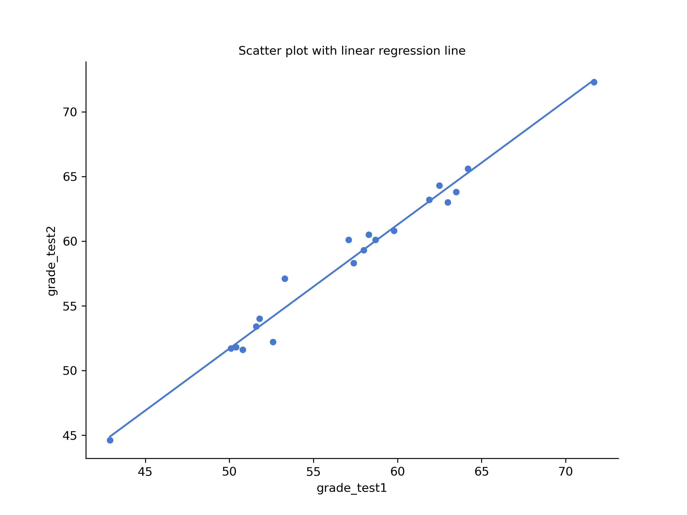
```

In this plot, each dot corresponds to the two grades for a given student: if their grade for test 1 ($x$ co-ordinate) equals their grade for test 2 ($y$ co-ordinate), then the dot falls on the line. Points falling above the line are the students that performed better on the second test. 

If we were to try to do an independent samples $t$-test, we would be conflating the **within subject** differences (which is what we're interested in testing) with the **between subject** variability (which we are not). 

The solution to the problem, mathematically speaking, is a *one-sample* $t$-test on the within-subject *difference* variable. To formalise this slightly, if $X_{i1}$ is the score that the $i$-th participant obtained on the first variable, and $X_{i2}$ is the score that the same person obtained on the second one, then the difference score is:
$$
D_{i} = X_{i1} - X_{i2}
$$

Notice that the difference scores is *variable 1 minus variable 2* and not the other way around, so if we want improvement to correspond to a positive valued difference, we actually want "test 2" to be our "variable 1". Equally, we would say that $\mu_D = \mu_1 - \mu_2$ is the population mean for this difference variable. So, to convert this to a hypothesis test, our null hypothesis is that this mean difference is zero; the alternative hypothesis is that it is not:
$$
\begin{array}{ll}
H_0: & \mu_D = 0  \\
H_1: & \mu_D \neq 0
\end{array}
$$
(this is assuming we're talking about a two-sided test here). This is more or less identical to the way we described the hypotheses for the one-sample $t$-test: the only difference is that the specific value that the null hypothesis predicts is 0. And so our $t$-statistic is defined in more or less the same way too. If we let $\bar{D}$ denote the mean of the difference scores, then 
$$
t = \frac{\bar{D}}{\mbox{SE}({\bar{D}})}
$$
which is 
$$
t = \frac{\bar{D}}{\hat\sigma_D / \sqrt{N}}
$$
where $\hat\sigma_D$ is the standard deviation of the difference scores. Since this is just an ordinary, one-sample $t$-test, with nothing special about it, the degrees of freedom are still $N-1$. And that's it: the paired samples $t$-test really isn't a new test at all: it's a one-sample $t$-test, but applied to the difference between two variables. It's actually very simple; the only reason it merits a discussion as long as this one, is that you need to be able to recognise *when* a paired samples test is appropriate, and to understand *why* it's better than an independent samples $t$ test.

Looking at the CogStat result set, the software automatically decided to run a paired $t$-test when we used the `Compare repeated measures variables` function:

```{=html}
<div style="margin: 0 0 1.275em; border: 1px solid #ddd; padding:.85em 1em;">
 <h4 style="font-size:medium; font-weight:600; color:#3960a5;">Population parameter estimations</h4>
 <p>Present confidence interval values suppose normality.</p>
  <table style="border: none; background-color: white;">
     <tr>
          <td style="border: 0px; background-color: white;"></td>
          <td style="border: 0px; background-color: white;">Point estimation</td>
          <td style="border: 0px; background-color: white;">95% CI (low)</td>
          <td style="border: 0px; background-color: white;">95% CI (high)</td>
     </tr>
     <tr>
          <td style="border: 0px; background-color: white;">grade_test1</td>
          <td style="border: 0px; background-color: white;">56.98</td>
          <td style="border: 0px; background-color: white;">53.88</td>
          <td style="border: 0px; background-color: white;">60.08</td>
     </tr>
     <tr>
          <td style="border: 0px; background-color: white;">grade_test2</td>
          <td style="border: 0px; background-color: white;">58.38</td>
          <td style="border: 0px; background-color: white;">55.39</td>
          <td style="border: 0px; background-color: white;">61.38</td>
     </tr>
  </table>
</div>
```

```{=html}
<div style="margin: 0 0 1.275em; border: 1px solid #ddd; padding:.85em 1em;">
     <p style="font-size:medium; font-weight:600; color:#3960a5;">Hypothesis tests</p>
     <p style="color:#008000;">Testing if the means are the same.<br />
     Two variables. Interval variables. &gt;&gt; Choosing paired t-test or paried Wilcoxon test depending on the assumptions.<br />
     Checking for normality.</p>
     <p style="color:black;">Shapiro-Wilk normality test in variable Difference of grade_test1 and grade_test2: <span style="font-style:italic;">W</span> = 0.97, <span style="font-style:italic;">p</span> = .678</p>
     <p style="color:#008000;">Normality is not violated. &gt;&gt; Running paired t-test.</p>
     <p style="color:black;">Sensitivity power analysis. Minimal effect size to reach 95% power with the present sample size for the present hypothesis test. Minimal effect size in d: 0.85. </p>
     <p style="color:black;">Result of paired samples t-test: <span style="font-style:italic;">t</span>(19) = -6.48, <span style="font-style:italic;">p</span> &lt; .001</p>
     <p style="color:black;">Result of the Bayesian two-samples t-test: BF<sub>10</sub> = 5991.58, BF<sub>01</sub> = 0.00</p>
</div>
```

From the population paramenter estimations, we know there's an average improvement of 1.4 from test 1 to test 2 ($58.38 - 56.98$), and this is significantly different from 0 ($t(19)=-6.48, p<.001$).

## Effect size (Cohen's $d$){#cohensd}

The most commonly used measure of effect size for a $t$-test is **Cohen's $d$** [@Cohen1988]. Cohen himself defined it primarily in the context of an independent samples $t$-test, specifically the Student test. In that context, a natural way of defining the effect size is to divide the difference between the means by an estimate of the standard deviation. In other words, we're looking to calculate *something* along the lines of this:
$$
d = \frac{\mbox{(mean 1)} - \mbox{(mean 2)}}{\mbox{std dev}}
$$
and he suggested a rough guide for interpreting $d$ in Table \@ref(tab:cohensdinterpretation). You'd think that this would be pretty unambiguous, but it's not; largely because Cohen wasn't too specific on what he thought should be used as the measure of the standard deviation. As discussed by @McGrath2006, there are several different versions in common usage, and each author tends to adopt slightly different notation. Cohen's $d$ is automatically produced as part of the output in CogStat whenever it makes sense.

```{r cohensdinterpretation, echo=FALSE, fig.align="center", out.width="100%"}
knitr::kable(tibble::tribble(
          ~V1,                    ~V2,
  "about 0.2",         "small effect",
  "about 0.5",      "moderate effect",
  "about 0.8",         "large effect"
  ), col.names = c("Cohen's $d$", "Interpretation")
  , caption = "A (very) rough guide to interpreting Cohen's $d$. Do not use these blindly. The $d$ statistic has a natural interpretation in and of itself: it redescribes the different in means as the number of standard deviations that separates those means. So it's generally a good idea to think about what that means in practical terms. In some contexts a \"small\" effect could be of big practical importance. In other situations a \"large\" effect may not be all that interesting.")
```

Let us go back to our examples and see how CogStat calculates effect sizes for us. 
- *One-sample $t$-test*: CogStat does not calculate Cohen's $d$ in the `Explore variable` function for our `zeppo.csv` data set.

Regarding the other tests, the sample's `Standardised effect sizes` will be shown right after the `Descriptives for the variables` subsection of the result set within the `Sample properties` section.

- *Independent samples $t$-test (Student's)*: CogStat calculates Cohen's $d$ in the `Compare groups` function for our `harpo.csv` data set. The result is $d=0.740$. CogStat also calculates Eta-squared ($0.120$), which is used for ANOVA, and we'll discuss it in Chapter \@ref(anova).
- *Independent samples $t$-test (Welch)*: CogStat calculates Cohen's $d$ in the `Compare groups` function for our `harpo_welch.csv` data set. The result is Cohen's $d=0.752$, eta-squared = $0.124$.
- *Paired samples $t$-test*: CogStat calculates Cohen's $d$ in the `Compare repeated measures variables` function for our `chico.csv` data set. The result is Cohen's $d=-0.216$, eta-squared = $0.012$.

## Normality of a sample{#shapiro}

All of the tests that we have discussed so far in this chapter have assumed that the data are normally distributed. This assumption is often quite reasonable because the central limit theorem (Section \@ref(clt)) does tend to ensure that many real-world quantities are normally distributed. Any time you suspect your variable is *actually* an average of lots of different things, there's a good chance that it will be normally distributed; or at least close enough to normal that you can get away with using $t$-tests. 

However, there are lots of ways in which you can end up with variables that are highly non-normal. For example, any time you think that your variable is actually the minimum of lots of different things, there's a very good chance it will end up quite skewed. In psychology, response time (RT) data is a good example of this. If you suppose that there are lots of things that could trigger a response from a human participant, then the actual response will occur the first time one of these trigger events occurs.^[This is a massive oversimplification.] This means that RT data are systematically non-normal.

How can we check the normality of a sample?

You might recall seeing this earlier in this chapter, but let's take another look at a histogram and QQ plot without going back to the beginning.

```{r zeppore, fig.cap="Left: a histogram of the data points (observations) in the `zeppo.csv` data set with a green dashed line showing the normal distribution curve. Right: a QQ plot of the same.", echo=FALSE, fig.align="center", out.width="100%"}

```

One way to check whether a sample violates the normality assumption is to draw a **"quantile-quantile" plot** (QQ plot). This allows you to visually check whether you see any systematic violations. In a QQ plot, each observation is plotted as a single dot. The x coordinate is the *theoretical quantile* that the observation should fall in if the data were normally distributed (with mean and variance estimated from the sample), and the y coordinate is the actual quantile of the data within the sample (i.e. *sample quantile*). If the data are normal, the dots should form a straight line, or rather, should fit onto the green line more-or-less seamlessly.

Now, let's see how the QQ plot would look like, if we had a data set that violates the assumption of normality. You can test for yourself on the `aflsmall` data set from earlier.

```{r aflsmallqq, fig.cap="Left: a histogram of the data points (observations) in the `aflsmall.csv` data set with a green dashed line showing the normal distribution curve. Right: a QQ plot of the same showing how the data points curve and don't form a stright line.", echo=FALSE, fig.align="center", out.width="100%"}
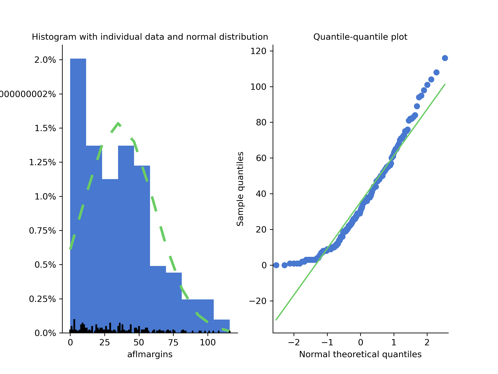
```

Although QQ plots provide a simple visual way to check the normality of your data informally, you'll want to do a formal test to prove it. The **Shapiro-Wilk test** [@Shapiro1965] is what you're looking for.^[The Kolmogorov-Smirnov test is probably more traditional than the Shapiro-Wilk, though mostly you'll encounter  Shapiro-Wilk in psychology research.]

As you'd expect, the null hypothesis being tested is that a set of $N$ observations is normally distributed. The test statistic it calculates is conventionally denoted as $W$, calculated as follows. First, we sort the observations in order of increasing size and let $X_1$ be the smallest value in the sample, $X_2$ be the second smallest and so on. Then the value of $W$ is given by
$$
W = \frac{ \left( \sum_{i = 1}^N a_i X_i \right)^2 }{ \sum_{i = 1}^N (X_i - \bar{X})^2}
$$
where $\bar{X}$ is the mean of the observations, and the $a_i$ values are something complicated beyond the scope of an introductory text.

Unlike most of the test statistics, if the $p$-value of a Shapiro-Wilk test is less than $0.05$, then you can conclude that the data are *not* normally distributed. If the $p$-value is greater than $0.05$, then you can conclude that the data are normally distributed.^[This is the opposite of what you'd expect from a $p$-value, but it's the way it is.]

The sampling distribution for $W$  -- which is not one of the standard ones discussed in Chapter \@ref(probability) -- depends on the sample size $N$. To give you a feel for what these sampling distributions look like, we've plotted three of them in Figure \@ref(fig:swdist). Notice that, as the sample size starts to get large, the sampling distribution becomes very tightly clumped up near $W=1$, and as a consequence, for larger samples, $W$ doesn't have to be much smaller than 1 for the test to be significant.

```{r swdist, fig.cap="Sampling distribution of the Shapiro-Wilk $W$ statistic, under the null hypothesis that the data are normally distributed, for samples of size 10, 20 and 50. Note that *small* values of $W$ indicate departure from normality.", echo=FALSE, fig.align="center", out.width="100%"}
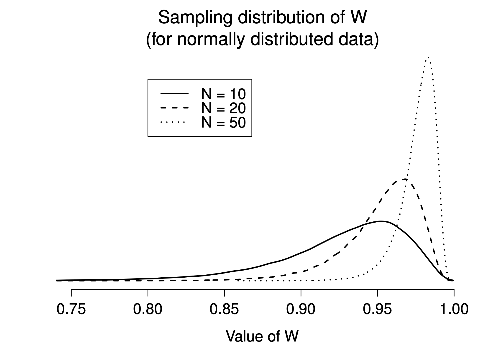
```

When reporting the results for a Shapiro-Wilk test, you should make sure to include the test statistic $W$ and the $p$ value, though given that the sampling distribution depends so heavily on $N$ it would probably be a politeness to include $N$ as well.

## Testing non-normal data with Wilcoxon tests{#wilcox}

Suppose your data is non-normal, but you still want to run something like a $t$-test. Remember our `aflsmall` data set which violates the assumption of normality. When exploring the variable, CogStat will state that `Normality is violated`. The statistics are also given: `Shapiro–Wilk normality test in variable aflmargins: W = 0.94, p < .001`.

This is the situation where you want to use Wilcoxon tests. Unlike the $t$-test, the Wilcoxon test doesn't assume normality. In fact, they don't make any assumptions about what kind of distribution is involved: in statistical jargon; this makes them **nonparametric tests**. While avoiding the normality assumption is nice, there's a drawback: the Wilcoxon test is usually less powerful than the $t$-test (i.e., higher Type II error rate).

Like the $t$-test, the Wilcoxon test comes in two forms, one-sample and two-sample, and they're used in more or less the exact same situations as the corresponding $t$-tests.

### Two-sample Wilcoxon test (Mann-Whitney test)

Let's start with the **two-sample Wilcoxon test**, also known as the **Mann-Whitney test**, since it's simpler than the one-sample version. 

Let us recall our AFL example with the data set called [`afl24.csv`](resources/data/afl24.csv)^[This example is not the same as in Danielle's original textbook designated for R.]. We want to see if there is any statistically significant difference in the `attendance` if the game is a final or not (boolean variable name: `isfinal`).

```{r mwafl24, echo=FALSE, fig.align="center", out.width="100%", fig.show="hold", fig.cap="AFL final and non-final attendance (`Compare groups` function used)."}
knitr::include_graphics(c(
     "resources/image/mannwhitneyafl24.png",
     "resources/image/mannwhitneyafl24box.png"
     ))
```

Once we ran the `Compare groups` function, the results are given.

Our sample size is $N=4096$ for non-final games, and $N=200$ for the final games. The Mann-Whitney test is a non-parametric test, so we don't need to worry about the normality assumption.

```{=html}
<div style="margin: 0 0 1.275em; border: 1px solid #ddd; padding:.85em 1em;">
     <p style="font-size:medium; font-weight:600; color:#3960a5;">Hypothesis tests</p>
     <p style="color:#008000;">Testing if the means are the same.<br />
     One grouping variable. Two groups. Interval variable. &gt;&gt; Choosing two sample t-test, Mann-Whitney test or Welch's t-test depending on assumptions.<br/>
     Checking for normality.</p>
     <p style="color:black;">Shapiro-Wilk normality test in variable attendance (isfinal: False): <span style="font-style:italic;">W</span> = 0.94, <span style="font-style:italic;">p</span> < .001</p>
     <p style="color:black;">Shapiro-Wilk normality test in variable attendance (isfinal: True): <span style="font-style:italic;">W</span> = 0.97, <span style="font-style:italic;">p</span> < .001</p>
     <p style="color:#008000;">Checking for homogeneity of variance across groups.</p>
     <p style="color:black;">Levene test: <span style="font-style:italic;">W</span> = 76.47, <span style="font-style:italic;">p</span> < .001</p>
     <p style="color:#008000;">Normality is violated in variable attendance, group(s) ('False',), ('True',). &gt;&gt; Running Mann-Whitney test.</p>
     <p style="color:black;">Result of independent samples Mann-Whitney rank test: <span style="font-style:italic;">U</span> = 97189.00 <span style="font-style:italic;">p</span> &lt; .001</p>
</div>
```

What does this score mean? Suppose we construct a table that compares every observation in group `isfinal:True` against every observation in group `isfinal:False`. Whenever the group `isfinal:True` attendance data is larger, we place a check mark in the table. We then count up the number of checkmarks. This is our test statistic, $W$.

But how do we interpret this data? Well, we already see from the chart in Figure \@ref(fig:mwafl24) that the median attendance for the final games is higher than the median attendance for the non-final games. Our $W$ statistic is also a positive number (from `isfinal:False` > `isfinal:True`), the $p$ value is below our $\alpha$ level of 0.05. This means that we can reject the null hypothesis that the two groups have the same median attendance. In other words, we can conclude that the final games have a statistically significantly higher attendance.

When quoting the Mann-Whitney test, you should report the $U$ statistic and the $p$ value.

### One-sample and paired samples Wilcoxon tests

What about the **one-sample Wilcoxon test**, or equivalently, the **paired samples Wilcoxon test**? Suppose we're interested in finding out whether taking a biology class has any effect on the happiness of students. The data is stored in the [`happiness.csv`](resources/data/happiness.csv) file^[Again, this is a modified data set, not included in Danielle's original].

What is measured here is the happiness of each student `before` taking the class and `after` taking the class. The `change` score is the difference between the two. There's no fundamental difference between doing a paired-samples test using `before` and `after`, versus doing a one-sample test using the `change` scores.

Let us run a paired sample Wilcoxon test first in CogStat. Let's use the `Compare repeat measures variables` function with the `before` and `after` variables.

```{r mwbeforeafter, echo=FALSE, fig.align="center", out.width="100%", fig.show="hold", fig.cap="Happiness before and after statistics class (`Compare repeat measures variables` function used)."}
knitr::include_graphics(c(
     "resources/image/cogstathappinessdescr.png",
     "resources/image/cogstathappinessbox.png"
     ))
```

Let's see the results:

```{=html}
<div style="margin: 0 0 1.275em; border: 1px solid #ddd; padding:.85em 1em;">
     <p style="font-size:medium; font-weight:600; color:#3960a5;">Hypothesis tests</p>
     <p style="color:#008000;">Testing if the means are the same.<br />
     Two variables. Interval variables. &gt;&gt; Choosing paired t-test or paired Wilcoxon test depending on the assumptions.<br/>
     Checking for normality.</p>
     <p style="color:black;">Shapiro-Wilk normality test in variable Difference of before and after: <span style="font-style:italic;">W</span> = 0.80, <span style="font-style:italic;">p</span> < .002</p>
     <p style="color:#008000;">Normality is violated in variable(s) Difference of before and after. &gt;&gt; Running paired Wilcoxon test.</p>
     <p style="color:black;">Result of Wilcoxon signed-rank test: <span style="font-style:italic;">T</span> = 31.00 <span style="font-style:italic;">p</span> = .031</p>
</div>
```

The $p$ value is 0.031, which is below our $\alpha$ level of 0.05. This means that we can reject the null hypothesis that the two groups have the same median happiness. In other words, we can conclude that taking the biology class has a statistically significantly negative effect on the happiness of students. Why negative? While the T value is positive, remember the rule, you have to plot your raw data and look at the descriptives as well, if something doesn't look right. And as you've seen, the median happiness score for the `before` group is higher than the median happiness score for the `after` group.

Now, you can make sure by running a one-sample Wilcoxon test in CogStat. Let's use the `Explore variable` function with the `change` variable. This will serve two purposes. You'll see how the one-sample Wilcoxon test works, and you'll also see how the one-sample and two-sample tests relate to each other.

You'll quickly see in the descriptives, that the Mean change is negative ($-9.6$) with a 95% confidence interval of $-18.7$ to #-0.4$ being both in the negative.

```{=html}
<div style="margin: 0 0 1.275em; border: 1px solid #ddd; padding:.85em 1em;">
     <p style="font-size:medium; font-weight:600; color:#3960a5;">Hypothesis tests</p>
     <p style="color:#008000;">Testing if mean deviates from the value 0.<br />
     Interval variable. &gt;&gt; Choosing one-sample t-test or Wilcoxon signed-rank test depending on the assumption.<br/>
     Checking for normality.</p>
     <p style="color:black;">Shapiro-Wilk normality test in variable change: <span style="font-style:italic;">W</span> = 0.81, <span style="font-style:italic;">p</span> < .002</p>
     <p style="color:#008000;">Normality is violated. &gt;&gt; Running Wilcoxon signed-rank test.</p>
     <p style="color:black;">Median: -5.5</p>
     <p style="color:black;">Result of Wilcoxon signed-rank test: <span style="font-style:italic;">T</span> = 31.50 <span style="font-style:italic;">p</span> = .035</p>
</div>
```

As this shows, we have a significant effect, and of the same size as the paired samples test. (Don't mind the rounding difference in the T value.)

## Summary

- A one-sample $t$-test is used to compare a single sample mean against a hypothesised value for the population mean. (Section \@ref(onesamplettest))
- An independent samples $t$-test is used to compare the means of two groups, and tests the null hypothesis that they have the same mean. It comes in two forms: the Student test (Section \@ref(studentttest) assumes that the groups have the same standard deviation, the Welch test (Section \@ref(welchttest)) does not.
- A paired samples $t$-test is used when you have two scores from each person, and you want to test the null hypothesis that the two scores have the same mean. It is equivalent to taking the difference between the two scores for each person, and then running a one-sample $t$-test on the difference scores. (Section \@ref(pairedsamplesttest))
- Effect size calculations for the difference between means can be calculated via the Cohen's $d$ statistic. (Section \@ref(cohensd)).
- You can check the normality of a sample using QQ plots and the Shapiro-Wilk test. (Section \@ref(shapiro))
- If your data are non-normal, you can use Wilcoxon and Mann-Whitney tests instead of $t$-tests. (Section \@ref(wilcox))
