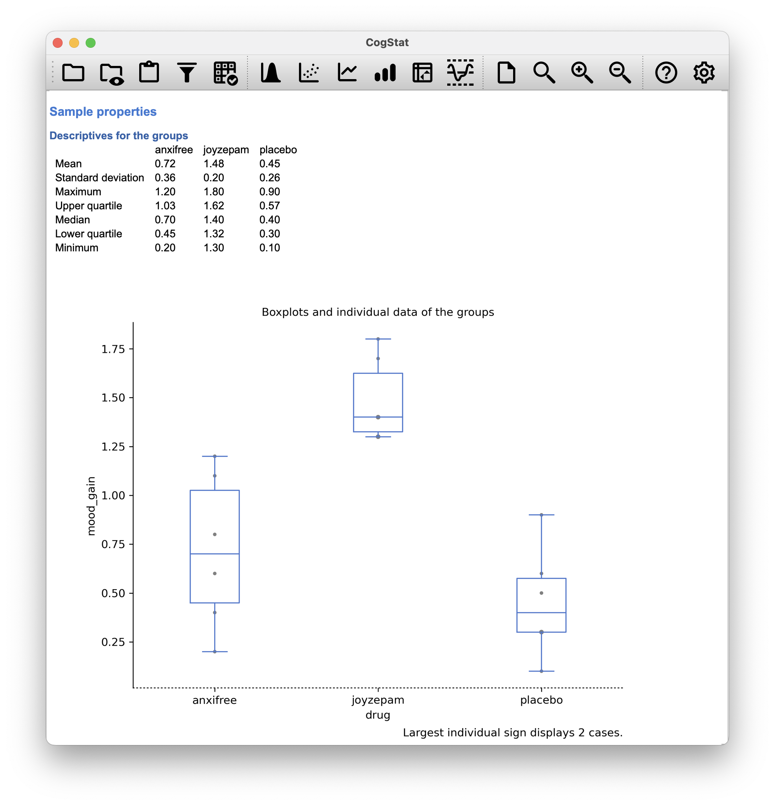
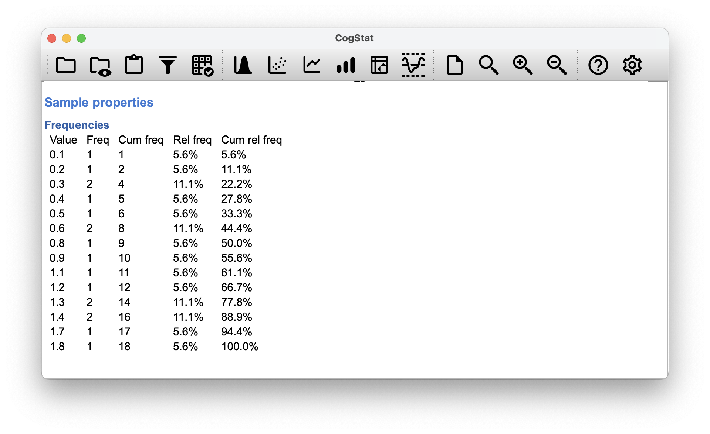

# Comparing several means (one-way ANOVA){#anova}

This chapter introduces one of the most widely used statistical tools known as "the analysis of variance", which is usually referred to as ANOVA. Sir Ronald Fisher developed the basic technique in the early 20th century, and it is to him that we owe the rather unfortunate terminology.

The term ANOVA is a little misleading in two respects. Firstly, although the technique's name refers to variances, ANOVA is concerned with investigating differences in means. Secondly, several different things out there are all referred to as ANOVAs, some of which have only a very tenuous connection to one another. Later in the book, we'll encounter various ANOVA methods that apply in quite different situations. Still, for this chapter, we'll only consider the simplest form of ANOVA, in which we have several different groups of observations. We're interested in finding out whether those groups differ in terms of some outcome variable of interest. This is the question that is addressed by a **one-way ANOVA**. 

After introducing the data, we'll describe the mechanics of the one-way ANOVA, how to calculate effect sizes and post hoc tests. We'll also talk about how to check for normality and homoscedasticity.

Now let's run a clinical trial!

## The data

Suppose you've become involved in a clinical trial in which you are testing a new antidepressant drug called *Joyzepam*. In order to construct a fair test of the drug's effectiveness, the study involves three different medications to be administered. One is a placebo, and the other is an existing antidepressant / anti-anxiety drug called *Anxifree*. A collection of 18 participants with moderate to severe depression are recruited for your initial testing. Because the drugs are sometimes administered in conjunction with psychological therapy, your study includes 9 people undergoing cognitive behavioural therapy (CBT) and 9 who are not. Participants are randomly assigned (doubly blinded, of course) a treatment, such that there are 3 CBT people and 3 no-therapy people assigned to each of the 3 drugs. A psychologist assesses the mood of each person after a 3 month run with each drug: and the overall *improvement* in each person's mood is assessed on a scale ranging from $-5$ to $+5$.

With that as the study design, let's load our data file: [`clinicaltrial.csv`](resources/data/clinicaltrial.csv). We have three variables: `drug`, `therapy` and `mood_gain`. Next, let's print the data frame to get a sense of what the data actually look like. 

For the purposes of this chapter, what we're really interested in is the effect of `drug` on `mood_gain`. The first thing to do is use the `Compare groups` function. (But don't jump ahead by adding both `drug` and `therapy` to the `Group(s)` box. That's going to be our factorial ANOVA in Chapter \@ref(anova2).)

```{r moodbydrug, echo=FALSE, fig.cap="Mood gain by drug", fig.align="center", fig.show="hold"}

```

The results are shown in the boxplot in Figure \@ref(fig:moodbydrug), which plots the average mood gain for all three conditions; error bars show 95\% confidence intervals. As the plot makes clear, there is a larger improvement in mood for participants in the Joyzepam group than for either the Anxifree group or the placebo group. The Anxifree group shows a larger mood gain than the control (i.e. placebo) group, but the difference isn't as large. 

The question that we want to answer is: are these difference "real", or are they just due to chance?

## How ANOVA works{#anovaintro}

In order to answer the question posed by our clinical trial data, we're going to run a one-way ANOVA. As usual, we're going to start by showing you how to do it the hard way to make sure you really understand how ANOVA works, but with CogStat, you'll never *ever* have do it this way.

The experimental design strongly suggests that we're interested in comparing the average mood change for the three different drugs. In that sense, we're talking about an analysis similar to the $t$-test (Chapter \@ref(ttest)), but involving more than two groups. If we let $\mu_P$ denote the population mean for the mood change induced by the placebo, and let $\mu_A$ and $\mu_J$ denote the corresponding means for our two drugs, Anxifree and Joyzepam, then the (somewhat pessimistic) null hypothesis that we want to test is that all three population means are identical: that is, *neither* of the two drugs is any more effective than a placebo.

Sidenote. This assumption of equal variances is Fisher's ANOVA. When we are explicitly not assuming equal variances, we should be using Welch's ANOVA, but that's covered in this book or in CogStat actually.

Back to our Fisher's one-way ANOVA. Mathematically, we write this null hypothesis like this:
$$
\begin{array}{rcl}
{H}_{0} &:& \mbox{it is true that } \mu_P = \mu_A = \mu_J
\end{array}
$$

As a consequence, our alternative hypothesis is that at least one of the three different treatments is different from the others. It's a little trickier to write this mathematically, because there are quite a few different ways in which the null hypothesis can be false. So for now we'll just write the alternative hypothesis like this:
$$
\begin{array}{rcl}
{H}_{1} &:& \mbox{it is *not* true that } \mu_P = \mu_A = \mu_J
\end{array}
$$

This null hypothesis is a lot trickier to test than any of the ones we've seen previously. How shall we do it? A sensible guess would be to "do an ANOVA", since that's the title of the chapter, but it's not particularly clear why an "analysis of *variances*" will help us learn anything useful about the *means*. In fact, this is one of the greatest conceptual difficulties that people have when first encountering ANOVA. To see how this works, let us talk about variances first.

### From variance...

We'll use $G$ to refer to the total number of groups. For our data set, there are three drugs, so there are $G=3$ groups. Next, we'll use $N$ to refer to the total sample size: there are a total of $N=18$ people in our data set. Similarly, let's use $N_k$ to denote the number of people in the $k$-th group. In our fake clinical trial, the sample size is $N_k = 6$ for all three groups.^[When all groups have the same number of observations, the experimental design is said to be "balanced". Balance isn't such a big deal for one-way ANOVA but becomes more important when you start doing more complicated ANOVAs.] Finally, we'll use $Y$ to denote the outcome variable (mood change). Specifically, we'll use $Y_{ik}$ to refer to the mood change experienced by the $i$-th member of the $k$-th group. Similarly, we'll use $\bar{Y}$ to be the average mood change, taken across all 18 people in the experiment, and $\bar{Y}_k$ to refer to the average mood change experienced by the 6 people in group $k$.  

Excellent. Now that we've got our notation sorted out, we can start writing down formulas. To start with, let's recall the formula for the variance that we used in Chapter \@ref(var), way back in those kinder days when we were just doing descriptive statistics. The sample variance of $Y$ is defined as follows:
$$
\mbox{Var}(Y) = \frac{1}{N} \sum_{k=1}^G \sum_{i=1}^{N_k} \left(Y_{ik} - \bar{Y} \right)^2
$$
This formula looks pretty much identical to the formula for the variance in Chapter \@ref(var). The only difference is that we are now summing over groups (i.e. values for $k$) and over the people within the groups (i.e. values for $i$).

Let's consider a simple table to see how this formula works on our clinical trial data set. The table below shows the person, the drug they were given, and their mood change. 

```{r moodtable, echo=FALSE, fig.align="center", fig.show="hold"}
library(kableExtra)
knitr::kable(
    rbind(
          c(1, "placebo", 1, 0.5)
        , c(2, "placebo", 2, 0.3)
        , c(3, "placebo", 3, 0.1)
        , c(4, "anxifree", 1, 0.6)
        , c(5, "anxifree", 2, 0.4)
        , c(6, "...", "...", "...")
    ),
    col.names = c(" ", "$k$",
                "$i$", "$Y_{ik}$"),
    align = "llcc",
    booktabs = TRUE, escape = FALSE
) %>%
  add_header_above(c("Row" = 1, "Drug group" = 1,
                     "Index in group" = 1,
                     "Mood change" = 1)) %>%
    kable_styling(position = "center", latex_options = "hold_position")
```

Our average mood change is the mean of all the mood changes in the data set (which you can see if you run `Explore variable` for `mood_gain`), which is $\bar{Y} = 0.88$. The variance of the mood changes is the sum of the squared differences between each mood change and the average mood change, divided by the total number of observations. So our formula filled in would look like this:

$$
\begin{array}{ll}
{Var}(Y) =& \frac{1}{18} ( (0.5 - 0.88 )^2 + (0.3 -0.88 )^2 + (0.1 - 0.88 )^2 + \\
 & (0.6 - 0.88 )^2 + (0.4 - 0.88 )^2 + (0.2 - 0.88 )^2 + (1.4 - 0.88 )^2 + \\
 & (1.7 - 0.88 )^2 + (1.3 - 0.88 )^2 + (0.6 - 0.88 )^2 + (0.9 - 0.88 )^2 + \\
 & (0.3 - 0.88 )^2 + (1.1 - 0.88 )^2 + (0.8 - 0.88 )^2 + (1.2 - 0.88 )^2 + \\
 & (1.8 - 0.88 )^2 + (1.3 - 0.88 )^2 + (1.4 - 0.88 )^2 )
\end{array}
$$

$$
\mbox{Var}(Y) = 0.269
$$

Fortunately, we don't have to do these manually.^[You went into Excel and did it manually, and got the same answer, great! No, you used the `VAR.P` function and got the same answer. Great! Wait, you used the `VAR.S` and got $0.285$? Something's not right. You went to jamovi or JASP or SPSS (because you're fancy) and got $0.285$. What happened? There is a difference between population variance and estimated variance. The population variance is the variance of the population based on the fact you know all members of the population -- which is the case in our example, as we need the population variance of our trial, not the population to which the trial results will extend to. The estimated variance is always going to be a little bit bigger than the population variance, because it's an estimate, and uses a slightly different formula. Namely, it multiplies by $\frac{1}{N-1}$, not $\frac{1}{N}$.]

### ... to total sum of squares

Okay, now that we've got a good grasp on how the population variance is calculated, let's define something called the **total sum of squares**, which is denoted $\mbox{SS}_{tot}$. This is very simple: instead of averaging the squared deviations, which is what we do when calculating the variance, we just add them up. So the formula for the total sum of squares is almost identical to the formula for the variance:
$$
\mbox{SS}_{tot} = \sum_{k=1}^G \sum_{i=1}^{N_k} \left(Y_{ik} - \bar{Y} \right)^2
$$ 
When we talk about analysing variances in the context of ANOVA, what we're really doing is working with the total sums of squares rather than the actual variance. One very nice thing about the total sum of squares is that we can break it up into two different kinds of variation. Firstly, we can talk about the **within-group sum of squares**, in which we look to see how different each individual person is from their own group mean:
$$
\mbox{SS}_w = \sum_{k=1}^G \sum_{i=1}^{N_k} \left( Y_{ik} - \bar{Y}_k \right)^2
$$
where $\bar{Y}_k$ is a group mean.

In our example, $\bar{Y}_k$ would be the average mood change experienced by those people given  the $k$-th drug. So, instead of comparing individuals to the average of *all* people in the experiment, we're only comparing them to those people in the same group. As a consequence, you'd expect the value of $\mbox{SS}_w$ to be smaller than the total sum of squares, because it's completely ignoring any group differences -- that is, the fact that the drugs (if they work) will have different effects on people's moods.

Next, we can define a third notion of variation which captures *only* the differences *between groups*. We do this by looking at the differences between the group means $\bar{Y}_k$ and grand mean $\bar{Y}$. In order to quantify the extent of this variation, what we do is calculate the **between-group sum of squares**:
$$
\begin{array}{rcl}
\mbox{SS}_{b} &=& \sum_{k=1}^G \sum_{i=1}^{N_k} \left( \bar{Y}_k - \bar{Y} \right)^2
 \\
&=& \sum_{k=1}^G N_k \left( \bar{Y}_k - \bar{Y} \right)^2
\end{array}
$$

It's not too difficult to show that the total variation among people in the experiment $\mbox{SS}_{tot}$ is actually the sum of the differences between the groups $\mbox{SS}_b$ and the variation inside the groups $\mbox{SS}_w$. That is:
$$
\mbox{SS}_w  + \mbox{SS}_{b} = \mbox{SS}_{tot}
$$

Yay.

(ref:anovavaracap) Graphical illustration of "between-groups" variation

```{r anovavara, fig.cap=paste("(ref:anovavaracap)"), echo=FALSE, fig.align="center"}
	width <- 7
	height <- 4
	# params
	mu <- c(-4, -.25, 3.5)
	sig <- 2

	# data
	x <- seq(-3,3,.1)
	x1 <- x*sig + mu[1]
	x2 <- x*sig + mu[2]
	x3 <- x*sig + mu[3]
	y1 <- dnorm( x1, mu[1], sig )
	y2 <- dnorm( x2, mu[2], sig )
	y3 <- dnorm( x3, mu[3], sig )

	# set up window
	plot.new() # create graphics device
	plot.window(xlim = c(-10,10), ylim = c(0,.25)) # define plot area
	axis(side = 1, # axis located below
	     col = "gray20",  # coloured gray
	     at = c(-10,mu,10), # tick marks located at
	     labels = c("","group 1","group 2","group 3","")
	)  

	# plot densities
	lines(x1,y1, type = "l", col = "gray20")
	lines(x2,y2, type = "l", col = "gray20")
	lines(x3,y3, type = "l", col = "gray20")

	# arrows
	arrows(
	  mu[1],.15, # from
	  mu[2],.15, # to
	  code = 3,  # arrows on both ends
	  lwd = 2,   # thick line
	)

	arrows(
	  mu[2],.125, # from
	  mu[3],.125, # to
	  code = 3,  # arrows on both ends
	  lwd = 2,   # thick line
	)

	arrows(
	  mu[1],.1, # from
	  mu[3],.1, # to
	  code = 3,  # arrows on both ends
	  lwd = 2,   # thick line
	)

	# title 
	title(main = "Between-group variation\n(i.e., differences among group means)",
	      font.main = 1)
```

(ref:anovavarbcap) Graphical illustration of "within groups" variation

```{r anovavarb, fig.cap=paste("(ref:anovavarbcap)"), echo=FALSE, fig.align="center"}
width <- 7
	height <- 4

		# params
	mu <- c(-4, -.25, 3.5)
	sig <- 2

	# data
	x <- seq(-3,3,.1)
	x1 <- x*sig + mu[1]
	x2 <- x*sig + mu[2]
	x3 <- x*sig + mu[3]
	y1 <- dnorm( x1, mu[1], sig )
	y2 <- dnorm( x2, mu[2], sig )
	y3 <- dnorm( x3, mu[3], sig )

	# set up window
	plot.new() # create graphics device
	plot.window(xlim = c(-10,10), ylim = c(0,.25)) # define plot area
	axis(side = 1, # axis located below
	     col = "gray20",  # coloured gray
	     at = c(-10,mu,10), # tick marks located at
	     labels = c("","group 1","group 2","group 3","")
	)  

	# plot densities
	lines(x1,y1, type = "l", col = "gray20")
	lines(x2,y2, type = "l", col = "gray20")
	lines(x3,y3, type = "l", col = "gray20")

	# arrows
	x <- 1.5
	y <- .135
	for (i in 1:3) {
	  arrows(
	    mu[i]-x,y, # from
	    mu[i]+x,y, # to
	    code = 3,  # arrows on both ends
	    lwd = 2,   # thick line
	  )  }
```

Okay, so what have we found out?

We've discovered that the total variability associated with the outcome variable ($\mbox{SS}_ {tot}$) can be mathematically carved up into the sum of "the variation due to the differences in the sample means for the different groups" ($\mbox{SS}_ {b}$) plus "all the rest of the variation" ($\mbox{SS}_ {w}$).

Let's apply the formulas to our clinical trial example, and see what we get. We won't bother with the calculations in details, because the formula is given, and CogStat will not bore you with these either.

$$
\begin{array}{rcl}
\mbox{SS}_w &=& \sum_{k=1}^G \sum_{i=1}^{N_k} \left( Y_{ik} - \bar{Y}_k \right)^2
    \\
        &=& 1.3917
\end{array}
$$

$$
\begin{array}{rcl}
\mbox{SS}_b &=& \sum_{k=1}^G N_k \left( \bar{Y}_k - \bar{Y} \right)^2
    \\
        &=& 3.4533
\end{array}
$$

How does that help me find out whether the groups have different population means? If the null hypothesis is true, then you'd expect all the sample means to be pretty similar to each other, right? And that would imply that you'd expect $\mbox{SS}_ {b}$ to be really small, or at least you'd expect it to be a lot smaller than the "the variation associated with everything else", $\mbox{SS}_{w}$.

So, let's do a hypothesis test to validate.

### From sums of squares to the $F$-test

As we saw in the last section, the *qualitative* idea behind ANOVA is to compare the two sums of squares values $\mbox{SS}_ b$ and $\mbox{SS}_ w$ to each other: if the between-group variation $\mbox{SS}_ b$ is large relative to the within-group variation $\mbox{SS}_ w$, then we have reason to suspect that the population means for the different groups aren't identical to each other. 

Our test statistic is called an **$F$-ratio**. It's defined as the ratio of the between-group variation to the within-group variation.

In order to convert our SS values into an $F$-ratio, the first thing we need to calculate is the **degrees of freedom** associated with the SS$_b$ and SS$_w$ values. As usual, the degrees of freedom corresponds to the number of unique "data points" that contribute to a particular calculation, minus the number of "constraints" that they need to satisfy.

For the within-groups variability, what we're calculating is the variation of the individual observations ($N$ data points) around the group means ($G$ constraints). In contrast, for the between-groups variability, we're interested in the variation of the group means ($G$ data points) around the grand mean (1 constraint). Therefore, the degrees of freedom here are:
$$
\begin{array}{lcl}
\mbox{df}_b &=& G-1 \\
\mbox{df}_w &=& N-G \\
\end{array}
$$

What we do next is convert our summed squares value into a "mean squares" value, which we do by dividing by the degrees of freedom:
$$
\begin{array}{lcl}
\mbox{MS}_b &=& \displaystyle\frac{\mbox{SS}_b }{ \mbox{df}_b} \\
\mbox{MS}_w &=& \displaystyle\frac{\mbox{SS}_w }{ \mbox{df}_w} 
\end{array}
$$

Finally, we calculate the $F$-ratio by dividing the between-groups MS by the within-groups MS:
$$
F = \frac{\mbox{MS}_b }{ \mbox{MS}_w } 
$$

At a very general level, the intuition behind the $F$ statistic is straightforward: bigger values of $F$ means that the between-groups variation is large, relative to the within-groups variation. As a consequence, the larger the value of $F$, the more evidence we have against the null hypothesis. (To read more on how large does $F$ have to be to reject the null hypothesis, see the next chapter.)

In order to complete our hypothesis test, we need to know the sampling distribution for $F$ if the null hypothesis is true. Not surprisingly, the sampling distribution for the $F$ *statistic* under the null hypothesis is an $F$ *distribution*. As seen in Chapter \@ref(probability), the $F$ distribution has two parameters, corresponding to the two degrees of freedom involved: the first one df$_1$ is the between-groups degrees of freedom df$_b$, and the second one df$_2$ is the within-groups degrees of freedom df$_w$.

A summary of all the key quantities involved in a one-way ANOVA, including the formulas showing how they are calculated, is shown in Table \@ref(tab:anovatable). 

```{r anovatable, echo=FALSE, fig.align="center"}
knitr::kable(t(cbind(
    c("Degrees of freedom", "$\\mbox{df}_b = G-1$", "$\\mbox{df}_w = N-G$"),
    c("Sum of squares", 
      "SS$_b = \\displaystyle\\sum_{k=1}^G N_k (\\bar{Y}_k - \\bar{Y})^2$", 
      "SS$_w = \\sum_{k=1}^G \\sum_{i = 1}^{N_k} ( {Y}_{ik} - \\bar{Y}_k)^2$"),
    c("Mean squares", "$\\mbox{MS}_b = \\frac{\\mbox{SS}_b}{\\mbox{df}_b}$",
      "$\\mbox{MS}_w =  \\frac{\\mbox{SS}_w}{\\mbox{df}_w}$"),
    c("$F$ statistic", "$F = \\frac{\\mbox{MS}_b }{ \\mbox{MS}_w }$", "-"),
    c("$p$ value", "[complicated]", "-")
)), col.names = c("", "Between groups", "Within groups"),
  caption = "All of the key quantities involved in an ANOVA, 
  organised into a “standard” ANOVA table. 
  The formulas for all quantities (except the $p$-value, 
  which has a very ugly formula and would be nightmarishly 
  hard to calculate without a computer) are shown.",
  booktabs = TRUE, escape = FALSE, format = "markdown")
```

Now let's calculate these for our clinical trial example, again, behind the scenes. Let's start with the degrees of freedom.

$$
\begin{array}{lcl}
\mbox{df}_b &=& G-1
    \\
    &=& 3-1
    \\
    &=& 2 \\
\mbox{df}_w &=& N-G
    \\
    &=& 18-3
    \\
    &=& 15
\end{array}
$$

Now that that's done, we can calculate the mean squares values.

$$
\begin{array}{lcl}
\mbox{MS}_b &=& \displaystyle\frac{\mbox{SS}_b }{ \mbox{df}_b} 
    \\
    &=& \displaystyle\frac{3.4533}{2}
    \\
    &=& 1.7267 \\
\mbox{MS}_w &=& \displaystyle\frac{\mbox{SS}_w }{ \mbox{df}_w}
    \\
    &=& \displaystyle\frac{1.3917}{15}
    \\
    &=& 0.0928
\end{array}
$$

Finally, we can calculate the $F$-ratio.

$$
F = \frac{\mbox{MS}_b }{ \mbox{MS}_w } 
    \\
    = \frac{1.7267}{0.0928}
    \\
    = 18.6067
$$


### Further reading: the meaning of $F$ (advanced){#anovamodel}

At a fundamental level, ANOVA is a competition between two different statistical models, $H_0$ and $H_1$. If you recall, our null hypothesis was that all of the group means are identical to one another. If so, then a natural way to think about the outcome variable $Y_{ik}$ is to describe individual scores in terms of a single population mean $\mu$, plus the deviation from that population mean. This deviation is usually denoted $\epsilon_{ik}$ and is traditionally called the *error* or **residual** associated with that observation. Be careful though: just like we saw with the word "significant", the word "error" has a technical meaning in statistics that isn't quite the same as its everyday English definition. The word "residual" is a better term than the word "error". In statistics, both words mean "leftover variability": that is, "stuff" that the model can't explain.

In any case, here's what the null hypothesis looks like when we write it as a statistical model:
$$
Y_{ik} = \mu + \epsilon_{ik}
$$
where we make the *assumption* that the residual values $\epsilon_{ik}$ are normally distributed, with mean 0 and a standard deviation $\sigma$ that is the same for all groups. To use the notation that we introduced in Chapter \@ref(probability) we would write this assumption like this:
$$
\epsilon_{ik} \sim \mbox{Normal}(0, \sigma^2)
$$

What about the alternative hypothesis, $H_1$? The only difference between the null hypothesis and the alternative hypothesis is that we allow each group to have a different population mean. So, if we let $\mu_k$ denote the population mean for the $k$-th group in our experiment, then the statistical model corresponding to $H_1$ is:
$$
Y_{ik} = \mu_k + \epsilon_{ik}
$$
where, once again, we assume that the error terms are normally distributed with mean 0 and standard deviation $\sigma$. That is, the alternative hypothesis also assumes that 
$$
\epsilon \sim \mbox{Normal}(0, \sigma^2)
$$

Okay, now that we've described the statistical models underpinning $H_0$ and $H_1$ in more detail, it's now pretty straightforward to say what the mean square values are measuring and what this means for the interpretation of $F$.

It turns out that the within-groups mean square, MS$_w$, can be viewed as an estimator (in the technical sense: Chapter \@ref(estimation)) of the error variance $\sigma^2$. The between-groups mean square MS$_b$ is also an estimator; but what it estimates is the error variance *plus* a quantity that depends on the true differences among the group means. If we call this quantity $Q$, then we can see that the $F$-statistic is basically
$$
F = \frac{\hat{Q} + \hat\sigma^2}{\hat\sigma^2}
$$
where the true value $Q=0$ if the null hypothesis is true, and $Q > 0$ if the alternative hypothesis is true [e.g. ch. 10 @Hays1994]. Therefore, at a bare minimum *the $F$ value must be larger than 1* to have any chance of rejecting the null hypothesis. Note that this *doesn't* mean that it's impossible to get an $F$-value less than 1. What it means is that, if the null hypothesis is true the sampling distribution of the $F$ ratio has a mean of 1,^[Or, more accurately, $1 + \frac{2}{df_2 - 2}$.] and so we need to see $F$-values larger than 1 in order to safely reject the null.

To be a bit more precise about the sampling distribution, notice that if the null hypothesis is true, both MS$_b$ and MS$_w$ are estimators of the variance of the residuals $\epsilon_{ik}$. If those residuals are normally distributed, then you might suspect that the estimate of the variance of $\epsilon_{ik}$ is chi-square distributed. Because (as discussed in Chapter \@ref(otherdists)) that's what a chi-square distribution *is*: it's what you get when you square a bunch of normally-distributed things and add them up. And since the $F$ distribution is (again, by definition) what you get when you take the ratio between two things that are $\chi^2$ distributed, we have our sampling distribution.

## Interpreting our results in CogStat{#introduceaov}

You already know the answers because we calculated it step by step, but you have a more in-depth understanding of how it all ties together. CogStat will do all of this for you, but it's good to know what's going on behind the scenes. Let's see how CogStat interprets our data.

So what we had to do, was simply run the `Compare groups` function with `mood_gain` by `drug`.

(ref:cogcompbydrugdialogcap) CogStat dialogue for `Compare groups` function with our clinical trial data set with variables `mood_gain` grouped by `drug`.

```{r cogcompbydrugdialog, echo=FALSE, fig.align="center", fig.show="hold", fig.cap=paste("(ref:cogcompbydrugdialogcap)")}
knitr::include_graphics(c(
    "resources/image/comparegroupsbydrug.png"))
```

(ref:cogcompbydrugdescrcap) CogStat result set displaying descriptives and boxplots as a result of `Compare groups` function with our clinical trial data set with variables `mood_gain` grouped by `drug`.

```{r cogcompbydrugdescr, echo=FALSE, fig.align="center", fig.show="hold", fig.cap=paste("(ref:cogcompbydrugdescrcap)")}
knitr::include_graphics(c(
    "resources/image/moodbydrug.png"))
```

(ref:cogcompbydrugcap) CogStat result set with hypothesis test results, effect size and post hoc results after running `Compare groups` function with our clinical trial data set with variables `mood_gain` grouped by `drug`.

```{r cogcompbydrug, echo=FALSE, fig.align="center", fig.show="hold", fig.cap=paste("(ref:cogcompbydrugcap)")}
knitr::include_graphics(c(
    "resources/image/moodbydrughypo.png"))
```

We've seen this before. Let us explore the hypothesis test results.

```{r, eval=knitr::is_html_output(), echo=FALSE}
htmltools::includeHTML("resources/html/hyp9.html")
```

```{r, echo=FALSE}
if (knitr::is_latex_output()) {
  knitr::asis_output(
      xfun::file_string("resources/html/hyp9.txt")
  )
}
```

For now, let's stop here. We'll come back to the post hoc tests later. For now, let's just focus on the hypothesis test results. We can see that the Shapiro-Wilk normality test was run on each of the groups. Testing the normality assumption is relatively straightforward. We covered the theory behind it in Chapter \@ref(shapiro). The Levene test was run to check for homogeneity of variance across groups. The one-way ANOVA was run, and the result was that the $F$-value was 18.61, and the $p$-value was less than 0.001.

At this point, we're basically done. (If you ran the test with us, you've seen something about post hoc tests. We will discuss them later.) Having completed our calculations, it's traditional to organise all these numbers into an ANOVA table like the one in Table \@ref(tab:anovatableresults). For our clinical trial data, the ANOVA table would look like this:

```{r anovatableresults, echo=FALSE, fig.align="center"}
knitr::kable(
    rbind(
        c("between groups", 2, 3.4533, 1.7267, 18.61, "< .001"),
        c("within groups", 15, 1.3917, 0.0928, "--", "--")
    ),
    col.names = c("", "df", "Sum of squares",
            "Mean squares", "$F$-statistic", "$p$-value"),
    caption = "ANOVA table for the `mood_gain` by `drug` variable",
    booktabs = TRUE, escape = FALSE, format = "markdown"
)
```

CogStat doesn't produce this table for you or give the sums of squares or mean squares. But actually, you don't need it to understand what the statistic tells you. There's almost never a good reason to include the whole table in your write-up, but you might see it in other statistical software.

A pretty standard way of reporting this result would be to write something like this:

> One-way ANOVA showed a significant effect of drug on mood gain (*F*(2,15) = 18.61, *p* < .001).

Sigh. So much work for one short sentence (if you do it manually).

## Effect size{#anovaeffect}

There's a few different ways you could measure the effect size in an ANOVA.

### Eta-squared

One of the most commonly used measures are $\eta^2$ (**eta-squared**). The definition of $\eta^2$ is actually really simple:
$$
\eta^2 = \frac{\mbox{SS}_b}{\mbox{SS}_{tot}}
$$

That's all it is. So when looking at the ANOVA table above, we see that $\mbox{SS}_b = 3.45$  and $\mbox{SS}_{tot} = 3.45 + 1.39 = 4.84$. Thus we get an $\eta^2$ value of 
$$
\eta^2 = \frac{3.45}{4.84} = 0.71
$$

The interpretation of $\eta^2$ is equally straightforward: it refers to the proportion of the variability in the outcome variable (`mood_gain`) that can be explained in terms of the predictor (`drug`). A value of $\eta^2 = 0$ means that there is no relationship at all between the two, whereas a value of $\eta^2 = 1$ means that the relationship is perfect. Better yet, the $\eta^2$ value is very closely related to a squared correlation (i.e. $r^2$). So, if you're trying to figure out whether a particular value of $\eta^2$ is big or small, it's sometimes useful to remember that 
$$
\eta= \sqrt{\frac{\mbox{SS}_b}{\mbox{SS}_{tot}}}
$$
can be interpreted as if it referred to the *magnitude* of a Pearson correlation. So in our drugs example, the $\eta^2$ value of 0.71 corresponds to an $\eta$ value of $\sqrt{.71} = .84$. If we think about this as being equivalent to a correlation of about .84, we'd conclude that the relationship between `drug` and `mood.gain` is strong.

### Omega-squared

There's an interesting blog post^[http://daniellakens.blogspot.com.au/2015/06/why-you-should-use-omega-squared.html] by Daniel Lakens suggesting that eta-squared itself is perhaps not the best measure of effect size in real world data analysis, but rather **omega-squared** ($\omega^2$) is. CogStat also opts for omega-squared as the default measure of effect size in one-way ANOVA.

The formula for $\omega^2$ is a little more complicated than for $\eta^2$, because it takes into account the degrees of freedom of the two sums of squares. The formula is specific for between-subjects, fixed effects designs. The formula is:

$$
\omega^2 = \frac{\mbox{SS}_b - \mbox{df}_b \times \mbox{MS}_w}{\mbox{SS}_{tot} + \mbox{MS}_w}
$$
where $\mbox{df}_b$ is the degrees of freedom for the between-subjects factor, and $\mbox{MS}_w$ is the mean square for the within-subjects factor, $\mbox{SS}_{tot}$ is the total sum of squares, and $\mbox{SS}_b$ is the between-subjects sum of squares. Filled in, we get:

$$
\begin{array}{rcl}
\omega^2 &=& \frac{\mbox{SS}_b - \mbox{df}_b \times \mbox{MS}_w}{\mbox{SS}_{tot} + \mbox{MS}_w}
    \\
    &=& \frac{3.4533 - 2 \times 0.0928}{4.845 + 0.0928}
    \\
    &=& 0.662
\end{array}
$$

CogStat will give you this exact omega-squared value when running the one-way ANOVA inside the `Compare groups` function (see result set in Figure \@ref(fig:cogcompbydrug)).

$\omega^2$ will take on values between $0$ and $1$, where 0 indicates there is no effect whatsoever. It is wise to quote the effect size when writing up our results in APA-styled psychology research^[https://apastyle.apa.org/instructional-aids/numbers-statistics-guide.pdf]. For example, we could write:

> One-way ANOVA showed a significant effect of drug on mood gain (*F*(2,15) = 18.61, p < .001, $\omega^2$ = 0.662).


## Post hoc tests{#posthoc}

Any time you run an ANOVA with more than two groups, and you end up with a significant effect, the first thing you'll probably want to ask is which groups are actually different from one another.

In our drugs example, our null hypothesis was that all three drugs (placebo, Anxifree and Joyzepam) have the exact same effect on mood. But if you think about it, the null hypothesis is actually claiming *three* different things all at once here. Specifically, it claims that:

- Your competitor's drug (Anxifree) is no better than a placebo (i.e., $\mu_A = \mu_P$)
- Your drug (Joyzepam) is no better than a placebo (i.e., $\mu_J = \mu_P$)
- Anxifree and Joyzepam are equally effective (i.e., $\mu_J = \mu_A$)

If any one of those three claims is false, then the null hypothesis is also false. So, now that we've rejected our null hypothesis, we're thinking that *at least* one of those things isn't true. But which ones? All three of these propositions are of interest: you certainly want to know if your new drug Joyzepam is better than a placebo, and it would be nice to know how well it stacks up against an existing commercial alternative (i.e., Anxifree). It would even be useful to check the performance of Anxifree against the placebo: even if Anxifree has already been extensively tested against placebos by other researchers, it can still be very useful to check that your study is producing similar results to earlier work.

When we characterise the null hypothesis in terms of these three distinct propositions, it becomes clear that there are eight possible "states of the world" that we need to distinguish between:

```{r echo=FALSE, fig.align="center"}
knitr::kable(
    cbind(
        c("1", "2", "3", "4", "5", "6", "7", "8"),
        c("$\\checkmark$", "$\\checkmark$", "$\\checkmark$", "$\\checkmark$",
             "", "", "", ""),
        c("$\\checkmark$", "$\\checkmark$", "", "", 
            "$\\checkmark$", "$\\checkmark$", "", ""),
        c("$\\checkmark$", "", "$\\checkmark$", "", 
            "$\\checkmark$", "", "$\\checkmark$", ""),
        c("null", "alternative", "alternative", "alternative",
             "alternative", "alternative", "alternative", "alternative")
    ),
    col.names = c("possibility:", "is $\\mu_P = \\mu_A$?", 
        "is $\\mu_P = \\mu_J$?", "is $\\mu_A = \\mu_J$?", "which hypothesis?"),
        booktabs = TRUE, escape = FALSE, format = "markdown"
)
```

By rejecting the null hypothesis, we've decided that we *don't* believe that \#1 is the true state of the world. The next question to ask is, which of the other seven possibilities *do* we think is right? When faced with this situation, it usually helps to look at the data. For instance, if we look at the plots in Figure \@ref(fig:moodbydrug), it's tempting to conclude that Joyzepam is better than the placebo and better than Anxifree, but there's no real difference between Anxifree and the placebo. However, if we want to get a clearer answer about this, it might help to run some tests.

There are actually quite a lot of different methods for performing multiple comparisons in the statistics literature [@Hsu1996], and it would be beyond the scope of an introductory text like this one to discuss all of them in any detail. That being said, there's one tool of importance, namely Tukey's "Honestly Significant Difference", or **Tukey's HSD** for short. While there is the possibility to run "pairwise" $t$-tests manually, or in other statistical software, CogStat opts for Tukey's HSD test as a robust tool for running post hoc tests.

The basic idea of Tukey's HSD is to examine all relevant pairwise comparisons between groups, and it's only really appropriate to use Tukey's HSD if it is *pairwise* differences that you're interested in. If, for instance, you actually would find yourself interested to know if Group A is significantly different from the mean of Group B and Group C, then you need to use a different tool (e.g., Scheffe's method, which is more conservative, and beyond the scope this book).

Tukey's HSD constructs **simultaneous confidence intervals** for all the comparisons. What we mean by 95\% "simultaneous" confidence interval is that there is a 95\% probability that *all* of these confidence intervals contain the relevant true value. Moreover, we can use these confidence intervals to calculate an adjusted $p$ value for any specific comparison.

Let's look at the post hoc test result coming from CogStat, as seen in Figure \@ref(fig:cogcompbydrug).

```{r echo=FALSE, fig.align="center"}
knitr::kable(
    cbind(
        c("anxifree", "anxifree", "joyzepam"),
        c("joyzepam", "placebo", "placebo"),
        c(0.7667, -0.2667, -1.0333),
        c(0.0015, 0.3115, "0.0001"),
        c(0.3099, -0.7235, -1.4901),
        c(1.2235, 0.1901, -0.5765),
        c("True", "False", "True")
    ),
    col.names = c("group1", "group2", "meandiff", "p-adj",
            "lower", "upper", "reject"),
    align = c("llccccc"),
    caption = "Multiple Comparison of Means - Tukey HSD, FWER=0.05",
    booktabs = TRUE, escape = FALSE, format = "markdown")
```

The first column shows one of the groups in our comparison, namely the drug. The second column shows which other group we are comparing against in pairs. The third column is our statistic (the mean difference), and the fourth column is the adjusted $p$ value. The fifth and sixth columns show the lower and upper bounds of the 95\% confidence interval for the mean difference. The final column shows whether or not we reject the null hypothesis that the mean difference is zero.

The easiest way to interpret the results is to look at what pairs have rejected the null hypothesis (of not having a significant difference).

In our case, we see in the first result line that Joyzepam is significantly better than Anxifree, because the mean difference is positive (meaning an improvement from Anxifree to Joyzepam), our $p$-value is less than 0.05, and the confidence interval does not include zero. The last column indicates we rejected the null hypothesis.

We also see in the third line that Joyzepam is significantly better than the placebo because the mean difference is negative from Joyzepam to placebo. The $p$-value is less than 0.05, and the confidence interval does not include zero, and the last column indicates we rejected the null hypothesis.

In the second line, from Anxifree to the placebo, we see a negative mean difference, meaning that while Anxifree looks like it's performing better than the placebo (as we've seen in the boxplot as well), the confidence interval does include zero, and the $p$-value is greater than 0.05, so we fail to reject the null hypothesis.

What we would write up next to our ANOVA result is the following:

> Post hoc tests indicated that Joyzepam produced a significantly larger mood change than both Anxifree (*p* = .002) and the placebo (*p* < .001). We found no evidence that Anxifree performed better than the placebo (*p* = .31).


## Checking the homogeneity of variance assumption{#levene}

There's more than one way to skin a cat, as the saying goes, and more than one way to test the homogeneity of variance assumption, too. The most commonly used test for this is the **Levene test** [@Levene1960], which CogStat uses.^[There's the closely related *Brown-Forsythe test* [@BrownForsythe1974] as well, but that's not implemented in CogStat.]

Levene's test is shockingly simple. Suppose we have our outcome variable $Y_{ik}$. All we do is define a new variable, say, $Z_{ik}$, corresponding to the absolute deviation from the group mean:
$$
Z_{ik} = \left| Y_{ik} - \bar{Y}_k \right|
$$

The value of $Z_{ik}$ is a measure of how the $i$-th observation in the $k$-th group deviates from its group mean. And our null hypothesis is that all groups have the same variance; that is, the same overall deviations from the group means. So the null hypothesis in a Levene's test is that the population means of $Z$ are identical for all groups. Isn't that what ANOVA is? Yes. All that the Levene's test does is run an ANOVA on the new variable $Z_{ik}$^[What about the Brown-Forsythe test? Does that do anything particularly different? Nope. The only change from the Levene's test is that it constructs the transformed variable $Z$ in a slightly different way, using deviations from the group *medians* rather than deviations from the group *means*.]. 

If we look at the output from Cogstat (Figure \@ref(fig:cogcompbydrug)), we see that the test is non-significant $W = 1.47, p = .262$. So it looks like the homogeneity of variance assumption is fine.

## Testing for non-normal data with Kruskal-Wallis test{#kruskalwallis}

CogStat automatically checked for normality, and we covered the Shapiro-Wilk test in Chapter \@ref(shapiro). However, let's talk about removing the normality assumption. In the context of a one-way ANOVA, the easiest solution is probably to switch to a non-parametric test (i.e. one that doesn't rely on any particular assumption about the kind of distribution involved). We've seen non-parametric tests before, in Chapter \@ref(ttest): when you only have two groups, the Wilcoxon test provides the non-parametric alternative that you need. When you've got three or more groups, though, you can use the **Kruskal-Wallis rank sum test** [@KruskalWallis1952].

The Kruskal-Wallis test is a non-parametric alternative to the one-way ANOVA, and it is surprisingly similar to it in some ways. It is a rank-based test, meaning that it doesn't actually look at the values of the data, but rather at the order of the data.

In ANOVA, we started with $Y_{ik}$, the value of the outcome variable for the $i$th person in the $k$th group. For the Kruskal-Wallis test, what we'll do is rank order all of these $Y_{ik}$ values and conduct our analysis on the ranked data. So let's let $R_{ik}$ refer to the ranking given to the $i$th member of the $k$th group. Now, let's calculate $\bar{R}_k$, the average rank given to observations in the $k$th group:
$$
\bar{R}_k = \frac{1}{N_K} \sum_{i} R_{ik}
$$
and let's also calculate $\bar{R}$, the grand mean rank:
$$
\bar{R} = \frac{1}{N} \sum_{i} \sum_{k} R_{ik}
$$

Now that we've done this, we can calculate the squared deviations from the grand mean rank $\bar{R}$. When we do this for the individual scores -- i.e., if we calculate $(R_{ik} - \bar{R})^2$ -- what we have is a "non-parametric" measure of how far the $ik$-th observation deviates from the grand mean rank. When we calculate the squared deviation of the group means from the grand means -- i.e., if we calculate $(\bar{R}_k  - \bar{R} )^2$ -- then what we have is a non-parametric measure of how much the *group* deviates from the grand mean rank. With this in mind, let's follow the same logic that we did with ANOVA, and define our *ranked* sums of squares measures in much the same way that we did earlier. First, we have our "total ranked sums of squares":
$$
\mbox{RSS}_{tot} = \sum_k \sum_i ( R_{ik} - \bar{R} )^2
$$
and we can define the "between-groups ranked sums of squares" like this:
$$
\begin{array}{rcl}
\mbox{RSS}_{b} &=& \sum_k \sum_i ( \bar{R}_k  - \bar{R} )^2 \\
&=& \sum_k N_k ( \bar{R}_k  - \bar{R} )^2 
\end{array}
$$

So, if the null hypothesis is true and there are no true group differences at all, you'd expect the between group rank sums $\mbox{RSS}_{b}$ to be very small, much smaller than the total rank sums $\mbox{RSS}_{tot}$. Qualitatively this is very much the same as what we found when we went about constructing the ANOVA $F$-statistic; but for technical reasons the Kruskal-Wallis test statistic, usually denoted $H$ (but let's not conflate with "hypothesis"!). In CogStat, you'll see $\chi^2$. The official formula is: 
$$
H = (N - 1) \times \frac{\mbox{RSS}_b}{\mbox{RSS}_{tot}}
$$
and, if the null hypothesis is true, then the sampling distribution of $H$ is *approximately* chi-square with $G-1$ degrees of freedom (where $G$ is the number of groups). The larger the value of $H$, the less consistent the data are with null hypothesis, so this is a one-sided test: we reject our null hypothesis when $H$ is sufficiently large.

At a conceptual level, this is the right way to think about how the test works. However, from a purely mathematical perspective, it's needlessly complicated. The equation for $H$ can be rewritten as
$$
H = \frac{12}{N(N-1)} \sum_k N_k {\bar{R}_k}^2  -  3(N+1)
$$

The story is true when there are no ties in the raw data. That is, if there are no two observations that have exactly the same value. If there *are* ties, then we have to introduce a correction factor to these calculations. At this point, even the most diligent reader might have stopped caring (or at least formed the opinion that the tie-correction factor is something that doesn't require their immediate attention). So let us omit the tedious details about *why* it's done this way. We can look at a frequency table for the raw data (under `Explore variable` function), and let $f_j$ be the number of observations that have the $j$-th unique value. 

(ref:moodgainfreqcap) Frequency table for the raw data (`mood_gain`).

```{r moodgainfreq, echo=FALSE, fig.cap=paste("(ref:moodgainfreqcap)"), fig.align="center"}

```


Looking at this table, notice that the value of $0.3$ (and $0.6$, $1.3$, $1.4$) has a frequency of 2. This is telling us that two people's mood increased by 0.3 (and 0.6...). More to the point, note that we can say $f_3 = 2$, where 3 is the index of the value (i.e. row number 3). Yay. So, now that we know this, the tie correction factor (TCF) is:
$$
\mbox{TCF} = 1 - \frac{\sum_j {f_j}^3 - f_j}{N^3 - N}
$$
The tie-corrected value of the Kruskal-Wallis statistic obtained by dividing the value of $H$ by this quantity.

If the data was non-normal, CogStat would automatically calculate the non-parametric test. However, it's normal, so you'll just have to trust us that the results are
$$
H = 12.076
$$

However, it's good to take a look at how CogStat would display the results for non-normal data, particularly because the post hoc test results are different.

So, here's some tweaking of our clinical trial data with the placebo results not meeting the normality assumption: [`clinical_nonnormal.csv`](resources/data/clinical_nonnormal.csv) (the placebo group's data is more "flat" when plotted). Let's load it in CogStat and explore the `Compare groups` result set.

```{r kruskalclinical, echo=FALSE, fig.cap="CogStat results for the non-normal data.", fig.align="center", fig.show="hold"}
knitr::include_graphics(c(
    "resources/image/cogstatclinicalnonnormal.png",
    "resources/image/cogstatclinicalnonnormalbox.png"))
```

The boxplot shows we have a similar setup to our original data, but we see that the placebo group's `mood_gain` is not normally distributed (because the Shapiro-Wilk test is significant with $p < 0.05$, and also the mood gain is now flattened on purpose for the sake of the exercise), so CogStat automatically calculates the non-parametric test. The results are:

`Result of the Kruskal-Wallis test:`
$$
\chi^2(2, N = 18) = 13.31, p = .001
$$

This is pretty straightforward: the test statistic proves that the null hypothesis is false. Now let's look at the post hoc results:

We see that CogStat ran the **Dunn's Multiple Comparison Test** for the non-normal data post hoc analysis. This is a pairwise comparison with 5% $\alpha$ significance level. From the table, you cannot read a specific statistic to show what are the differences between the groups and what is their direction, but you see a $p$-value of significance.

So what you can do, is list all the pairs where $p$ is significant, and then you can look at the boxplot to see the direction of the difference (or more scientifically, the descriptive statistics results where you have the means for each group). 

For example, we see two pairs, where the $p$ is significant ($p < 0.05$):

- The first pair is Joyzepam and Anxifree, where $p = 0.024$ (regardless if you read it by column or row). This means that the difference between the two groups is significant, but we don't know the direction of the difference. We can look at the boxplot to see that the Joyzepam group has a higher mean than the Anxifree group, and we can quantify it by looking at the means: $0.72$ for Anxifree, and $1.48$ for Joyzepam. So Joyzepam is more effective than Anxifree, and the result is significant.
- The second (and final) pair is Joyzepam and the placebo, where $p = 0.000$, or more formally, $p < 0.001$. This means that the difference between the two groups is significant, and we can see that Joyzepam ($1.48$) has a higher mean than the placebo ($0.28$). So Joyzepam is more effective than the placebo, and the result is significant.

Our effect size is calculated with omega-squared as before, which, for this altered data set is: $0.747$.

Our write-up would be something along the lines of:

> The Kruskal-Wallis test showed a significant effect of drug on mood gain (*H*(2, N=18) = 13.31, *p* = .001, $\omega^2$ = .747$). Post hoc tests indicated that Joyzepam produced a significantly larger mood change than both Anxifree (*p* = .024) and the placebo (*p* < .001). We found no evidence that Anxifree performed better than the placebo (*p* = .175).

And we're done.

## On the relationship between ANOVA and the Student $t$-test{#anovaandt}

It's something that a lot of people find kind of surprising but it's worth knowing about: an ANOVA with two groups is identical to the Student $t$-test. It's not just that they are similar, but they are actually equivalent in every meaningful way. Suppose that, instead of running an ANOVA on our `mood_gain ~ drug` model, let's instead do it using `therapy` as the predictor. If we run this in `Compare group`, CogStat automatically selects the independent sample $t$-test, as we've seen in Chapter \@ref(ttest). Here's the result when running the `therapy` model:

```{r ttesttherapy, echo=FALSE, fig.cap="CogStat results for the `therapy` model.", fig.align="center", fig.show="hold"}
knitr::include_graphics(c(
    "resources/image/csmoodgaintherapybox.png",
    "resources/image/csmoodgaintherapyresult.png"))
```

Having run a $t$-test, we get $t(16) = 1.31$ (or more precisely, $1.3068$ -- you'll see why this is important). The $p$-value is $.210$. Should we run a one-way ANOVA $F$-statistic in another software, we'd see $F(1,16) = 1.71$, and the $p$-value, which is -- not surprisingly -- $.210$. 

But hang on, what is the story with the $F$ and $t$ statistics? Actually, there is a fairly straightforward relationship here. If we square the $t$-statistic:
$$
1.3068 ^ 2
$$

we get the $F$-statistic from before:
$$
1.71
$$

Such fun!


## Summary

Like any statistical test, analysis of variance relies on some assumptions about the data.

- **Normality**. The residuals are assumed to be normally distributed. As we saw in Chapter \@ref(shapiro), we can assess this by looking at QQ plots or running a Shapiro-Wilk test. If normality fails, we can run a Kruskal-Wallis test instead (see Chapter \@ref(kruskalwallis)).
- **Homogeneity of variance**. Notice that we've only got the one value for the population standard deviation (i.e. $\sigma$), rather than allowing each group to have its own value (i.e. $\sigma_k$). This is referred to as the homogeneity of variance or homoscedasticity assumption. ANOVA assumes that the population standard deviation is the same for all groups. See Chapter \@ref(levene). If the homogeneity of variance assumption fails, CogStat runs the Kruskal-Wallis test instead (see Chapter \@ref(kruskalwallis)), similarly to when the normality assumption is violated.
- **Independence**. The independence assumption is a little trickier. What it basically means is that, knowing one residual tells you nothing about any other residual. All of the $\epsilon_{ik}$ values are assumed to have been generated without any "regard for" or "relationship to" any of the other ones. There's not an obvious or simple way to test for this, but there are some situations that are clear violations of this: for instance, if you have a repeated measures design, where each participant in your study appears in more than one condition, then independence doesn't hold. When that happens, you need to use repeated measures ANOVA (accessible in `Compare repeated measures variable`).

Some part of this chapter was influenced by @Sahai2000, which is an excellent book for more advanced readers who are interested in understanding the mathematics behind ANOVA.