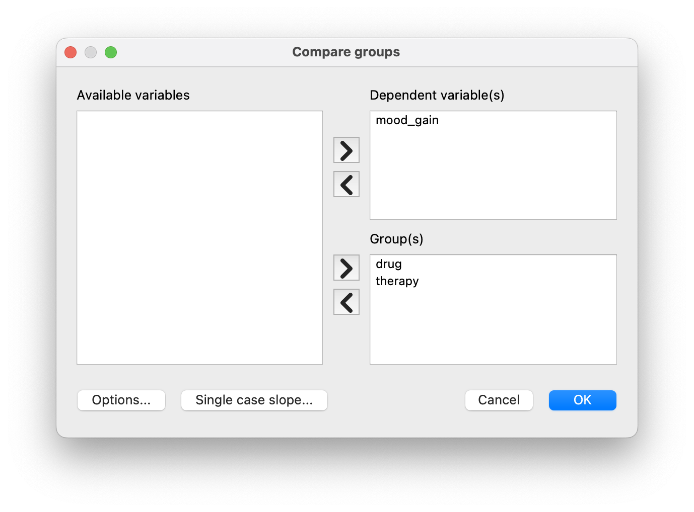
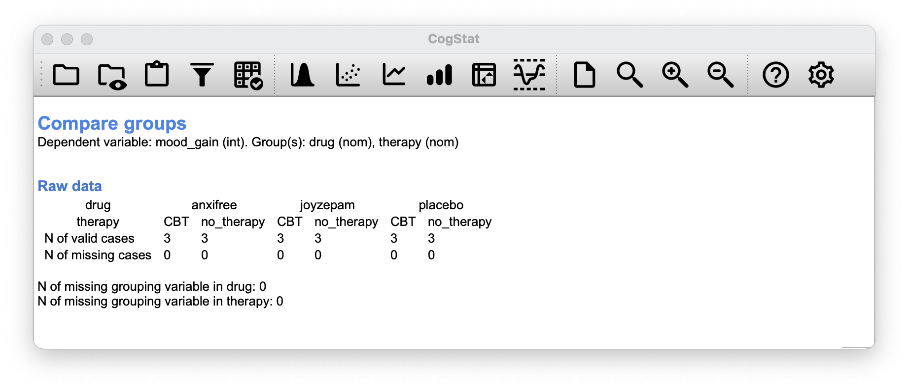
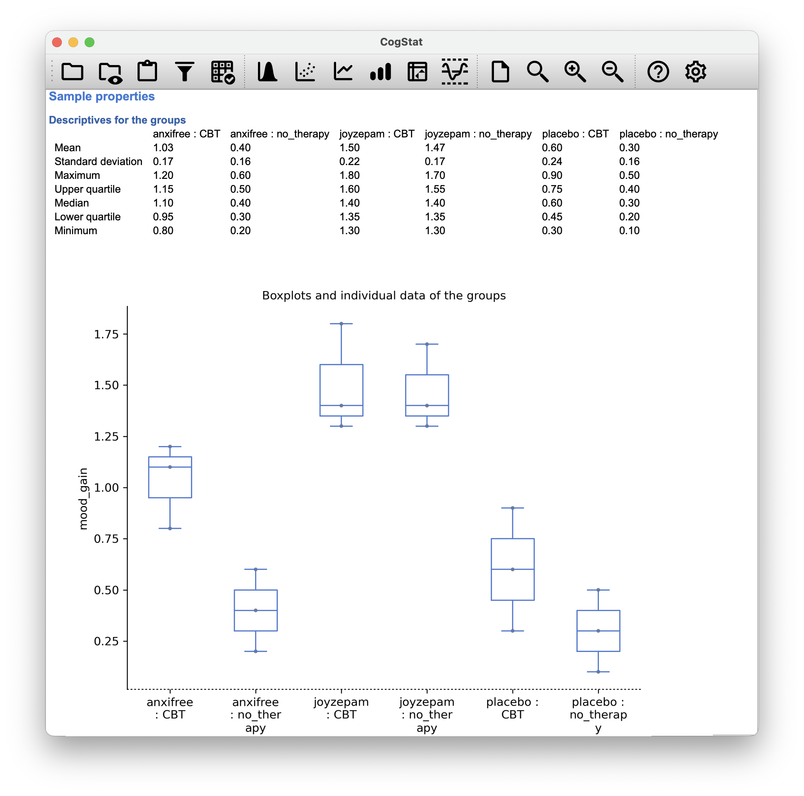
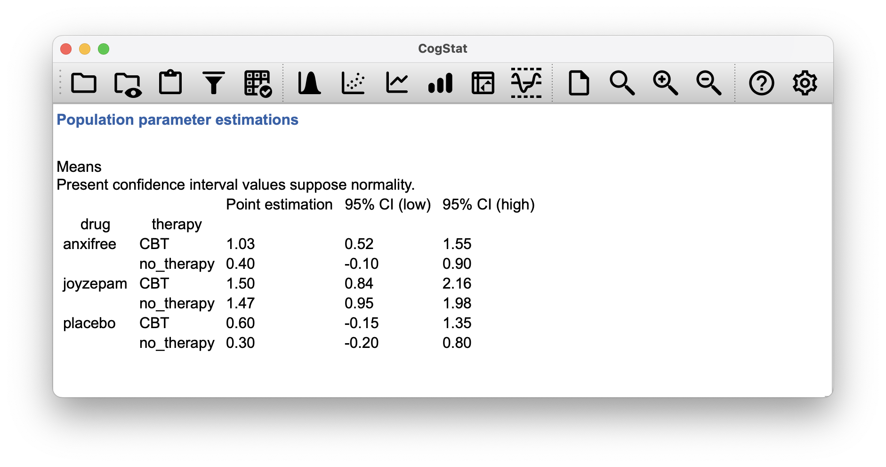
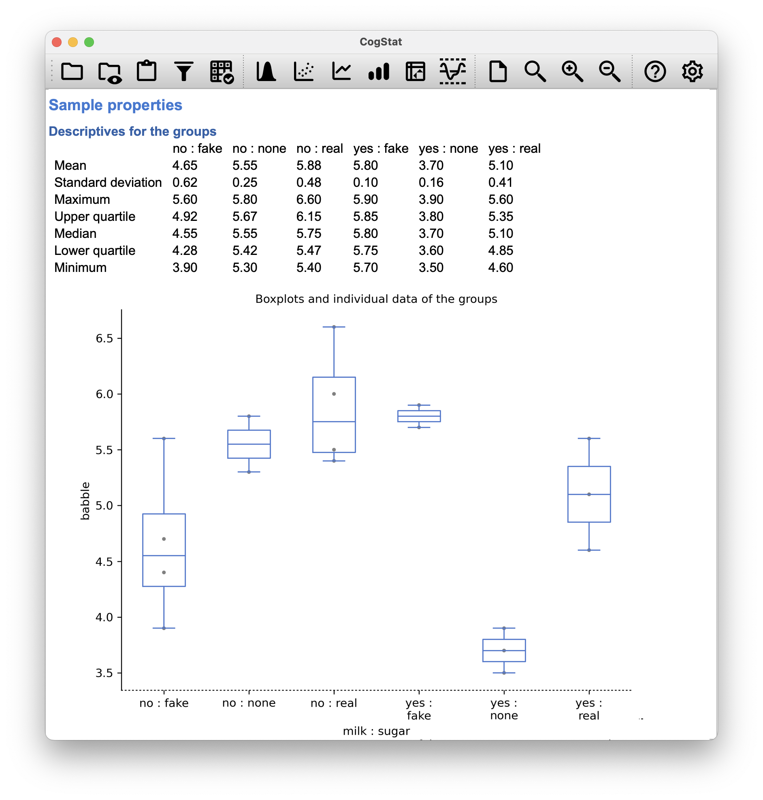

# Comparing several groups (factorial ANOVA){#anova2}

In past chapters, we compared two groups for the same varible (Chapter \@ref(anova)), or we compared two variables (Chapter \@ref(ttest)). In this chapter, we are going to look at more than one grouping variables, which we sometimes refer to as **factorial ANOVA**.

## Balanced designs{#factorialanovasimple}

When we discussed analysis of variance in Chapter \@ref(anova), we assumed a fairly simple experimental design: each person falls into one of several groups, and we want to know whether these groups have different means on some outcome variable. In this section, we will look at a broader class of experimental designs, known as **factorial designs**, where we have more than one grouping variable.

Let's take the example that appears in  Chapter \@ref(anova), in which we were looking at the effect of different drugs on the `mood_gain` experienced by each person. In that chapter, we did find a significant effect of drug (Chapter \@ref(introduceaov)), but at the end of the chapter we also ran an analysis to see if there was an effect of therapy (Chapter \@ref(anovaandt)). We didn't find one, but there's something a bit worrying about trying to run two *separate* analyses trying to predict the same outcome. Maybe there actually *is* an effect of therapy on mood gain, but we couldn't find it because it was being "hidden" by the effect of drug? In other words, we're going to want to run a *single* analysis that includes *both* `drug` and `therapy` as predictors.

For this analysis each person is cross-classified by the drug they were given (a factor with 3 levels) and what therapy they received (a factor with 2 levels). We refer to this as a $3 \times 2$ factorial design. Let's load the [`clinicaltrial.csv`](resources/data/clinicaltrial.csv) data set again to CogStat, and run the `Compare groups` function with both `drug` and `therapy` as grouping variables.

```{r, echo=FALSE, fig.align="center", out.width="100%", fig.show="hold"}

```

We get the following table:
```{r, echo=FALSE, fig.align="center", out.width="100%", fig.show="hold"}

```

As you can see, not only do we have participants corresponding to all possible combinations of the two factors, indicating that our design is **completely crossed**, it turns out that there are an equal number of people in each group. In other words, we have a **balanced** design.


### What hypotheses are we testing?{#factanovahyp}

Like one-way ANOVA, factorial ANOVA is a tool for testing certain types of hypotheses about population means. So a sensible place to start would be to be explicit about what our hypotheses actually are.

However, before we can even get to that point, it's really useful to have some clean and simple ways to describe the means. Because of the fact that observations are cross-classified in terms of two different factors, we'll need a cross-tabulation of sorts. 

Now, this output by CogStat shows a cross-tabulation of the group means and other descriptive statistics for all possible combinations of the two factors (e.g. people who received the placebo and no therapy, people who received the placebo while getting CBT etc.), and it also shows a boxplot comparing these combinations.

```{r anova2clinicalbox, echo=FALSE, fig.align="center", out.width="100%", fig.show="hold"}

```

But sometimes, we want to dissect our data in different output format. To do that, we have the `Pivot table` function in CogStat. Let's use it to create a cross-tabulation of the means of `mood_gain` for each combination of `drug` and `therapy`.

```{r anova2clinicalpivot, echo=FALSE, fig.align="center", out.width="100%", fig.show="hold", fig.cap="Cross-tabulation of the means of `mood_gain` for each combination of `drug` and `therapy` in `Pivot table` function. You can select different functions to tabulate: *N* (count), *Sum*, *Mean*, *Median*, *Lower* and *Upper quartile*, *Standard deviation*, and *Variance*."}
knitr::include_graphics(c(
    "resources/image/cogstatpivotclinicaldialog.png",
    "resources/image/cogstatpivotclinicalpivot.png")
)
```

Let's use some mathematical notation and the symbol $\mu$ to denote a population mean. However, because there are lots of different means, we'll need to use subscripts to distinguish between them. Here's how the notation works. Our table is defined in terms of two factors: each row corresponds to a different level of Factor A (in this case `drug`), and each column corresponds to a different level of Factor B (in this case `therapy`). If we let $R$ denote the number of rows in the table, and $C$ denote the number of columns, we can refer to this as an $R \times C$ factorial ANOVA. In this case $R=3$ and $C=2$.

We'll use lowercase letters to refer to specific rows and columns, so $\mu_{rc}$ refers to the population mean associated with the $r$th level of Factor A (i.e. row number $r$) and the $c$th level of Factor B (column number $c$).^[The nice thing about the subscript notation is that generalises nicely: if our experiment had involved a third factor, then we could just add a third subscript. In principle, the notation extends to as many factors as you might care to include.] We use the "dot" notation to express averages across rows and columns. In the case of Joyzepam, notice that we're talking about the mean associated with the third row in the table. That is, we're averaging across two cell means (i.e., $\mu_{31}$ and $\mu_{32}$). The result of this averaging is referred to as a **marginal mean**, and would be denoted $\mu_{3.}$ in this case. The marginal mean for CBT corresponds to the population mean associated with the second column in the table, so we use the notation $\mu_{.2}$ to describe it. The grand mean is denoted $\mu_{..}$ because it is the mean obtained by averaging (marginalising^[Technically, marginalising isn't quite identical to a regular mean: it's a weighted average, where you take into account the frequency of the different events that you're averaging over. However, in a balanced design, all of our cell frequencies are equal by definition, so the two are equivalent.]) over both. So our full table of population means can be written down like this:

```{r echo=FALSE, fig.align="center", out.width="100%"}
knitr::kable(
    rbind(
        c("Placebo", "$\\mu_{11}$", "$\\mu_{12}$", "$\\mu_{1.}$"),
        c("Anxifree", "$\\mu_{21}$", "$\\mu_{21}$", "$\\mu_{2.}$"),
        c("Joyzepam", "$\\mu_{31}$", "$\\mu_{32}$", "$\\mu_{3.}$"),
        c("Total", "$\\mu_{.1}$", "$\\mu_{.2}$",    "$\\mu_{..}$")),
    col.names = c("", "No therapy", "CBT", "Total"),
    booktabs = TRUE, align = "lccc",
    caption = "Population means in factorial ANOVA."
)
```

Now that we have this notation, it is straightforward to formulate and express some hypotheses. Let's suppose that the goal is to find out two things: firstly, does the choice of drug have any effect on mood, and secondly, does CBT have any effect on mood? These aren't the only hypotheses that we could formulate of course, but these are the two simplest hypotheses to test, and so we'll start there. 

Consider the first test. If drug has no effect, then we would expect all of the row means to be identical, right? So that's our null hypothesis. On the other hand, if the drug does matter then we should expect these row means to be different. Formally, we write down our null and alternative hypotheses in terms of the *equality of marginal means*:

```{r echo=FALSE, fig.align="center", out.width="100%"}
knitr::kable(
    rbind(
        c("Null hypothesis $H_0$:", "row means are the same i.e. $\\mu_{1.} = \\mu_{2.} = \\mu_{3.}$"),
        c("Alternative hypothesis $H_1$:", "at least one row mean is different.")
    ),
    col.names = c("", ""),
    booktabs = TRUE, align = "ll"
)
```

It's worth noting that these are *exactly* the same statistical hypotheses that we formed when we ran a one-way ANOVA on these data back in Chapter \@ref(anova). Back then, we used the notation $\mu_P$ to refer to the mean mood gain for the placebo group, with $\mu_A$ and $\mu_J$ corresponding to the group means for the two drugs, and the null hypothesis was $\mu_P = \mu_A = \mu_J$. So we're actually talking about the same hypothesis: it's just that the more complicated ANOVA requires more careful notation due to the presence of multiple grouping variables, so we're now referring to this hypothesis as $\mu_{1.} = \mu_{2.} = \mu_{3.}$. However, as we'll see shortly, although the hypothesis is identical, the test of that hypothesis is subtly different due to the fact that we're now acknowledging the existence of the second grouping variable.

Speaking of the other grouping variable, you won't be surprised to discover that our second hypothesis test is formulated the same way. However, since we're talking about the psychological therapy rather than drugs, our null hypothesis now corresponds to the equality of the column means:

```{r echo=FALSE, fig.align="center", out.width="100%"}
knitr::kable(
    rbind(
        c("Null hypothesis $H_0$:", "column means are the same, i.e., $\\mu_{.1} = \\mu_{.2}$"),
        c("Alternative hypothesis $H_1$:", "column means are different, i.e., $\\mu_{.1} \\neq \\mu_{.2}$")
    ),
    col.names = c("", ""),
    booktabs = TRUE, align = "ll"
)
```

### Means, sums of squares, and degrees of freedom

The null and alternative hypotheses might seem awfully familiar: they're basically the same as the hypotheses that we were testing in our simpler one-way ANOVAs in Chapter \@ref(anova). So you're probably expecting that the hypothesis *tests* that are used in factorial ANOVA will be essentially the same as the $F$-test from Chapter \@ref(anova). You're expecting to see references to sums of squares (SS), mean squares (MS), degrees of freedom (df), and finally an $F$-statistic that we can convert into a $p$-value, right? Well, you're absolutely and completely right.

We used $\mu$ for population means, but we'll use $\bar{Y}$ to refer to a sample mean. For the rest of the formulas, we can use the same notation as before to refer to group means, marginal means and grand means: that is, $\bar{Y}_{rc}$ is the sample mean associated with the $r$th level of Factor A and the $c$th level of Factor B, $\bar{Y}_{r.}$ would be the marginal mean for the $r$th level of Factor A, $\bar{Y}_{.c}$ would be the marginal mean for the $c$th level of Factor B, and $\bar{Y}_{..}$ is the grand mean. In other words, our sample means can be organised into the same table as the population means. For our clinical trial data, that table looks like this:

```{r echo=FALSE, fig.align="center", out.width="100%"}
knitr::kable(
    rbind(
        c("Placebo", "$\\bar{Y}_{11}$", "$\\bar{Y}_{12}$", "$\\bar{Y}_{1.}$"),
        c("Anxifree", "$\\bar{Y}_{21}$", "$\\bar{Y}_{21}$", "$\\bar{Y}_{2.}$"),
        c("Joyzepam", "$\\bar{Y}_{31}$", "$\\bar{Y}_{32}$", "$\\bar{Y}_{3.}$"),
        c("Total", "$\\bar{Y}_{.1}$", "$\\bar{Y}_{.2}$",    "$\\bar{Y}_{..}$")),
    col.names = c("", "No therapy", "CBT", "Total"),
    booktabs = TRUE, align = "lccc"
)
```

If we look at the sample means from earlier (Figure \@ref(fig:anova2clinicalpivot)), we have $\bar{Y}_{11} = 0.30$, $\bar{Y}_{12} = 0.60$ etc. In our clinical trial example, the `drugs` factor has 3 levels and the `therapy` factor has 2 levels, and so what we're trying to run is a $3 \times 2$ factorial ANOVA. 

To be a little more general, we can say that Factor A (the row factor) has $R$ levels and Factor B (the column factor) has $C$ levels, and so what we're runnning here is an $R \times C$ factorial ANOVA. The formula for the sum of squares values for each of the two factors in a relatively familiar. For Factor A, our between group sum of squares is calculated by assessing the extent to which the (row) marginal means $\bar{Y}_{1.}$, $\bar{Y}_{2.}$ etc, are different from the grand mean $\bar{Y}_{..}$:
$$
\mbox{SS}_{A} = (N \times C)  \sum_{r=1}^R  \left( \bar{Y}_{r.} - \bar{Y}_{..} \right)^2
$$

The formula for factor B is of course the same thing, just with some subscripts shuffled around:
$$
\mbox{SS}_{B} = (N \times R) \sum_{c=1}^C \left( \bar{Y}_{.c} - \bar{Y}_{..} \right)^2
$$

Okay, now let's calculate the sum of squares associated with the main effect of `drug`. There are a total of $N=3$ people in each group, and $C=2$ different types of therapy. Or, to put it another way, there are $3 \times 2 = 6$ people who received any particular drug. So our calculations are:
$$
\begin{array}{rcl}
\mbox{SS}_{drug} &=& (N \times C)  \sum_{r=1}^R  \left( \bar{Y}_{r.} - \bar{Y}_{..} \right)^2
    \\
    &=& 3.453333
\end{array}
$$

We can repeat the same kind of calculation for the effect of therapy. Again there are $N=3$ people in each group, but since there are $R=3$ different drugs, this time around we note that there are $3 \times 3 = 9$ people who received CBT, and an additional 9 people who received the placebo. So our calculation is now:
 $$
\begin{array}{rcl}
\mbox{SS}_{therapy} &=& (N \times C)  \sum_{r=1}^R  \left( \bar{Y}_{r.} - \bar{Y}_{..} \right)^2
    \\
    &=& 0.467222
\end{array}
$$

So that's how you calculate the SS values for the two main effects. These SS values are analogous to the between-group sum of squares values that we calculated when doing one-way ANOVA in Chapter \@ref(anova). However, it's not a good idea to think of them as between-groups SS values anymore, just because we have two different grouping variables and it's easy to get confused. In order to construct an $F$ test, however, we also need to calculate the within-groups sum of squares. We will refer to the within-groups SS value as the *residual*^[This will be a term used and explained in Chapter \@ref(regression).] sum of squares SS$_R$.

The easiest way to think about the residual SS values in this context, is to think of it as the leftover variation in the outcome variable after you take into account the differences in the marginal means (i.e. after you remove SS$_{drug}$ and SS$_{therapy}$). What I mean by that is we can start by calculating the total sum of squares (SS$_T$). We take the difference between each observation $Y_{rci}$ and the grand mean $\bar{Y}_{..}$, square the differences, and add them all up
$$
\begin{array}{rcl}
\mbox{SS}_T &=& \sum_{r=1}^R \sum_{c=1}^C \sum_{i=1}^N \left( Y_{rci} - \bar{Y}_{..}\right)^2
    \\
    &=& 4.845
\end{array}
$$

The "triple summation" here looks more complicated than it is. In the first two summations, we're summing across all levels of Factor A (i.e., over all possible rows $r$ in our table), across all levels of Factor B (i.e. all possible columns $c$). Each $rc$ combination corresponds to a single group, and each group contains $N$ people: so we have to sum across all those people (i.e. all $i$ values) too. In other words, all we're doing here is summing across all observations in the data set (i.e. all possible $rci$ combinations).

The residual sum of squares is thus defined to be the variability in $Y$ that *can't* be attributed to either of our two factors. In other words:
$$
\begin{array}{rcl}
\mbox{SS}_R &=& \mbox{SS}_T - (\mbox{SS}_A + \mbox{SS}_B)
    \\
    &=& 4.845 - (3.45333 + 0.46722)
    \\
    &=& 0.92445
\end{array}
$$

It is commonplace to refer to $\mbox{SS}_A + \mbox{SS}_B$ as the variance attributable to the "ANOVA model", denoted SS$_M$, and so we often say that the total sum of squares is equal to the model sum of squares plus the residual sum of squares.

The degrees of freedom are calculated in much the same way as for one-way ANOVA. The degrees of freedom equals the number of quantities that are observed, minus the number of constraints. So, for the `drugs` factor, we observe 3 separate group means, but these are constrained by 1 grand mean; and therefore the degrees of freedom is $df = 2$. For the `therapy` factor we obtain $df=1$.

For the residuals, the logic is similar, but not quite the same. The total number of observations in our experiment is 18. The constraints correspond to the 1 grand mean, the 2 additional group means that the `drug` factor introduces, and the 1 additional group mean that the the `therapy` factor introduces, and so our degrees of freedom is 14. As a formula, this is $N-1 -(R-1)-(C-1)$, which simplifies to $N-R-C+1$.

Just like we saw with the original one-way ANOVA, note that the mean square value is calculated by dividing SS by the corresponding $df$. That is, it's still true that
$$
\mbox{MS} = \frac{\mbox{SS}}{df}
$$
regardless of whether we're talking about `drug`, `therapy` or the residuals. To see this, let's not worry about how the sums of squares values are calculated. So for the `drug` factor, we divide $3.45333$ by $2$, and end up with a mean square value of $1.73$. For the `therapy` factor, there's only 1 degree of freedom, so our calculations are even simpler: dividing $0.46722$ (the SS value) by 1 gives us an answer of $0.47$ (the MS value).

Turning to the $F$ statistics and the $p$ values, notice that we have two of each: one corresponding to the `drug` factor and the other corresponding to the `therapy` factor. Regardless of which one we're talking about, the $F$ statistic is calculated by dividing the mean square value associated with the factor by the mean square value associated with the residuals:
$$
F_{A} = \frac{\mbox{MS}_{A}}{\mbox{MS}_{R}}
$$
and an equivalent formula exists for factor B (i.e. `therapy`).

So for the `drug` factor, we take the mean square of $1.73$ and divide it by the residual mean square value of $0.07$, which gives us an $F$-statistic of $26.15$. The corresponding calculation for the `therapy` variable would be to divide $0.47$ by $0.07$ which gives $7.08$ as the $F$-statistic.

Regarding the $p$-value, what we're trying to do is test the null hypothesis that there is no relationship between the factor and the outcome variable. To that end, we've followed a similar strategy that we did in the one-way ANOVA, and have calculated an $F$-statistic for each of these hypotheses. To convert these to $p$ values, all we need to do is note that the sampling distribution for the $F$ *statistic* under the null hypothesis is an $F$ *distribution*, and that two degrees of freedom values are those corresponding to the factor, and those corresponding to the residuals. For the `drug` factor we're talking about an $F$ distribution with 2 and 14 degrees of freedom. In contrast, for the `therapy` factor sampling distribution is $F$ with 1 and 14 degrees of freedom.

So, for the `drug` factor, we have an $F$-statistic of $26.15$ and an $F$-distribution with 2 and 14 degrees of freedom. The corresponding $p$-value is $<0.001$. For the `therapy` factor, we have an $F$-statistic of $7.08$ and an $F$-distribution with 1 and 14 degrees of freedom. The corresponding $p$-value is $0.02$.

But hang on! You've run the analysis in CogStat and you see something vastly different. That's okay. Bear with us for a moment.

### The *interaction*

The ANOVA model that we've been talking about so far covers a range of different patterns that we might observe in our data. For instance, in a two-way ANOVA design, there are four possibilities: (a) only Factor A matters, (b) only Factor B matters, (c) both A and B matter, and (d) neither A nor B matters. An example of each of these four possibilities is plotted in Figure \@ref(fig:maineffects).

```{r maineffects, fig.cap="Factor main effects", echo=FALSE, fig.align="center", out.width="50%", fig.show="hold"}
knitr::include_graphics(c(
  "resources/image/maineffectA.png",
  "resources/image/maineffectB.png",
  "resources/image/maineffectAB.png",
  "resources/image/maineffectO.png"))
```

The four patterns of data shown in Figure \@ref(fig:maineffects) are all quite realistic: there are a great many data sets that produce exactly those patterns. However, they are not the whole story, and the ANOVA model that we have been talking about up to this point is not sufficient to fully account for a table of group means. Why not? Well, so far we have the ability to talk about the idea that drugs can influence mood, and therapy can influence mood, but no way of talking about the possibility of an **interaction** between the two. An interaction between A and B is said to occur whenever the effect of Factor A is *different*, depending on which level of Factor B we're talking about. Several examples of an interaction effect with the context of a 2 x 2 ANOVA are shown in Figure \@ref(fig:interaction). 

```{r interaction, fig.cap="Qualitatively different interactions for a $2 \\times 2$ ANOVA", echo=FALSE, fig.align="center", out.width="50%", fig.show="hold"}
knitr::include_graphics(c(
  "resources/image/interaction1.png",
  "resources/image/interaction2.png",
  "resources/image/interaction3.png",
  "resources/image/interaction4.png"))
```

To give a more concrete example, suppose that the operation of Anxifree and Joyzepam is governed quite different physiological mechanisms, and one consequence of this is that while Joyzepam has more or less the same effect on mood regardless of whether one is in therapy, Anxifree is actually much more effective when administered in conjunction with CBT. The ANOVA that we developed manually, does not capture this idea. To get some idea of whether an interaction is actually happening here, it helps to plot the various group means.

```{r interactionplot, fig.cap="Interaction plot for our clinical trial data", echo=FALSE, fig.align="center", out.width="100%", fig.show="hold"}
knitr::include_graphics(c(
  "resources/image/interactionplot.png"))
```

Our main concern relates to the fact that the two lines aren't parallel. The effect of CBT (difference between solid line and dotted line) when the drug is Joyzepam (right side) appears to be near zero, even smaller than the effect of CBT when a placebo is used (left side). However, when Anxifree is administered, the effect of CBT is larger than the placebo (middle). Is this effect real, or is this just random variation due to chance? Our original ANOVA cannot answer this question, because we make no allowances for the idea that interactions even exist! In this section, we'll fix this problem.

Although there are only two *factors* involved in our model (i.e. `drug` and `therapy`), there are actually three distinct **terms** (i.e. `drug`, `therapy` and `drug × therapy`). That is, in addition to the main effects of `drug` and `therapy`, we have a new component to the model, which is our interaction term `drug × therapy`.

Intuitively, the idea behind an interaction effect is fairly simple: it means that the effect of Factor A is different, depending on which level of Factor B we're talking about. But what does that actually mean in terms of our data? Figure \@ref(fig:interactionplot) depicts several different patterns that, although quite different to each other, would all count as an interaction effect. So it's not entirely straightforward to translate this qualitative idea into something mathematical that a statistician can work with. As a consequence, the way that the idea of an interaction effect is formalised in terms of null and alternative hypotheses is slightly difficult.

To start with, we need to be a little more explicit about our main effects. Consider the main effect of Factor A (`drug` in our running example). We originally formulated this in terms of the null hypothesis that the two marginal means $\mu_{r.}$ are all equal to each other. Obviously, if all of these are equal to each other, then they must also be equal to the grand mean $\mu_{..}$ as well, right? So what we can do is define the *effect* of Factor A at level $r$ to be equal to the difference between the marginal mean $\mu_{r.}$ and the grand mean $\mu_{..}$.  
Let's denote this effect by $\alpha_r$, and note that
$$
\alpha_r  = \mu_{r.} - \mu_{..} 
$$

Now, by definition all of the $\alpha_r$ values must sum to zero, for the same reason that the average of the marginal means $\mu_{r.}$ must be the grand mean $\mu_{..}$. We can similarly define the effect of Factor B at level $i$ to be the difference between the column marginal mean $\mu_{.c}$ and the grand mean $\mu_{..}$
$$
\beta_c = \mu_{.c} - \mu_{..}
$$
and once again, these $\beta_c$ values must sum to zero. The reason that statisticians sometimes like to talk about the main effects in terms of these $\alpha_r$ and $\beta_c$ values is that it allows them to be precise about what it means to say that there is no interaction effect. If there is no interaction at all, then these $\alpha_r$ and $\beta_c$ values will perfectly describe the group means $\mu_{rc}$. Specifically, it means that
$$
\mu_{rc} = \mu_{..} + \alpha_r + \beta_c 
$$

That is, there's nothing *special* about the group means that you couldn't predict perfectly by knowing all the marginal means. And that's our null hypothesis, right there. The alternative hypothesis is that
$$
\mu_{rc} \neq \mu_{..} + \alpha_r + \beta_c 
$$
for at least one group $rc$ in our table. However, statisticians often like to write this slightly differently. They'll usually define the specific interaction associated with group $rc$ to be some number, awkwardly referred to as $(\alpha\beta)_{rc}$, and then they will say that the alternative hypothesis is that 
$$\mu_{rc} = \mu_{..} + \alpha_r + \beta_c + (\alpha\beta)_{rc}$$
where $(\alpha\beta)_{rc}$ is non-zero for at least one group. This notation is kind of ugly to look at, but it is handy to calculate the sum of squares.

How should we calculate the sum of squares for the interaction terms, SS$_{A:B}$? For Factor A, a good way to estimate the main effect at level $r$ as the difference between the *sample* marginal mean $\bar{Y}_{rc}$ and the sample grand mean $\bar{Y}_{..}$. That is, we would use this as our estimate of the effect^[Again, we switched $\mu$ to $\bar{Y}$ to indicate that we're using the sample mean instead of the population mean.]:
$$
\hat{\alpha}_r = \bar{Y}_{r.} - \bar{Y}_{..}
$$
Similarly, our estimate of the main effect of Factor B at level $c$ can be defined as follows:
$$
\hat{\beta}_c = \bar{Y}_{.c} - \bar{Y}_{..}
$$

Now, if you go back to the formulas of the SS values for the two main effects, you'll notice that these effect terms are exactly the quantities that we were squaring and summing! So what's the analog of this for interaction terms? The answer to this can be found by first rearranging the formula for the group means $\mu_{rc}$ under the alternative hypothesis, so that we get this:
\begin{eqnarray*} 
(\alpha \beta)_{rc} &=& \mu_{rc} - \mu_{..} - \alpha_r - \beta_c \\
&=& \mu_{rc} - \mu_{..} - (\mu_{r.} - \mu_{..}) - (\mu_{.c} - \mu_{..}) \\
&=& \mu_{rc} - \mu_{r.} - \mu_{.c} + \mu_{..}
\end{eqnarray*}
So, once again, if we substitute our sample statistics in place of the population means, we get the following as our estimate of the interaction effect for group $rc$, which is
$$
\hat{(\alpha\beta)}_{rc} = \bar{Y}_{rc} - \bar{Y}_{r.} - \bar{Y}_{.c} + \bar{Y}_{..}
$$

Now all we have to do is sum all of these estimates across all $R$ levels of Factor A and all $C$ levels of Factor B, and we obtain the following formula for the sum of squares associated with the interaction as a whole:
$$
\mbox{SS}_{A:B} = N \sum_{r=1}^R \sum_{c=1}^C \left( \bar{Y}_{rc} - \bar{Y}_{r.} - \bar{Y}_{.c} + \bar{Y}_{..} \right)^2
$$
where, we multiply by $N$ because there are $N$ observations in each of the groups, and we want our SS values to reflect the variation among *observations* accounted for by the interaction, not the variation among groups.

Now that we have a formula for calculating SS$_{A:B}$, it's important to recognise that the interaction term is part of the model (of course), so the total sum of squares associated with the model, SS$_M$ is now equal to the sum of the three relevant SS values, $\mbox{SS}_A + \mbox{SS}_B + \mbox{SS}_{A:B}$. The residual sum of squares $\mbox{SS}_R$ is still defined as the leftover variation, namely $\mbox{SS}_T - \mbox{SS}_M$, but now that we have the interaction term this becomes
$$
\mbox{SS}_R = \mbox{SS}_T - (\mbox{SS}_A + \mbox{SS}_B + \mbox{SS}_{A:B})
$$ 
As a consequence, the residual sum of squares SS$_R$ will be smaller than in our original ANOVA that didn't include interactions.

Calculating the degrees of freedom for the interaction is, once again, slightly trickier than the corresponding calculation for the main effects. To start with, let's think about the ANOVA model as a whole. Once we include interaction effects in the model, we're allowing every single group has a unique mean, $\mu_{rc}$. For an $R \times C$ factorial ANOVA, this means that there are $R \times C$ quantities of interest in the model, and only the one constraint: all of the group means need to average out to the grand mean. So the model as a whole needs to have $(R\times C) - 1$ degrees of freedom. But the main effect of Factor A has $R-1$ degrees of freedom, and the main effect of Factor B has $C-1$ degrees of freedom. Which means that the degrees of freedom associated with the interaction is:
$$
\begin{eqnarray*}
df_{A:B} &=& (R\times C - 1) - (R - 1) - (C -1 ) \\
&=& RC - R - C + 1 \\
&=& (R-1)(C-1)
\end{eqnarray*}
$$
which is just the product of the degrees of freedom associated with the row factor and the column factor.

What about the residual degrees of freedom? Because we've added interaction terms, which absorb some degrees of freedom, there are fewer residual degrees of freedom left over. Specifically, note that if the model with interaction has a total of $(R \times C) - 1$, and there are $N$ observations in your data set that are constrained to satisfy 1 grand mean, your residual degrees of freedom now become $N-(R \times C)-1+1$, or just $N-(R \times C)$.

This means that our residual degrees of freedom are for the model with interaction are:

- $N-(R \times C)$ for the residual degrees of freedom: 18 - (3 \times 2) = 12
- $(R-1)(C-1)$ for the interaction degrees of freedom: (3-1)(2-1) = 2
- $R-1$ for the main effect of Factor A (`drug`): 3 levels - 1 = 2
- $C-1$ for the main effect of Factor B (`therapy`): 2 levels - 1 = 1

This changes the $F$-statistic for all of the effects in the model. Let's look at the CogStat results now.

```{=html}
<div style="margin: 0 0 1.275em; border: 1px solid #ddd; padding:.85em 1em;">
     <p style="font-size:medium; font-weight:600; color:#3960a5;">Hypothesis tests</p>
     <p style="color:#008000;">Testing if the means are the same.<br />
     At least two grouping variables. Interval variable. &gt;&gt; Choosing factorial ANOVA.</p>
     <p style="color:black;">Result of multi-way ANOVA:</p>
     <p style="color:black">Main effect of drug: <span style="font-style:italic;">F</span>(2, 12) = 31.71, <span style="font-style:italic;">p</span> &lt; .001</p>
    <p style="color:black">Main effect of therapy: <span style="font-style:italic;">F</span>(1, 12) = 8.58, <span style="font-style:italic;">p</span> = .013</p>
    <p style="color:black">Interaction of drug and therapy: <span style="font-style:italic;">F</span>(2, 12) = 2.49, <span style="font-style:italic;">p</span> = .125</p>
</div>
```

### How to interpret the results

There's a couple of very important things to consider when interpreting the results of factorial ANOVA. Firstly, there's the same issue that we had with one-way ANOVA, which is that if you obtain a significant main effect of `drug`, it doesn't tell you anything about which drugs are different to one another. To find that out, you need to run additional analyses. We'll talk about some analyses that you can run in Sections \@ref(contrasts) and \@ref(sec:posthoc2). The same is true for interaction effects: knowing that there's a significant interaction doesn't tell you anything about what kind of interaction exists. Again, you'll need to run additional analyses.

Secondly, there's a very peculiar interpretation issue that arises when you obtain a significant interaction effect but no corresponding main effect. This happens sometimes. For instance, in the crossover interaction shown in Figure \@ref(fig:interaction), this is exactly what you'd find: in this case, neither of the main effects would be significant, but the interaction effect would be. This is a difficult situation to interpret, and people often get a bit confused about it. The general advice that statisticians like to give in this situation is that you shouldn't pay much attention to the main effects when an interaction is present. The reason they say this is that, although the tests of the main effects are perfectly valid from a mathematical point of view, when there is a significant interaction effect the main effects rarely test interesting hypotheses. Recall that the null hypothesis for a main effect is that the *marginal means* are equal to each other, and that a marginal mean is formed by averaging across several different groups. But if you have a significant interaction effect, then you *know* that the groups that comprise the marginal mean aren't homogeneous, so it's not really obvious why you would even care about those marginal means.

Here's what that means. Again, let's stick with a clinical example. Suppose that we had a $2 \times 2$ design comparing two different treatments for phobias (e.g., systematic desensitisation vs flooding), and two different anxiety reducing drugs (e.g., Anxifree vs Joyzepam). Now suppose what we found was that Anxifree had no effect when desensitisation was the treatment, and Joyzepam had no effect when flooding was the treatment. But both were pretty effective for the other treatment. This is a classic crossover interaction, and what we'd find when running the ANOVA is that there is no main effect of drug, but a significant interaction. Now, what does it actually *mean* to say that there's no main effect? Well, it means that, if we average over the two different psychological treatments, then the *average* effect of Anxifree and Joyzepam is the same. But why would anyone care about that? When treating someone for phobias, it is never the case that a person can be treated using an "average" of flooding and desensitisation: that doesn't make a lot of sense. You either get one or the other. For one treatment, one drug is effective; and for the other treatment, the other drug is effective. The interaction is the important thing; the main effect is kind of irrelevant.

This sort of thing happens a lot: the main effect are tests of marginal means, and when an interaction is present we often find ourselves not being terribly interested in marginal means, because they imply averaging over things that the interaction tells us shouldn't be averaged! Of course, it's not always the case that a main effect is meaningless when an interaction is present. Often you can get a big main effect and a very small interaction, in which case you can still say things like "drug A is generally more effective than drug B" (because there was a big effect of drug), but you'd need to modify it a bit by adding that "the difference in effectiveness was different for different psychological treatments". In any case, the main point here is that whenever you get a significant interaction you should stop and *think* about what the main effect actually means in this context. Don't automatically assume that the main effect is interesting.

## Effect size{#effectsizefactorialanova}

The effect size calculations for a factorial ANOVA should be similar to those used in one-way ANOVA ($\eta^2$ and $\omega^2$). However, when doing a factorial ANOVA, there is a second measure of effect size that people like to report, known as partial $\eta^2$. The idea behind partial $\eta^2$ (which is sometimes denoted $_p\eta^2$ or $\eta^2_p$) is that, when measuring the effect size for a particular term (e.g. the main effect of Factor A), you want to deliberately ignore the other effects in the model (e.g. the main effect of Factor B). That is, you would pretend that the effect of all these other terms is zero, and then calculate what the $\eta^2$ value would have been. This is actually pretty easy to calculate. All you have to do is remove the sum of squares associated with the other terms from the denominator. In other words, if you want the partial $\eta^2$ for the main effect of Factor A, the denominator is just the sum of the SS values for Factor A and the residuals:
$$
\mbox{partial } \eta^2_A = \frac{\mbox{SS}_{A}}{\mbox{SS}_{A} + \mbox{SS}_{R}}
$$

This will always give you a larger number than $\eta^2$, which the cynic in me suspects accounts for the popularity of partial $\eta^2$. And once again you get a number between 0 and 1, where 0 represents no effect. However, it's slightly trickier to interpret what a large partial $\eta^2$ value means. In particular, you can't actually compare the partial $\eta^2$ values across terms! Suppose, for instance, there is no within-groups variability at all: if so, SS$_R = 0$. What that means is that *every* term has a partial $\eta^2$ value of 1. But that doesn't mean that all terms in your model are equally important, or indeed that they are equally large. All it mean is that all terms in your model have effect sizes that are large *relative to the residual variation*. It is not comparable across terms.

CogStat currently doesn't provide effect sizes for multi-way ANOVAs. But if you're interested in $\eta^2$ and partial $\eta^2$, read on.


First, let's have a look at the effect sizes for the original ANOVA without the interaction term:

```{r echo=FALSE, fig.align="center", fig.cap="Effect sizes for the ANOVA without the interaction term", out.width="100%"}
knitr::kable(
    rbind(
        c("Drug", "0.713", "0.789"),
        c("Therapy", "0.096", "0.336")
    ),
    col.names = c("", "$\\eta^2$", "Partial $\\eta^2$"),
    booktabs = TRUE,
    align = "lcc"
)
```

Looking at the $\eta^2$ values first, we see that `drug` accounts for 71.3\% of the variance (i.e. $\eta^2 = 0.713$) in `mood_gain`, whereas `therapy` only accounts for 9.6\%. This leaves a total of 19.1\% of the variation unaccounted for (i.e. the residuals constitute 19.1\% of the variation in the outcome). Overall, this implies that we have a very large effect^[Implausibly large: the artificiality of this data set is really starting to show!] of `drug` and a modest effect of `therapy`.

Now let's look at the partial $\eta^2$ values. Because the effect of `therapy` isn't all that large, controlling for it doesn't make much of a difference, so the partial $\eta^2$ for `drug` doesn't increase very much, and we obtain a value of $_p\eta^2 = 0.789$). In contrast, because the effect of `drug` was very large, controlling for it makes a big difference, and so when we calculate the partial $\eta^2$ for `therapy` you can see that it rises to $_p\eta^2 = 0.336$. The question that we have to ask ourselves is, what does these partial $\eta^2$ values actually *mean*? 

The partial $\eta^2$ for the main effect of Factor A is a statement about a hypothetical experiment in which *only* Factor A was being varied. So, even though in *this* experiment we varied both A and B, we can easily imagine an experiment in which only Factor A was varied: the partial $\eta^2$ statistic tells you how much of the variance in the outcome variable you would expect to see accounted for in that experiment. However, it should be noted that this interpretation -- like many things associated with main effects -- doesn't make a lot of sense when there is a large and significant interaction effect.

Speaking of interaction effects, here's what we get when we calculate the effect sizes for the model that includes the interaction term. As you can see, the $\eta^2$ values for the main effects don't change, but the partial $\eta^2$ values do:

```{r echo=FALSE, fig.align="center", fig.cap="Effect sizes for the ANOVA without the interaction term", out.width="100%"}
knitr::kable(
    rbind(
        c("Drug", "0.713", "0.841"),
        c("Therapy", "0.096", "0.417"),
        c("Drug $\\times$ Therapy", "0.056", "0.293")
    ),
    col.names = c("", "$\\eta^2$", "Partial $\\eta^2$"),
    booktabs = TRUE,
    align = "lcc"
)
```

## Estimated group means and confidence intervals{#meansfactorialanova}

You will find yourself wanting to report estimates of all the group means based on the results of your ANOVA, as well as confidence intervals associated with them. If the ANOVA that you have run is a **saturated model** (i.e. contains all possible main effects and all possible interaction effects), then the estimates of the group means are actually identical to the sample means, though the confidence intervals will use a pooled estimate of the standard errors, rather than use a separate one for each group.

If you look at the `Population parameter estimations` output from CogStat, you see that there are confidence intervals given for each combination of our variables (Figure \@ref(fig:cogstatafci)). Estimated mean mood gain for placebo group with no therapy was $0.30$, with a 95\% confidence interval from $-0.20$ to $0.80$. However, that is when you calculate the confidence intervals separately for each group.

```{r cogstatafci, echo=FALSE, fig.align="center", fig.cap="Population parameter estimations: estimated group means -- reduced model", out.width="100%"}

```

In a saturated model, the estimated mean mood gain for the placebo group with no therapy should still be $0.30$, but with a 95\% confidence interval from $0.006$ to $0.594$.

```{=html}
<table>
<caption colspan="6">Estimated group means and confidence intervals</caption>
<thead>
    <tr><th class="cornerLabels" rowspan="2">drug</th><th class="cornerLabels" rowspan="2">therapy</th><th rowspan="2">Mean</th><th rowspan="2">Std. Error</th><th colspan="2">95% Confidence Interval</th></tr>
    <tr><th>Lower Bound</th><th>Upper Bound</th></tr>
</thead>
<tbody data-rect="0,5,0,3">
    <tr><th rowspan="2" style="min-width:71px">Placebo</th><th style="min-width:78px">No therapy</th><td class=" har" style="min-width:68px">.300</td><td class=" har" style="min-width:69px">.135</td><td class=" har" style="min-width:88px">.006</td><td class=" har" style="min-width:90px">.594</td></tr>
    <tr><th>CBT</th><td class=" har">.600</td><td class=" har">.135</td><td class=" har">.306</td><td class=" har">.894</td></tr>
    <tr><th rowspan="2">Anxifree</th><th>No therapy</th><td class=" har">.400</td><td class=" har">.135</td><td class=" har">.106</td><td class=" har">.694</td></tr>
    <tr><th>CBT</th><td class=" har">1.033</td><td class=" har">.135</td><td class=" har">.740</td><td class=" har">1.327</td></tr>
    <tr><th rowspan="2">Joyzepam</th><th>No therapy</th><td class=" har">1.467</td><td class=" har">.135</td><td class=" har">1.173</td><td class=" har">1.760</td></tr>
    <tr><th>CBT</th><td class=" har">1.500</td><td class=" har">.135</td><td class=" har">1.206</td><td class=" har">1.794</td></tr>
</tbody>
</table>
```

## Post hoc tests{#posthoc2}

Let's suppose you've done your ANOVA, and it turns out that you obtained some significant effects. Because of the fact that the $F$-tests are "omnibus" tests that only really test the null hypothesis that there are no differences among groups, obtaining a significant effect doesn't tell you which groups are different to which other ones

We discussed this issue back in Chapter \@ref(anova), and in that chapter we mentioned an easy solution to run $t$-tests for all possible pairs of groups, but CogStat opts for Tukey's HSD, which is the right call in terms of ANOVA.

We would be interested in the following four comparisons:

- The difference in mood gain for people given Anxifree versus people given the placebo.
- The difference in mood gain for people given Joyzepam versus people given the placebo.
- The difference in mood gain for people given Anxifree versus people given Joyzepam.
- The difference in mood gain for people treated with CBT and people given no therapy.

For any one of these comparisons, we're interested in the true difference between (population) group means. Tukey's HSD constructs **simultaneous confidence intervals** for all four of these comparisons. What we mean by 95\% "simultaneous" confidence interval is that there is a 95\% probability that *all* of these confidence intervals contain the relevant true value. Moreover, we can use these confidence intervals to calculate an adjusted $p$ value for any specific comparison. 

Currently, CogStat does not do a stacked Tukey's HSD for multi-way ANOVA.

We can run the `Compare groups` function in CogStat but with only `drug` as grouping variable, as we did in Chapter \@ref(posthoc). The confidence intervals would be slightly different, though. For the second variable, namely `therapy`, we don't get a Tukey's HSD, as it's a two-level factor.

But what would be quite interesting, is the situation where your model includes interaction terms. The number of pairwise comparisons that we would need to consider starts to increase. As before, we need to consider the three comparisons that are relevant to the main effect of `drug` and the one comparison that is relevant to the main effect of `therapy`. But, if we want to consider the possibility of a significant interaction (and try to find the group differences that underpin that significant interaction), we need to include comparisons such as the following:

- The difference in mood gain for people given Anxifree and treated with CBT, versus people given the placebo and treated with CBT
- The difference in mood gain for people given Anxifree and given no therapy, versus people given the placebo and given no therapy.
- etc

There are quite a lot of these comparisons that you need to consider. So, the ideal output of Tukey's HSD would make a *lot* of pairwise comparisons (19 in total). This is not yet possible in CogStat, but let's look at what the result would look like if it were.

```{r, echo=FALSE}
knitr::kable(
    rbind(
        c("anxifree-no_therapy",  "0.100", "-0.540", "0.740", "0.994"),
        c("joyzepam-no_therapy",   "1.167", "0.527", "1.807", "0.001"),
        c("placebo-CBT",  "0.300", "-0.340", "0.940", "0.628"),
        c("anxifree-CBT",  "0.733", "0.093", "1.373", "0.022"),
        c("joyzepam-CBT",  "1.200", "0.560", "1.840", "0.000"),
        c("joyzepam-no_therapy",  "1.067", "0.427", "1.707", "0.001"),
        c("placebo-CBT",  "0.200", "-0.440", "0.840", "0.892"),
        c("anxifree-CBT",  "0.633", "-0.007", "1.273", "0.053"),
        c("joyzepam-CBT", "1.100", "0.460", "1.740", "0.001"),
        c("placebo-CBT",  "-0.867", "-1.507", "-0.227", "0.007"),
        c("anxifree-CBT",   "-0.433", "-1.073", "0.207", "0.275"),
        c("joyzepam-CBT",  "0.033", "-0.607", "0.673", "1.000"),
        c("anxifree-CBT", "0.433", "-0.207", "1.073", "0.275"),
        c("joyzepam-CBT",  "0.900", "0.260", "1.540", "0.005"),
        c("joyzepam-CBT",  "0.467", "-0.173", "1.107", "0.214")),
    col.names = c("Pair", "Difference", "CI 95% (Lower)", "CI 95% (Upper)", "$p$"),
    caption = "Tukey's HSD for a multi-way ANOVA", digits = 3,
    booktabs = TRUE,
    align = "lcccc"
) %>%
    pack_rows("... - placebo-no_therapy", 1, 5) %>%
    pack_rows("... - anxifree-no_therapy", 6, 9) %>%
    pack_rows("... - joyzepam-no_therapy", 10, 12) %>%
    pack_rows("... - placebo-CBT", 13, 14) %>%
    pack_rows("... - anxifree-CBT", 15, 15)
```

## Unbalanced designs and types of sums of squares{#unbalancedanova}

In real life, we're rarely lucky enough to have perfectly balanced designs. For one reason or another, it's typical to end up with more observations in some cells than in others. Or, to put it another way, we have an **unbalanced design**.

Unbalanced designs need to be treated with a lot more care than balanced designs, and the statistical theory that underpins them is a lot messier. But we must not ignore this issue, like a lot of stats textbooks (or psychology students) tend to do. The net result of this is that a lot of active researchers in the field don't actually know that there's several different "types" of unbalanced ANOVAs, and they produce quite different answers. In fact, reading the psychological literature, it seems that most people don't even realise that their statistical software package is making a whole lot of substantive data analysis decisions on their behalf. CogStat will also make all decisions for you, but when interpreting the results, it's important to know what the software is doing and what is the underlying statistical theory.

As usual, it will help us to work with some data. The [`coffee.csv`](resources/data/coffee.csv) file contains a hypothetical data set that produces an unbalanced $3 \times 2$ ANOVA. Suppose we were interested in finding out whether or not the tendency of people to `babble` when they have too much coffee is purely an effect of the coffee itself, or whether there's some effect of the `milk` and `sugar` that people add to the coffee. Suppose we took 18 people, and gave them some coffee to drink. The amount of coffee / caffeine was held constant, and we varied whether or not milk was added: so `milk` is a binary factor with two levels, `"yes"` and `"no"`. We also varied the kind of sugar involved. The coffee might contain `"real"` sugar, or it might contain `"fake"` sugar (i.e., artificial sweetener), or it might contain `"none"` at all, so the `sugar` variable is a three level factor. Our outcome variable is a continuous variable that presumably refers to some psychologically sensible measure of the extent to which someone is "babbling". The details don't really matter for our purpose. To get a sense of what the data look like, let's load it into CogStat and run the `Compare groups` function. Let's look at the sample properties:

```{r, echo=FALSE, fig.align="center", fig.cap="The coffee data set", out.width="100%"}

```

Across groups, the standard deviation varies from $.10$ to $.62$, which is fairly small relative to the differences in group means. So far, it's looking like a straightforward factorial ANOVA, just like we did earlier.

Unbalanced designs lead us to the somewhat unsettling discovery that there isn't really any one thing that we might refer to as a standard ANOVA. In fact, it turns out that there are *three* fundamentally different ways^[Actually, this is a bit of a lie. ANOVAs can vary in other ways besides the ones discussed in this book. For instance, we ignored the difference between fixed-effect models, in which the levels of a factor are "fixed" by the experimenter or the world, and random-effect models, in which the levels are random samples from a larger population of possible levels (this book only covers fixed-effect models). Don't make the mistake of thinking that this book -- or any other one -- will tell you "everything you need to know" about statistics, any more than a single book could possibly tell you everything you need to know about psychology, physics or philosophy. Life is too complicated for that to *ever* be true. This isn't a cause for despair, though. Most researchers get by with a basic working knowledge of ANOVA that doesn't go any further than this book does. Keep in mind that this book is only the beginning of a very long story, not the whole story.] in which you might want to run an ANOVA in an unbalanced design. If you have a balanced design, all three versions produce identical results, with the sums of squares, $F$-values and so on. All conforming to the formulas from start of this chapter. However, when your design is unbalanced they don't give the same answers. Furthermore, they are not all equally appropriate to every situation: some methods will be more appropriate to your situation than others. Given all this, it's important to understand what the different types of ANOVA are and how they differ from one another.

The first kind of ANOVA is conventionally referred to as *Type I sum of squares*. You can guess what they other two are called. The "sum of squares" part of the name was introduced by the SAS statistical software package, and has become standard nomenclature, but it's a bit misleading in some ways. The logic for referring to them as different types of sum of squares is that, when you look at the ANOVA tables that they produce, the key difference in the numbers is the SS values. The degrees of freedom don't change, the MS values are still defined as SS divided by df, etc. However, what the terminology gets wrong is that it hides the reason *why* the SS values are different from one another.

To that end, it's a lot more helpful to think of the three different kinds of ANOVA as three different *hypothesis testing strategies*. These different strategies lead to different SS values, to be sure, but it's the strategy that is the important thing here, not the SS values themselves. Any particular $F$-test is best thought of as a comparison between two linear models. So when you're looking at an ANOVA result, it helps to remember that each of those $F$-tests corresponds to a *pair* of models that are being compared. Of course, this leads naturally to the question of *which* pair of models is being compared. This is the fundamental difference between ANOVA Types I, II and III: each one corresponds to a different way of choosing the model pairs for the tests. 


### Type I sum of squares

The Type I method is sometimes referred to as the "sequential" sum of squares, because it involves a process of adding terms to the model one at a time. Consider the coffee data, for instance. Suppose we want to run the full $3 \times 2$ factorial ANOVA, including interaction terms.

The simplest possible model for the data would be one in which neither milk nor sugar is assumed to have any effect on babbling. The only term that would be included in such a model is the intercept. This is our initial null hypothesis.

The next simplest model for the data would be one in which only one of the two main effects is included. In the coffee data, there are two different possible choices here, because we could choose to add milk first or to add sugar first. The order actually matters, but for now, let's just make a choice arbitrarily, and pick sugar. So the second model in our sequence of models is `babble ~ sugar`. This comparison forms our hypothesis test of the main effect of `sugar`. The next step in our model building exercise it to add the other main effect term, so the next model in our sequence is `babble ~ sugar + milk`. This comparison forms our hypothesis test of the main effect of `milk`. In one sense, this approach is very elegant: the alternative hypothesis from the first test forms the null hypothesis for the second one. It is in this sense that the Type I method is strictly sequential. Every test builds directly on the results of the last one. However, in another sense it's very inelegant, because there's a strong asymmetry between the two tests. The test of the main effect of `sugar` (the first test) completely ignores `milk`, whereas the test of the main effect of `milk` (the second test) does take `sugar` into account. In any case, the fourth model in our sequence is now the full model, `babble ~ sugar + milk + sugar:milk`.

```{r echo=FALSE, fig.align="center", out.width="100%"}
knitr::kable(
    rbind(
        c("Model 1", "babble ~ 1", "babble ~ sugar", "sugar"),
        c("Model 2", "babble ~ sugar", "babble ~ sugar + milk", "milk"),
        c("Model 3", "babble ~ sugar + milk", "babble ~ sugar + milk + sugar×milk", "sugar×milk")
    )
    , caption = "Hypotheses for the Type I Sum of Squares for the `coffee` dataset (sugar first).",
    booktabs = TRUE,
    col.names = c("Model", "$H_0$ Null hypothesis", "$H_1$ Alternative hypothesis", "Main effect")
    , align = "l"
)
```

When run (in another statistical software package that allows for selection of Type I, II or III), the results of the analysis are the following:

```{r echo=FALSE, fig.align="center", out.width="100%"}
knitr::kable(
    rbind(
        c("sugar", "3.558", "2", "1.779", "6.749", "0.011"),
        c("milk", "0.956", "1", "0.956", "3.628", "0.081"),
        c("sugar×milk", "5.944", "2", "2.972", "11.277", "0.002")
    ),
    caption = "Test of between-subject effects with Type I Sum of Squares for the `coffee` dataset (sugar first).",
    booktabs = TRUE,
    col.names = c("Source", "Type I SS", "df", "MS", "$F$", "$p$"),
    align = "l"
)
```

The big problem with using Type I sum of squares is the fact that it really does depend on the order in which you enter the variables. Yet, in many situations the researcher has no reason to prefer one ordering over another. This is presumably the case for our milk and sugar problem. Should we add milk first, or sugar first? It feels exactly as arbitrary as a data analysis question as it does as a coffee-making question. There may in fact be some people with firm opinions about ordering, but it's hard to imagine a principled answer to the question. Yet, look what happens when we change the ordering:

```{r echo=FALSE, fig.align="center", out.width="100%"}
knitr::kable(
    rbind(
        c("Model 1", "babble ~ 1", "babble ~ milk", "milk"),
        c("Model 2", "babble ~ milk", "babble ~ milk + sugar", "sugar"),
        c("Model 3", "babble ~ milk + sugar", "babble ~ milk + sugar + milk×sugar", "milk×sugar")
    )
    , caption = "Hypotheses for the Type I Sum of Squares for the `coffee` dataset (milk first).",
    booktabs = TRUE,
    col.names = c("Model", "$H_0$ Null hypothesis", "$H_1$ Alternative hypothesis", "Main effect")
    , align = "l"
)
```

```{r echo=FALSE, fig.align="center", out.width="100%"}
knitr::kable(
    rbind(
        c("milk", "1.444", "1", "1.444", "5.479", "0.037"),
        c("sugar", "3.070", "2", "1.535", "5.824", "0.017"),
        c("milk×sugar", "5.944", "2", "2.972", "11.277", "0.002")
    ),
    caption = "Test of between-subject effects with Type I Sum of Squares for the `coffee` dataset (milk first)",
    booktabs = TRUE,
    col.names = c("Source", "Type I SS", "df", "MS", "$F$", "$p$"),
    align = "l"
)
```

The $p$-values for both main effect terms have changed, and fairly dramatically. Among other things, the effect of `milk` has become significant (though one should avoid drawing any strong conclusions about this, as I've mentioned previously). Which of these two ANOVAs should one report? It's not immediately obvious.

When you look at the hypothesis tests that are used to define the "first" main effect and the "second" one, it's clear that they're qualitatively different from one another. In our initial example, we saw that the test for the main effect of `sugar` completely ignores `milk`, whereas the test of the main effect of `milk` does take `sugar` into account. As such, the Type I testing strategy really does treat the first main effect as if it had a kind of theoretical primacy over the second one. There is very rarely if ever any theoretically primacy of this kind that would justify treating any two main effects asymmetrically.

The consequence of all this is that Type I tests are very rarely of much interest.

### Type III sum of squares

Having just finished talking about Type I tests, you might think that the natural thing to do next would be to talk about Type II tests. However, it's actually a bit more natural to discuss Type III tests (which are simple) before talking about Type II tests (which are trickier). The basic idea behind Type III tests is extremely simple: regardless of which term you're trying to evaluate, run the $F$-test in which the alternative hypothesis corresponds to the full ANOVA model as specified by the user, and the null model just deletes that one term that you're testing. For instance, in the coffee example, the hypotheses would look like this:

```{r echo=FALSE, fig.align="center", out.width="100%"}
knitr::kable(
    rbind(
        c("Model 1", "babble ~ milk + sugar×milk", "babble ~ sugar + milk + sugar×milk", "sugar"),
        c("Model 2", "babble ~ sugar + sugar×milk", "babble ~ sugar + milk + sugar×milk", "milk"),
        c("Model 3", "babble ~ sugar + milk", "babble ~ sugar + milk + sugar×milk", "sugar×milk")
    )
    , caption = "Hypotheses for the Type III Sum of Squares for the `coffee` dataset.",
    booktabs = TRUE,
    col.names = c("Model", "$H_0$ Null hypothesis", "$H_1$ Alternative hypothesis", "Main effect")
    , align = "l"
)
```

At first pass, Type III tests seem like a nice idea. Firstly, we've removed the asymmetry that caused us to have problems when running Type I tests. And because we're now treating all terms the same way, the results of the hypothesis tests do not depend on the order in which we specify them. This is definitely a good thing.

However, there is a big problem when interpreting the results of the tests, especially for main effect terms. Consider the coffee data. Suppose it turns out that the main effect of `milk` is not significant according to the Type III tests. What this is telling us is that `babble ~ sugar + sugar×milk` is a better model for the data than the full model. But what does that even *mean*? If the interaction term `sugar×milk` was also non-significant, we'd be tempted to conclude that the data are telling us that the only thing that matters is `sugar`. But suppose we have a significant interaction term, but a non-significant main effect of `milk`. In this case, are we to assume that there really is an "effect of sugar", an "interaction between milk and sugar", but no "effect of milk"? That seems crazy. The right answer simply *must* be that it's meaningless^[Or, at the very least, rarely of interest.] to talk about the main effect if the interaction is significant. In general, this seems to be what most statisticians advise us to do. But if it really is meaningless to talk about non-significant main effects in the presence of a significant interaction, then it's not at all obvious why Type III tests should allow the null hypothesis to rely on a model that includes the interaction but omits one of the main effects that make it up. When characterised in this fashion, the null hypotheses really don't make much sense at all. 

Let's look at the results:
```{r echo=FALSE, fig.align="center", out.width="100%"}
knitr::kable(
    rbind(
        c("milk", "1.004", "1", "1.004", "3.810", "0.075"),
        c("sugar", "2.132", "2", "1.066", "4.045", "0.045"),
        c("milk×sugar", "5.944", "2", "2.972", "11.277", "0.002")
    ),
    caption = "Test of between-subject effects with Type III Sum of Squares for the `coffee` dataset.",
    booktabs = TRUE,
    col.names = c("Source", "Type III SS", "df", "MS", "$F$", "$p$"),
    align = "l"
)
```

You'll notice, that CogStat will automatically use Type III Sums of Squares. This is exactly the same result set that we get from CogStat whether we put `milk` or `sugar` first in the `Compare groups` dialog's `Group(s)` list.

With `milk` first, we get:

```{=html}
<div style="margin: 0 0 1.275em; border: 1px solid #ddd; padding:.85em 1em;">
     <p style="font-size:medium; font-weight:600; color:#3960a5;">Hypothesis tests</p>
     <p style="color:#008000;">Testing if the means are the same.<br />
     At least two grouping variables. Interval variable. &gt;&gt; Choosing factorial ANOVA.</p>
     <p style="color:black;">Result of multi-way ANOVA:</p>
     <p style="color:black">Main effect of milk: <span style="font-style:italic;">F</span>(1, 12) = 3.81, <span style="font-style:italic;">p</span> = .075</p>
    <p style="color:black">Main effect of sugar: <span style="font-style:italic;">F</span>(2, 12) = 4.04, <span style="font-style:italic;">p</span> = .045</p>
    <p style="color:black">Interaction of milk and sugar: <span style="font-style:italic;">F</span>(2, 12) = 11.28, <span style="font-style:italic;">p</span> = .002</p>
</div>
```

With `sugar` first, we get:

```{=html}
<div style="margin: 0 0 1.275em; border: 1px solid #ddd; padding:.85em 1em;">
     <p style="font-size:medium; font-weight:600; color:#3960a5;">Hypothesis tests</p>
     <p style="color:#008000;">Testing if the means are the same.<br />
     At least two grouping variables. Interval variable. &gt;&gt; Choosing factorial ANOVA.</p>
     <p style="color:black;">Result of multi-way ANOVA:</p>
     <p style="color:black">Main effect of sugar: <span style="font-style:italic;">F</span>(2, 12) = 4.04, <span style="font-style:italic;">p</span> = .045</p>
     <p style="color:black">Main effect of milk: <span style="font-style:italic;">F</span>(1, 12) = 3.81, <span style="font-style:italic;">p</span> = .075</p>
     <p style="color:black">Interaction of sugar and milk: <span style="font-style:italic;">F</span>(2, 12) = 11.28, <span style="font-style:italic;">p</span> = .002</p>
</div>
```


### Type II sum of squares

Type II tests are broadly similar to Type III tests: start with a "full" model, and test a particular term by deleting it from that model. However, Type II tests are based on the **marginality principle** which states that you should not omit a lower order term from your model if there are any higher order ones that depend on it. So, for instance, if your model contains the interaction `A:B` (a 2nd order term), then it really ought to contain the main effects `A` and `B` (1st order terms). Similarly, if it contains a three way interaction term `A:B:C`, then the model must also include the main effects `A`, `B` and `C` as well as the simpler interactions `A:B`, `A:C` and `B:C`. Type III tests routinely violate the marginality principle. For instance, consider the test of the main effect of `A` in the context of a three-way ANOVA that includes all possible interaction terms. According to Type III tests, our null and alternative models are:

```{r echo=FALSE, fig.align="center", out.width="100%"}
knitr::kable(tibble::tribble(
                   ~V1,                                               ~V2,
         "Null model:",     "`outcome ~ B + C + A:B + A:C + B:C + A:B:C`",
  "Alternative model:", "`outcome ~ A + B + C + A:B + A:C + B:C + A:B:C`"
  ), col.names = c("", ""))
```

Notice that the null hypothesis omits `A`, but includes `A:B`, `A:C` and `A:B:C` as part of the model. This, according to the Type II tests, is not a good choice of null hypothesis. What we should do instead, if we want to test the null hypothesis that `A` is not relevant to our `outcome`, is to specify the null hypothesis that is the most complicated model that does not rely on `A` in any form, even as an interaction. The alternative hypothesis corresponds to this null model plus a main effect term of `A`. This is a lot closer to what most people would intuitively think of as a "main effect of `A`", and it yields the following as our Type II test of the main effect of `A`.^[Note, of course, that this does depend on the model that the user specified. If original ANOVA model doesn't contain an interaction term for `B:C`, then obviously it won't appear in either the null or the alternative. But that's true for Types I, II and III. They never include any terms that you *didn't* include, but they make different choices about how to construct tests for the ones that you did include. ]

```{r echo=FALSE}
knitr::kable(tibble::tribble(
                   ~V1,                                               ~V2,
         "Null model:",     "`outcome ~ B + C + B:C`",
  "Alternative model:", "`outcome ~ A + B + C + B:C`"
  ), col.names = c("", ""))
```


In the context of the two way ANOVA that we've been using in the coffee data, the hypothesis tests are even simpler.

```{r echo=FALSE, fig.align="center", out.width="100%"}
knitr::kable(
    rbind(
        c("Model 1", "babble ~ milk", "babble ~ sugar + milk", "sugar"),
        c("Model 2", "babble ~ sugar", "babble ~ sugar + milk", "milk"),
        c("Model 3", "babble ~ sugar + milk", "babble ~ sugar + milk + sugar×milk", "sugar×milk")
    )
    , caption = "Hypotheses for the Type II Sum of Squares for the `coffee` dataset.",
    booktabs = TRUE,
    col.names = c("Model", "$H_0$ Null hypothesis", "$H_1$ Alternative hypothesis", "Main effect")
    , align = "l"
)
```

The results would be:

```{r echo=FALSE, fig.align="center", out.width="100%"}
knitr::kable(
    rbind(
        c("milk", "0.956", "1", "0.956", "3.628", "0.081"),
        c("sugar", "3.070", "2", "1.535", "5.824", "0.017"),
        c("milk×sugar", "5.944", "2", "2.972", "11.277", "0.002")
    ),
    caption = "Test of between-subject effects with Type II Sum of Squares for the `coffee` dataset.",
    booktabs = TRUE,
    col.names = c("Source", "Type III SS", "df", "MS", "$F$", "$p$"),
    align = "l"
)
```

Type II tests have some clear advantages over Type I and Type III tests: they don't depend on the order in which you specify factors (unlike Type I), and they don't depend on the contrasts^[Which is something we might discuss in a future version of this book.] that you use to specify your factors (unlike Type III).

For the moment, you only have Type III available in CogStat, and it is also the default setting in SPPS. It is important though that in the psychological literature researchers seldom bother to report which Type of tests they ran. Often they don't report what software they used either.

Make sure you indicate what software you used, and if you're reporting ANOVA results for unbalanced data, then specify what Type of tests you ran. Or, even better, do hypotheses tests that correspond to things you really care about, and then report those!
