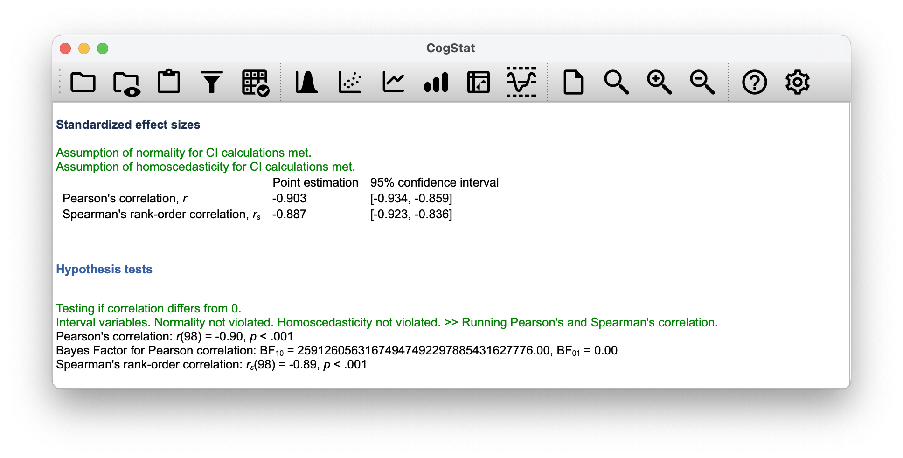

# Linear regression{#regression}

In the past few chapters, we discussed how to test whether your outcome variable's average value is higher in one group or another. In other words, we have been focusing on *differences* between group means or their standard deviations. 

The goal in this chapter is to introduce **linear regression**, the standard tool that statisticians rely on when analysing the *relationship* between interval scale *predictors* and interval scale *outcomes*. Stripped to its bare essentials, linear regression models are basically a slightly fancier version of the Pearson correlation (Chapter \@ref(correl)). Though as we'll see, regression models are much more powerful tools.

You might have seen already in Chapter \@ref(correl) that CogStat gives you a linear regression result. You might also recall the charts with the regression line and the residuals. In this chapter, we'll learn how to interpret these results and how to use them to make predictions.

## What is a linear regression model?{#introregression}

Since the basic ideas in regression are closely tied to correlation, we'll return to the [`parenthood.csv`](resources/data/parenthood.csv) file that we were using to illustrate how correlations work. In this data set, we were analysing babies', parents' and their sleep, and the parents' grumpiness.

Let's go ahead and use `Explore relation of a variable pair` function with `parentsleep` and `parentgrump` variables. 

```{r parentscatters, echo=FALSE, fig.cap="Scatterplots of parent sleep and grumpiness", fig.align="center", out.width="50%", fig.show="hold"}
knitr::include_graphics(c(
    "resources/image/parentsleepgrumpplotnolinreg.png",
    "resources/image/parentsleepgrumpplot.png"
    )
)
```

You'll notice that you have two charts (scatterplots) which are very similar: there's one with and one without a line. The line is called a **regression line**, and it shows the relationship between two variables. It's a straight line that goes through the data points. But what does this mean?

The formula for a straight line is usually written like this:
$$
y = mx + c
$$ 

The two *variables* are $x$ and $y$, and we have two *coefficients*, $m$ and $c$. The coefficient $m$ represents the *slope* of the line (**regression coefficient**), and the coefficient $c$ represents the *$y$-intercept* (**intercept**) of the line.

The regression coefficient is the change in the outcome variable for every unit change in the predictor variable. A slope of $m$ means that if you increase the $x$-value by 1 unit, then the $y$-value goes up by $m$ units; a negative slope means that the $y$-value would go down rather than up. The intercept is the value of the outcome variable when the predictor variable is zero ($x=0$).

If $Y$ is the outcome variable (the DV) and $X$ is the predictor variable (the IV), then the formula that describes our regression is written like this:
$$
\hat{Y_i} = b_1 X_i + b_0
$$

Looks like the same formula, but there's some extra frilly bits in this version. Let's make sure we understand them. Firstly, notice that we have $X_i$ and $Y_i$ rather than just plain old $X$ and $Y$. This is because we want to remember that we're dealing with actual data. In this equation, $X_i$ is the value of predictor variable for the $i$th observation (i.e. the number of hours of sleep on day $i$), and $Y_i$ is the corresponding value of the outcome variable (i.e. the grumpiness on that day). We're assuming that this formula works for all observations in the data set (i.e. for all $i$). Secondly, we also have $\hat{Y}_i$ and not $Y_i$. This is because we want to make the distinction between the *actual data* $Y_i$, and the *estimate* $\hat{Y}_i$ (i.e. the prediction that our regression line is making). Thirdly, we changed the letters used to describe the coefficients from $m$ and $c$ to $b_1$ and $b_0$. That's just the way that statisticians like to refer to the coefficients in a regression model. In any case $b_0$ always refers to the intercept term, and $b_1$ refers to the slope.

We see that the data don't fall perfectly on the line. In other words, the data $Y_i$ are not identical to the predictions of the regression model $\hat{Y_i}$. Since statisticians love to attach letters, names and numbers to everything, let's refer to the difference between the model prediction and that actual data point as a *residual*, and we'll refer to it as $\epsilon_i$.^[The $\epsilon$ symbol is the Greek letter epsilon. It's traditional to use $\epsilon_i$ or $e_i$ to denote a residual.] Written using mathematics, the residuals are defined as:
$$
\epsilon_i = Y_i - \hat{Y}_i
$$
which in turn means that we can write down the complete linear regression model as:
$$
Y_i = b_1 X_i + b_0 + \epsilon_i
$$

## Estimating a linear regression model{#regressionestimation}

Let's redraw the scatterplots just for this example's sake adding some dotted lines to show the distance of each data point to the regression line. The lenght of the lines from the points to the regression line is proportional to the size of the residual.

```{r parentscatterswithresiduals, echo=FALSE, fig.cap="Scatterplot outputs from CogStat of `parentsleep` and `parentgrump` with and without regression lines", fig.align="center", out.width="100%", fig.show="hold"}
knitr::include_graphics("resources/image/parentresiduallines.png")
```

When the regression line is good, our residuals (the lengths of the dotted black lines) all look pretty small, but when the regression line is a bad one, the residuals are a lot larger. The "best fitting" regression line is the one that has the smallest residuals. Or better yet:

> The estimated regression coefficients, $\hat{b}_0$ and $\hat{b}_1$ are those that minimise the sum of the squared residuals, which we could either write as $\sum_i (Y_i - \hat{Y}_i)^2$ or as $\sum_i {\epsilon_i}^2$.

Do note that our regression coefficients are *estimates* (we're trying to guess the parameters that describe a population), which is why he have the little hats, so that we get $\hat{b}_0$ and $\hat{b}_1$ rather than $b_0$ and $b_1$. Since there's actually more than one way to estimate a regression model, the more technical name for this estimation process is **ordinary least squares (OLS) regression**.

At this point, we now have a concrete definition for what counts as our "best" choice of regression coefficients, $\hat{b}_0$ and $\hat{b}_1$. The natural question to ask next is, if our optimal regression coefficients are those that minimise the sum squared residuals, how do we *find* these wonderful numbers? The actual answer to this question is complicated, and it doesn't help you understand the logic of regression.^[On the off chance that someone reading this is a proper kung fu master of linear algebra, it *will* help *you* to know that the solution to the estimation problem turns out to be $\hat{b} = (X^TX)^{-1} X^T y$, where $\hat{b}$ is a vector containing the estimated regression coefficients, $X$ is the "design matrix" that contains the predictor variables (plus an additional column containing all ones; strictly $X$ is a matrix of the regressors.), and $y$ is a vector containing the outcome variable. For everyone else, this isn't exactly helpful, and can be downright scary. However, since quite a few things in linear regression can be written in linear algebra terms, you'll see a bunch of footnotes like this one in this chapter. If you can follow the maths in them, great. If not, ignore it.]  As a result, this time we're just going to interpret the results.

## Interpreting the results of a linear regression{#regressioninterpretation}

We see that CogStat gave us the formula for our line:

```{=html}
<div style="margin: 0 0 1.275em; border: 1px solid #ddd; padding:.85em 1em;">
     <p style="font-size:medium; font-weight:600; color:#4878ce;">Sample properties</p>
     <p style="color:black;">Linear regression: y = -8.937x + 125.956</p>
</div>
```

The most important thing to be able to understand is how to interpret these coefficients. Let's start with $\hat{b}_1$, the slope. If we remember the definition of the slope, a regression coefficient of $\hat{b}_1 = -8.937$ means that if we increase $X_i$ by 1, then we are decreasing $Y_i$ by 8.937. That is, each additional hour of sleep that the parent gains will improve their mood reducing their grumpiness by 8.937 grumpiness points.

What about the intercept? Well, since $\hat{b}_0$ corresponds to "the expected value of $Y_i$ when $X_i$ equals 0", it's pretty straightforward. It implies that if the parent gets zero hours of sleep ($X_i =0$) then their grumpiness will go off the scale, to an insane value of ($Y_i = 125.956$). Best to be avoided.

The next section in the output is a *Residual analysis*.

```{r residualanalysisplot, echo=FALSE, fig.align="center", out.width="100%", fig.show="hold", fig.cap="Residual analysis plots from CogStat"}
knitr::include_graphics("resources/image/parentresidualanalysis.png")
```

The residual plot shows a horizontal line at zero. The $x$ axis shows the independent variable (i.e. `parentsleep`), and the $y$ axis shows the residual values. Ideally, the points should be all over the place randomly. If they are not, then there is a problem with the model. This can be due to outliers or you have a nonlinear relationship between the variables. The residual plot is a good way to check for these problems.

Next to the residual plot, you see a sideways histogram. It depicts the distribution of the residuals. Ideally, the residuals should be normally distributed. If they are not, then, again, you have a problem with your model.

In our example, the residuals are beautifully random, and their distribution is normal. This is a sign that our model is a good one.

Within the `Population parameter estimations`, you'll see the estimated regression coefficients with their 95% confidence interval given. The confidence interval is a range of values that we are 95% confident that the true value of the parameter lies within. In this case, we are 95% confident that the true value of the slope is between -9.787 and -8.086, and that the true value of the intercept is between 119.971 and 131.942. You'll also see a chart depicting the confidence intervals for the regression line. You'll also note that normality and homoscedasticity are checked. These are two assumptions of linear regression. Normality means that the residuals are normally distributed, which we saw earlier. Homoscedasticity means that the residuals are equally distributed across the range of the independent variable, so there is no big chunk on the left or right or centre of the residual plot.

```{r parentregressionresults, echo=FALSE, fig.align="center", out.width="100%", fig.show="hold", fig.cap="Regression coefficients"}
knitr::include_graphics("resources/image/cogstatregressioncoeff.png")
```


## Quantifying the fit of the regression model{#r2}

So we now know how to estimate the coefficients of a linear regression model. The problem is, we don't yet know if this regression model is any good. For example, the model *claims* that every hour of sleep will improve the mood (i.e. reduce grumpiness) by quite a lot, but it might just be rubbish. Remember, the regression model only produces a prediction $\hat{Y}_i$. But the actual mood is $Y_i$. If these two are very close, then the regression model has done a good job. If they are very different, then it has done a bad job.

Once again, let's wrap a little bit of mathematics around this. Firstly, we have the sum of the squared residuals:
$$
\begin{array}{rcl}
\mbox{SS}_{res} &=& \sum_i (Y_i - \hat{Y}_i)^2
    \\
    &=& 1838.722
\end{array}
$$

Secondly, we have the total variability in the outcome variable:
$$
\begin{array}{rcl}
\mbox{SS}_{tot} &=& \sum_i (Y_i - \bar{Y})^2
    \\
    &=&  9998.59
\end{array}
$$

Well, it's a much bigger number than the previous one, so this does suggest that our regression model was making good predictions. But it's not very interpretable. 

Perhaps we can fix this. What we'd like to do is to convert these two fairly meaningless numbers into one number. A nice, interpretable number, which for no particular reason we'll call $R^2$. What we would like is for the value of $R^2$ to be equal to 1 if the regression model makes no errors in predicting the data. In other words, if it turns out that the residual errors are zero -- that is, if $\mbox{SS}_{res} = 0$ -- then we expect $R^2 = 1$. The formula that provides us with out $R^2$ value is pretty simple to write down,
$$
\begin{array}{rcl}
R^2 &=& 1 - \frac{\mbox{SS}_{res}}{\mbox{SS}_{tot}}
    \\
    &=& 1 - \frac{1838.722}{9998.59}
    \\
    &=& 0.816
\end{array}
$$

The $R^2$ value, sometimes called the **coefficient of determination**, has a simple interpretation: it is the *proportion* of the variance in the outcome variable that can be accounted for by the predictor. So in this case, the fact that we have obtained $R^2 = .816$ means that the predictor (`parentsleep`) explains 81.6\% of the variance in the outcome (`parentgrump`).

The $R^2$ value is not currently calculated and displayed by CogStat, so if you need it, you'll have to hold on to your hat and read on a bit.

At this point, we can revisit our claim that regression, in this very simple form, is basically the same thing as a correlation. Previously, we used the symbol $r$ to denote a Pearson correlation. Might there be some relationship between the value of the correlation coefficient $r$ and the $R^2$ value from linear regression? Of course there is!

The squared correlation $r^2$ is identical to the $R^2$ value for a linear regression with only a single predictor. So when you scroll down to the end of the result set, you can gather the Pearson correlation $r$.

You can see a more precise value at the `Standardised effect sizes` section of the output: `Point estimation` for `Pearson's correlation, r` is $-0.903$ (with a CI 95% interval of $-0.934$ to $-0.859$).

You'll also see a two-digit rounded version of it in the `Hypothesis tests` section:

> Pearson's correlation: *r*(98) = -0.90, *p* < 0.001

```{r echo=FALSE, fig.align="center", out.width="100%", fig.show="hold"}

```

So how about you square the Pearson correlation coefficient $r = -0.903$?

$$
\begin{array}{rcl}
r^2 &=& (-0.903)^2
    \\
    &=& 0.816
\end{array}
$$

Voilà, same number. In other words, running a Pearson correlation is more or less equivalent to running a linear regression model that uses only one predictor variable.