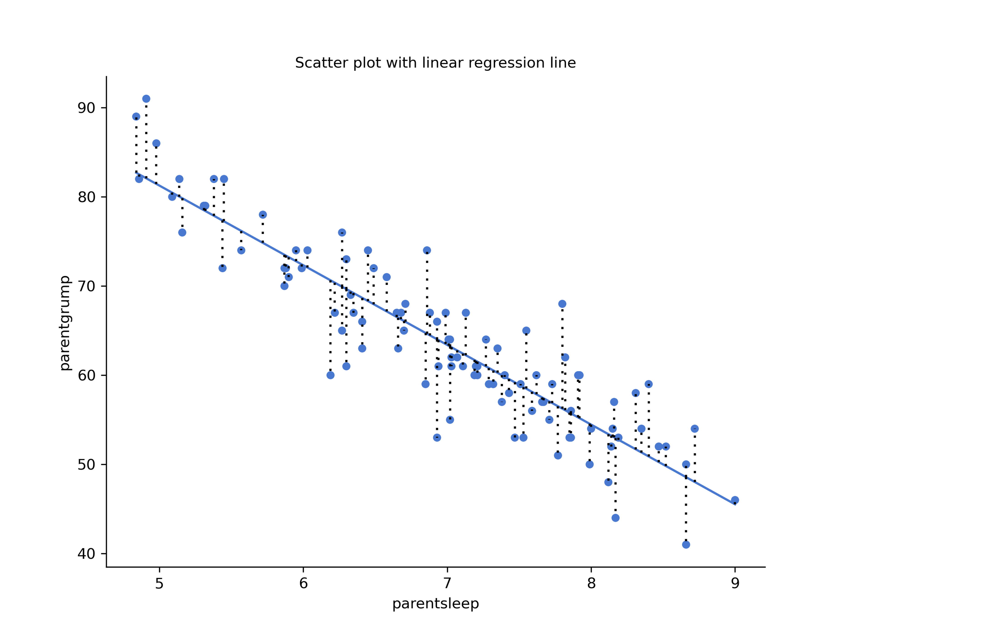
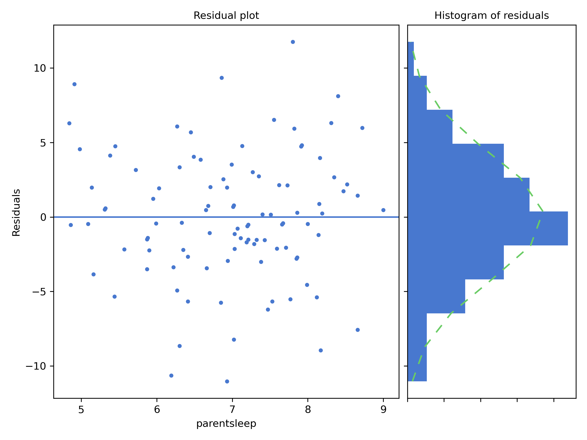
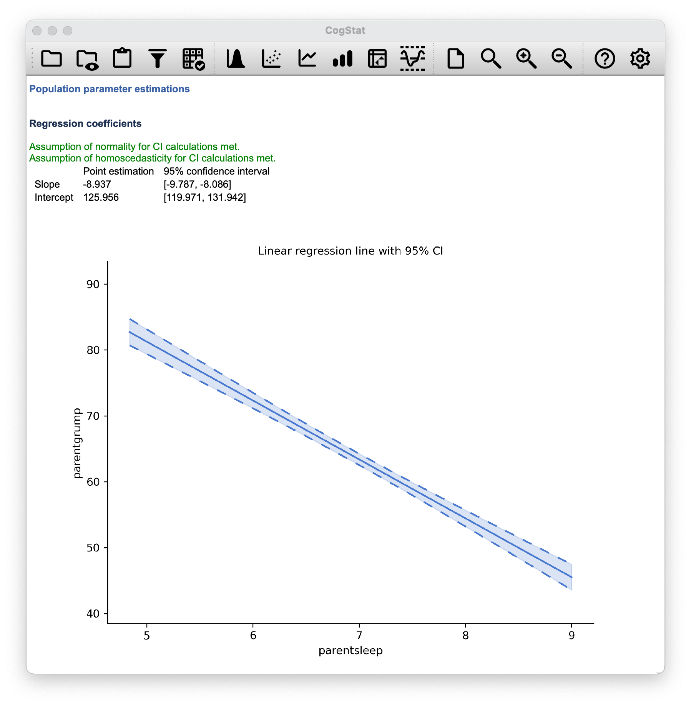
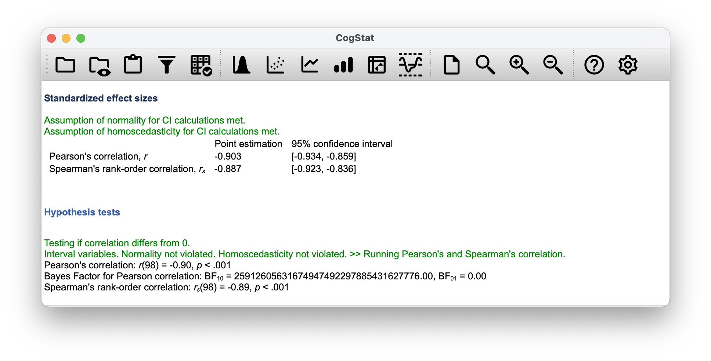
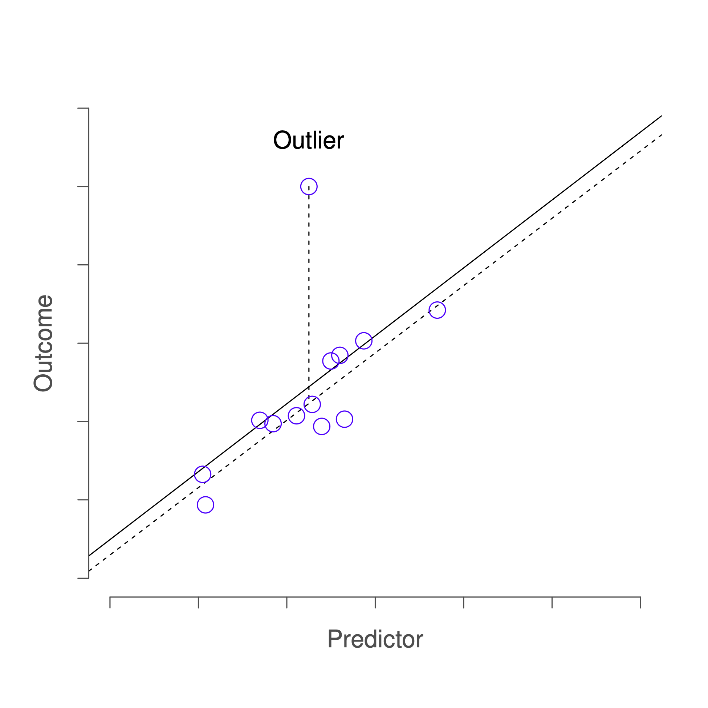
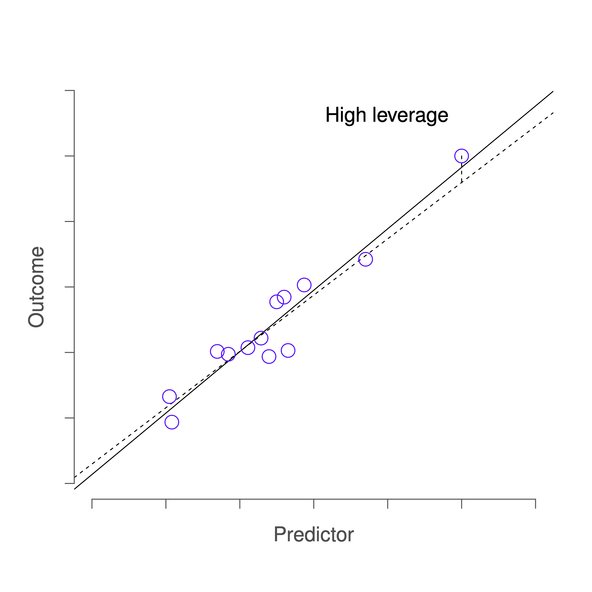
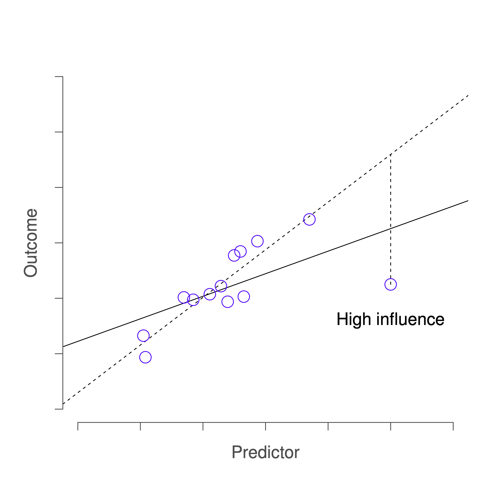

# Linear regression{#regression}

In the past few chapters, we discussed how to test whether your outcome variable's average value is higher in one group or another. In other words, we have been focusing on *differences* between group means or their standard deviations. 

The goal of this chapter is to introduce **linear regression**, the standard tool that statisticians rely on when analysing the ***relationship*** between interval scale *predictors* and interval scale *outcomes*. Stripped to its bare essentials, linear regression models are basically a slightly fancier version of the Pearson correlation (Chapter \@ref(correl)). Though as we'll see, regression models are much more powerful tools.

You might have seen already in Chapter \@ref(correl) that CogStat gives you a linear regression result. You might also recall the charts with the regression line and the residuals. In this chapter, we'll learn how to interpret these results and how to use them to make predictions.

## What is a linear regression model?{#introregression}

Since the basic ideas in regression are closely tied to correlation, we'll return to the [`parenthood.csv`](resources/data/parenthood.csv) file that we were using to illustrate how correlations work. In this data set, we were analysing babies', parents' and their sleep, and the parents' grumpiness.

Let's go ahead and use `Explore relation of a variable pair` function with `parentsleep` and `parentgrump` variables. 

```{r parentscatters, echo=FALSE, fig.cap="Scatterplots of parent sleep and grumpiness", fig.align="center", out.width="50%", fig.show="hold"}
knitr::include_graphics(c(
    "resources/image/parentsleepgrumpplotnolinreg.png",
    "resources/image/parentsleepgrumpplot.png"
    )
)
```

You'll notice that you have two charts (scatterplots) which are very similar: there's one with and one without a line. The line is called a **regression line**, and it shows the relationship between two variables. It's a straight line that goes through the data points. But what does this mean?

The formula for a straight line is usually written like this:
$$
y = mx + c
$$ 

The two *variables* are $x$ and $y$, and we have two *coefficients*, $m$ and $c$. The coefficient $m$ represents the *slope* of the line (**regression coefficient**), and the coefficient $c$ represents the *$y$-intercept* (**intercept**) of the line.

The regression coefficient is the change in the outcome variable for every unit change in the predictor variable. A slope of $m$ means that if you increase the $x$-value by 1 unit, then the $y$-value goes up by $m$ units; a negative slope means that the $y$-value would go down rather than up. The intercept is the value of the outcome variable when the predictor variable is zero ($x=0$).

If $Y$ is the outcome variable (the DV) and $X$ is the predictor variable (the IV), then the formula that describes our regression is written like this:
$$
\hat{Y_i} = b_1 X_i + b_0
$$

Looks like the same formula, but there are some extra frilly bits in this version. Let's make sure we understand them. Firstly, notice that we have $X_i$ and $Y_i$ rather than just plain old $X$ and $Y$. This is because we want to remember that we're dealing with actual data. In this equation, $X_i$ is the value of the predictor variable for the $i$th observation (i.e. the number of hours of sleep on day $i$), and $Y_i$ is the corresponding value of the outcome variable (i.e. the grumpiness on that day). We're assuming that this formula works for all observations in the data set (i.e. for all $i$). Secondly, we also have $\hat{Y}_i$ and not $Y_i$. This is because we want to make the distinction between the *actual data* $Y_i$, and the *estimate* $\hat{Y}_i$ (i.e. the prediction that our regression line is making). Thirdly, we changed the letters used to describe the coefficients from $m$ and $c$ to $b_1$ and $b_0$. That's just the way that statisticians like to refer to the coefficients in a regression model. In any case, $b_0$ always refers to the intercept term, and $b_1$ refers to the slope.

We see that the data don't fall perfectly on the line. In other words, the data $Y_i$ are not identical to the predictions of the regression model $\hat{Y_i}$. Since statisticians love to attach letters, names and numbers to everything, let's refer to the difference between the model prediction and that actual data point as a *residual*, and we'll refer to it as $\epsilon_i$.^[The $\epsilon$ symbol is the Greek letter epsilon. It's traditional to use $\epsilon_i$ or $e_i$ to denote a residual.] The residuals are defined as:
$$
\epsilon_i = Y_i - \hat{Y}_i
$$
which in turn means that we can write down the complete linear regression model as:
$$
Y_i = b_1 X_i + b_0 + \epsilon_i
$$

## Estimating a linear regression model{#regressionestimation}

Let's redraw the scatterplots just for this example's sake adding some dotted lines to show the distance of each data point to the regression line. The length of the lines from the points to the regression line is proportional to the size of the residual.

```{r parentscatterswithresiduals, echo=FALSE, fig.cap="Scatterplot outputs from CogStat of `parentsleep` and `parentgrump` with and without regression lines", fig.align="center", fig.show="hold"}

```

When the regression line is good, our residuals (the lengths of the dotted black lines) all look pretty small, but when the regression line is a bad one, the residuals are a lot larger. The "best fitting" regression line is the one that has the smallest residuals. Or better yet:

> The estimated regression coefficients, $\hat{b}_0$ and $\hat{b}_1$ are those that minimise the sum of the squared residuals, which we could either write as $\sum_i (Y_i - \hat{Y}_i)^2$ or as $\sum_i {\epsilon_i}^2$.

Do note that our regression coefficients are *estimates* (we're trying to guess the parameters that describe a population), which is why he have the little hats, so that we get $\hat{b}_0$ and $\hat{b}_1$ rather than $b_0$ and $b_1$. Since there's actually more than one way to estimate a regression model, the more technical name for this estimation process is **ordinary least squares (OLS) regression**.

At this point, we now have a concrete definition for what counts as our "best" choice of regression coefficients, $\hat{b}_0$ and $\hat{b}_1$. The natural question to ask next is, if our optimal regression coefficients are those that minimise the sum squared residuals, how do we *find* these wonderful numbers? The actual answer to this question is complicated, and it doesn't help you understand the logic of regression.^[On the off chance that someone reading this is a proper kung fu master of linear algebra, it *will* help *you* to know that the solution to the estimation problem turns out to be $\hat{b} = (X^TX)^{-1} X^T y$, where $\hat{b}$ is a vector containing the estimated regression coefficients, $X$ is the "design matrix" that contains the predictor variables (plus an additional column containing all ones; strictly $X$ is a matrix of the regressors.), and $y$ is a vector containing the outcome variable. For everyone else, this isn't exactly helpful, and can be downright scary. However, since quite a few things in linear regression can be written in linear algebra terms, you'll see a bunch of footnotes like this one in this chapter. If you can follow the maths in them, great. If not, ignore it.]  As a result, this time we're just going to interpret the results.

## Interpreting the results of a linear regression{#regressioninterpretation}

We see that CogStat gave us the formula for our line:

```{r, eval=knitr::is_html_output(), echo=FALSE}
htmltools::includeHTML("resources/html/samprop1.html")
```

```{r, echo=FALSE}
if (knitr::is_latex_output()) {
  knitr::asis_output(
      xfun::file_string("resources/html/samprop1.txt")
  )
}
```

The most important thing to be able to understand is how to interpret these coefficients. Let's start with $\hat{b}_1$, the slope. If we remember the definition of the slope, a regression coefficient of $\hat{b}_1 = -8.937$ means that if we increase $X_i$ by 1, then we are decreasing $Y_i$ by 8.937. That is, each additional hour of sleep that the parent gains will improve their mood reducing their grumpiness by 8.937 grumpiness points.

What about the intercept? Well, since $\hat{b}_0$ corresponds to "the expected value of $Y_i$ when $X_i$ equals 0", it's pretty straightforward. It implies that if the parent gets zero hours of sleep ($X_i =0$) then their grumpiness will go off the scale, to an insane value of ($Y_i = 125.956$). Best to be avoided.

The next section in the output is a *Residual analysis*.

```{r residualanalysisplot, echo=FALSE, fig.align="center", fig.show="hold", fig.cap="Residual analysis plots from CogStat"}

```

The residual plot shows a horizontal line at zero. The $x$ axis shows the independent variable (i.e. `parentsleep`), and the $y$ axis shows the residual values. Ideally, the points should be all over the place randomly. If they are not, then there is a problem with the model. This can be due to outliers, or you have a nonlinear relationship between the variables. The residual plot is a good way to check for these problems.

Next to the residual plot, you see a sideways histogram. It depicts the distribution of the residuals. Ideally, the residuals should be normally distributed. If they are not, then, again, you have a problem with your model.

In our example, the residuals are beautifully random, and their distribution is normal. This is a sign that our model is a good one.

Within the `Population parameter estimations`, you'll see the estimated regression coefficients with their 95% confidence interval given. The confidence interval is a range of values that we are 95% confident that the true value of the parameter lies within. In this case, we are 95% confident that the true value of the slope is between -9.787 and -8.086, and that the true value of the intercept is between 119.971 and 131.942. You'll also see a chart depicting the confidence intervals for the regression line. You'll also note that normality and homoscedasticity are checked. These are two assumptions of linear regression. Normality means that the residuals are normally distributed, which we saw earlier. Homoscedasticity means, very simplistically, that the residuals are equally distributed across the range of the independent variable, so there is no big chunk on one side of the residual plot.

```{r parentregressionresults, echo=FALSE, fig.align="center", fig.show="hold", fig.cap="Regression coefficients"}

```

### Confidence intervals for the coefficients

Like any population parameter, the regression coefficients cannot be estimated with complete precision from a sample of data; that's part of why we need hypothesis tests. Given this, it's quite useful to be able to report confidence intervals that capture our uncertainty about the true value of $b$. This is especially useful when the research question focuses heavily on an attempt to find out *how* strongly variable $X$ is related to variable $Y$, since in those situations the interest is primarily in the regression weight $b$. Fortunately, confidence intervals for the regression weights can be constructed in the usual fashion, 
$$
\mbox{CI}(b) = \hat{b} \pm \left( t_{crit} \times \mbox{SE}({\hat{b})}  \right)
$$
where $\mbox{SE}({\hat{b}})$ is the standard error of the regression coefficient, and $t_{crit}$ is the relevant critical value of the appropriate $t$ distribution. For instance, if it's a 95\% confidence interval that we want, then the critical value is the 97.5th quantile of a $t$ distribution with $N-K-1$ degrees of freedom.  In other words, this is basically the same approach to calculating confidence intervals that we've used throughout.

As you've seen on Figure \@ref(fig:parentregressionresults), CogStat gives us the confidence intervals for the regression coefficients.

Simple enough.


## Quantifying the fit of the regression model{#r2}

So we now know how to estimate the coefficients of a linear regression model. The problem is, we don't yet know if this regression model is any good. For example, the model *claims* that every hour of sleep will improve the mood (i.e. reduce grumpiness) by quite a lot, but it might just be rubbish. Remember, the regression model only produces a prediction $\hat{Y}_i$. But the actual mood is $Y_i$. If these two are very close, then the regression model has done a good job. If they are very different, then it has done a bad job.

Once again, let's wrap a little bit of mathematics around this. Firstly, we have the sum of the squared residuals:
$$
\begin{array}{rcl}
\mbox{SS}_{res} &=& \sum_i (Y_i - \hat{Y}_i)^2
    \\
    &=& 1838.722
\end{array}
$$

Secondly, we have the total variability in the outcome variable:
$$
\begin{array}{rcl}
\mbox{SS}_{tot} &=& \sum_i (Y_i - \bar{Y})^2
    \\
    &=&  9998.59
\end{array}
$$

Well, it's a much bigger number than the previous one, so this does suggest that our regression model was making good predictions. But it's not very interpretable. 

Perhaps we can fix this. What we'd like to do is to convert these two fairly meaningless numbers into one number. A nice, interpretable number, which for no particular reason we'll call $R^2$. What we would like is for the value of $R^2$ to be equal to 1 if the regression model makes no errors in predicting the data. In other words, if it turns out that the residual errors are zero -- that is, if $\mbox{SS}_{res} = 0$ -- then we expect $R^2 = 1$. The formula that provides us with our $R^2$ value is pretty simple to write down,
$$
\begin{array}{rcl}
R^2 &=& 1 - \frac{\mbox{SS}_{res}}{\mbox{SS}_{tot}}
    \\
    &=& 1 - \frac{1838.722}{9998.59}
    \\
    &=& 0.816
\end{array}
$$

The $R^2$ value, sometimes called the **coefficient of determination**, has a simple interpretation: it is the *proportion* of the variance in the outcome variable that can be accounted for by the predictor. So in this case, the fact that we have obtained $R^2 = .816$ means that the predictor (`parentsleep`) explains 81.6\% of the variance in the outcome (`parentgrump`).

The $R^2$ value is not currently calculated and displayed by CogStat, so if you need it, you'll have to hold on to your hat and read on a bit.

At this point, we can revisit our claim that regression, in this very simple form, is basically the same thing as a correlation. Previously, we used the symbol $r$ to denote a Pearson correlation. Might there be some relationship between the value of the correlation coefficient $r$ and the $R^2$ value from linear regression? Of course there is!

The squared correlation $r^2$ is identical to the $R^2$ value for a linear regression with only a single predictor. So when you scroll down to the end of the result set, you can gather the Pearson correlation $r$.

You can see a more precise value in the `Standardised effect sizes` section of the output: `Point estimation` for `Pearson's correlation, r` is $-0.903$ (with a CI 95% interval of $-0.934$ to $-0.859$).

You'll also see a two-digit rounded version of it in the `Hypothesis tests` section:

> Pearson's correlation: *r*(98) = -0.90, *p* < 0.001

```{r echo=FALSE, fig.align="center", fig.show="hold"}

```

So how about you square the Pearson correlation coefficient $r = -0.903$?

$$
\begin{array}{rcl}
r^2 &=& (-0.903)^2
    \\
    &=& 0.816
\end{array}
$$

Voilà, same number. In other words, running a Pearson correlation is more or less equivalent to running a linear regression model that uses only one predictor variable.

### The adjusted $R^2$ value

One final thing to point out before moving on. It's quite common for people to report a slightly different measure of model performance, known as "adjusted $R^2$". The motivation behind calculating the adjusted $R^2$ value is the observation that adding more predictors into the model will *always* call the $R^2$ value to increase (or at least not decrease). The adjusted $R^2$ value introduces a slight change to the calculation, as follows. For a regression model with $K$ predictors, fit to a data set containing $N$ observations, the adjusted $R^2$ is:
$$
\mbox{adj. } R^2 = 1 - \left(\frac{\mbox{SS}_{res}}{\mbox{SS}_{tot}} \times \frac{N-1}{N-K-1} \right)
$$
This adjustment is an attempt to take the degrees of freedom into account. The big advantage of the adjusted $R^2$ value is that when you add more predictors to the model, the adjusted $R^2$ value will only increase if the new variables improve the model performance more than you'd expect by chance. The big disadvantage is that the adjusted $R^2$ value *can't* be interpreted in the elegant way that $R^2$ can. $R^2$ has a simple interpretation as the proportion of variance in the outcome variable that is explained by the regression model but no equivalent interpretation exists for adjusted $R^2$.

An obvious question then, is whether you should report $R^2$ or adjusted $R^2$. This is probably a matter of personal preference. If you care more about interpretability, then $R^2$ is better. If you care more about correcting for bias, then adjusted $R^2$ is probably better. This feature is not currently implemented in CogStat. Just for your reference, the statistic for our example is: $adj. R^2 = 0.814$. Not too big a difference.


## Hypothesis tests for regression models{#regressiontests}

So far, we've talked about what a regression model is, how the coefficients of a regression model are estimated, and how we quantify the performance of the model (the last of these, incidentally, is basically our measure of effect size). The next thing we need to talk about is hypothesis tests for the regression models themselves.

There are two different (but related) kinds of hypothesis tests that we need to talk about: those in which we test whether the regression model as a whole is performing significantly better than a null model; and those in which we test whether a particular regression coefficient is significantly different from zero.

At this point, you're probably groaning internally, thinking we're going to introduce a whole new collection of tests. You're probably sick of hypothesis tests by now, and don't want to learn any new ones. Well, you're lucky, because we can shamelessly reuse the $F$-test from Chapter \@ref(anova) as an overall model test, and the $t$-test from Chapter \@ref(ttest) as testing the coefficients.

Testing the overall regression model is not implemented in CogStat yet. As you've seen in the result set, the Hypothesis tests section will show the Pearson's correlation coefficient and the Spearman's rank-order correlation coefficient. To be clear, it is testing particularly the null hypothesis that *the correlation coefficient is zero*, but not the null hypothesis that *the regression model is not performing significantly better than a null model*.

However, it's still good to understand these tests, so let's talk about them briefly.


### Testing the model as a whole

Okay, suppose you've estimated your regression model. The first hypothesis test you might want to try is one in which the null hypothesis is that there is *no relationship* between the predictors and the outcome, and the alternative hypothesis is that *the data are distributed in exactly the way that the regression model predicts*. Formally, our "null model" corresponds to the fairly trivial "regression" model in which we include 0 predictors, and only include the intercept term $b_0$
$$
H_0: Y_i = b_0 + \epsilon_i
$$

If our regression model has $K$ predictors, the "alternative model" is described using the usual formula for a multiple regression model:
$$
H_1: Y_i = \left( \sum_{k=1}^K b_{k} X_{ik} \right) + b_0 + \epsilon_i
$$

How can we test these two hypotheses against each other? The trick is to understand that just like we did with ANOVA, it's possible to divide up the *total variance* $\mbox{SS}_ {tot}$ into the *sum of the residual variance* $\mbox{SS}_ {res}$ and the *regression model variance* $\mbox{SS}_ {mod}$. Skipping over the technicalities, note that:
$$
\mbox{SS}_{mod} = \mbox{SS}_{tot} - \mbox{SS}_{res}
$$

And, just like we did with the ANOVA, we can convert the sums of squares in to mean squares by dividing by the degrees of freedom. 
$$
\begin{array}{rcl}
\mbox{MS}_{mod} &=& \displaystyle\frac{\mbox{SS}_{mod} }{df_{mod}} \\ \\
\mbox{MS}_{res} &=& \displaystyle\frac{\mbox{SS}_{res} }{df_{res} }
\end{array}
$$

So, how many degrees of freedom do we have? As you might expect, the $df$ associated with the model is closely tied to the number of predictors that we've included. In fact, it turns out that $df_{mod} = K$. For the residuals, the total degrees of freedom is $df_{res} = N - K - 1$. 

Now that we've got our mean square values, you're probably going to be entirely unsurprised (possibly even bored) to discover that we can calculate an $F$-statistic like this:
$$
F =  \frac{\mbox{MS}_{mod}}{\mbox{MS}_{res}}
$$
and the degrees of freedom associated with this are $K$ and $N-K-1$. This $F$ statistic has exactly the same interpretation as the one we introduced in Chapter \@ref(anova). Large $F$ values indicate that the null hypothesis is performing poorly in comparison to the alternative hypothesis.

The $F$-test for our `parentsleep` and `parentgrump` variable pair is:
$$
F(1, 98) = 434.906, p < 0.001
$$.


### Tests for individual coefficients

The $F$-test that we've just introduced is useful for checking that the model as a whole is performing better than chance. This is important: if your regression model doesn't produce a significant result for the $F$-test then you probably don't have a very good regression model (or, quite possibly, you don't have very good data). 

However, while failing the $F$-test is a pretty strong indicator that the model has problems, *passing* the test (i.e. rejecting the null) doesn't imply that the model is good! Why is that, you might be wondering? 

The estimated regression coefficient is quite large for the `parentsleep` variable ($-8.937$)^[If you recall our result was: `Linear regression: y = -8.937x + 125.95`]. Should we run an analysis with the pair of `babysleep` and `parentgrump`, we'd notice the linear regression line is: `Linear regression: y = -2.742x + 85.782`, meaning our regression coefficient is much smaller.

Let us combine these two predictors into a single model without CogStat^[This feature is not available in CogStat at the moment of writing, but this section will definitely be updated when it is.], and add both `babysleep` and `parentsleep` to the model predicting `parentgrump`, we get the following result:

```{r echo=FALSE, fig.align="center", warning=FALSE, message=FALSE}
knitr::kable(
    cbind(
        c("babysleep", "parentsleep", "Intercept"),
        c(0.011, "-8.950", 125.966),
        c(-0.527, -10.049, 119.930),
        c(0.549, -7.852, 132.001)
    ), caption = "Model coefficients for the combined model with both predictors at $\\alpha = 0.05$",
    align = "lrrr", booktabs = TRUE, escape = FALSE, format = "markdown",
    col.names = c("Predictor", "Coefficient estimate",
        "95% CI (low)", "95% CI (high)")
)
```

Given that these two variables are absolutely on the same scale (they're both measured in "hours slept"), this is suspicious. In fact, we should begin to suspect that the amount of sleep that the parent gets is what really only matters in order to predict their grumpiness.

Once again, we can reuse a hypothesis test that we discussed earlier, this time the $t$-test. The test that we're interested in has a null hypothesis that the true regression coefficient is zero ($b = 0$), which is to be tested against the alternative hypothesis that it isn't ($b \neq 0$). That is:
$$
\begin{array}{rl}
H_0: & b = 0 \\
H_1: & b \neq 0 
\end{array}
$$

How can we test this? Well, if the central limit theorem is kind to us, we might be able to guess that the sampling distribution of $\hat{b}$, the estimated regression coefficient, is a normal distribution with mean centred on $b$. What that would mean is that if the null hypothesis were true, then the sampling distribution of $\hat{b}$ has mean zero and unknown standard deviation. Assuming that we can come up with a good estimate for the standard error of the regression coefficient, $\mbox{SE}({\hat{b}})$, then we're in luck. That's *exactly* the situation for which we introduced the one-sample $t$ way back in Chapter \@ref(ttest). So let's define a $t$-statistic like this,
$$
t = \frac{\hat{b}}{\mbox{SE}({\hat{b})}}
$$

Our degrees of freedom in this case are $df = N- K- 1$. Irritatingly, the estimate of the standard error of the regression coefficient, $\mbox{SE}({\hat{b}})$, is not as easy to calculate as the standard error of the mean that we used for the simpler $t$-tests in Chapter \@ref(ttest). In fact, the formula is somewhat ugly, and not terribly helpful to look at. For our purposes, it's sufficient to point out that the standard error of the estimated regression coefficient depends on both the predictor and outcome variables, and is somewhat sensitive to violations of the homogeneity of variance assumption (discussed shortly).

In any case, this $t$-statistic can be interpreted in the same way as the $t$-statistics that we discussed in Chapter \@ref(ttest). Assuming that you have a two-sided alternative (i.e. you don't really care if $b >0$ or $b < 0$), then it's the extreme values of $t$ (i.e. a lot less than zero or a lot greater than zero) that suggest that you should reject the null hypothesis. 

```{r linrcombnobeta, echo=FALSE, fig.align="center", fig.show="hold"}
knitr::kable(
    cbind(
        c("babysleep", "parentsleep", "Intercept"),
        c(0.011, "-8.950", 125.966),
        c(-0.527, -10.049, 119.930),
        c(0.549, -7.852, 132.001),
        c(0.039, -16.172, 41.423),
        c(0.969, "<.001", "<.001")
    ), caption = "Model coefficients for the combined model with both predictors at $\\alpha = 0.05$ with $t$-statistics",
    align = "lrrrrr", booktabs = TRUE, digits = 3, escape = FALSE,
    format = "markdown",
    col.names = c("Predictor", "Coefficient estimate",
        "95% CI (low)", "95% CI (high)", "$t$-statistic", "$p$-value")
)
```

Let's run the $F$-test for the combined model with the total degrees of freedom is $df_{res} = N - K - 1$, and we calculate the $R^2$, we get:
$$
F(2, 97) = 215.238, p < 0.001
$$

$$
R^2 = 0.816
$$

So in this case, the model performs significantly better than you'd expect by chance ($F(2,97) = 215.2$, $p<.001$), which isn't all that surprising: the $R^2 = .816$ value indicate that the regression model accounts for 81.6\% of the variability in the outcome measure. However, when we look back up at the $t$-tests for each of the individual coefficients, we have pretty strong evidence that the `babysleep` variable has no significant effect; all the work is being done by the `parentsleep` variable. Taken together, these results suggest that `babysleep > parentgrump` is actually the wrong model for the data: you'd probably be better off dropping the `babysleep` predictor entirely. In other words, the `parentsleep > parentgrump` model that we started with is the better model.

### Calculating standardised regression coefficients{#stdcoef}

One more thing that you might want to do is to calculate "standardised" regression coefficients, often denoted $\beta$. The rationale behind standardised coefficients goes like this. In a lot of situations, your variables are on fundamentally different scales. E.g. a 7-point Likert scale compared to a 5-point one; IQ scores compared to years of education; or, in our case, hours of sleep compared to grumpiness. In these situations, it's not really fair to compare the regression coefficients for the two variables. 

Yet, there are situations where you simply must make comparisons between different coefficients. Specifically, you might want some kind of standard measure of which predictors have the strongest relationship to the outcome. This is what **standardised coefficients** aim to do. 

The basic idea is quite simple: the standardised coefficients are the coefficients that you would have obtained if you'd converted all the variables to $z$-scores before running the regression.  The idea here is that, by converting all the predictors to $z$-scores, they all go into the regression on the same scale, thereby removing the problem of having variables on different scales. Regardless of what the original variables were, a $\beta$ value of 1 means that an increase in the predictor of 1 *standard deviation* will produce a corresponding 1 *standard deviation increase* in the outcome variable. Therefore, if variable A has a larger absolute value of $\beta$ than variable B, it is deemed to have a stronger relationship with the outcome. Or at least that's the idea: it's worth being a little cautious here, since this does rely very heavily on the assumption that "a 1 standard deviation change" is fundamentally the same kind of thing for all variables. It's not always obvious that this is true.

Leaving aside the interpretation issues, let's look at how it's calculated. What you could do is standardise all the variables yourself and then run a regression^[Which is what you have to do now, as this is not implemented in CogStat yet.].

The $\beta$ coefficient for a predictor $X$ and outcome $Y$ has a very simple formula, namely
$$
\beta_X = b_X \times \frac{\sigma_X}{\sigma_Y} 
$$
where $\sigma_X$ is the standard deviation of the predictor, and $\sigma_Y$ is the standard deviation of the outcome variable $Y$.

What does this mean in our original example (i.e. `parentsleep` and `parentgrump`)?

To calculate this manually with CogStat, you can use `Explore variable` function to get the Standard deviation of both the predictor and outcome variables:

- (`parentsleep` is $X$) $\sigma_X = 1.011$, and
- (`parentgrump` is $Y$) $\sigma_Y = 10.0$.

Then you can use the `Explore relation of variable pair` function (which we've been using in this Chapter) to get the $b_X$ value. In this case, it was $-8.937$. Let's put these figures in the formula:

$$
\begin{array}{rcl}
\beta_X &=& b_X \times \frac{\sigma_X}{\sigma_Y}
    \\
    &=& -8.937 \times \frac{1.011}{10}
    \\
    &=& -0.903
\end{array}
$$

To calculate it for our combined model manually, we can use the same, just with different figures (see Table \@ref(tab:linrcombnobeta)): $b_X$ for `parentsleep` is $-8.950$ and $b_X$ for `babysleep` is $0.011$. We know the $\sigma$ values for `parentsleep` and `parentgrump`, so we only need to calculate the $\sigma$ value for `babysleep` using the `Explore variable` and getting the Standard deviation. In this case, it's $2.064$.

So putting these in the formula, we get the followings:

- `parentsleep`:
$$
\begin{array}{rcl}
\beta_X &=& b_X \times \frac{\sigma_X}{\sigma_Y}
    \\
    &=& -8.950 \times \frac{1.011}{10}
    \\
    &=& -0.905
\end{array}
$$
- `babysleep`:
$$
\begin{array}{rcl}
\beta_X &=& b_X \times \frac{\sigma_X}{\sigma_Y}
    \\
    &=& 0.011 \times \frac{2.064}{10}
    \\
    &=& 0.002
\end{array}
$$

```{r echo=FALSE, fig.align="center", fig.show="hold"}
knitr::kable(
    cbind(
        c("babysleep", "parentsleep", "Intercept"), # predictor
        c(0.011, "-8.950", 125.966), # coefficient estimate
        c(0.002, -0.905, "--"), # standardised coefficient estimate
        c(-0.527, -10.049, 119.930), # 95% CI (low)
        c(0.549, -7.852, 132.001), # 95% CI (high)
        c(0.039, -16.172, 41.423), # t-statistic
        c(0.969, "<.001", "<.001") # p-value
    ), caption = "Model coefficients (both estimate and standardised estimate) for the combined model with both predictors at $\\alpha = 0.05$ with $t$-statistics",
    align = "lrrrrrr", booktabs = TRUE, digits = 3, escape = FALSE,
    format = "markdown",
    col.names = c("Predictor", "Coefficient estimate",
    "Standardised coefficient ($\\beta$)",
    "95% CI (low)", "95% CI (high)",
    "$t$-statistic", "$p$-value")
)
```

This clearly shows that the `parentsleep` variable has a much stronger effect than the `babysleep` variable. Also, let's not forget that this $\beta$ coefficient can also have a confidence interval, which we are not going to cover now.

This, however, is a perfect example of a situation where it would probably make sense to use the original coefficients $b$ rather than the standardised coefficients $\beta$. After all, the parent's sleep and the baby's sleep are *already* on the same scale: number of hours slept. Why complicate matters by converting these to $z$-scores?

## Model checking{#regressiondiagnostics}

The main focus of this section is **regression diagnostics**^[Some parts of this chapter was influenced by @Fox2011.], a term that refers to the art of checking that the assumptions of your regression model have been met, figuring out how to fix the model if the assumptions are violated, and generally to check that nothing "funny" is going on.

If done manually, and not with an automatic statistics software, it's easy to get lost in all the details of checking this thing or that thing, and it's quite exhausting to try to remember what all the different things are. This has the very nasty side effect that a lot of people get frustrated when trying to learn *all* the tools, so instead they decide not to do *any* model checking. This is a bit of a worry!

In this section, we discuss several different things you can theoretically do to check that your regression model is doing what it's supposed to.

### Three kinds of residuals

The majority of regression diagnostics revolve around looking at the residuals. In particular, the following three kinds of residual are referred to in this section: "ordinary residuals" (which in some cases is identical to "Pearson residual"), "standardised residuals", and "Studentised residuals".

The first and simplest kind of residuals that we care about are **ordinary residuals**. These are the actual, raw residuals we've been talking about throughout this chapter. The ordinary residual is just the difference between the fitted value $\hat{Y}_i$ and the observed value $Y_i$. We've been using the notation $\epsilon_i$ to refer to the $i$-th ordinary residual. With this in mind, we have a very simple equation:
$$
\epsilon_i = Y_i - \hat{Y}_i
$$

One drawback to using ordinary residuals is that they're always on a different scale, depending on what the outcome variable is and how good the regression model is. The ordinary residuals will have mean 0; but the variance is different for every regression.

In a lot of contexts, especially where you're only interested in the *pattern* of the residuals and not their actual values, it's convenient to estimate the **standardised residuals**, which are normalised in such a way as to have standard deviation 1. The way we calculate these is, we divide the ordinary residual by an estimate of the (population) standard deviation of these residuals. For technical reasons, the formula for this is:
$$
\epsilon_{i}^\prime = \frac{\epsilon_i}{\hat{\sigma} \sqrt{1-h_i}}
$$
where $\hat\sigma$ in this context is the estimated population standard deviation of the ordinary residuals, and $h_i$ is the "hat value" of the $i$th observation. For now, it's enough to interpret the standardised residuals as if we'd converted the ordinary residuals to $z$-scores. In fact, that is more or less the truth, it's just that we're being a bit fancier.

The third kind of residuals are **Studentised residuals**, and they're even fancier than standardised residuals. Again, the idea is to take the ordinary residual and divide it by some quantity in order to estimate some standardised notion of the residual, but the formula for doing the calculations this time is subtly different:
$$
\epsilon_{i}^* = \frac{\epsilon_i}{\hat{\sigma}_{(-i)} \sqrt{1-h_i}}
$$

Notice that our estimate of the standard deviation here is written $\hat{\sigma}_{(-i)}$. This corresponds to the estimate of the residual standard deviation that you *would have obtained*, if you just deleted the $i$th observation from the data set. This sounds like the sort of thing that would be a nightmare to calculate, since it seems to be saying that you have to run $N$ new regression models (even a modern computer might grumble a bit at that, especially if you've got a large data set). Fortunately, this standard deviation estimate is actually given by the following equation:
$$
\hat\sigma_{(-i)} = \hat{\sigma} \ \sqrt{\frac{N-K-1 - {\epsilon_{i}^\prime}^2}{N-K-2}}
$$

It's always nice to know how to actually get hold of these things yourself in case you ever need to do something non-standard.

### Three kinds of anomalous data{#regressionoutliers}

One danger that you can run into with linear regression models is that your analysis might be disproportionately sensitive to a smallish number of "unusual" or "anomalous" observations. In the context of linear regression, there are three conceptually distinct ways in which an observation might be called "anomalous". All three are interesting, but they have rather different implications for your analysis.

The first kind of unusual observation is an **outlier**. The definition of an outlier (in this context) is an observation that is very different from what the regression model predicts. An example is shown in Figure \@ref(fig:outlier). In practice, we operationalise this concept by saying that an outlier is an observation that has a very large Studentised residual, $\epsilon_i^*$. Outliers are interesting: a big outlier *might* correspond to junk data. E.g. the variables might have been entered incorrectly, or some other defect may be detectable. Note that you shouldn't throw an observation away just because it's an outlier. But the fact that it's an outlier is often a cue to look more closely at that case, and try to find out why it's so different.

```{r outlier, fig.cap="An illustration of outliers. The dotted lines plot the regression line that would have been estimated without the anomalous observation included, and the corresponding residual (i.e. the Studentised residual). The solid line shows the regression line with the anomalous observation included. The outlier has an unusual value on the outcome (y axis location) but not the predictor (x axis location), and lies a long way from the regression line.", echo=FALSE, fig.align="center"}

```

The second way in which an observation can be unusual is if it has high **leverage**: this happens when the observation is very different from all the other observations. This doesn't necessarily have to correspond to a large residual: if the observation happens to be unusual on all variables in precisely the same way, it can actually lie very close to the regression line. An example of this is shown in Figure \@ref(fig:leverage).

```{r leverage, fig.cap="An illustration of high leverage points. The anomalous observation in this case is unusual both in terms of the predictor (x axis) and the outcome (y axis), but this unusualness is highly consistent with the pattern of correlations that exists among the other observations; as a consequence, the observation falls very close to the regression line and does not distort it.", echo=FALSE, fig.align="center"}

```
The leverage of an observation is operationalised in terms of its *hat value*, usually written $h_i$. The formula for the hat value is rather complicated^[For the linear algebra fanatics: the "hat matrix" is defined to be that matrix $H$ that converts the vector of observed values $y$ into a vector of fitted values $\hat{y}$, such that $\hat{y} = H y$. The name comes from the fact that this is the matrix that "puts a hat on $y$". The  hat *value* of the $i$-th observation is the $i$-th diagonal element of this matrix (so technically: $h_{ii}$ rather than $h_{i}$). Here's how it's calculated: $H = X(X^TX)^{-1} X^T$. Pretty, isn't it?] but its interpretation is not: $h_i$ is a measure of the extent to which the $i$-th observation is "in control" of where the regression line ends up going.

In general, if an observation lies far away from the other ones in terms of the predictor variables, it will have a large hat value (as a rough guide, high leverage is when the hat value is more than 2-3 times the average; and note that the sum of the hat values is constrained to be equal to $K+1$). High leverage points are also worth looking at in more detail, but they're much less likely to be a cause for concern unless they are also outliers.

This brings us to our third measure of unusualness, the **influence** of an observation. A high influence observation is an outlier that has high leverage. That is, it is an observation that is very different to all the other ones in some respect, and also lies a long way from the regression line. This is illustrated in Figure \@ref(fig:influence). Notice the contrast to the previous two figures: outliers don't move the regression line much, and neither do high leverage points. But an outlier that has high leverage will have a big effect on the regression line.

```{r influence, fig.cap="An illustration of high influence points. In this case, the anomalous observation is highly unusual on the predictor variable (x axis), and falls a long way from the regression line. As a consequence, the regression line is highly distorted, even though (in this case) the anomalous observation is entirely typical in terms of the outcome variable (y axis).", echo=FALSE, fig.align="center"}

```

That's why we call these points high-influence; and it's why they're the biggest worry. We operationalise influence in terms of a measure known as **Cook's distance**, 
$$
D_i = \frac{{\epsilon_i^*}^2 }{K+1} \times \frac{h_i}{1-h_i}
$$

Notice that this is a multiplication of something that measures the outlier-ness of the observation (the bit on the left), and something that measures the leverage of the observation (the bit on the right). In other words, in order to have a large Cook's distance, an observation must be a fairly substantial outlier *and* have high leverage. Some statistics software will provide you with this measure, but it is not available in CogStat yet. It is good to know about it, though.

As a rough guide, Cook's distance greater than 1 is often considered large, though a quick scan of the internet and a few papers suggests that $4/N$ has also been suggested as a possible rule of thumb.

An obvious question to ask next is, if you do have large values of Cook's distance, what should you do? As always, there's no hard-and-fast rules. Probably the first thing to do is to run the regression with that point excluded (i.e. removing it from the source data) and see what happens to the model performance and to the regression coefficients. If they really are substantially different, it's time to start digging into your data set and your notes that you no doubt were scribbling as your ran your study; try to figure out *why* the point is so different. If you start to become convinced that this one data point is badly distorting your results, you might consider excluding it, but that's less than ideal unless you have a solid explanation for why this particular case is qualitatively different from the others and therefore deserves to be handled separately.


### Checking the normality of the residuals{#regressionnormality}

Like many of the statistical tools we've discussed in this book, regression models rely on a normality assumption. In this case, we assume that the residuals are normally distributed. It never hurts to draw a histogram. You've seen an example of this very early on in this Chapter in Figure \@ref(fig:residualanalysisplot). If the residuals are normally distributed, you should see a roughly bell-shaped curve in the right-hand chart. CogStat will automatically test for normality as usual.

The test used by CogStat is not the Shapiro-Wilk test but the **Henze-Zirkler test** of multivariate normality, but it also provides us with a $W$-value and $p$-value. And the rule is, again, if the $p$-value is less than 0.05, we can reject the null hypothesis that the residuals are normally distributed, meaning, our data set violates the assumption of normality.

In such a case, CogStat will specifically call out that the confidence intervals for the regression coefficients and the intercept might be biased. Also, only the Spearman's rank-order correlation will be run as part of the Hypothesis tests, because Pearson's correlation assumes normality.

### Checking the homoscedasticity of the residuals{#regressionhomogeneity}

The regression models that we've talked about all make a homogeneity of variance assumption: the variance of the residuals is assumed to be constant. Again, you might recall from Figure \@ref(fig:residualanalysisplot) that if on the left chart, the residuals are leaning towards one of the sides and are not spread more or less evenly, this is a sign that the variance is not constant, hence the homoscedasticity assumption is violated.

CogStat uses two tests to determine whether the homoscedasticity assumption is violated (meaning the data is *heteroscedatic*):

- **Koenker's studentised score test** is a studentised version of Breuschand Pagan's score test, and is robust when long-tailed errors or unusual observations are present [@lyon1996comparison];
- **White's test** tests for bias due to heteroskedasticity, but it's generally advised to use Koenker's test instead [@lyon1996comparison].

Both tests will give you a test statistic ($LM$^[Lagrange Multiplier -- which is beyond this textbook's scope to cover.]) and a $p$-value. If either test's $p$-value is less than 0.05, we can reject the null hypothesis that the residuals are homoscedastic, in which case CogStat will specifically call out that the confidence intervals for the regression coefficients and the intercept might be biased, and will run, again, only the Spearman's rank-order correlation as part of the Hypothesis tests.

## Summary{#regressionassumptions}

The linear regression model relies on several assumptions:

- *Normality*. Like half the models in statistics, standard linear regression relies on an assumption of normality. Specifically, it assumes that the *residuals* are normally distributed. It's actually okay if the predictors $X$ and the outcome $Y$ are non-normal, so long as the residuals $\epsilon$ are normal. See Section \@ref(regressionnormality).
- *Linearity*. A pretty fundamental assumption of the linear regression model is that relationship between $X$ and $Y$ actually be linear! Regardless of whether it's a simple regression or a multiple regression, we assume that the relatiships involved are linear.
- *Homogeneity of variance*. Strictly speaking, the regression model assumes that each residual $\epsilon_i$ is generated from a normal distribution with mean 0, and (more importantly for the current purposes) with a standard deviation $\sigma$ that is the same for every single residual. In practice, it's impossible to test the assumption that every residual is identically distributed. Instead, what we care about is that the standard deviation of the residual is the same for all values of $\hat{Y}$, and (if we're being especially paranoid) all values of every predictor $X$ in the model. See Section \@ref(regressionhomogeneity).
- *Residuals are independent of each other*. This is really just a "catch all" assumption, to the effect that "there's nothing else funny going on in the residuals". If there is something weird (e.g., the residuals all depend heavily on some other unmeasured variable) going on, it might screw things up.
- *No "bad" outliers*. Again, not actually a technical assumption of the model (or rather, it's sort of implied by all the others), but there is an implicit assumption that your regression model isn't being too strongly influenced by one or two anomalous data points; since this raises questions about the adequacy of the model, and the trustworthiness of the data in some cases. See Section \@ref(regressionoutliers).