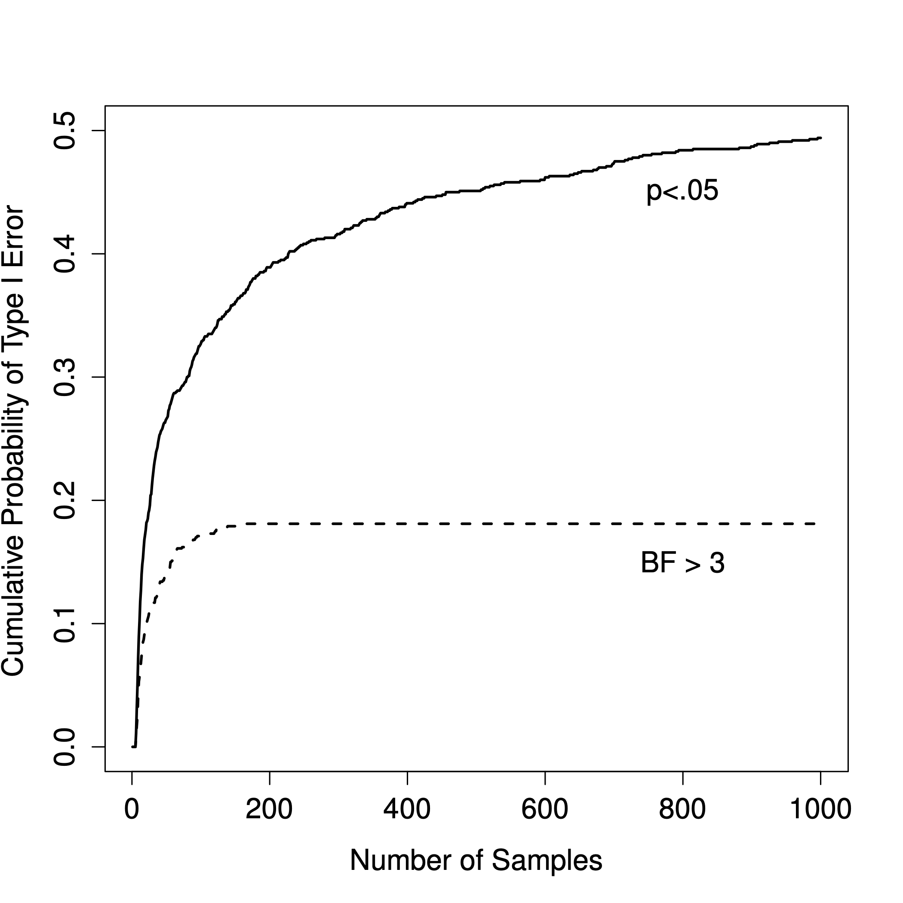

# Why be a Bayesian?{#whybayes}

One of the most significant advantages of the Bayesian approach is that it answers the right questions. Within the Bayesian framework, it is sensible and allowable to refer to "the probability that a hypothesis is true". You can even try to calculate this probability. Ultimately, isn't that what you *want* your statistical tests to tell you? To an actual human being, this would seem to be the whole *point* of doing statistics: determining what is true and what isn't. Any time you aren't exactly sure about the truth, you should use the language of probability theory to say things like "there is an 80\% chance that Theory A is true, but a 20\% chance that Theory B is true instead". 

This seems so obvious to a human, yet it is explicitly forbidden within the orthodox framework. To a frequentist, such statements are nonsense because "the theory is true" is not a repeatable event. A theory is true, or it is not, and no probabilistic statements are allowed, no matter how much you might want to make them. There's a reason why you *must not* interpret the $p$-value as the probability that the null hypothesis is true. There's a reason why almost every textbook on statistics is forced to repeat that warning. It's because people desperately *want* that to be the correct interpretation. However, it's such an appealing idea that even trained statisticians fall prey to the mistake of trying to interpret a $p$-value this way. For example, here is a quote from an official Newspoll report in 2013 explaining how to interpret their (frequentist) data analysis:^[http://about.abc.net.au/reports-publications/appreciation-survey-summary-report-2013/]

> Throughout the report, where relevant, statistically significant changes have been noted. All significance tests have been based on the 95 percent level of confidence. **This means that if a change is noted as being statistically significant, there is a 95 percent probability that a real change has occurred**, and is not simply due to chance variation. (emphasis added)

Nope! That's *not* what $p<.05$ means. That's *not* what 95\% confidence means to a frequentist statistician. The bolded section is just plain wrong. Orthodox methods cannot tell you that "there is a 95\% chance that a real change has occurred" because this is not the kind of event to which frequentist probabilities may be assigned. To an ideological frequentist, this sentence should be meaningless. Even if you're a more pragmatic frequentist, it's still the wrong definition of a $p$-value. It is simply not an allowed or correct thing to say if you want to rely on orthodox statistical tools. 

On the other hand, let's suppose you are a Bayesian. Although the bolded passage is the wrong definition of a $p$-value, it's pretty much exactly what a Bayesian means when they say that the posterior probability of the alternative hypothesis is greater than 95\%. And here's the thing. If the Bayesian posterior is the thing you *want* to report, why are you even trying to use orthodox methods? If you wish to make Bayesian claims, all you have to do is be a Bayesian and use Bayesian tools. 

Once you've made the jump, you no longer have to wrap your head around counterintuitive definitions of $p$-values. You don't have to bother remembering why you can't say that you're 95\% confident that the true mean lies within some interval. You have to be honest about what you believed before running the study and then report what you learned from doing it. Sounds nice, doesn't it? To me, this is the big promise of the Bayesian approach: you do the analysis you want to do and express what you believe the data are telling you.

## Evidentiary standards you can believe

> *If $p$ is below .02 it is strongly indicated that the null hypothesis fails to account for the whole of the facts. We shall not often be astray if we draw a conventional line at .05 and consider that smaller values of $p$ indicate a real discrepancy.*  
-- Sir Ronald @Fisher1925


Consider the quote above by Sir Ronald Fisher, one of the founders of what has become the orthodox approach to statistics. If anyone has ever been entitled to express an opinion about the intended function of $p$-values, it's Fisher. In this passage, taken from his classic guide *Statistical Methods for Research Workers*, he's pretty clear about what it means to reject a null hypothesis at $p<.05$. In his opinion, if we take $p<.05$ to mean there is "a real effect", then "we shall not often be astray". This view is hardly unusual: most practitioners express views very similar to Fisher's. In essence, the $p<.05$ convention is assumed to represent a fairly stringent evidentiary standard.

Well, how true is that? One way to approach this question is to try to convert $p$-values to Bayes factors and see how the two compare. It's not an easy thing to do because a $p$-value is a fundamentally different kind of calculation to a Bayes factor, and they don't measure the same thing. However, there have been some attempts to work out the relationship between the two, and it's somewhat surprising. For example, @Johnson2013 presents a pretty compelling case that (for $t$-tests at least) the $p<.05$ threshold corresponds roughly to a Bayes factor of somewhere between 3:1 and 5:1 in favour of the alternative. If that's right, then Fisher's claim is a bit of a stretch. Let's suppose that the null hypothesis is true about half the time (i.e., the prior probability of $H_0$ is 0.5), and we use those numbers to work out the posterior probability of the null hypothesis, given that it has been rejected at $p<.05$. Using the data from @Johnson2013, we see that if you reject the null at $p<.05$, you'll be correct about 80\% of the time. An evidentiary standard that ensures you'll be wrong on 20\% of your decisions isn't good enough. The fact remains that, quite contrary to Fisher's claim, if you reject at $p<.05$ you shall quite often go astray. It's not a very stringent evidentiary threshold at all. 


## The $p$-value is a lie.

Okay, at this point, you might be thinking that the real problem is not with orthodox statistics, just the $p<.05$ standard. In one sense, that's true. The recommendation that @Johnson2013 gives is not that "everyone must be a Bayesian now". Instead, the suggestion is that it would be wiser to shift the conventional standard to something like a $p<.01$ level. That's not an unreasonable view to take. Nonetheless, there's a fairly big problem built into the way most (but not all) orthodox hypothesis tests are constructed. They are grossly naive about how humans actually do research, and because of this, most $p$-values are wrong. 

That sounds like an absurd claim, right? Well, consider the following scenario. You've come up with a really exciting research hypothesis, and you design a study to test it. You're very diligent, so you run a power analysis to work out what your sample size should be, and you run the study. You run your hypothesis test, and out pops a $p$-value of 0.072. Really bloody annoying, right? 

What should you do? Here are some possibilities:


1. You conclude that there is no effect and try to publish it as a null result
1. You guess that there might be an effect and try to publish it as a "borderline significant" result
1. You give up and try a new study
1. You collect some more data to see if the $p$ value goes up or (preferably!) drops below the "magic" criterion of $p<.05$


Which would *you* choose? Before reading any further, take some time to think about it. Be honest with yourself. But don't stress about it too much because it actually doesn't matter what you choose. Danielle has some insights to share based on her own experiences as an author, reviewer and editor. Here's what might easily happen in each case:


- Let's start with option 1. If you try to publish it as a null result, the paper will struggle to be published. Some reviewers will think that $p=.072$ is not a null result. They'll argue it's borderline significant. Other reviewers will agree it's a null result but will claim that even though some null results *are* publishable, yours isn't. One or two reviewers might even be on your side, but you'll be fighting an uphill battle to get it through.

- Okay, let's think about option number 2. Suppose you try to publish it as a borderline significant result. Some reviewers will claim that it's a null result and should not be published. Others will claim that the evidence is ambiguous and that you should collect more data until you get a clear significant result. Again, the publication process does not favour you.

- Given the difficulties in publishing an "ambiguous" result like $p=.072$, option number 3 might seem tempting: give up and do something else. But that's a recipe for career suicide. If you give up and try a new project every time you face ambiguity, your work will never be published. And if you're in academia without a publication record, you can lose your job. So that option is out.

- It looks like you're stuck with option 4. You don't have conclusive results, so you decide to collect some more data and re-run the analysis. It seems sensible, but unfortunately for you, if you do this, all of your $p$-values are now incorrect. *All* of them. Not just the $p$-values that you calculated for *this* study. All of them. All the $p$-values you calculated in the past and all the $p$-values you will calculate in the future. Fortunately, no one will notice. You'll get published, and you'll have lied.

What does that mean? It sounded like a perfectly reasonable strategy, didn't it? You collected some data, but the results weren't conclusive, so now what you want to do is collect more data until the results *are* conclusive. What's wrong with that?

In real life, this is exactly what every researcher does. Unfortunately, the theory of null hypothesis testing, as described in Chapter \@ref(hypothesistesting), *forbids* you from doing this.^[In the interests of being completely honest, not all orthodox statistical tests that rely on this silly assumption. There are several *sequential analysis* tools that are sometimes used in clinical trials and the like. These methods are built on the premise that data are analysed as they arrive, and these tests aren't horribly broken. However, sequential analysis methods are constructed in a very different fashion from the "standard" version of null hypothesis testing. They don't make it into any introductory textbooks, and they're not very widely used in psychological literature. The concern raised here is valid for every single orthodox test presented so far.] The reason is that the theory assumes that the experiment is finished and all the data are in. And because it assumes the experiment is over, it only considers *two* possible decisions. If you're using the conventional $p<.05$ threshold, those decisions are:

```{r, echo=FALSE, fig.align="center"}
knitr::kable(
    rbind(
        c("$p < .05$", "Reject $H_0$"),
        c("$p > .05$", "Retain $H_0$")
    ),
    col.names = c("$p$-value", "Decision"),
    booktabs = TRUE,
    align = "ll", escape = FALSE,
    format = "markdown"
)
```

What *you're* doing is adding a third possible action to the decision-making problem. Specifically, what you're doing is using the $p$-value itself as a reason to justify continuing the experiment. And as a consequence, you've transformed the decision-making procedure into one that looks more like this:


```{r, echo=FALSE, fig.align="center"}
knitr::kable(
    rbind(
        c("$p < .05$", "Stop the experiment and reject the null"),
        c("$0.10 > p > .05$", "Continue the experiment and retain the null"),
        c("$p > .10$", "Stop the experiment and retain the null")
    ),
    col.names = c("$p$-value", "Decision"),
    booktabs = TRUE,
    align = "ll", escape = FALSE,
    format = "markdown"
)
```

The "basic" theory of null hypothesis testing isn't built to handle this sort of thing, not in the form described in Chapter \@ref(hypothesistesting). If you're the kind of person who would choose to "collect more data" in real life, it implies that you are *not* making decisions in accordance with the rules of null hypothesis testing. Even if you arrive at the same decision as the hypothesis test, you aren't following the decision *process* it implies, and it's this failure to follow the process causing the problem.^[A related problem: http://xkcd.com/1478/] Your $p$-values are a lie. Worse yet, they're a lie in a dangerous way because they're all *too small*. To give you a sense of just how bad it can be, consider the following (worst case) scenario. 

Imagine you're a really super-enthusiastic researcher on a tight budget who didn't pay any attention to the warnings above. You design a study comparing two groups. You desperately want to see a significant result at the $p<.05$ level, but you really don't want to collect any more data than you have to (because it's expensive). In order to cut costs, you start collecting data, but every time a new observation arrives, you run a $t$-test on your data. If the $t$-tests says $p<.05$ then you stop the experiment and report a significant result. If not, you keep collecting data. You keep doing this until you reach your pre-defined spending limit for this experiment. Let's say that limit kicks in at $N=1000$ observations. As it turns out, the truth of the matter is that there is no real effect to be found: the null hypothesis is true. So, what's the chance that you'll make it to the end of the experiment and (correctly) conclude that there is no effect? In an ideal world, the answer here should be 95\%. After all, the whole *point* of the $p<.05$ criterion is to control the Type I error rate at 5\%, so what we'd hope is that there's only a 5\% chance of falsely rejecting the null hypothesis in this situation. However, there's no guarantee that will be true. You're breaking the rules: you're running tests repeatedly, "peeking" at your data to see if you've gotten a significant result, and all bets are off.

```{r type1, fig.cap="How badly can things go wrong if you re-run your tests every time new data arrive? If you are a frequentist, the answer is \"very wrong\".", echo=FALSE, fig.align="center", out.width="100%"}

```

So, how bad is it? The answer is shown as the solid black line in Figure \@ref(fig:type1), and it's *astoundingly* bad. If you peek at your data after every single observation, there is a 49\% chance that you will make a Type I error. That's, um, quite a bit bigger than the 5\% that it's supposed to be.

By way of comparison, imagine that you had used the following strategy. Start collecting data. Every single time an observation arrives, run a *Bayesian* $t$-test and look at the Bayes factor. Assume that @Johnson2013 is right, and let's treat a Bayes factor of 3:1 as roughly equivalent to a $p$-value of .05.^[Some readers might wonder why 3:1 rather than 5:1, given that @Johnson2013 suggests that $p=.05$ lies somewhere in that range. Let's be charitable to the $p$-value. Should we choose a 5:1 Bayes factor instead, the results would look even better for the Bayesian approach.] This time around, our trigger-happy researcher uses the following procedure: if the Bayes factor is 3:1 or more in favour of the null, stop the experiment and retain the null. If it is 3:1 or more in favour of the alternative, stop the experiment and reject the null. Otherwise, continue testing. Now, just like last time, let's assume that the null hypothesis is true. What happens? The simulation results for this scenario are shown as the dashed line in Figure \@ref(fig:type1). It turns out that the Type I error rate is much much lower than the 49\% rate that we were getting by using the orthodox $t$-test.

In some ways, this is remarkable. The entire *point* of orthodox null hypothesis testing is to control the Type I error rate. Bayesian methods aren't actually designed to do this at all. Yet, the Bayesian approach is much more effective when faced with a "trigger-happy" researcher who keeps running hypothesis tests as the data come in. Even the 3:1 standard, which most Bayesians would consider unacceptably lax, is much safer than the $p<.05$ rule.


## Is it really this bad?

The example in the previous section is a pretty extreme situation. In real life, people don't run hypothesis tests every time a new observation arrives. So it's not fair to say that the $p<.05$ threshold "really" corresponds to a 49\% Type I error rate (i.e., $p=.49$). But the fact remains that if you want your $p$-values to be honest, then you either have to switch to a completely different way of doing hypothesis tests, or you must enforce a strict rule: *no peeking*. 

You are *not* allowed to use the data to decide when to terminate the experiment. You are *not* allowed to look at a "borderline" $p$-value and decide to collect more data. You aren't even allowed to change your data analysis strategy after looking at the data. You are strictly required to follow these rules. Otherwise, the $p$-values you calculate will be nonsense. And yes, these rules are surprisingly strict. 

Suppose you started running your study with the intention of collecting $N=80$ people. When the study starts out, you follow the rules, refusing to look at the data or run any tests. But when you reach $N=50$, your willpower gives in, and you take a peek. Guess what? You've got a significant result! Now, sure, you know you *said* that you'd keep running the study out to a sample size of $N=80$, but it seems pointless now, right? The result is significant with a sample size of $N=50$, so wouldn't it be wasteful and inefficient to keep collecting data? Aren't you tempted to stop? Just a little? Well, keep in mind that if you do, your Type I error rate at $p<.05$ just ballooned out to 8\%. When you report $p<.05$ in your paper, what you're *really* saying is $p<.08$. That's how bad the consequences of "just one peek" can be.

Now consider this: the scientific literature is filled with $t$-tests, ANOVAs, regressions and chi-square tests. The tests in this book and the ones baked into CogStat aren't picked arbitrarily. The reason why these four tools appear in most introductory statistics texts is that these are the bread and butter tools of science. None of these tools includes a correction to deal with "data peeking": they all assume that you're not doing it. But how realistic is that assumption? In real life, how many people do you think have "peeked" at their data before the experiment was finished and adapted their subsequent behaviour after seeing what the data looked like? Except when an external constraint fixes the sampling procedure, the answer probably is: "most people have done it". If that has happened, you can infer that the reported $p$-values are wrong. Worse yet, because we don't know what decision process they actually followed, we have no way to know what the $p$-values *should* have been. You can't compute a $p$-value when you don't know the decision-making procedure that the researcher used. And so the reported $p$-value remains a lie. 

Given all of the above, what is the take-home message? It's not that Bayesian methods are foolproof. If a researcher is determined to cheat, they can always do so. Bayes' rule cannot stop people from lying, nor can it stop them from rigging an experiment. The reason why we run statistical tests is to protect us from ourselves. And the reason why "data peeking" is such a concern is that it's so tempting, *even for honest researchers*. A theory for statistical inference has to acknowledge this. Yes, you might try to defend $p$-values by saying that it's the researcher's fault for not using them correctly. A theory of statistical inference that is so utterly naive about humans that it doesn't even consider the possibility that the researcher might *look at their data* isn't a theory worth having. The point here is:

> *Good laws have their origins in bad morals.* 
-- Ambrosius Macrobius^[http://www.quotationspage.com/quotes/Ambrosius_Macrobius/]

Good rules for statistical testing have to acknowledge human frailty. None of us is without sin. None of us is beyond temptation. A good system for statistical inference should still work even when it is used by actual humans. Orthodox null hypothesis testing does not.

Let us be fair: by adopting a sequential analysis perspective, you can avoid these errors within the orthodox framework as well. You can explicitly design studies with interim analyses in mind. However, that is not the current practice amongst psychology researchers.

So until then, the *default* Bayes factor methods are much more robust in the face of data analysis practices as they exist in the real world.
