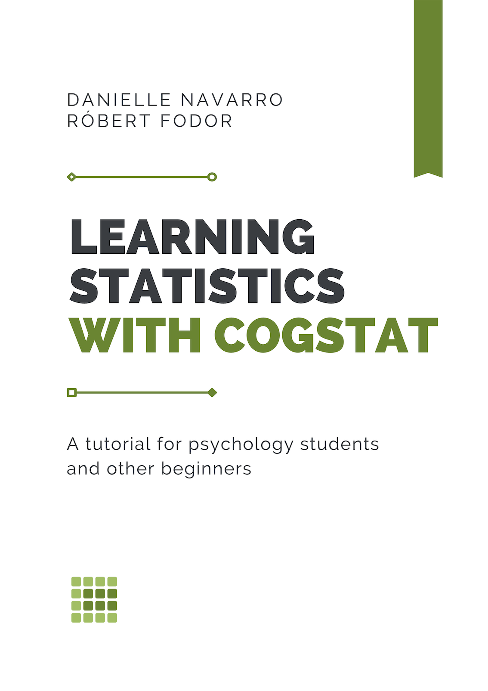

--- 
title: "Learning Statistics with CogStat"
author:
- Danielle Navarro^[Danielle Navarro -- [Github](https://github.com/djnavarro/) | [](https://orcid.org/0000-0001-7648-6578) 0000-0001-7648-6578]
- Róbert Fodor^[Róbert Fodor -- [Github](https://github.com/robertfodor/) | [](https://orcid.org/0000-0001-8470-335X) 0000-0001-8470-335X]
date: "5 Nov 2022"
output:
  bookdown::gitbook:
    config:
      sharing: false
site: bookdown::bookdown_site
documentclass: book
bibliography: book.bib
subtitle: A tutorial for psychology students and other beginners
biblio-style: apa
csl: apa7.csl
github-repo: https://github.com/robertfodor/lsc
url: https://learningstatisticswithcogstat.com
cover-image: "resources/bookcover/LSC_small.png"
description: '*Learning Statistics with CogStat* covers the contents of an introductory
  statistics class, as typically taught to undergraduate psychology students based
  on Danielle Navarro''s original *Learning Statistics with R* with a focus on automatic
  statistical analysis performed in CogStat.'
always_allow_html: true
urlcolor: CSbluelight
linkcolor: CSbluelight
citecolor: CSbluelight
toccolor: black
link-citations: true
geometry: a4paper, margin=1in, bindingoffset=0.5in, footskip=0.5in
fontsize: 11pt
---

```{r setup, include=FALSE}
knitr::opts_chunk$set(echo = FALSE, warning = FALSE, message = FALSE)

if (knitr::is_latex_output()) {
  knitr::opts_chunk$set(out.width = "66%")
}


library(metathis)
meta() %>%
  meta_social(
    og_type = "book",
    og_author = c("Danielle Navarro", "Róbert Fodor")
  ) %>%
  meta_google_scholar(
    title = "Learning Statistics with CogStat",
    author = c("Danielle Navarro", "Róbert Fodor"),
    publication_date = "2022/09/27"
  )

library(kableExtra)
```


# About this book{.unnumbered}

```{r, eval=knitr::is_html_output(), echo=FALSE, out.width="50%", out.extra="style='box-shadow: 0px 3px 12px 1px rgba(0,0,0,0.66);'"}

```

First published on 27 September 2022 (electronic). 

Critical fixes applied (typos and minor errors) on 5 November 2022.

**Second edition** published on XX January **2023** (electronic). Aligns with **Cogstat v2.3**.

To reference this book, please use the following citation (APA7 format):

> Navarro, D., & Fodor, R. (2023). Learning Statistics with CogStat (Rev. ed.). \
>        https://learningstatisticswithcogstat.com


## Foreword for the *First Edition* {.unnumbered}

#### Author's note {.unnumbered .unlisted}

This book is intended for psychology students and other beginners who are interested in learning statistics and want to use CogStat to perform their analyses. [CogStat](https://www.cogstat.org) is a statistics software written in Python by Attila Krajcsi^[Attila Krajcsi -- [Website](http://www.attilakrajcsi.hu) | [](https://orcid.org/0000-0001-9792-9091) 0000-0001-9792-9091] and developed with the help of supporters. Its distinct advantage is automatic hypothesis test selection and chart creation with an APA-style output to suit the needs of psychology researchers and students.

*Learning Statistics with CogStat* is a book which covers the contents of an introductory statistics class. It is an adaptation made by Róbert Fodor based on Danielle Navarro's original, [Learning Statistics with R](https://learningstatisticswithr.com), version 0.6^[This book is compiled from scratch in bookdown but some code snippets rely on [Emily Kothe](https://twitter.com/emilyandthelime)'s bookdown adaptation of the originasl material (e.g. some knitr plots and tables appear in the source code without alteration), numbered as version [0.6.1](https://learningstatisticswithr.com/book/)]. While the theory laid out in the original book is still valid, this book focuses on the practical application of statistical methods in CogStat. The book is not intended to be a comprehensive guide to either CogStat or statistical theory, though. One of the key challenges of the adaptation was to balance between a fully applied approach (like how CogStat handles analysis) and a theoretical one (like the fantastic textbook it is based on). Danielle's original content, while making up a massive chunk of the material, has been revised, reorganised, redacted, expanded on and rewritten to fit the new purpose.

This book will always be a living thing. As CogStat expands and evolves, so will this book. If you have any suggestions, comments or questions, please feel free to reach out to me on [GitHub](https://github.com/robertfodor/lsc/issues).

\nopagebreak[4]

--- Robert

## Foreword for the *Second Edition* {.unnumbered}

#### Author's note {.unnumbered .unlisted}

This edition brings in plenty of changes, well beyond 10% of the book, which should warrant, per publishing standards, for it to be called "second edition". While it sounds quite conceited to me, considering I've done some of the work that really should've gone into the original edition in the first place, I opted for this numbering in the aim that whenever a new CogStat version is released and some of the material needs to be updated, I can just call it "*revised* second edition". I also want to avoid any confusion where we'd have a textbook v1, v3.14 against a CogStat v2.4RC -- it's tedious. I really love this material, and maybe this is my grandiosity, but I hope this makes sense to you as well.

The main drive behind these edits was reflections on the material's usefulness and *accuracy*, since some explanations and wordings needed to be more robust to withstand scientific scrutiny, which Attila Krajcsi provided. I must thank him for his helpful notes as consulting editor for this version, not due to sheer obligation but on account of genuine appreciation. His feedback was essential, and while I spent quite some time defending most of my earlier decisions (some of which I still do), I had to accept that I simply couldn't have got it quite right the first time, and I shouldn't be too attached to the source material. I loved that the original was accessible and the opposite of stuffy, but I decided to cut down plenty (mostly the chattiness) and replace it with, hopefully still accessible but scientifically more accurate parts. I consulted some other textbooks comparing the way they present the material for it not to be stuffy. I firmly believe scientific communication in all its forms needs to be in everyday language while using precise terminology, appropriate analogies, and accurate examples. I hope that this edition is something you, dear reader, will love to read. I hope this edition is a step in the right direction.

\nopagebreak[4]

--- Robert

#### Changelog {.unnumbered .unlisted}

- Chapters \@ref(autostat) and \@ref(cogstatintro) were amended and slightly expanded, and now they follow Chapter \@ref(researchdesign), so that the reader can better appreciate automatic statistical analysis.
- Chapter \@ref(researchdesign) was largely replaced to make definitions and examples more accurate.
- Chapter \@ref(exploringavariable) was largely revised to tie to other statistics textbooks, also focusing on differentiating between population and sample measures.
- New: callout boxes added throughout the chapters to explain chart types and other concepts.
- New: definitions and examples are now presented markedly in the text.
- New: explanatory charts were added to the text.
- New: health psychology examples were added to the text.
- Typos and minor errors were fixed all throughout the book.


## Licensing{.unlisted .unnumbered}

```{r echo=FALSE, fig.pos="left"}
knitr::include_graphics("resources/image/by-sa.png")
```

This work is licensed under the Creative Commons Attribution-ShareAlike 4.0 International License. To view a copy of this license, visit http://creativecommons.org/licenses/by-sa/4.0/ or send a letter to Creative Commons, PO Box 1866, Mountain View, CA 94042, USA.
