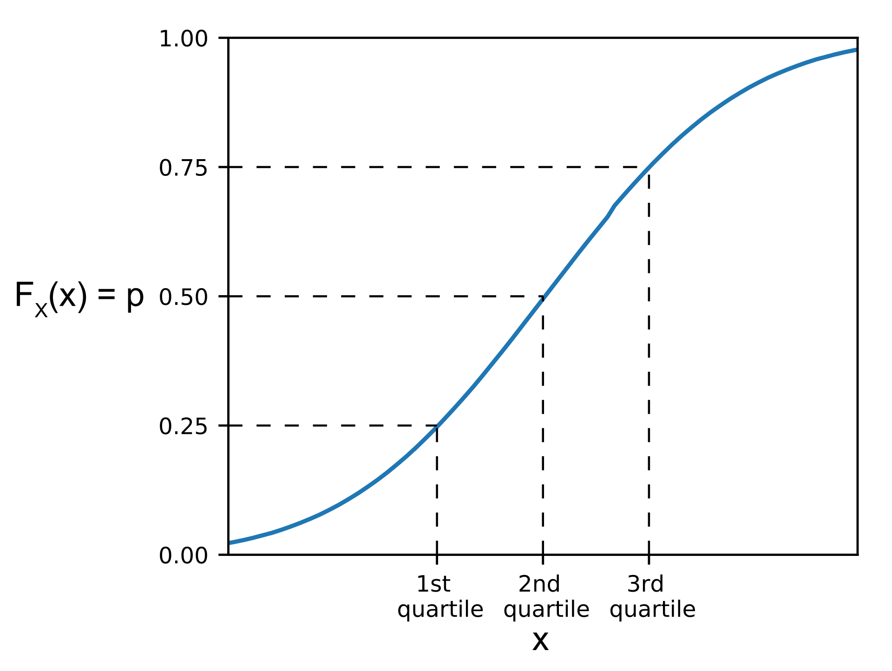
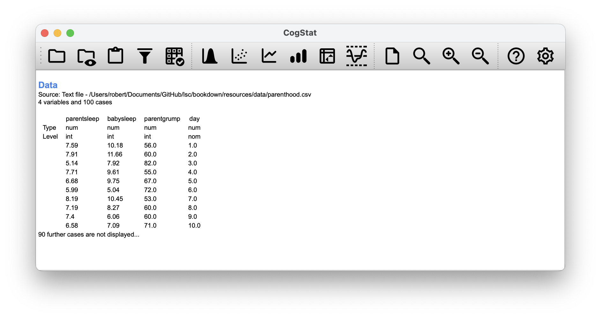
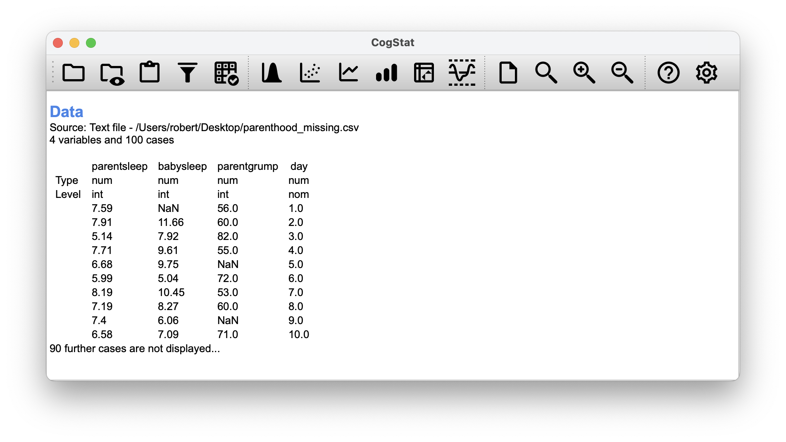
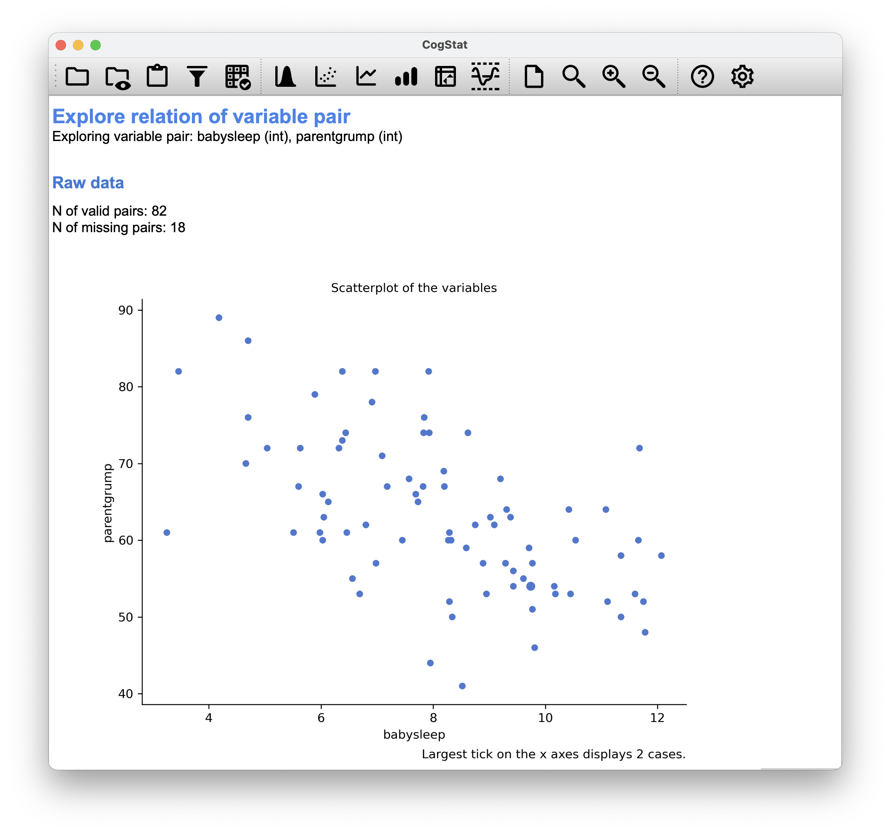

--- 
title: "Learning Statistics with CogStat"
author:
- Danielle Navarro^[Danielle Navarro -- [Github](https://github.com/djnavarro/) | [](https://orcid.org/0000-0001-7648-6578) 0000-0001-7648-6578]
- Róbert Fodor^[Róbert Fodor -- [Github](https://github.com/robertfodor/) | [](https://orcid.org/0000-0001-8470-335X) 0000-0001-8470-335X]
date: "5 Nov 2022"
output:
  bookdown::gitbook:
    config:
      sharing: false

bibliography: book.bib
subtitle: A tutorial for psychology students and other beginners
biblio-style: apa
csl: apa7.csl

link-citations: true
urlcolor: CSbluelight
linkcolor: CSbluelight
citecolor: CSbluelight
toccolor: black

github-repo: https://github.com/robertfodor/lsc
url: https://learningstatisticswithcogstat.com

cover-image: "resources/bookcover/LSC_small.png"
description: '*Learning Statistics with CogStat* (Second Edition) covers the contents of an introductory statistics class, as typically taught to undergraduate psychology students based on Danielle Navarro''s original *Learning Statistics with R* with a focus on automatic statistical analysis performed in CogStat.'

documentclass: book
classoption: twoside,symmetric,openright
fontsize: 11pt
papersize: a4
linestretch: 1.15
links-as-notes: true
always_allow_html: true
geometry: margin=1in, bindingoffset=0in, outer=1.5in
---

```{r setup, include=FALSE}
knitr::opts_chunk$set(echo = FALSE, warning = FALSE, message = FALSE)

if (knitr::is_latex_output()) {
  knitr::opts_chunk$set(out.width = "60%")
}

options(bookdown.post.latex = function(x) {
    from <- grep("usepackage\\{amsthm\\}", x)
    to <- grep("newtheorem\\*\\{solution", x)
    x <- x[-c(from:to)]
  })

library(metathis)
meta() %>%
  meta_social(
    og_type = "book",
    og_author = c("Danielle Navarro", "Róbert Fodor")
  ) %>%
  meta_google_scholar(
    title = "Learning Statistics with CogStat (2nd Ed)",
    author = c("Danielle Navarro", "Róbert Fodor"),
    publication_date = "2023/09/22"
  )

library(kableExtra)
```


# About this book{.unnumbered}

```{r, eval=knitr::is_html_output(), echo=FALSE, out.width="67%", out.extra="style='box-shadow: 0px 3px 12px 1px rgba(0,0,0,0.66);'"}
knitr::include_graphics("resources/bookcover/LSC_small.png")
```

> First published on 27 September 2022 (electronic). Aligns with Cogstat v2.3. \
> **Second edition** published on 23 September 2023 (electronic). Aligns with Cogstat v2.4.

To reference this book, please use the following citation (APA7 format):

> Navarro, D., & Fodor, R. (2023). *Learning Statistics with CogStat* (2nd ed.). \
>        https://learningstatisticswithcogstat.com

## Licensing{.unlisted .unnumbered}

```{r echo=FALSE, fig.pos="left", out.width="15%"}
knitr::include_graphics("resources/image/by-sa.png")
```

This work is licensed under the Creative Commons Attribution-ShareAlike 4.0 International License. To view a copy of this license, visit http://creativecommons.org/licenses/by-sa/4.0/ or send a letter to Creative Commons, PO Box 1866, Mountain View, CA 94042, USA.


# Foreword{.unnumbered}

## Foreword for the *First Edition* {.unnumbered .unlisted}

This book is intended for psychology students and other beginners who are interested in learning statistics and want to use CogStat to perform their analyses. [CogStat](https://www.cogstat.org) is a statistics software written in Python by Attila Krajcsi^[Attila Krajcsi -- [Website](http://www.attilakrajcsi.hu) | [](https://orcid.org/0000-0001-9792-9091) 0000-0001-9792-9091] and developed with the help of supporters. Its distinct advantage is automatic hypothesis test selection and chart creation with an APA-style output to suit the needs of psychology researchers and students.

*Learning Statistics with CogStat* is a book which covers the contents of an introductory statistics class. It is an adaptation made by Róbert Fodor based on Danielle Navarro's original, [Learning Statistics with R](https://learningstatisticswithr.com), version 0.6^[This book is compiled from scratch in bookdown but some code snippets rely on [Emily Kothe](https://twitter.com/emilyandthelime)'s bookdown adaptation of the originasl material (e.g. some knitr plots and tables appear in the source code without alteration), numbered as version [0.6.1](https://learningstatisticswithr.com/book/)]. While the theory laid out in the original book is still valid, this book focuses on the practical application of statistical methods in CogStat. The book is not intended to be a comprehensive guide to either CogStat or statistical theory, though. One of the key challenges of the adaptation was to balance between a fully applied approach (like how CogStat handles analysis) and a theoretical one (like the fantastic textbook it is based on). Danielle's original content, while making up a massive chunk of the material, has been revised, reorganised, redacted, expanded on and rewritten to fit the new purpose.

This book will always be a living thing. As CogStat expands and evolves, so will this book. If you have any suggestions, comments or questions, please feel free to reach out to me on [GitHub](https://github.com/robertfodor/lsc/issues).

\nopagebreak[4]

--- Robert

## Foreword for the *Second Edition* {.unnumbered .unlisted}

This edition brings in plenty of changes, well beyond 10% of the book, which should warrant, per publishing standards, for it to be called "second edition". The main drive behind these edits was reflections on the material's usefulness and *accuracy*, since some explanations and wordings needed to be more robust to withstand scientific scrutiny, which Attila Krajcsi provided. I must thank him for his helpful notes as consulting editor for this version, not due to sheer obligation but on account of genuine appreciation. His feedback was essential, and while I spent quite some time defending most of my earlier decisions (some of which I still do), I had to accept that I simply couldn't have got it quite right the first time, and I shouldn't be too attached to the source material. I loved that the original was accessible and the opposite of stuffy, but I decided to cut down plenty (mostly the chattiness) and replace it with, hopefully still accessible but scientifically more accurate parts. I consulted some other textbooks comparing the way they present the material for it not to be stuffy. I firmly believe scientific communication in all its forms needs to be in everyday language while using precise terminology, appropriate analogies, and accurate examples. I hope that this edition is something you, dear reader, will love to read. I hope this edition is a step in the right direction.

\nopagebreak[4]

--- Robert

**Changelog:**

- Chapters \@ref(autostat) and \@ref(cogstatintro) were amended and slightly expanded, and now they follow Chapter \@ref(researchdesign), so that the reader can better appreciate automatic statistical analysis.
- Chapter \@ref(researchdesign) was largely rewritten -- particularly reliability and validity -- to make definitions more accurate, and examples are now related to health and psychology research. The rest of the chapter discussing bias and study design were scrapped due to their lack of relevance to the book's purpose.
- Chapter \@ref(exploringavariable) was largely revised to tie to other statistics textbooks, also focusing on differentiating between population and sample measures.
- Chapter \@ref(correl) now includes CogStat tutorial on interrater and internal consistency measures.
- New: callout boxes added throughout some chapters to explain chart types and other concepts.
- New: definitions and examples are now presented markedly in the text.
- New: explanatory charts were added to the text.
- Typos and minor errors were fixed all throughout the book.

\newpage

<!--chapter:end:index.rmd-->

\setcounter{page}{1}
\pagenumbering{arabic}

# (PART\*) INTRODUCTIONS {-}

# Why do we learn statistics?{#whywhywhy}

To the surprise of many students, statistics is a fairly significant part of a psychological education. To the surprise of no-one, statistics is very rarely the *favourite* part of one's psychological education. Not surprisingly, there's a pretty large proportion of the student base that isn't happy about the fact that psychology has so much statistics in it. A big part of this issue at hand relates to the very idea of statistics.

>*Why do you do statistics? Why don't scientists just use **common sense?***

Humans are susceptible to all kinds of biases, temptations and frailties, and much of statistics is basically a safeguard. Using "common sense" to evaluate evidence means trusting gut instincts, relying on verbal arguments and on using the raw power of human reason to come up with the right answer, which is not scientific at all.

## The curse of belief bias

Psychologists have shown over the years is that we really do find it hard to be neutral, to evaluate evidence impartially and without being swayed by pre-existing biases. A good example of this is the ***belief bias effect*** in logical reasoning: if you ask people to decide whether a particular argument is logically valid (i.e., conclusion would be true if the premises were true), we tend to be influenced by the believability of the conclusion, even when we shouldn't. For instance, here's a valid argument where the conclusion is believable:

>No cigarettes are inexpensive (Premise 1) \
>Some addictive things are inexpensive (Premise 2)\
>Therefore, some addictive things are not cigarettes (Conclusion)

And here's a valid argument where the conclusion is not believable:

>No addictive things are inexpensive (Premise 1)\
>Some cigarettes are inexpensive (Premise 2)\
>Therefore, some cigarettes are not addictive (Conclusion)

The logical *structure* of argument #2 is identical to the structure of argument #1, and they're both valid. However, in the second argument, there are good reasons to think that premise 1 is incorrect, and as a result it's probably the case that the conclusion is also incorrect. But that's entirely irrelevant to the topic at hand: an argument is deductively valid if the conclusion is a logical consequence of the premises. That is, a valid argument doesn't have to involve true statements.

On the other hand, here's an invalid argument that has a believable conclusion:

>No addictive things are inexpensive (Premise 1)\
>Some cigarettes are inexpensive (Premise 2)\
>Therefore, some addictive things are not cigarettes (Conclusion)

And finally, an invalid argument with an unbelievable conclusion:

>No cigarettes are inexpensive (Premise 1)\
>Some addictive things are inexpensive (Premise 2)\
>Therefore, some cigarettes are not addictive (Conclusion)

Now, suppose that people really are perfectly able to set aside their pre-existing biases about what is true and what isn't, and purely evaluate an argument on its logical merits. We'd expect 100% of people to say that the valid arguments are valid, and 0% of people to say that the invalid arguments are valid. So if you ran an experiment looking at this, you'd expect to see data like this:

```{r echo=FALSE}
library(kableExtra)
knitr::kable(
  rbind(
    c("argument is valid", "100% say valid", "100% say valid"),
    c("argument is invalid", "0% say valid", "0% say valid")
  ),
   col.names = c(" ", "conclusion feels true", "conclusion feels false"),
   caption = NULL,
   label = "conclusion1",
   linesep = "",
   escape = TRUE,
   booktabs = TRUE,
   align = "lcc"
) %>%
  kable_styling(
   bootstrap_options = c("hover"),
   full_width = FALSE,
   position = "center",
   latex_options = c("HOLD_position", "repeat_header")
  )
```


If the psychological data looked like this (or even a good approximation to this), we might feel safe in just trusting our gut instincts. That is, it'd be perfectly okay just to let scientists evaluate data based on their common sense, and not bother with all this murky statistics stuff.

In a classic study, @Evans1983 ran an experiment looking at exactly this. What they found is that when pre-existing biases (i.e., beliefs) were in agreement with the structure of the data, everything went the way you'd hope:

```{r echo=FALSE}
knitr::kable(
  rbind(
    c("argument is valid", "92% say valid", ""),
    c("argument is invalid", " ", "8% say valid")
  ),
   col.names = c(" ", "conclusion feels true", "conclusion feels false"),
   caption = NULL,
   label = "conclusion2",
   linesep = "",
   escape = TRUE,
   booktabs = TRUE,
   align = "lcc"
) %>%
  kable_styling(
   bootstrap_options = c("hover"),
   full_width = FALSE,
   position = "center",
   latex_options = c("HOLD_position", "repeat_header")
  )
```

Not perfect, but that's pretty good. But look what happens when our intuitive feelings about the truth of the conclusion run against the logical structure of the argument:

```{r echo=FALSE}
knitr::kable(
  rbind(
    c("argument is valid", "92% say valid", "**46% say valid**"),
    c("argument is invalid", "**92% say valid**", "8% say valid")
  ),
   col.names = c(" ", "conclusion feels true", "conclusion feels false"),
   caption = NULL,
   label = "conclusion3",
   linesep = "",
   escape = TRUE,
   booktabs = TRUE,
   align = "lcc",
) %>%
  kable_styling(
   bootstrap_options = c("hover"),
   full_width = FALSE,
   position = "center",
   latex_options = c("HOLD_position", "repeat_header")
    )
```

Apparently, when people are presented with a strong argument that contradicts our pre-existing beliefs, we find it pretty hard to even perceive it to be a strong argument (people only did so 46% of the time). Even worse, when people are presented with a weak argument that agrees with our pre-existing biases, almost no-one can see that the argument is weak.

It's just *too easy* for us to "believe what we want to believe"; so if we want to "believe in the data" instead, we're going to need a bit of help to keep our personal biases under control. That's what statistics does: it helps keep us honest. 

\pagebreak[3]

## The Simpson's paradox

In 1973, the University of California, Berkeley, had some worries about the gender breakdown of student admissions into postgraduate courses. Given that there were nearly 13,000 applicants, a difference of 9 percentage points in admission rates between males and females is just way too big to be a coincidence.

```{r echo=FALSE}
knitr::kable(
  rbind(
    c("Males", "8442", "46%"),
    c("Females", "4321", "35%")
  ),
   col.names = c(" ", "Number of applicants", "Percent admitted"),
   caption = NULL,
   label = "applicants",
   linesep = "",
   escape = TRUE,
   booktabs = TRUE,
   align = "lcc"
) %>%
  kable_styling(
   bootstrap_options = c("hover"),
   full_width = FALSE,
   position = "center",
   latex_options = c("HOLD_position", "repeat_header")
    )
```

When people started looking more carefully at the admissions data [@Bickel1975] on a department by department basis, it turned out that most of the departments actually had a slightly *higher* success rate for female applicants than for male applicants.

```{r echo=FALSE, warning = FALSE}
simpson <- cbind(c("A", "B", "C", "D", "E", "F"),
         c(825, 560, 325, 417, 191, 272),
         c("62%", "63%", "37%", "33%", "28%", "6%"),
         c(108, 25, 593, 375, 393, 341),
         c("82%", "68%", "34%", "35%", "24%", "7%"))

knitr::kable(
    simpson,
    col.names = c("Department", "Applicants",
        "Admitted", "Applicants",
        "Admitted"),
   caption = NULL,
   label = "simpsontable",
   linesep = "",
   escape = TRUE,
   booktabs = TRUE,
   align = "lcccc"
) %>%
  add_header_above(c(" " = 1, "Male" = 2, "Female" = 2)) %>% # Has to be here before kable_styling
  kable_styling(
   bootstrap_options = c("hover"),
   full_width = FALSE,
   position = "center",
   latex_options = c("HOLD_position", "repeat_header")
  )
```

Yet the overall rate of admission across the university for females was *lower* than for males. How can both of these statements be true at the same time?

Firstly, notice that the departments are *not* equal to one another in terms of their admission percentages: some departments (e.g., engineering, chemistry) tended to admit a high percentage of the qualified applicants, whereas others (e.g., English) tended to reject most of the candidates, even if they were high quality. So, among the six departments shown above, notice that department A is the most generous, followed by B, C, D, E and F in that order. Next, notice that males and females tended to apply to different departments. If we rank the departments in terms of the total number of male applicants, we get **A**>**B**>D>C>F>E (the "easy" departments are in bold). On the whole, males tended to apply to the departments that had high admission rates. Now compare this to how the female applicants distributed themselves. Ranking the departments in terms of the total number of female applicants produces a quite different ordering C>E>D>F>**A**>**B**. 

In other words, what these data seem to be suggesting is that the female applicants tended to apply to "harder" departments. And in fact, if we look at Figure \@ref(fig:berkeley), we see that this trend is systematic, and quite striking. This effect is known as Simpson's paradox. It's not common, but it does happen in real life, and most people are very surprised by it when they first encounter it, and many people refuse to even believe that it's real. It is very real.

```{r berkeley, echo=FALSE, fig.cap="(ref:berkeleyFigCap)", fig.scap="The Berkeley 1973 college admissions data.", fig.align="center"}

```

(ref:berkeleyFigCap) The Berkeley 1973 college admission rate for the 85 departments that had at least one female applicant based on Bickel et al. [-@Bickel1975]. Circles plot departments with more than 40 applicants; the area of the circle is proportional to the total number of applicants. The crosses plot department with fewer than 40 applicants.

When doing research, there are *lots* of subtle, counterintuitive traps lying in wait for the unwary. Truth is sometimes cunningly hidden in the nooks and crannies of complicated data. Statistics only solves *part* of the problem.

Remember that we started, we looked at the "aggregated" data, and it did seem like the university was discriminating against women, but when we "disaggregated" and looked at the individual behaviour of all the departments, it turned out that the actual departments were, if anything, slightly biased in favour of women. The gender bias in total admissions was caused by the fact that women tended to self-select for harder departments. If you're interested in the overall structural effects of subtle gender biases, then you probably want to look at *both* the aggregated and disaggregated data. If you're interested in the decision making process at Berkeley itself then you're probably only interested in the disaggregated data.

In short there are a lot of critical questions that you can't answer with statistics, but the answers to those questions will have a huge impact on how you analyse and interpret data. And this is the reason why you should always think of statistics as a *tool* to help you learn about your data, no more and no less. It's a powerful tool to that end, but there's no substitute for careful thought.

## Statistics in psychology

We hope that the discussion above helped explain why science in general is so focused on statistics. But we're guessing that you have a lot more questions about what role statistics plays in psychology, and specifically why psychology classes always devote so many lectures to stats. So here's an attempt to answer a few of them...

**Why does psychology have so much statistics?**

\nopagebreak[4]

The most important reason is that psychology is a statistical science. There's a saying used sometimes in physics, to the effect that "if your experiment needs statistics, you should have done a better experiment".

The "things" that we study are *people*. Real, complicated, gloriously messy people. The "things" of physics include object like electrons, and while there are all sorts of complexities that arise in physics, electrons don't have minds of their own. They don't have opinions, they don't differ from each other in weird and arbitrary ways, they don't get bored in the middle of an experiment, and they don't get angry at the experimenter and then deliberately try to sabotage the data set.^[Some may argue that natural science experiments still struggle with data quality, noise etc. But there's no evidence of an electron producing response bias in the lab due to over- or undercompliance, which is our point.]

We teach statistics to you as psychologists because you need to be better at stats than physicists. They have the luxury of being able to say that because their objects of study are simple in comparison to the vast mess that confronts social scientists.

**Can't someone else do the statistics?**

\nopagebreak[4]

To some extent, but not completely. It's true that you don't need to become a fully trained statistician just to do psychology, but you do need to reach a certain level of statistical competence. There's three reasons that every psychological researcher ought to be able to do basic statistics:

- Firstly, there's the fundamental reason: statistics is deeply intertwined with research design. If you want to be good at designing psychological studies, you need to at least understand the basics of stats.
- Secondly, if you want to be good at the psychological side of the research, then you need to be able to understand the psychological literature, right? But almost every paper in the psychological literature reports the results of statistical analyses. So if you really want to understand the psychology, you need to be able to understand what other people did with their data. And that means understanding a certain amount of statistics.
- Thirdly, there's a big practical problem with being dependent on other people to do all your statistics: statistical analysis is *expensive*. In almost any real life situation where you want to do psychological research, the cruel facts will be that you don't have enough money to afford a statistician. So the economics of the situation mean that you have to be self-sufficient.

Note that a lot of these reasons generalise beyond researchers. If you want to be a practicing psychologist and stay on top of the field, it helps to be able to read the scientific literature, which relies pretty heavily on statistics.

**I don't care about jobs, research, or clinical work. Do I need statistics?**

\nopagebreak[4]

Statistics should matter to you in the same way that statistics should matter to *everyone*: we live in the 21st century, and data are *everywhere*. Frankly, given the world in which we live these days, a basic knowledge of statistics is pretty damn close to a survival tool! Which is the topic of the next section...

## There's more to research methods than statistics

Most research methods courses will cover a lot of topics that relate much more to the pragmatics of research design, and in particular the issues that you encounter when trying to do research with humans. Most student fears relate to the statistics part of the course. Hopefully you are convinced that statistics matters, and more importantly, that it's not to be feared.

Introductory classes focus a lot on the statistics because you almost always find yourself needing statistics before you need the other research methods training. Why? Because almost all of your assignments in other classes will rely on statistical training, to a much greater extent than they rely on other methodological tools. It's not common for undergraduate assignments to require you to design your own study from the ground up (in which case you would need to know a lot about research design), but it is common for assignments to ask you to analyse and interpret data that were collected in a study that someone else designed (in which case you need statistics). In that sense, from the perspective of allowing you to do well in all your other classes, the statistics is more urgent.

But note that "urgent" is different from "important" -- they both matter. We really do want to stress that research design is just as important as data analysis, and this book does spend a fair amount of time on it. However, while statistics has a kind of universality, and provides a set of core tools that are useful for most types of psychological research, the research methods side isn't quite so universal. There are some general principles that everyone should think about, but a lot of research design is very idiosyncratic, and is specific to the area of research that you want to engage in. To the extent that it's the details that matter, those details don't usually show up in an introductory stats and research methods class.

<!--chapter:end:P1-01_intro_stats.Rmd-->

# Basic concepts {#researchdesign}

In this chapter, we'll discuss basic concepts and terminology related to measurement and study design. Since this book focuses on data analysis, it won't give you enough information to design studies of your own. To do that, you'll need to take a course in research design and methods. There are a couple of good books on the topic.

This chapter relies on @howittUnderstandingStatisticsPsychology2020 and @Stevens1946 for discussing scales of measurement, and on @bonczResearchMethodologyBasics2015, @michalosEncyclopediaQualityLife2014, and @marksResearchMethodsClinical2004 for discussing reliability and validity.

## Introduction to psychological measurement{#measurement}

First, data collection can be thought of as a kind of **measurement**. That is, what we're trying to do here is measure something about human behaviour or the human mind. What do we mean by "measurement"?

Measurement as a concept comes down to finding some way of assigning numbers, labels, or other well-defined descriptions to phenomena. So, any of the following would count as a psychological measurement:

- Danielle's **age** is *33 years*.
- She *does not* **like anchovies**.
- Her **chromosomal gender** is *male*.
- Her **self-identified gender** is *female*.

In the short list above, the **bolded part** is "the thing to be measured", and the *italicised part* is "the measurement itself". We can expand on this a little bit by thinking about the set of possible measurements that could have arisen in each case:

- **Age** (in years) could have been *1, 2, 3 ... years*, etc. The upper bound on what the age could be is a bit fuzzy, but in practice, you'd be safe in saying that the largest possible age is *150* since no human has ever lived that long. And age doesn't really have a true zero, but that is not important just yet.
- When asked if someone **likes anchovies**, they might say *I do*, *I do not*, *I have no opinion*, or *I sometimes do*.
- **Chromosomal gender** is almost certainly going to be *male (XY)* or *female (XX)*, but there are a few other possibilities: with *Klinefelter's syndrome (XXY)*, it is more similar to male than to female. And there are other possibilities, too.
- **Self-identified gender** is also very likely to be *male* or *female*, *transgender*, *nonbinary*, *queer* etc.

As you can see, for some things, like age, it seems pretty apparent what the set of possible measurements should be, whereas, for other things, it gets a bit tricky. But even regarding someone's age, it's a bit more subtle. For instance, if you're a developmental psychologist, measuring in *years* is way too crude, and so you often measure age in *years and months* (if a child is 2 years and 11 months, this is usually written as "2;11"). If you're interested in newborns, you might want to measure age in *days since birth*, or maybe even *hours since birth*.

Looking at this a bit more closely, you might also realise that the concept of "age" isn't all that precise. Generally, when we say "age", we implicitly mean "the length of time since birth". But that's not always the right way to do it.

Suppose you're interested in how newborn babies control their eye movements. If Baby Alice is born 3 weeks premature and Baby Bianca is born 1 week late, would it really make sense to say that they are the "same age" if we encountered them "2 hours after birth"? In a sense, yes. By social convention, we use birth as our reference point for talking about age in everyday life since it defines the amount of time the person has been operating as an independent entity in the world. But from a scientific perspective, that's not the only thing we care about. You might want to measure age from conception, and voilà, you're already thinking about all the potential problems with analysis and comparisons. When we think about the biology of human beings, it's often helpful to think of ourselves as organisms that have been growing and maturing since conception. From that perspective, Alice and Bianca aren't the same age at all. So you might want to define the concept of "age" in two different ways: the length of time since conception and the length of time since birth. It won't make much difference when dealing with adults, but when dealing with newborns, it might. In other words, how you specify the allowable measurement values is important.

Still, there's the question of methodology. What specific measurement **method** will you use to find out someone's age? There are several options:

- You could just ask people, "how old are you?" The method of *self-report* is fast, cheap and easy, but it only works with people old enough to understand the question, and some people lie about their age.
- You could ask an authority (e.g. a parent), "how old is your child?" This method is fast, and it's not all that hard when dealing with kids since the parent is almost always around. It doesn't work as well if you want to know "age since conception" since a lot of parents can't say for sure when conception took place. You might need a different authority (e.g. an obstetrician).
- You could look up official records, like birth certificates. This is time-consuming and annoying, but it has its uses (e.g. if the person is now dead).

All of the ideas discussed in the previous section relate to the concept of **operationalisation**. To be a bit more precise about the idea, operationalisation is the process by which we take a meaningful but somewhat vague concept and turn it into an accurate measurement. The method of operationalisation can involve several different things:

- For instance, does "age" mean "time since birth" or "time since conception" in the context of your research?
- Will you use self-report to measure age, ask a parent, or look up an official record? If you're using self-report, how will you phrase the question?
- Defining the set of allowable values that the measurement can take. Note that these values don't always have to be numerical, though they often are. When measuring age, the values are numerical, but we still need to think carefully about what numbers are allowed. Do we want age in years, years and months, days, or hours? The values aren't numerical for other types of measurements (e.g. gender). But, as before, we need to consider what values are allowed. If we're asking people to self-report their gender, what options do we allow them to choose from? Is it enough to allow only "male" or "female"? Do you need an "other" option? Or should we not give people any specific options and let them answer in their own words? And if you open up the set of possible values to include all verbal responses, how will you interpret their answers?

Operationalisation is tricky, and there's no "one, true way" to do it. How you operationalise the informal concept of "age" or "gender" into a formal measurement depends on what you need to use the measurement for. You'll often find that the community of scientists who work in your area have some well-established ideas for how to go about it. Tip: when working on your dissertation, consult your supervisor and the literature to see what the community has settled on.

In other words, operationalisation needs to be thought through case-by-case. Nevertheless, while there are a lot of issues that are specific to each individual research project, there are some aspects to it that are pretty general. 

Let's take a moment to clear up our terminology and, in the process, introduce one more term. Here are four different things that are closely related to each other:

- *A clear construct*. This is the concept that you're trying to measure, like "age", "gender", or an "opinion".
- *A measure*. The measure refers to the method or instrument used to make your observations. A question in a survey, a behavioural observation or a brain scan could all count as a measure.
- *Operationalisation*. This is the logical connection between the measure and the theoretical construct: a definition of how you assign value to the concept (calculation, range, level of measurement etc.).
- ***A variable***. Finally, a new term. A variable is the outcome of the measurement process.

::: {.example #exops name="Method"}
Here's an example:

- Construct: attitude towards Prince Harry the Duke of Sussex (the underlying concept)
- Measure: 5-point Likert scale in a self-report survey (instrument)
- Operationalisation: survey a sample of UK online newsreaders and ask them to rate their level of agreement on a 5-point Likert scale with the following statement: "I personally find Prince Harry the Duke of Sussex an agreeable person"^[Is this most relevant sentence that accurately represents the concept you want to measure?].
- Variable: the numerical value of the response to the question, e.g., 5: "strongly agree"...
:::

## Measurement levels{#scales}

As the previous section indicates, the outcome of a psychological measurement is called a variable. But not all variables are of the same qualitative type, and it's handy to understand what types there are. A very useful concept for distinguishing between different types of variables is what's known as **scales of measurement**, or in CogStat terminology, **measurement levels**.

### Nominal categories{#nominalscale}

::: {.definition #defnominal name="Nominal scale variable"}
A **nominal scale variable** (also referred to as a **categorical variable**) is the results of a *qualitative* measurement, where the number of possible values are limited and fixed; they represent a name, a label, a classification, or non-overlapping categories; and there is no order, hierarchy or ranking between the categories. E.g. eye colour, place of residence, gender.
:::

For these kinds of variables, it doesn't make any sense to say that one of them is "bigger' or "better" than any other one, and it doesn't make any sense to average them. The classic example for this is "eye colour". Eyes can be blue, green and brown, among other possibilities, but none of them is any "better" than any other one. As a result, it would feel bizarre to talk about an "average eye colour". Similarly, gender is nominal too: *male* isn't better or worse than *female*, neither does it make sense to try to talk about an "average gender". In short, nominal scale variables are those for which the only thing you can say about the different possibilities is that they are different. That's it.

Note that sometimes nominal variables will have numbers coded to them usually for technical reasons (e.g., in survey data outputs). E.g., 1: male, 2: female, 3: nonbinary... This is a common practice, but the variable is still nominal: the numbers are just a way of representing the categories, and you should never, ever, ever (!) analyse them as if they were numerical/score measurements.

::: {.example #exnominal name="Nominal scale variable example"}
Suppose we were researching how people commute to and from work. One variable we would have to measure would be what kind of transportation people use to get to work. This "transport type" variable could have quite a few possible values, including: "train", "bus", "car", "bicycle", etc. For now, let's suppose that these four are the only possibilities, and suppose that when we ask 100 people how they got to work today, we get this:

```{r echo=FALSE}
knitr::kable(
  rbind(
    c("Train", 12),
    c("Bus", 30),
    c("Car", 48),
    c("Bicycle", 10)
  ),
   col.names = c("Transportation", "Number of people"),
   caption = NULL,
   label = "transportation1",
   linesep = "",
   escape = TRUE,
   booktabs = TRUE,
   align = "lc"
) %>%
  kable_styling(
   bootstrap_options = c("hover", "condensed", "responsive"),
   full_width = FALSE,
   position = "center",
   latex_options = c("HOLD_position", "repeat_header")
  )
```

So, what's the *average transportation type*? Obviously, the answer here is that there isn't one. You can say that travel by car is the *most popular method*, and travel by train is the *least popular method*, but that's about all. That is based on the *frequency* of the occurence (i.e., count). Similarly, notice that the order in which the options are listed isn't very exciting. We could have chosen to display the data like this:

```{r echo=FALSE}
knitr::kable(
  rbind(
    c("Car", 48),
    c("Train", 12),
    c("Bicycle", 10),
    c("Bus", 30)
  ),
   col.names = c("Transportation", "Number of people"),
   caption = NULL,
   label = "transportation2",
   linesep = "",
   escape = TRUE,
   booktabs = TRUE,
   align = "lc"
) %>%
  kable_styling(
   bootstrap_options = c("hover", "condensed", "responsive"),
   full_width = FALSE,
   position = "center",
   latex_options = c("HOLD_position", "repeat_header")
  )
```

-- and nothing really changes.
:::

### Ordinal scale and rank{#ordinalscale}

::: {.definition #defordinal name="Ordinal scale variable"}
An **ordinal scale variable** or **rank** is the results of a measurement, where there is a natural, meaningful way to order or rank the different outcome possibilities. E.g. finishing position in a race, education status.
:::

The *quantitative* difference between the outcomes might be unknown or uneven. E.g. education status: finishing elementary school takes 8 years in Europe, while an undergraduate degree is usually 3 years long; or you *can* say that the person who finished first was faster than the person who finished second, but you don't know the exact difference (unless you had a "finished at" timestamp data, which in turn is no longer an ordinal variable anymore). The important thing is that there is a natural, meaningful way to *order the outcomes*, but we don't *quantify* the difference between them.

Note that you can have a numeric code assigned to an ordinal variable. However, do not process these numbers as if they were meaningful beyond them representing an order. E.g., if you have a variable that measures the level of education, and you code it as 1: elementary school, 2: high school, 3: undergraduate degree, 4: graduate degree, but the variable still represents an order (i.e., level): you cannot add, subtract, divide or multiply these numbers.

:::: {.example #exordinal name="Ordinal scale variable example"}
Suppose we're interested in people's attitudes to climate change, and we ask them to pick one of these four statements that most closely matches their beliefs:

:::{.keepTogether data-latex=""}
>1 Temperatures are rising because of human activity \
>2 Temperatures are rising, but we don't know why \
>3 Temperatures are rising, but not because of humans \
>4 Temperatures are not rising
:::

Notice that these four statements actually do have a natural ordering in terms of "the extent to which they agree with the current science". Statement 1 is a close match, statement 2 is a suitable match, statement 3 isn't a perfect match, and statement 4 strongly opposes science. So, in terms of the thing we're interested in (the extent to which people endorse the science), we can order the items as 1 > 2 > 3 > 4. Since this ordering exists, it would be peculiar to list the options like this:

:::{.keepTogether data-latex=""}
>3 Temperatures are rising, but not because of humans \
>1 Temperatures are rising because of human activity \
>4 Temperatures are not rising \
>2 Temperatures are rising, but we don't know why
:::

-- because it seems to violate the natural "structure" of the question.

So, let's suppose I asked 100 people these questions and got the following answers:

```{r echo=FALSE}
knitr::kable(
  rbind(
    c("1 Temperatures are rising because of human activity", 51),
    c("2 Temperatures are rising, but we don't know why", 20),
    c("3 Temperatures are rising, but not because of humans", 10),
    c("4 Temperatures are not rising", 19)
  ),
   col.names = c("Response", "Number"),
   caption = NULL,
   label = "climate1",
   linesep = "",
   escape = FALSE,
   booktabs = TRUE,
   align = "lc"
) %>%
  kable_styling(
   bootstrap_options = c("hover", "condensed", "responsive"),
   full_width = FALSE,
   position = "center",
   latex_options = c("HOLD_position", "repeat_header")
  )
```

When analysing these data, it seems quite reasonable to try to group (1), (2) and (3) together and say that 81 of 100 people were willing to *at least partially* endorse the science. And it's *also* quite reasonable to group (2), (3) and (4) together and say that 49 of 100 people registered *at least some disagreement* with the dominant scientific view. However, it would be entirely bizarre to try to group (1), (2) and (4) together and say that 90 of 100 people said what? There's nothing sensible that allows you to group those responses together at all.

That said, notice that while we *can* use the natural ordering of these items to construct sensible groupings, what we *can't* do is average them. For instance, in our simple example here, the "average" response to the question is 1.97. We would love to know if someone can tell us what that means.

::::

### Interval scale{#intervalscale}

::: {.definition #definterval name="Interval scale variable"}
An (equal-)**interval scale variable** is the results of a *quantitative* measurement, where the difference between the outcomes is meaningful, but *no true zero* value can be assigned to our variable. E.g. temperature in Celsius or Fahrenheit etc.
:::

In contrast to nominal and ordinal scale variables, the *differences* between the numbers are interpretable: *addition* and *subtraction* make sense for interval scale variables. The intervals are same-sized, but a measurement value of 0 does not mean "nothing"/"none at all" on the Celsius scale: $0^\circ$ means "the temperature at which water freezes", it's a, useful, but arbitrary label, not a true zero. As a consequence, it becomes pointless to try to multiply and divide temperatures. It is wrong to claim that $20^\circ$ is *negative two times as hot as* $-10^\circ$.

::: {.example #exinterval name="Interval scale variable example"}
Suppose we're interested in looking at how the attitudes of first-year university students have changed over time, and we need to capture the *year they started*. This is an interval scale variable. A student who started in 2003 did arrive 5 years before a student who started in 2008. However, it would be completely insane to divide 2008 by 2003 and say that the second student started "1.0024 times later" than the first one.
:::

### Ratio scale{#ratioscale}

::: {.definition #defratio name="Ratio scale variable"}
A **ratio scale variable** is the results of a *quantitative* measurement, where both the difference between the outcomes and the ratio of the outcomes are meaningful, and the variable has a true zero value. E.g. distance in meters, heart rate, mass, temperature on the Kelvin scale etc.
:::

The fourth and final type of variable to consider is a ratio scale variable, in which zero really means zero, and it's okay to multiply and divide on top of addition and subtraction. You can have a heart rate of zero, or in other words, "no heart rate at all" (an absolute zero), but that sadly means that you are likely dead. Kelvin is a ratio scale variable, because it has a true zero (absolute zero), and 100\ K means truly twice as much energy as 50\ K.

::: {.example #exratio name="Ratio scale variable example"}
A psychological example would be the result of a short-term working memory capacity test^[One of the most famous ones is a digit span test [@millerMagicalNumberSeven1956], but the original article is not without its faults [@cowanGeorgeMillerMagical2015].], where we ask respondents to remember a set of 5-letter words and recall them. Let's make our variable the number of words that they successfully recall. Person A is able to recall 12 words, and Person B can recall 6 words, Person C cannot recall a single word (i.e., 0 words), and Person D can recall 7 words. We can set an *order* between them: Person A > Person D > Person B > Person C; there is equal distance between the possible units, so subtraction is meaningful (*interval*); furthermore, there is a true zero (Person C). It also makes sense to say Person B made twice as many errors as Person A.
:::

### The special case of the Likert scale{#likertscale}

The humble Likert scale is all survey designs' bread and butter tool. You have filled out hundreds, maybe thousands of them, and odds are you've even used one yourself. Suppose we have a survey question that looks like this:

>Which of the following best describes your opinion of the statement that "all pirates are awesome" ...

\nopagebreak[4]

and then, the options presented to the participant are these:

:::{.keepTogether data-latex=""}
>(1) Strongly disagree
>(2) Disagree
>(3) Neither agree nor disagree
>(4) Agree
>(5) Strongly agree
:::

This set of items is an example of a 5-point Likert scale: people are asked to choose among one of several (in this case, 5) clearly ordered possibilities, generally with a verbal descriptor given in each case. However, it's not necessary that all items be explicitly described. This is a perfect example of a 5-point Likert scale too:

:::{.keepTogether data-latex=""}
>(1) Strongly disagree
>(2) 
>(3) 
>(4) 
>(5) Strongly agree
:::

Likert scales are convenient, if somewhat limited, tools. The question is, what kind of variable are they? They're obviously discrete since you can't give a response of 2.5. They're obviously not nominal scale since the items are ordered, and they're not ratio scale either since there's no natural zero^[And you can't cheat. You can code your Likert scale from 0 to 4 instead of 1 to 5, but these are arbitrary, just like deciding that the freezing temperature is labelled as 0.].

But are they ordinal scale or interval scale? One argument says that we can't prove that the difference between "strongly agree" and "agree" is of the same size as the difference between "agree" and "neither agree nor disagree". In fact, in everyday life, it's pretty apparent they're not the same. So this suggests that we ought to treat Likert scales as ordinal variables. On the other hand, we can argue that some participants will take the whole "on a scale from 1 to 5" part seriously, and they tend to act as if the differences between the five response options were equidistant. While theoretically it is not an interval scale, researchers treat it as a **quasi-interval scale**.

### Continuous versus discrete variables{#continuousdiscrete}

There's a second kind of distinction that you need to be aware of regarding what types of variables you can run into. This is the distinction between *continuous* and *discrete* data types.

::: {.definition #defcontinuous name="Continuous variables"}
A **continuous variable** can take on any value on a spectrum, and it's logically possible to have a value in between.
:::

::: {.example #excontinuous name="Continuous variable example"}
Response time is continuous. If Alan takes 3.1 seconds and Ben takes 2.3 seconds to respond to a question, then Cameron's response time can lie in between by taking 3.0 seconds. And, of course, it would also be possible for David to take 3.031 seconds to respond, meaning that his RT would lie in between Cameron's and Alan's. And while in practice, it might be impossible to measure RT that precisely, it's certainly possible in principle. Because we can always find a new value for RT in between any two other ones, we say that RT is continuous.
:::

::: {.definition #defdiscrete name="Discrete variables"}
A **discrete variable** can take on a limited number of distinct values; there is no possible value in between.
:::

::: {.example #exdiscrete name="Discrete variable example"}
Nominal scale variables are always discrete: there isn't a type of transportation that falls "in-between" trains and bicycles, not in the strict mathematical way that 2.3 falls in between 2 and 3. So transportation type is discrete. 

Similarly, ordinal scale variables are always discrete: although "2nd place" does fall between "1st place" and "3rd place", there's nothing that can logically fall in between "1st place" and "2nd place". 

Interval scale and ratio scale variables can go either way. Temperature in degrees Celsius (an interval scale variable) is also continuous; however, the year you went to school (an interval scale variable) is discrete. There's no year between 2002 and 2003. The number of questions you get right on a true-or-false test (a ratio scale variable) is also discrete: since a true-or-false question doesn't allow you to be "partially correct", there's nothing in between 5/10 and 6/10. 
:::

Note that some people might say "discrete variable" when they mean "nominal scale variable". While all nominal scale variables are discrete, not all discrete variables are nominal.

### A summary guide for levels of measurement{#summaryguidelevels}
```{r echo=FALSE}
library(kableExtra)
knitr::kable(
  rbind(
    c("Discrete", "$\\checkmark$", "$\\checkmark$", "$\\checkmark$", "$\\checkmark$"),
    c(" ", "gender, birthplace", "education, finishing position", "year of enrolment to university", "number of questions answered correctly"),
    c("Continuous", " ", " ", "$\\checkmark$", "$\\checkmark$"),
    c(" ", " ", " ", "attitude", "height, weight, heart rate, distance"),
    c("Can be ordered or ranked", " ", "$\\checkmark$", "$\\checkmark$", "$\\checkmark$"),
    c("Equidistant units", " ", " ", "$\\checkmark$", "$\\checkmark$"),
    c("Has a meaningful, true zero", " ", " ", " ", "$\\checkmark$"),
    c("$+$ addition, $-$ subtraction", " ", " ", "$\\checkmark$", "$\\checkmark$"),
    c("$\\times$ multiplication, $\\div$ division", " ", " ", "$\\checkmark$", "$\\checkmark$"),
    c("Mode", "$\\checkmark$", "$\\checkmark$", "$\\checkmark$", "$\\checkmark$"),
    c("Median", " ", "$\\checkmark$", "$\\checkmark$", "$\\checkmark$"),
    c("Mean", " ", " ", "$\\checkmark$", "$\\checkmark$")
  )
  ,
  col.names = c("Variable types ", "Nominal", "Ordinal", "Interval", "Ratio"),
  caption = NULL,
  booktabs = TRUE,
  label = "measurementlevels",
  escape = FALSE,
) %>%
  kable_styling(
    latex_options = c("HOLD_position", "repeat_header", "scale_down"),
    full_width = TRUE,
    bootstrap_options = c("striped", "hover", "condensed", "responsive"),
  ) %>%
  group_rows("Data types", start_row=1, end_row=4) %>%
  group_rows("Properties", start_row=5, end_row=7) %>%
  group_rows("Valid operations", start_row=8, end_row=9) %>%
  group_rows("Central tendency measures", start_row=10, end_row=12) %>%
  row_spec(0, bold = TRUE) %>%
  column_spec(1, width_min = "20%")

```

## Independent and dependent variables{#ivdv}

Usually, when we do some research, we end up with lots of different variables. Then, when we analyse our data, we often try to explain some of the variables in terms of the other variables. It's essential to keep the two roles, "thing doing the explaining" and "thing being explained", distinct. So let's be clear about this now. Firstly, we might as well get used to the idea of using mathematical symbols to describe variables since it's going to happen repeatedly. Let's denote the "to be explained" variable $Y$, and the variables "doing the explaining" as $X_1$, $X_2$, etc.

Now, when we are doing analysis, we have different names for $X$ and $Y$, since they play different roles. The classical names for these roles are **independent variable** (IV) and **dependent variable** (DV). The IV is the variable you use to explain (i.e., $X$) and the DV is the variable being explained (i.e., $Y$). The logic behind these names goes like this: if there is a relationship between $X$ and $Y$, then we can say that $Y$ depends on $X$, and if we have designed our study "properly", then $X$ isn't dependent on anything else. However, those names are horrible: they're hard to remember, and they're highly misleading because (a) the IV is never actually "independent of everything else" and (b) if there's no relationship, then the DV doesn't actually depend on the IV. And, because we're not the only people who think that IV and DV are just awful names, there are several alternatives that some find more appealing. The terms used in these notes are ***predictors*** and ***outcomes***. The idea here is that you're trying to use $X$ (the predictors) to make guesses about $Y$ (the outcomes). This is summarised in Table \@ref(tab:ivdvtable).

```{r echo=FALSE}
knitr::kable(
  rbind(
       c("to be explained", "dependent variable (DV)", "outcome"),
       c("to do the explaining", "independent variable (IV)", "predictor")
  ),
   col.names = c("role of the variable", "classical name", "modern name"),
   caption = "The terminology used to distinguish between 
      different roles that a variable can play when analysing a data set",
   label = "ivdvtable",
   linesep = "",
   escape = TRUE,
   booktabs = TRUE,
   align = "llc"
) %>%
  kable_styling(
   bootstrap_options = c("hover"),
   full_width = FALSE,
   position = "center",
   latex_options = c("HOLD_position", "repeat_header")
  )
```

## Reliability{#reliability}

By applying psychological measures we end up with variables, which can come in many different types. But the inevitable question arises: is the measurement any good? We'll do this in terms of two related ideas: *reliability* and *validity*.

::: {.definition #defreliability name="Reliability"}
The **reliability** of a measure is the extent to which it is dependably, consistently, and stably giving the same result when measuring the same observation.
:::

::: {.example #exreliability1 name="Reliability example A"}
You are designing a health psychology experiment to test the effect of psilocybin on mood disorders^[Read up on actual research on dosing, if interested. At the time of writing, this is an excellent starting point: @garcia-romeuOptimalDosingPsilocybin2021]. You are trying to find the right bodyweight-adjusted dose. You have a scale in the lab in Room A. You ask a participant to step on and you read 65 kg. For some reason, within a minute (in which they didn't drink, eat or go to the bathroom), you have to ask them to step back, but this time, the scale shows 74 kg. Disbelief creeps in, rightly. You are confused, and you decide to ask them to step on the scale again. This time, the scale shows 65 kg. Can you trust this 65 kg reading? 

You borrow a scale from Room B and ask the same participant to step on it -- again, within a minute or two, so no weight shift should occur. This time, the scale shows 68 kg after three consecutive readings. But can you trust this 68 kg reading? You have your doubts. So you go into Room C, which has a different type of scale. The participant steps on the scale three times, and it consistently shows 68 kg.
:::

::: {.example #exreliability2 name="Reliability example B"}
You have a patient admitted to a ward, and you and your colleague are asked to evaluate them. You both use the same version of the Questionnaire X, still within the same time of day, but you both end up with different scores and different diagnoses. Can you trust either of your scores?

A senior colleague provides you with SCID-5, a structured clinical interview for diagnosing mental disorders based on DSM-5. You use it to evaluate the patient. You both get a diagnosis of major depressive disorder.
:::

The examples already hints at different ways of thinking about reliability, but let's summarise what the different types of reliability might be:

- ***Test-retest*** or ***temporal reliability***. This relates to consistency over time: if we repeat the measurement on the same thing at a later date, do we get the same answer? In Example \@ref(exm:exreliability1), the scale in Room A was not reliable, but the scale in Room B and Room C was.
- ***Interrater reliability***. This relates to consistency across people: if someone else repeats the measurement, will they produce the same answer? In Example \@ref(exm:exreliability2), the two raters gave different answers with the same Questionnaire X, so clearly it was not reliable in this sense, however the SCID-5 was^[SCID-5 is a golden standard, but it is not fully void of inter-rater reliability issues, particularly among recently trained clinicians [@brodeyValidationNetSCIDAutomated2016], however, there are always new tools or versions to help tackle this.]. If this fails, the instrument is subjective.
- ***Internal consistency reliability*** or ***homogeneity***. Suppose a measurement is constructed from many different parts that perform similar functions. Inventories and scales use multiple questions to measure a single concept. If the questions are all measuring the same thing, then they should be consistent with each other. Ideally, items relating to the same concept should be highly correlated with each other, i.e., they should be consistent with each other^[Of course if some items are too highly correlated, one or two of them might even be redundant to be dropped while keeping the overall consistency high. However, we won't cover in detail survey design in this book.].
- ***Parallel/alternative forms reliability***. This relates to consistency across theoretically-equivalent measurements. In Example \@ref(exm:exreliability1), the scales in both Room B and Room C gave the same reading. Two different "versions" of a measurement instrument were used to measure the same concept (human body weight), and they gave the same answer^[Making different versions of the same test, e.g. by switching up the order of items is one possible way to test for reliability.].
- ***Split-half reliability***. This is a very specific concept widely used in survey design: divide a test into two halves, and see if the two halves are consistent with each other by calculating the reliability coefficient.

Not all measurements need to possess all forms of reliability. Nevertheless, it is important to be aware of reliability as a concept with its forms. CogStat will help you with analysing internal consistency and interrater reliability as of version 2.4+, but we will cover the tutorial once we understand how to compare two groups of data (Chapter \@ref(correl)).

## Validity{#validity}

More than any other thing, a scientist wants their research to be "valid". The conceptual idea behind validity is simple: can you trust the results of your study? In practice, there aredifferent kinds of validity, each of which raises its own issues, and not all forms of validity are relevant to all studies. 

While validity is a research methodology subject and not a statistical one, some forms of validity are measured using statistical methods. So let's talk about different kinds of validity briefly, in a somewhat particular order.

<!--
- Content validity
- Face validity
- Construct validity
- Discriminant validity
- Convergent validity
- Internal validity
- External validity
- Ecological validity
- Criterion validity
- Concurrent validity
- Predictive validity
- Postdictive validity
-->

<!--
### Content validity
-->

::: {.definition #defcontentvalidity name="Content validity"}
The **content validity** is the extent to which an instrument measures the desired concept or construct comprehensively (with no gaps or missing aspects) and accurately (with no irrelevant or misleading domains).
:::

Some typical questions would be:

- Are all important domains of the concept we want to measure covered?
- Does the selected instrument measure the same concept that we are trying to measure in all its aspects?
- Are there any items in the instrument that are not relevant to the concept we are trying to measure?
- What biases might be present in the instrument?
- Is the instrument culturally sensitive? Is the instrument reliable and consistent across different subgroups of the population?

<!--
### Face validity
-->
A subjective judgement of content validity is called face validity.

::: {.definition #deffacevalidity name="Face validity"}
The **face validity** of a study is the extent to which the measurement of a variable "looks like" it's measuring the correct theoretical construct, but it is a subjective judgement.
:::

Types of questions that you might ask:

- Does the instrument look like it's measuring the right thing?
- Will the participant recognise the construct that we are trying to measure? (This might lead to cases where the participant fakes the response.)

<!--
### Construct validity
-->

::: {.definition #defconstructvalidity name="Construct validity"}
The **construct validity** is the extent to which the measurement of a variable is consistent with the theoretical construct that it is supposed to measure.
:::

Typical questions you might consider:

- Is the construct defined in a way that is clear and unambiguous?
- Is the construct defined too broadly or too narrowly?
- Is the sample and method appropriate for the construct?
- How does this instrument relate to other instruments designed to measure the same construct?
- Does the instrument produce the same expected results as other instruments designed to measure the same construct?
- Does the instrument predict other variables that are theoretically related to the construct?

<!--
### Discriminant validity
-->

To test for construct validity, we can to test for discriminant validity^[Sometimes referred to as *divergent validity*. This, however, is not a universally accepted terminology [@hubleyDivergentValidity2014].] through correlation and factor analysis.

::: {.definition #defdiscriminantvalidity name="Discriminant validity"}
The **discriminant validity** assesses the extent to which a measure is capable of accurately distinguishing the construct variable it is intended to measure from an unrelated construct variables. It is the opposite of convergent validity.
:::

Question:

- What is the correlation between the variable we are measuring and other variables that should not be related to it? $\rightarrow$ *discriminant validity coefficient*

<!--
### Convergent validity
-->

::: {.definition #defconvergentvalidity name="Convergent validity"}
The **convergent validity** is the extent to which the measurement of a variable is *consistent with other variables* that should be theoretically related to it.
:::

Types of questions you might consider:

- What is the correlation between the variable we are measuring and other variables that should be related to it? $\rightarrow$ *correlation coefficient*

::: {.example #exconstructvalidity name="Constructs and validity"}
You are researching the relationship between socio-economic status and health outcomes. The health outcome is the construct of interest, it is the dependent variable. The socio-economic status is the independent variable. You are interested in the relationship between the two, and you want to know if socio-economic status is a good predictor of health outcomes.

There are a number of related variables that you could use to measure socio-economic status, such as: personal income, household income, education, occupation, and so on. You could use any of these variables to measure socio-economic status, but you want to know which one is the best predictor of health outcomes. You could test for the relationship between each of these variables and health outcomes, and then choose the one that has the highest correlation coefficient. This is a form of convergent validity.

There are unrelated variables that have an effect on health outcomes, such as: environment, gender, disability and impairments, minority status, family history of diseases, and so on. If the unrelated variables demonstrate a weak correlation with the socio-economic status variables, then this is a form of discriminant validity.

You'll notice that in this particular example, gender^[E.g. research suggests that there are a number of reasons why women tend to live longer than men beyond socio-economic status (with which the relationship is negative), like biological protective factors and differences in risk aversion between men and women [@taylorHealthPsychology2021].], disability, and minority status as variables would likely have a stronger than weak correlation with socio-economic status. These are called **confounding variables**. They are variables that are related to both the independent and dependent variables, and they can affect the results of the study. You'll need to control for these variables in your study design.
:::

<!--
### Internal validity
-->

::: {.definition #definternalvalidity name="Internal validity"}
The **internal validity** is the extent to which the results of the study can be attributed to the cause-and-effect relationships between the variables studied, rather than other factors. I.e., any change in the dependent variable (outcome) is a result of the manipulation of the independent variable (predictor), and not due to other factors.
:::

Typical questions would be:

- Is the relationship between the independent and dependent variables causal?
- Is this cause-and-effect relationship the only one that could explain the results?
- Are there any confounding variables that could affect the results?
- Was the design fit for establishing causality?

<!--
### External validity
-->

::: {.definition #defexternalvalidity name="External validity"}
The **external validity** of a study is the extent to which the results of the study can be generalised to other people, other situations, and other times.
:::

Questions to consider:

- To what extent can the results of the study be generalised to other people, other situations, and other times?
- Is the sample representative of the population?
- Is the sample too narrow? (e.g. only psychology students)
- Is this study replicable across different settings?
- Are there any respondent biases that could affect the results? (Hawthorne effect, demand characteristics, etc.)

<!--
### Ecological validity
-->

::: {.definition #defecologicalvalidity name="Ecological validity"}
The **ecological validity** of a study is the extent to which the entire study set-up closely approximates the real-world scenario being investigated.
:::

Some typical questions would be:

- Is the lab-based study set-up similar to the real-world scenario?
- Would the study scenario occur naturally in the real world or in other non-controlled environment?
- Are there any environmental or systemic factors that could affect the replicability of results in the real world?

<!--
### Criterion validity
-->

::: {.definition #defcriterionvalidity name="Criterion validity"}
The **criterion validity** of an instrument is the extent to which the score results are consistent with other measures of the same construct.
:::

Typical questions would be:

- Does the instrument produce the same expected results as other instruments designed to measure the same construct?
- Is the correlation between the instrument and other instruments designed to measure the same construct high enough?

<!--
### Concurrent validity
-->

::: {.definition #defconcurrentvalidity name="Concurrent validity"}
The **concurrent validity** of an instrument is the extent to which the score results are consistent with other criterion measures (where the criterion is measured at the same time as the instrument is administered).
:::

Question:

- What is the correlation between the instrument and other instruments designed to measure the same construct at the same time on the same sample? $\rightarrow$ *concurrent validity coefficient*

<!--
### Predictive validity
-->

::: {.definition #defpredictivevalidity name="Predictive validity"}
The **predictive validity** of an instrument is the extent to which the results can be used to make inferences about future criterion outcomes (where the criterion is measured after the instrument is administered).
:::

<!--
### Postdictive validity
-->

::: {.definition #defpostdictivevalidity name="Postdictive validity"}
The **postdictive validity** or **retrospective validity** of an instrument is the extent to which the results can be used to make inferences about past criterion outcomes (where the criterion is measured before the instrument is administered).
:::

::: {.callout #calloutvalidityterminology data-latex="[Modern Validity Theory Terminology]"}

```{=html}
<div class="callout-title">
Modern Validity Theory Terminology
</div>
```

The American Educational Research Association (AERA), the American Psychological Association (APA),  and the National Council on Measurement in Education (NCME) prepared their Standards for Educational and Psychological Testing [-@americaneducationalresearchassociationStandardsEducationalPsychological2014]. This standard uses different terminology to describe the different types of validity.

It does not apply validity to the research instrument but rather the interpretation of it; it is a continuum and not a dichotomy ("valid" or "not valid") [@edwardsFitPurposeModern2018]. So in this mindset, we no longer have types of validity but rather *types of validity evidence*:

- Evidence based on test content
- Evidence based on response processes
- Evidence based on internal structure
- Evidence based on relations to other variables

However, still many statistics and research methodology textbooks used today, particularly the ones that are used to create this chapter, use the historical terminology.

:::

## Summary {.unnumbered .unlisted}

This chapter isn't really meant to provide a comprehensive discussion of psychological research methods: it would require another volume just as long as this one does justice to the topic. However, in real life, statistics and study design are tightly intertwined, so discussing some key topics is convenient. In this chapter, we've briefly discussed the following:

- [Measurement](#measurement). What does it mean to operationalise a theoretical construct? What does it mean to have variables and take measurements?
- [Scales of measurement and variable types](#scales). Remember that there are *two* different distinctions here: there's the difference between discrete and continuous data, and there's the difference between the four different scale types (nominal, ordinal, interval and ratio).
- [Terminology: predictors and outcomes](#ivdv). What roles do variables play in an analysis? Can you remember the difference between predictors and outcomes? Dependent and independent variables? Etc.
- [Reliability](#reliability). Can you trust your results? How do you know that your measurements are consistent?
- [Validity](#validity). Does your study measure what you want it to?


<!--chapter:end:P1-02_research.Rmd-->

# Automatic statistical analysis {#autostat}

To produce strong research results, it is important to have good data analysis, which can make or break a research project. In psychological research, this includes: identifying and selecting a good design from many alternative design options, sampling participants appropriately, observing ethical standards in data collection and documentation, controlling for confounding variables, selecting appropriate statistics and replications of analyses, analysing data with appropriate software, assessing the effect sizes of results based on their inferential characteristics, reporting findings accurately in papers -- just to name a few. Some of these tasks can be automated to ensure that the appropriate protocol is followed, which is why we have CogStat, and why you are reading this book.

Neglecting early protocols can lead to errors. For example, using a tool designed for *normally distributed* data on a highly *skewed* data set will be inappropriate. In this book, we will cover why this characteristic of our data set matters. Ignoring the foundations of hypothesis testing tools will harm the reliability of the research and, in turn, the reliability and prestige of psychology as a science. 

There are several manual statistical programs, such as SPSS, SAS, and Stata, and some programming languages used for data analysis, such as R and Python. These tools can be time-consuming and require multiple steps for simple tasks like creating tables and graphs, not to mention the time spent on learning how to use them. One benefit of automatic statistical software is that it is programmed to follow all necessary steps as part of its protocol. A good automatic statistical software will apply the most appropriate tools based on current statistical consensus.

In this book, you will learn what it means to do normality and heteroscedasticity checks, calculate effect sizes, and performing hypothesis tests etc. We focus on making sure you understand what they are, why they matter, and how to interpret them. We will indulge in presenting mathematical formulas as well, but you won't have to do any of the calculations. To be fair, you don't have to manually calculate the respective metrics in a manual statistical program either, but deciding which tool to pick up first, or which step to take next might be a challenge if statistics is not in your veins. Beyond the anxiety of how to even get started with manual statistical programs, applying a single tool can take up to tens of steps. In comparison, producing the full analysis with multiple tools with supporting charts and graphs may only take three steps in CogStat.

There is a high pressure on researchers to produce a large volume of work with statistically positive results [@krajcsi_advancing_2021], and they often have too little time for rigorous data analysis and interpretation. At the same time, journals set somewhat arbitrary standards (e.g. specific $p$-values are demanded whether or not they avoid Type I errors -- this is one of the topics in this book), so some researchers might just use those as rules of thumb without going deeper into data analysis. In recent years, the reliability of psychological science has been questioned [@open_science_collaboration_estimating_2015] due to the overstated use of certain statistical measures (e.g., $p$-values, effect sizes), and the overall lower-than-expected replicability. While automatic analysis cannot solve all of the systematic issues, it does enable researchers to shift their focus to the quality of content. Time spent on data analysis can be redirected towards understanding the implications of the test results for the research question.

For more about the merits of automatic statistical analysis, here are some further reads from Attila Krajcsi, the creator of CogStat:

- [Methodological considerations behind CogStat](https://psyarxiv.com/hnmsq)
- [Reducing the replication crisis](https://docs.google.com/presentation/d/1HmSTPnTxDzW8hYZG7ujHaeHc0mRqqYeY95yKh56z61c)


<!--chapter:end:P1-03_intro_automatic.Rmd-->

# Introduction to CogStat{#cogstatintro}

CogStat is a statistical analysis program designed for psychology research, particularly in cognitive science. It is user-friendly and automatic, yet powerful enough to handle a variety of statistical analyses. CogStat is free to download from the [CogStat website](http://cogstat.org) and runs on Windows, macOS, and Linux.

The main feature of CogStat is its automatic analysis of source data and automatic selection of hypothesis tests, which can be very useful after learning about statistical theory and hypothesis testing. The program will automatically choose the most appropriate statistical test for your data, making it a useful tool for researchers who want to save time on test selection or are unsure of the best fit for their purposes.

CogStat automatically analyzes data based on its scale type, runs necessary pre-checks (such as for normality and heteroscedasticity), and performs the appropriate hypothesis test. The results are presented in a clear format following APA7 guidelines, and the program also generates graphical representations of the results.

To install CogStat, simply download the latest version from the [CogStat website](http://cogstat.org). The installation is easy and straightforward, and should only take a few minutes. For help with installation, please visit our [GitHub page](https://github.com/cogstat/cogstat/wiki/Installation).

To quickly test CogStat without using your own data, you can use the demo data provided in the program. From the `Data > Open demo data file...` menu, choose a folder and data file, then click `Open`.

To use your own data with CogStat, prepare it in spreadsheet software like Excel, Google Spreadsheet, or LibreOffice Calc, or in statistical software like jamovi, JASP, SPSS, STATA, or SAS. CogStat does not handle data editing tasks, as there are more efficient solutions available. To import your data into CogStat, you can either copy and paste it from your spreadsheet software, or import it as a saved file (.xlsx, .ods, .csv, .jasp, .omv, .rdata etc.). You can also drag and drop the file into the CogStat window.

If your data comes from a spreadsheet software or is a text file, like .csv, make sure of the following:

- The first row of your data should include the variable names without accent characters (áâő...).
- The second row should include the measurement levels: `int` for interval and ratio scales, `ord` for ordinal variables, and `nom` for nominal variables. More on measurement levels (scales) in Chapter \@ref(scales). The remaining rows should include the values of the variables.

To learn more about using CogStat, including how to prepare and load data, refer to the [GitHub Wiki page](https://github.com/cogstat/cogstat/wiki/Documentation-for-users).

<!--chapter:end:P1-04_intro_cogstat.Rmd-->

# (PART\*) DESCRIPTIVE STATISTICS{-}

```{r echo=FALSE}
library(kableExtra)
```

# Exploring a single variable{#exploringavariable}

Any time you get a new data set to look at, one of the first things you might want to do is find ways of summarising the data in a compact, easily understood fashion. This is what **descriptive statistics** (as opposed to *inferential statistics*) is all about. In fact, to many people, the term "statistics" is synonymous with descriptive statistics.

The first dataset we'll be looking at is real data relating to the Australian Football League (AFL)^[Note for non-Australians: the AFL is an Australian rules football competition. You don't need to know anything about Australian rules in order to follow this section.]. To do this, let us load the [aflsmall.csv](resources/data/aflsmall.csv) file.

```{r loadaflsmall, fig.align='center', echo=FALSE, fig.cap="Loading `aflsmall.csv`"}
knitr::include_graphics("resources/image/loadaflsmall.png")
```

CogStat will help you get familiar with some essential aspects of your variable, like:

- measures of central tendency (mean, median)
- measures of variability (range, minimum, maximum, standard deviation, quartiles)
- measures of "distortion" (skewness, kurtosis).

These measures will help you contextualise the results so the conclusions drawn from the variable will be valid.

To start understanding a variable in CogStat, select `Explore variable` so a pop-up appears. Move the name of the data you wish to analyse (in this case: `aflmargins`) from `Available variables` to `Selected variables`, then click `OK` (Figure \@ref(fig:explorevariabledialog)).

```{r explorevariabledialog, fig.align='center',echo=FALSE, fig.cap="`Explore variable` dialogue."}
knitr::include_graphics("resources/image/explorevariable.png")
```

```{r rawaflsmall, fig.align='center', echo=FALSE, fig.scap="`Explore variable results` for the `aflsmall.csv` data set.", fig.cap="`Explore variable results` for the `aflsmall.csv` data set. This is the first chart you will see exploring the raw shape of the data."}
knitr::include_graphics("resources/image/cogstatrawaflsmall.png")
```

The first piece of information here is $N$, which we will use to refer to the number of observations we're analysing. CogStat (or any other software for that matter) will only use valid data for calculations. Sometimes, when working with survey data, you will have missing data points, the number of which you might have to mention in your report. CogStat will quote these for you:

> `N of valid cases: 176`\
> `N of missing cases: 0`

In the rest of this chapter, we will explore what these measures mean and what they indicate.

## Measures of central tendency{#centraltendency}

In most situations, the first thing that you'll want to calculate is a measure of **_central tendency_**. That is, you'd like to know something about the "average" or "middle" of your data lies.

```{r echo=FALSE, fig.align="center", fig.cap = "Density plot with mean, median and mode."}
library(tidyverse) # data manipulation
library(ggplot2) # plotting
library(multimode) # mode estimation

scaling = 10

data_bellcurve <- data.frame(x = seq(-3.5 * scaling, 3.5 * scaling, .01 * scaling)) %>%
    mutate(y = dnorm(x, sd = scaling))

plotdata <- data_bellcurve

mean_a <- round(mean(plotdata$x))
median_a <- median(plotdata$x)
modes <- locmodes(plotdata$x, mod0 = 1)
mode_a <- round(modes$locations[1])

# sigma x values
sigma_l1 <- -1 * scaling
sigma_u1 <- 1 * scaling
sigma_l2 <- -2 * scaling
sigma_u2 <- 2 * scaling
sigma_l3 <- -3 * scaling
sigma_u3 <- 3 * scaling

# y value when x
y_l1 <- dnorm(sigma_l1, sd = scaling)
y_u1 <- dnorm(sigma_u1, sd = scaling)
y_l2 <- dnorm(sigma_l2, sd = scaling)
y_u2 <- dnorm(sigma_u2, sd = scaling)
y_l3 <- dnorm(sigma_l3, sd = scaling)
y_u3 <- dnorm(sigma_u3, sd = scaling)

plotmax <- max(plotdata$y)

plot <- ggplot(plotdata, aes(x, y)) +
    geom_line(color = "#0096c8", alpha = 1) +
    geom_area(fill = "#0096c8", alpha = 0.5) +
    theme(
        legend.position = "none",
        axis.title.x = element_blank(),
        axis.title.y = element_blank(),
        axis.text.x = element_blank(),
        axis.text.y = element_blank(),
        axis.ticks = element_blank(),
        plot.background = element_blank(),
        panel.background = element_blank(),
        axis.line.x = element_line(color = "black"),
    )

plot_w_mean <- plot +
    # Add labels "Mean"
    annotate("text", x = mean_a, y = plotmax *1.25, 
        label = "Mean", color = "black",
        hjust = "center", size = 5) +
    annotate("segment", 
        x = mean_a, xend = mean_a, y = 0, yend = plotmax * 1.20, 
        color = "black", alpha = 0.7, linetype = "solid", size = 1)

# Add Median and Mode
plot_w_mmm <- plot_w_mean +
    annotate("text", x = median_a - scaling/2, y = plotmax * 1.15, label = "Median ", color = "black", hjust = "right", size = 5) +
    annotate("text", x = mode_a + scaling/2, y = plotmax * 1.1, label = " Mode", color = "black", hjust = "left", size = 5) +
    annotate("segment", x = median_a, xend = median_a, y = 0, yend = plotmax * 1.15, color = "black", linetype = "dashed") +
    annotate("segment", x = mode_a, xend = mode_a - scaling/2, y = plotmax * 1.15, yend = plotmax * 1.15, color = "black", linetype = "dashed") +
    annotate("segment", x = mode_a, xend = mode_a, y = 0, yend = plotmax * 1.1, color = "black", linetype = "dotted") +
    annotate("segment", x = mode_a, xend = mode_a + scaling/2, y = plotmax * 1.1, yend = plotmax * 1.1, color = "black", linetype = "dotted")

plot_w_mmm

```

### The mean{#mean}

The first measure of *central tendency* is the mean, or arithmetic average. It is calculated by adding up all of the values in the data set and then divide the sum by the total number (count) of values.

::: {.definition #defmean name="Mean"}
The **mean** of a set of observations is the sum of the observations divided by the number of observations.
$$
\bar{X} = \frac{\sum_{i=1}^N X_i}{N}
$$
:::

Of course, this definition of the mean isn't news to anyone: averages (i.e., means) are used so often in everyday life that this is quite familiar. By tradition, we use $\bar{X}$ as the notation for the mean, $\scriptstyle\sum$ for the idea of summation (see [callout on notation](#summation)), $X_i$ for the $i$th observation, and $N$ for the total number of observations. We use subscripts to indicate which observation we're talking about. That is, we'll use $X_1$ to refer to the first observation, $X_2$ to refer to the second observation, and so on, all the way up to $X_N$ for the last one. 

:::{.example #exmean name="Mean"}
The first five AFL margins were 56, 31, 56, 8 and 32 (which CogStat will display when loading the data, see Figure \@ref(fig:loadaflsmall)), so the mean of these observations is just:
$$
\frac{56 + 31 + 56 + 8 + 32}{5} = \frac{183}{5} = 36.60
$$

The following table lists the 5 observations in the `afl.margins` variable, along with the mathematical symbol used to refer to it, and the actual value that the observation corresponds to:

```{r echo=FALSE}
knitr::kable(rbind(
      c("winning margin, game 1", "$X_1$", "56 points"),
      c("winning margin, game 2", "$X_2$", "31 points"),
      c("winning margin, game 3", "$X_3$", "56 points"),
      c("winning margin, game 4", "$X_4$", "8 points"),
      c("winning margin, game 5", "$X_5$", "32 points")),
   col.names = c("Observation", "Symbol", "Observed value"),
   caption = NULL,
   label = "winningmargin",
   linesep = "",
   escape = FALSE,
   align = "lcc", booktabs = TRUE
) %>%
  kable_styling(
   bootstrap_options = c("hover", "condensed", "responsive"),
   full_width = FALSE,
   position = "center",
   latex_options = c("HOLD_position", "repeat_header")
  )
```

:::


CogStat calculates the mean automatically when exploring a variable using all valid data points, not just the first five. It will be part of the `Descriptives for the variable` section, as seen in Figure \@ref(fig:histogramaflsmall). The result for our variable is:

> `afl.margins`\
> `Mean 35.3`

```{r histogramaflsmall, fig.align='center', echo=FALSE, fig.scap="Descriptive statistics and histogram for the `aflsmall.csv` data set.", fig.cap="Descriptive statistics and histogram for the `aflsmall.csv` data set. Scrolling down, you'll see CogStat reporting all the descriptive measures while showing you a histogram to understand the shape of your data better. Drawing pictures of the data is an excellent way to convey the gist of what the data is trying to tell you; it's often instrumental to try to condense the data into a few simple summary statistics."}
knitr::include_graphics("resources/image/cogstathistogramaflsmall.png")
```

:::: {.callout #summation data-latex="[Summation symbol: $\scriptstyle\sum$ and Product symbol: $\scriptstyle\prod$ notations]"}

```{=html}
<div class="callout-title">
Summation symbol: ∑ and Product symbol: ∏ notations
</div>
```
::: {.keepTogether data-latex=""}
The summation symbol $\scriptstyle\sum$ is used to denote the operation of adding up a sequence of numbers. It is used to write out formulas in a concise way, and is used extensively in mathematics.

$$
\sum_{i=1}^n X_i = X_1 + X_2 + ... + X_{n-1} + X_n
$$
where $i$ is the *index of the observation*, which means that the index starts out at the given number, so in this case, at the first observation ($X_\mathbf{1}$). The index is incremented by 1 for each observation (even if $i>1$), so the next observation is $X_\mathbf{2}$, and so on, until the last observation, which is $X_\mathbf{n}$, as denoted above the symbol.
:::

The choice to use $\Sigma$ to denote summation isn't arbitrary: it's the Greek upper case letter sigma, which is the analogue of the letter S in that alphabet.

Similarly, there's an equivalent symbol used to denote the multiplication of lots of numbers: because multiplications are also called "products", we use the $\Pi$ symbol for this; the Greek upper case pi, which is the analogue of the letter P.

::::

### The median{#median}

The second measure of *central tendency* people use a lot is the median^[*medianus* is Latin for "the one in the middle", originating from the word *medius*, meaning "the middle".], and it's even easier to describe than the mean. 

::: {.definition #defmedian name="Median"}
The **median** is the middle value in a set of observations that has been arranged in ascending or descending order.
:::

::: {.example #exmedian name="Median"}
As before, let's imagine we were interested only in the first 5 AFL winning margins: 56, 31, 56, 8 and 32. To figure out the median, we sort these numbers into ascending order. From inspection, it's evident that the median value of these five observations is 32 since that's the middle one in the sorted list. 

$$
8, 31, \mathbf{32}, 56, 56
$$

But what should we do if we were interested in the first six games rather than the first 5? Since the sixth game in the season had a winning margin of 14 points, our sorted list is now:

$$
8, 14, \mathbf{31}, \mathbf{32}, 56, 56
$$

and there are *two* middle numbers, $31$ and $32$. The median is defined as the average of those two numbers, which is $31.5$.
:::

In the data set we loaded to CogStat, there were 176 valid cases, so we ought to have two middle numbers. The result in this case is (as seen in Figure \@ref(fig:histogramaflsmall)):

> `afl.margins`\
> `Median 30.5`

### Mean or median? What's the difference?

```{r meanmedian, fig.align='center', echo=FALSE, fig.scap="An illustration of the difference between how the mean and the median should be interpreted.", fig.cap="An illustration of the difference between how the mean and the median should be interpreted. The mean is basically the \"centre of gravity\" of the data set: if you imagine that the histogram of the data is a solid object, then the point on which you could balance it (as if on a see-saw) is the mean. In contrast, the median is the middle observation. Half of the observations are smaller, and half of the observations are larger."}
knitr::include_graphics("./resources/image/meanmedian.png")
```

Knowing how to calculate means and medians is only a part of the story. You also need to understand what each one is saying about the data, what that implies, and which one to choose. This is illustrated in Figure \@ref(fig:meanmedian); the mean is kind of like the "centre of gravity" of the data set, whereas the median is where you'd cut it in half. What this implies about which one you should use depends a little on what type of data you've got and what you're trying to achieve. As a rough guide:
 
- If your data are *[nominal scale](#nominalscale)*, you shouldn't be using either the mean or the median. Both the mean and the median rely on the idea that the numbers assigned to values are meaningful (i.e., 1 means 1 of a unit of measure, and not simply a technical coding for "1: men, 2: women, 3: nonbinary ..."). If the numbering scheme is arbitrary, then use the mode (Section \@ref(mode)) instead.
- If your data are *[ordinal scale](#ordinalscale)*, you can to use the median but not the mean. The median only uses the order information in your data (i.e., which numbers are larger) which is the purpose of an ordinal scale. The mean makes use of the precise numeric values assigned to the observations beyond their order info, so it's not appropriate for ordinal data.
- For *[interval](#intervalscale)* and *[ratio scale](#ratioscale)* data, either one is generally acceptable. Which one you pick depends a bit on what you're trying to achieve. The mean has the advantage of using all the information in the data (which is useful when you don't have a lot of data), but it's very susceptible to extreme values, as we'll see in Chapter \@ref(trimmedmean).

Let's expand on that last part a little. One consequence is that there are systematic differences between the mean and the median when the histogram is asymmetric (skewed; see Chapter \@ref(skewnesskurtosis)). This is illustrated in Figure \@ref(fig:meanmedian) notice that the median (right hand side) is located closer to the "body" of the histogram, whereas the mean (left hand side) gets dragged towards the "tail" (where the extreme values are).

::: {.example #exmeanmedian name="Mean or median"}
Suppose Bob (income \$50,000), Kate (income \$60,000) and Jane (income \$65,000) are sitting at a table: the average income at the table is \$58,333 and the median income is \$60,000. Then Bill sits down with them (income \$100,000,000). The average income has now jumped to \$25,043,750 but the median rises only to \$62,500. If you're interested in looking at the overall income at the table, the mean might be the right answer; but if you're interested in what counts as a typical income at the table, the median would be a better choice here.
:::

### Trimmed mean{#trimmedmean}

::: {.example #exoutliers name="Outliers"}
Consider this rather strange-looking data set:
$$
-100,2,3,4,5,6,7,8,9,10
$$
If you were to observe this in a real-life data set, you'd probably suspect that there is something odd about the $-100$ value. It's probably an **outlier**, a value that doesn't belong with the others. You might consider removing it from the data set entirely. In this particular case, it might be the right call. However, you don't always get such cut-and-dried examples. For instance, you might get this instead:
$$
-15,2,3,4,5,6,7,8,9,12
$$
The $-15$ looks suspicious, but not as much as that $-100$ did. In this case, it's a little trickier. It *might* be a legitimate observation; it might not.
:::

When faced with a situation where some of the most extreme-valued observations might not be quite trustworthy, the mean is not necessarily a good measure of central tendency. It is highly sensitive to one or two extreme values and might not be a *robust* measure in all cases. One remedy is to use the median. An alternative solution is to use a **trimmed mean**. 

::: {.definition #deftrimmedmean name="Trimmed mean"}
A **trimmed mean** is a measure of central tendency, a type of average, that is calculated by discarding a certain percentage of the largest and smallest observations from the data, and then calculating the arithmetic average of the remaining observations.
:::

The goal is to preserve the best characteristics of the mean and the median: just like a median, you aren't highly influenced by extreme outliers. Generally, we describe a trimmed mean in terms of the percentage of observations on either side that are discarded. So, for instance, a 10% trimmed mean discards the largest 10% of the observations *and* the smallest 10% of the observations and then takes the mean of the remaining 80% of the observations. Not surprisingly, the 0% trimmed mean is just the regular mean, and the 50% trimmed mean is the median. In that sense, trimmed means provide a whole family of central tendency measures that span the range from the mean to the median.

::: {.example #extrimmedmean}
For our toy example above, we have 10 observations. So a 10% trimmed mean is calculated by ignoring the largest value (i.e. $12$) and the smallest value (i.e. $-15$) and taking the mean of the remaining values. 

> `Mean: 4.1`\
> `Median: 5.5`

That's a fairly substantial difference. But the mean is being influenced too much by the extreme values at either end of the data set, especially the $-15$ one.  If we take a 10% trimmed mean, we'll drop the extreme values on either side and take the mean of the rest: 

> `Mean: 5.5`

Which, in this case, gives exactly the same answer as the median.
:::

Currently, there is no direct way for you to do that in CogStat, but you can certainly trim those outlying data points in your source file and re-load the data.

### Mode{#mode}

::: {.definition #defmode name="Mode"}
The **mode** is a measure of central tendency that indicates the value that occurs most frequently in the data set.
:::

::: {.example #exmode name="Mode"}
Consider the following data set:

> 0, 1, 1, 2, 3, 5, 8, 13, 21

The mode would be 1, as it's the value the occurs most frequently. A **frequency table** helps you identify the mode in more complex datasets even if it's not calculated automatically.

> Value: Frequency (Relative frequency)\
> 0: 1 (11.1%)\
> 1: 2 (22.2%)\
> 2: 1 (11.1%)\
> 3: 1 (11.1%)\
> 5: 1 (11.1%)\
> 8: 1 (11.1%)\
> 13: 1 (11.1%)\
> 21: 1 (11.1%)\

:::

In CogStat, you will see a frequency table (Figure \@ref(fig:freqaflsmall)) of the values in your data if you have `Frequencies` ticked in the `Explore variable` dialogue.

```{r freqaflsmall, fig.align='center',echo=FALSE, fig.cap="The frequency table sorts non-nominal values from lowest to highest."}
knitr::include_graphics("resources/image/cogstatfrequencyaflsmall.png")
```

While it's generally true that the mode is most often calculated when you have [nominal scale](#nominalscale) data -- because means and medians are useless for those sorts of variables --, there are some situations in which you do want to know the mode of an [ordinal](#ordinalscale), [interval](#intervalscale) or [ratio scale](#ratioscale) variable.

::: {.example #exmode2 name="Mode for ordinal, interval and ratio scale"}
Let's look at our `afl.margins` variable we loaded into CogStat. This variable is clearly ratio scale, and so in most situations the mean or the median is the measure of central tendency that you want. But consider that a friend of yours is offering a bet. They pick a football game at random, and without knowing who is playing you have to guess the *exact* margin. If you guess correctly, you win \$50. If you don't, you lose \$1. There are no consolation prizes for "almost" getting the right answer. You have to guess exactly the right margin^[This is called a "0-1 loss function", meaning that you either win (1) or you lose (0), with no middle ground.] For this bet, the mean and the median are completely useless to you. It is the mode that you should bet on. So, we look at the frequency table offered by the result set: the data suggest you should bet on a $3.0$ point margin, and since this was observed in 8 of the 176 games (4.5% of games -- the *relative frequency*), the odds are firmly in your favour.
:::


:::: {.callout #calloutmultimodal data-latex="[Bimodal distributions]"}
```{=html}
<div class="callout-title">
Bimodal distributions
</div>
```
A data set which has only one mode (or in other terms, a density distribution with only one local maximum) is called *unimodal*, regardless if the peak is in the middle or at either end. A perfect example of a unimodal distribution is the normal distribution (the *bell-curve*). This is the one that we use when explaining the theory in this book. However, a distribution can have more than one modes or more than one local maxima, and some simplistic rules of thumb don't necessarily work. Distributions with more than one modes are called *bimodal* (i.e., two peaks) or *multimodal* (i.e., multiple peaks) distributions.

```{r echo=FALSE, fig.align="center", fig.pos="H", fig.height=3, fig.fig.width=8}

library(extraDistr)

x = seq.int(-100, 100, 1)
y = dtnorm(x, a = -100, b = 100, mean = -50, sd = 14) + dtnorm(x, a = -100, b = 100, mean = 10, sd = 20)

bimodal <- data.frame(x=x, y=y)

max_bimodal <- max(bimodal$y)
locmax_bimodal <- max(bimodal$y[bimodal$x > 0])

plot_bimodal <- ggplot(bimodal, aes(x, y)) +
    geom_area(fill = "#0096c8", alpha = 0.25) +
    geom_line(color = "#0096c8", alpha = 0.5) +
    theme(
        legend.position = "none",
        axis.title.x = element_blank(),
        axis.title.y = element_blank(),
        axis.text.x = element_blank(),
        axis.text.y = element_blank(),
        axis.ticks = element_blank(),
        plot.background = element_blank(),
        panel.background = element_blank(),
        axis.line.x = element_line(color = "black"),
        panel.grid = element_blank()
    ) +
    annotate("text", x = -50, y = max_bimodal * 1.05, label = "Global maximum ", color = "black", hjust = "right", size = 5) +
    annotate("text", x = 10, y = locmax_bimodal * 1.05, label = " Local maximum", color = "black", hjust = "left", size = 5) +
    annotate("segment", x = -50, xend = -50, y = 0, yend = max_bimodal, color = "black", linetype = "dashed") +
    annotate("segment", x = 10, xend = 10, y = 0, yend = locmax_bimodal, color = "black", linetype = "dashed")

plot_bimodal

```

The graph shows a bimodal distribution with two local maximums (the peak at the left and the right), of which there is a global maximum (the peak at the left). This distribution plot's $y$ values infer the frequency of each observation $x$, so the higher the $y$ value, the more observations there are of that $x$ value. The mode is the $x$ value with the highest frequency ($y$ value). In this specific case there is only one mode, because there is only one global maximum (absolute highest frequency), but since there are two local maximums with identifiable, distinct clusters of data, the distribution is considered bimodal.

You will likely encounter bimodal distributions in your data when you have multiple groups in one dataset. For example, when you measure an attitude towards a politically divisive subject with a Likert scale. When you graph the response on that item, you'll likely see a bimodal distribution, but if you split the data by group (based on a binary demographic item measuring political affilition, for example), you'll likely see two unimodal distributions with different [skewness](#skewnesskurtosis).

::::

## Measures of variability{#var}

The statistics that we've discussed so far all relate to *central tendency*. They all talk about which values are "in the middle" or "popular" in the data. However, central tendency is not the only type of summary statistic that we want to calculate. The second thing that we really want is a measure of the **variability** (or, *dispersion*) of the data. That is, how "spread out" are the data? How "far" away from the mean or median do the observed values tend to be? 

```{r echo=FALSE, fig.cap="Data sets with equal measures of central tendency but different variability.", fig.align="center"}
library(ggplot2)

# Add second bellcurve that is flatter
data_flatbellcurve <- data.frame(x = seq(-3.5 * scaling, 3.5 * scaling, .01 * scaling)) %>%
    mutate(y = dnorm(x, sd = scaling/2))

plotmax <- max(data_flatbellcurve$y)

plot_w_mmm_dual <- plot +
    geom_area(data = data_flatbellcurve, aes(x, y), fill = "#0096c8", alpha = 0.2) +
    geom_line(data = data_flatbellcurve, aes(x, y), color = "#0096c8", alpha = 0.5) +
    annotate("text", x = median_a - scaling/2, y = plotmax * 1.15, label = "Median ", color = "black", hjust = "right", size = 5) +
    annotate("text", x = mode_a + scaling/2, y = plotmax * 1.1, label = " Mode", color = "black", hjust = "left", size = 5) +
    annotate("segment", x = median_a, xend = median_a, y = 0, yend = plotmax * 1.15, color = "black", linetype = "dashed") +
    annotate("segment", x = mode_a, xend = mode_a - scaling/2, y = plotmax * 1.15, yend = plotmax * 1.15, color = "black", linetype = "dashed") +
    annotate("segment", x = mode_a, xend = mode_a, y = 0, yend = plotmax * 1.1, color = "black", linetype = "dotted") +
    annotate("segment", x = mode_a, xend = mode_a + scaling/2, y = plotmax * 1.1, yend = plotmax * 1.1, color = "black", linetype = "dotted") + 
    annotate("text", x = mean_a, y = plotmax *1.25, 
        label = "Mean", color = "black",
        hjust = "center", size = 5) +
    annotate("segment", 
        x = mean_a, xend = mean_a, y = 0, yend = plotmax * 1.20, 
        color = "black", alpha = 0.7, linetype = "solid", size = 1)
    

plot_w_mmm_dual
```

For now, let's assume that the data are interval or ratio scale, so we'll continue to use the `afl.margins` data. We'll use this data to discuss several different measures of spread, each with different strengths and weaknesses. 

### Range{#range}

::: {.definition #defrange name="Range"}
As a measure of variability, the **range** of a variable is the difference between the largest and smallest observation in the data set.
$$
\text{Range}=\max(x)-\min(x)
$$
:::

::: {.example #exrange name="Range"}
For the AFL winning margins data, the maximum value is $116$, and the minimum is $0$, so the range is:
$$116-0=\mathbf{116}$$
:::

CogStat automatically calculates all these values (see Figure \@ref(fig:histogramaflsmall)), so there is nothing we need to do about this, only to understand what it implies.

Although the range is the simplest way to quantify the notion of variability, it's not a fit-for-all tool. Recall from our discussion of the mean that we want our summary measure to be robust. If the data set has one or two extremely "bad" values in it (i.e., *outliers*), we'd like our statistics not to be unduly influenced by these cases. 

::: {.example #exrange2 name="Range with outliers present"}
Let us look once again at our toy example of a data set containing very extreme outliers:
$$
-100,2,3,4,5,6,7,8,9,10
$$

It is clear that the range is not robust since this has a range of $110$, but if the outlier was removed, we would have a range of only $8$.
:::

:::: {.callout #calloutquantile data-latex="[Quantiles]"}
```{=html}
<div class="callout-title">
Quantiles
</div>
```
Quantiles are cut points that divide an ordered data set into equal-sized groups of observations when the data is continuous. Or more generally, they cut a [probability distribution](#probability) to equally probable intervals.

<!--
```{r echo=FALSE}
library(kableExtra)
knitr::kable(
  data.frame(
    "Quantile" = c(1,2,3,4),
    "Observations" = c(10,10,10,10),
    "Lower bound" = c(1,11,21,31),
    "Upper bound" = c(10,20,30,40)
  ),
  col.names = c("Section", "Number of observations",
    "Lower bound", "Upper bound"),
  caption = NULL,
  booktabs = TRUE,
  digits = 0,
  align = "c",
  label="quantile",
  escape=FALSE
) %>%
  kableExtra::kable_styling(
    bootstrap_options = c("hover", "condensed", "responsive"),
    full_width = FALSE,
    latex_options = c("HOLD_position")
  )
```
-->

For example, a data set of 40 observations can be divided into 4 equal-sized groups of 10 observations each. This is called a ***quartile*** (i.e., 1/4). If we wanted to define in percentages, this would be able to define 25th, 50th and 75th ***percentiles*** of a data set. The *25th percentile* (*1st quartile* or *lower quartile*) holds the value in a distribution that is greater than 25% of the values and less than 75% of the values. The *50th percentile* (*2nd quartile*) is the *median*, and the *75th percentile* (*3rd quartile* or *upper quartile*) is the value that is greater than 75% of the values and less than 25% of the values.

<!--
(ref:quartilefigcap) The 25th, 50th and 75th percentiles of a cumulative distribution of a normal distribution. (StevenJYang on [Wikipedia: Quartile](https://en.wikipedia.org/wiki/Quartile))

```{r echo=FALSE, fig.align="center", out.width="45%", fig.cap="(ref:quartilefigcap)", fig.pos="H"}

```
-->

```{r echo=FALSE, fig.align="center", fig.pos="H", fig.width=8, fig.height=5}
  # q2 is median
  xq2 = median(data_bellcurve$x)
  yq2 = max(data_bellcurve$y)
  data_bellcurve_q2 <- data_bellcurve[data_bellcurve$x <= xq2,]
  
  # q1 is where
  xq1 = -6.7
  data_bellcurve_q1 <- data_bellcurve_q2[data_bellcurve_q2$x <= xq1,]
  yq1 = max(data_bellcurve_q1$y)
  
  # q3
  xq3 = -xq1
  data_bellcurve_q3 <- data_bellcurve[data_bellcurve$x <= xq3,]
  yq3 = yq1

  plotq <- ggplot(plotdata, aes(x, y)) +
    geom_line(color = "#0096c8", alpha = 1) +
    theme(
        legend.position = "none",
        axis.title.x = element_blank(),
        axis.title.y = element_blank(),
        axis.text.x = element_blank(),
        axis.text.y = element_blank(),
        axis.ticks = element_blank(),
        plot.background = element_blank(),
        panel.background = element_blank(),
        axis.line.x = element_line(color = "black"),
        panel.grid = element_blank(),
    )

  plotq +
    geom_area(data = data_bellcurve_q1, aes(x, y), fill = "#0096c8", alpha = 0.2) + # area under the curve
    annotate("text", x = xq1-2, y = yq1, label = "Q1", color = "black", hjust = "right", size = 5) + # Q label
    annotate("segment", x = xq1, xend = xq1, y = yq2 * -0.1, yend = yq1, color = "#0096c8", linetype = "dotted", linewidth = 1) + # vertical line
    annotate("segment", x = min(data_bellcurve_q1$x), xend = xq1, y = yq2 * -0.1, yend = yq2 * -0.1, color = "#0096c8", linetype = "solid", linewidth = 0.5, arrow = arrow(angle = 45, ends = "both", length = unit(0.3, "cm"))) + # horizontal line
    annotate("text", x = (xq1 - abs(min(data_bellcurve$x)))/2, y = yq2 * -0.05, label = "25%", color = "black", hjust = "center", size = 5) + # % label

    geom_area(data = data_bellcurve_q2, aes(x, y), fill = "#0096c8", alpha = 0.2) + # area under the curve
    annotate("text", x = xq2, y = yq2 * 1.05, label = "Q2", color = "black", hjust = "center", size = 5) + # Q label
    annotate("segment", x = xq2, xend = xq2, y = yq2 * -0.2, yend = yq2, color = "#0096c8", linetype = "dotted", linewidth = 1) + # vertical line
    annotate("segment", x = min(data_bellcurve_q2$x), xend = xq2, y = yq2 * -0.2, yend = yq2 * -0.2, color = "#0096c8", linetype = "solid", linewidth = 0.5, arrow = arrow(angle = 45, ends = "both", length = unit(0.3, "cm"))) + # horizontal line
    annotate("text", x = (xq2 - abs(min(data_bellcurve_q2)))/2, y = yq2 * -0.15, label = "50%", color = "black", hjust = "center", size = 5) + # % label

    geom_area(data = data_bellcurve_q3, aes(x, y), fill = "#0096c8", alpha = 0.2) + # area under the curve
    annotate("text", x = xq3+2, y = yq3, label = "Q3", color = "black", hjust = "left", size = 5) + # Q label
    annotate("segment", x = xq3, xend = xq3, y = yq2 * -0.3, yend = yq3, color = "#0096c8", linetype = "dotted", linewidth = 1) + # vertical line
    annotate("segment", x = min(data_bellcurve$x), xend = max(data_bellcurve_q3$x), y = yq2 * -0.3, yend = yq2 * -0.3, color = "#0096c8", linetype = "solid", linewidth = 0.5, arrow = arrow(angle = 45, ends = "both", length = unit(0.3, "cm"))) + # horizontal line
    annotate("text", x = (xq3 - abs(min(data_bellcurve_q3)))/2, y = yq2 * -0.25, label = "75%", color = "black", hjust = "center", size = 5) + # % label

    geom_area(data = data_bellcurve, aes(x, y), fill = "#0096c8", alpha = 0.2) # area under the curve

```


The data can be divided into other quantiles as well: e.g. a distribution cut in 5 equal-sized groups are called ***quintiles***, and a distribution cut in 10 equal-sized groups are called ***deciles***, and so on.

There are different methods to cutting discrete data into quantiles, but we're not going to discuss them here.
::::

### Interquartile range{#IQR}

The **interquartile range** (IQR) is similar to the range in terms of measuring variability, but instead of calculating the difference between the largest and smallest value, it calculates the difference between the 25th and 75th quantile, hence, somewhat minimising the effect of a few outliers.

::: {.definition #defIQR name="Interquartile range"}
The **interquartile range** (IQR) is the difference between the 25th and 75th quantile of a data set. It is a measure of variability that is less sensitive to outliers than the range.
:::

CogStat provides you with both the 25th (`Lower quartile`) and 75th quantiles (`Upper quartile`) automatically:

> `Upper quartile: 50.5`\
> `Lower quartile: 12.8`

::: {.example #exIQR name="Interquartile range"}
We can see that the interquartile range for the 2010 AFL winning margins data is:
$$
50.5 - 12.8 = \mathbf{37.7}
$$
:::

While it's obvious how to interpret the range, it's a little less obvious how to interpret the IQR. The simplest way to think about it is like this: the interquartile range is the range spanned by the "middle half" of the data, ignoring any data between $-\infty$ and $Q_1$, and between $Q_3$ and $+\infty$. That is, one quarter of the data falls below the 25th percentile, one quarter of the data is above the 75th percentile, leaving the "middle half" of the data lying in between the two. And the IQR is the range covered by this middle half.

:::: {.callout #boxplot data-latex="[Boxplots]"}
```{=html}
<div class="callout-title">
Boxplots
</div>
```
Boxplots (or “box and whiskers” plots) are a standardised method to display the distribution of a data set based on a five-number summary:

- the minimum and maximum (i.e., range), 
- first quartile and third quartile (i.e., IQR),
- and the median.

```{r echo=FALSE, fig.align="center", fig.show="hold", out.width="75%", fig.pos="H"}
set.seed(42)
data1 <- rnorm(50, mean = 10, sd = 2)
data2 <- rnorm(50, mean = 10, sd = 1.7)
outlier1 <- rnorm(1, mean = 18, sd = 0.2)
outlier2 <- rnorm(1, mean = 17, sd = 0.2)
data2 <- c(data2, outlier1, outlier2)
data_df <- data.frame(x=c(rep(1,length(data1)), rep(2,length(data2))), 
                      y=c(data1, data2),
                      group = c(rep("data1",length(data1)), rep("data2",length(data2))))
library(ggplot2)

ggplot(data=data_df, aes(x=x, y=y, group=group)) +
  geom_boxplot(
    stat = "boxplot",
    width = 0.4,
    coef = 2,
    outlier.shape = 1,
    outlier.color = "red",
    fatten = 3,
    notch=FALSE) +
  stat_boxplot(
    geom = "errorbar",
    width = 0.1,
    size = 0.5,
    color = "black",
    coef = 2
  ) +
  xlab("") + ylab("") +
  scale_y_continuous(limits=c(min(data1, data2) - 1, max(data1, data2) + 1)) +
  scale_x_continuous(breaks=c(1,2), labels=c("Basic", "With outliers")) +
  annotate("text", size = 5, x=1.4, y=quantile(data1, probs=c(0,1,0.25,0.75,0.5))[1], label = "Minimum", hjust=0) +
  annotate("text", size = 5, x=1.4, y=quantile(data1, probs=c(0,1,0.25,0.75,0.5))[2], label = "Maximum", hjust=0) +
  annotate("text", size = 5, x=1.3, y=quantile(data1, probs=c(0,1,0.25,0.75,0.5))[3], label = "Q1", hjust=0) +
  annotate("text", size = 5, x=1.3, y=quantile(data1, probs=c(0,1,0.25,0.75,0.5))[4], label = "Q3", hjust=0) +
  annotate("text", size = 5, x=1.3, y=quantile(data1, probs=c(0,1,0.25,0.75,0.5))[5], label = "Median", hjust=0) +
  annotate("segment", x=1.3, xend=1.1, y=quantile(data1, probs=c(0,1,0.25,0.75,0.5))[1], yend=quantile(data1, probs=c(0,1,0.25,0.75,0.5))[1], arrow=arrow(length=unit(0.15,"cm"))) +
  annotate("segment", x=1.3, xend=1.1, y=quantile(data1, probs=c(0,1,0.25,0.75,0.5))[2], yend=quantile(data1, probs=c(0,1,0.25,0.75,0.5))[2], arrow=arrow(length=unit(0.15,"cm"))) +
  annotate("text", size = 5, x=1.95, y=mean(c(outlier1, outlier2)), label = "Outliers", hjust=1) +
  theme_void(
    base_size = 15
  )
 
```

Like histograms, they're most suited for interval or ratio scale data. Some boxplots separate out those observations that are “suspiciously” distant from the rest of the data, i.e., the outliers. These are usually displayed with a circle or a dot.

::::

### Mean absolute deviation (average absolute deviation){#aad}

The two measures we've looked at so far, the range and the interquartile range, both rely on the idea that we can measure the spread of the data by looking at quantiles. However, this isn't the only way to think about the problem. A different approach is to select some meaningful reference point (usually the mean or the median) and then report the "typical" deviations from that. In practice, this leads to two different measures, the "mean absolute deviation" (from the mean) and the "median absolute deviation" (from the median). Irritatingly, "mean absolute deviation" and "median absolute deviation" have the same acronym (i.e., MAD), which leads to a certain amount of ambiguity. What we'll do is use *AAD* (*average absolute deviation*) for *mean absolute deviation*, while *MAD* will stand for *median absolute deviation*.

::: {.definition #defAAD name="Average absolute deviation"}
The **average absolute deviation** (AAD) is a measure of variability calculated as the average of the absolute difference between each observation and the *mean* of the data set.
$$
\text{AAD} = \frac{1}{n} \sum_{i=1}^n |X_i - \bar{X}|
$$
where $n$ is the number of observations, $X_i$ is the $i$th observation, and $\bar{X}$ is the mean of the data set.
:::

::: {.example #exAAD name="Average absolute deviation"}
Let's think about our AFL winning margins data, and once again we'll start by pretending that there's only 5 games in total, with winning margins of 56, 31, 56, 8 and 32. Our calculations rely on an examination of the deviation from some reference point, in this case, the mean.

1. The first thing we need to look up is the mean, $\bar{X}$. For these five observations, our mean is $\bar{X} = 36.6$.
1. The next step is to convert each of our observations $X_i$ into a deviation score. We do this by calculating the difference between the observation $X_i$ and the mean $\bar{X}$ (i.e., the deviation score: $X_i - \bar{X}$).
1. Then we convert these deviations to absolute deviations. Mathematically, we would denote the absolute value of $-3$ as $|-3|$, and so we say that $|-3| = 3$. We use the absolute value function here because we don't care whether the value is higher than the mean or lower than the mean; we're just interested in how *close* it is to the mean.

To help make this process as obvious as possible, the table below shows these calculations for all five observations:

```{r echo=FALSE}
knitr::kable(rbind(
 c("winning margin, game 1", "$X_1$", "56 points", "56 - 36.6 = 19.4", "19.4"),
 c("winning margin, game 2", "$X_2$", "31 points", "31 - 36.6 = -5.6", "5.6"),
 c("winning margin, game 3", "$X_3$", "56 points", "56 - 36.6 = 19.4",  "19.4"),
 c("winning margin, game 4", "$X_4$", "8 points", "8 - 36.6 = -28.6", "28.6"),
 c("winning margin, game 5", "$X_5$", "32 points", "32 - 36.6 = -4.6", "4.6")),
col.names = c("Observation", "Symbol", "Observed value", "Deviation score $X_i - \\bar{X}$", "Absolute d.s. $|X_i - \\bar{X}|$"),
 booktabs = TRUE, escape = FALSE) %>%
  kableExtra::kable_styling(
    bootstrap_options = c("hover", "condensed", "responsive"),
    full_width = F,
    position = "center",
    latex_options = c("HOLD_position", "scale_down")
    )
```


Now that we have calculated the absolute deviation score for every observation in the data set, we only have to calculate the mean of these scores. Let's do that:
$$
\frac{19.4 + 5.6 + 19.4 + 28.6 + 4.6}{5} = 15.52
$$
And we're done. The mean absolute deviation for these five scores is 15.52. 
:::

Currently, AAD is not calculated in CogStat, but you can calculate this with other statistics software. When this is added, we'll update this section.

### Median absolute deviation {#mad}

The basic idea behind *median absolute deviation* (MAD) is identical to the one behind the mean absolute deviation (Section \@ref(aad)). The difference is that you use the median. This has a straightforward interpretation: every observation in the data set lies some distance away from the typical value (the median). So the MAD is an attempt to describe a *typical deviation from a typical value* in the data set.

::: {.definition #defMAD name="Median absolute deviation"}
The **median absolute deviation** (MAD) is a measure of variability calculated as the average of the absolute difference between each observation and the *median* of the data set.

$$
\text{MAD} = \frac{1}{n} \sum_{i=1}^n |X_i - \text{median}(X)|
$$

where $n$ is the number of observations, $X_i$ is the $i$th observation, and $\text{median}(X)$ is the median of the data set.
:::

::: {.example #exMAD name="Median absolute deviation"}
Let's think about our AFL winning margins data, and once again we'll start by pretending that there's only 5 games in total, with winning margins of 56, 31, 56, 8 and 32. Our calculations rely on an examination of the deviation from some reference point, in this case, the median. The median for these five observations is $\text{median}(X) = 32$. We'll repeat the same steps as before with the [mean absolute deviation](#exAAD), and we'll have the following result:

$$
\text{MAD} = \frac{1}{5} \left( |56 - 32| + |31 - 32| + |56 - 32| + |8 - 32| + |32 - 32| \right) = 19.5
$$
:::

### Variance{#variance}

Variance isn't all too different from the [mean absolute deviation](#aad). The main difference is that we use squared deviations instead of absolute deviations. With squared deviations, we obtain a measure called **variance**.

::: {.definition #defVar name="Variance"}
**Variance** is a measure of variability calculated as the average of the *squared difference* between each observation and the *mean* of the data set.

$$
\mbox{Var}(X) = \frac{1}{n} \sum_{i=1}^n (X_i - \bar{X})^2
$$

where $n$ is the number of observations, $X_i$ is the $i$th observation, and $\bar{X}$ is the mean of the data set.
:::

Variances are *additive*. Suppose we have two variables ($X$ and $Y$), whose variances are $\mbox{Var}(X)$ and $\mbox{Var}(Y)$ respectively. Now imagine we want to define a new variable $Z$ that is the sum of the two, $Z = X+Y$. As it turns out, the variance of $Z$ is equal to $\mbox{Var}(X) + \mbox{Var}(Y)$.

::: {.example #exVarAddit name="Additive property of the variance"}
Let's use the first five AFL games as our data. If we follow the same approach that we took last time, we end up with the following table:

```{r echo=FALSE}
library(kableExtra)
knitr::kable(rbind(c(1 , 56 , 19.4 , 376.36),
 c(2 , 31 , -5.6 , 31.36),
 c(3 , 56 , 19.4 , 376.36),
 c(4 , 8 , -28.6 , 817.96),
 c(5 , 32 , -4.6 , 21.16)),
col.names = c( 
 "$i$",
 "$X_i$",
 "$X_i - \\bar{X}$",
 "$(X_i - \\bar{X})^2$"),
 booktabs = TRUE, escape = FALSE, align = "llcc") %>%
  add_header_above(c("Which game" = 1, "Value" = 1, 
                     "Deviation from mean" = 1, 
                     "Absolute squared deviation" = 1)) %>%
  kable_styling(position = "center",
  latex_options = c("repeat_header", "HOLD_position"))
```

That last column contains all of our squared deviations, so all we have to do is average them.

$$
\frac{( 376.36 + 31.36 + 376.36 + 817.96 + 21.16 )}{5} = 324.64
$$
:::

Let's tackle the burning question you're probably thinking: how do you *interpret* the variance? Unfortunately, the reason why we haven't given you the human-friendly interpretation of the variance is that there really isn't one. It does have some elegant mathematical properties that suggest that it really is a fundamental quantity for expressing variation and spread. The reason for the difficulty is that all the numbers have been squared, and they don't necessarily mean anything in the original units. For example, if you're running an analysis on vitamin D levels in a study about mood disorders, you'll have a base unit of measure of nmol/L or ng/mL. If you square these numbers, you'll end up with a variance in nmol/L-squared or ng/mL-squared. This is a meaningless unit of measure on its own. However, variance is still a good measure to indicate a spread of data, and it's a good measure to use when comparing variances between different groups.

CogStat will not attempt to interpret the variance nor will it give you the raw value.

:::: {.callout #calloutVar data-latex="[Population variance versus variance estimate]"}
```{=html}
<div class="callout-title">
Population variance versus variance estimate
</div>
```
::: {.keepTogether data-latex=""}
If you are extremely lucky and have a data set that contains the entire population, then you can calculate the variance as given in Definition \@ref(def:defVar). This is called **population variance**. In this case the variance is denoted $\sigma^2$, the mean is denoted as $\mu$.

$$
\sigma^2 = \frac{1}{n} \sum_{i=1}^n (X_i - \mu)^2
$$
:::

::: {.keepTogether data-latex=""}
In research, however, you are most likely to have gathered data for merely a *sample* of the population. There is an alternative formula for this case. This is called **variance estimate**, or *estimated variance*, or *sample variance*, or *estimated population variance*, and is denoted $s^2$. The formula for the variance estimate is:

$$
s^2 = \frac{1}{n-1} \sum_{i=1}^n (X_i - \bar{X})^2
$$

where $n$ is the number of observations in the sample, $X_i$ is the $i$th observation, and $\bar{X}$ is the mean of the sample. You'll notice the difference is the denominator using $n-1$ instead of $n$.
:::
::::

### Standard deviation{#sd}

Suppose you would like to have a measure expressed in the same units as the data itself (i.e. nmol/L, not nmol/L-squared). What should you do? The solution to the problem is obvious: take the square root of the variance, known as the **standard deviation** (usually shortened as *SD* or *Std dev.*), also called the *root mean squared deviation*, or RMSD. This solves our problem with variance fairly neatly: it's much easier to understand "a standard deviation of 18.01 nmol/L" since it's expressed in the original units.

::: {.definition #defSD name="Standard deviation"}
**Standard deviation** is the *square root* of the average of the *squared difference* between each observation and the *mean* of the data set.

$$
\mbox{SD} = \sqrt{ \frac{1}{n} \sum_{i=1}^n \left( X_i - \bar{X} \right)^2 }
$$
:::

So how do we interpret standard deviation? Standard deviation has the same unit of measure as the observations, e.g., nmol/L, but just like variance, it doesn't have a simple interpretation either. The interpretation is based on the scale of the measurement. E.g. 3.5 can be big or small depending on the scale of measurement. For example, a 3.5 nmol/L SD value for vitamin D level suggests a fairly consistent measurement, considering 50-75 nmol/L is adequate, >75 is optimum, and <25 is deficient according to NHS UK guidelines^[https://www.southtees.nhs.uk/services/pathology/tests/vitamin-d/] in 2023. But an SD of 3.5 for a 5-level Likert scale is massive, indicating a less consistent data point and high variability.

There are different ways to standardise the SD. One way is to divide the SD by the mean, which gives you the **coefficient of variation** (CV). Another way is by utilizing $z$-scores which assumes the data are *normally* distributed, which is an important concept discussed in Chapter \@ref(probability). We'll discuss z-scores shortly in Chapter \@ref(zscore).

:::: {.callout #calloutSD data-latex="[Population SD versus estimated SD]"}
```{=html}
<div class="callout-title">
Population SD versus estimated SD
</div>
```

Similarly to variance, we can differentiate between a population-based standard deviation and a sample-based standard deviation.

::: {.keepTogether data-latex=""}
The **population SD** is denoted $\sigma$, the mean is denoted as $\mu$.

$$
\sigma = \sqrt{ \frac{1}{n} \sum_{i=1}^n \left( X_i - \mu \right)^2 }
$$
:::

::: {.keepTogether data-latex=""}
For calculating a population *estimate* based on sample data, we use the **estimated standard deviation** ($s$) formula.

$$
s = \sqrt{ \frac{1}{n-1} \sum_{i=1}^n \left( X_i - \bar{X} \right)^2 }
$$

where $n$ is the number of observations in the sample, $X_i$ is the $i$th observation, and $\bar{X}$ is the mean of the sample. The denominator is $n-1$ instead of $n$.
:::
::::

### Which measure to use?

We've discussed quite a few measures of spread and hinted at their strengths and weaknesses. Here's a quick summary:

- [*Range*](#range). Gives you the full spread of the data. It's very vulnerable to outliers, and as a consequence, it isn't often used unless you have good reasons to care about the extremes in the data.
- [*Interquartile range*](#IQR). Tells you where the "middle half" of the data sits. It's pretty robust and complements the median nicely. This is used a lot.
- [*Average absolute deviation*](#AAD). Tells you how far "on average" the observations are from the mean. It's very interpretable but has a few minor issues that make it less attractive to statisticians than the standard deviation. Used sometimes, but not often.
- [*Median absolute deviation*](#MAD). The typical deviation from the median value.
- [*Variance*](#variance). Tells you the average squared deviation from the mean. It's mathematically elegant and is probably the "right" way to describe variation around the mean, but it's completely uninterpretable because it doesn't use the same units as the data. Almost never used except as a mathematical tool, but it's buried "under the hood" of a very large number of statistical tools.
- [*Standard deviation*](#sd). This is the square root of the variance. It's fairly elegant mathematically, and it's expressed in the same units as the data, so it can be interpreted pretty well. In situations where the mean is the measure of central tendency, this is the default. This is by far the most popular measure of variation. 


In short, the IQR and the standard deviation are easily the two most common measures used to report the variability of the data. Still, there are situations in which range or other measures are used.

## Skewness and kurtosis{#skewnesskurtosis}

There are two more descriptive statistics that you will likely see reported in the psychological literature, known as **skewness** and **kurtosis**. These are measures of the shape of the distribution of the data.
```{r skewness, fig.cap="An illustration of skewness.", echo=FALSE, fig.align="center", fig.pos="H", fig.width = 14, out.width="90%"}
  x <- seq(0, 1, 0.001)

# Create raw data
negskewraw <- rep(x, dbeta(x, shape1 = 8, shape2 = 2, ncp = 0, log = FALSE) * 1000)
posskewraw <- rep(x, dbeta(x, shape1 = 2, shape2 = 8, ncp = 0, log = FALSE) * 1000)

mean_negskew <- mean(negskewraw)
mean_posskew <- mean(posskewraw)

median_negskew <- median(negskewraw)
median_posskew <- median(posskewraw)

mode_negskew <- as.numeric(names(sort(table(negskewraw), decreasing = TRUE)[1]))
mode_posskew <- 1-mode_negskew

# Create data frame
negskew <- data.frame(x = x, y = dbeta(x, shape1 = 8, shape2 = 2, ncp = 0, log = FALSE))
posskew <- data.frame(x = x, y = dbeta(x, shape1 = 2, shape2 = 8, ncp = 0, log = FALSE))
noskew <- data.frame(x = x, y = dbeta(x, shape1 = 5, shape2 = 5, ncp = 0, log = FALSE))

meany_skew <- negskew$y[negskew$x == round(mean_negskew,3)]

negskewplot <- ggplot(data = negskew) +
    geom_area(aes(x, y), fill = "#0096c8", alpha = 0.2) +
    geom_line(aes(x, y), color = "#0096c8", alpha = 0.5) +
    theme(
        legend.position = "none",
        axis.title.x = element_text(size = 16, color = "black", face = "bold", margin = margin(12, 0, 0, 0, unit = "pt")),
        axis.title.y = element_blank(),
        axis.text.x = element_blank(),
        axis.text.y = element_blank(),
        axis.ticks = element_blank(),
        plot.background = element_blank(),
        panel.background = element_blank(),
        axis.line.x = element_line(color = "black"),
    ) + xlab("Negative skew") +

    annotate("text", x = mean_negskew - 0.16, y = meany_skew, label = "Mean", color = "black", hjust = "right", size = 6) +
    annotate("text", x = median_negskew - 0.11, y = (max(negskew$y) - meany_skew)/2 + meany_skew, label = "Median", color = "black", hjust = "right", size = 6) +
    annotate("text", x = mode_negskew, y = max(negskew$y)*1.05, label = "Mode", color = "black", hjust = "center", size = 6) +

    annotate("segment", x = mean_negskew, xend = mean_negskew, y = 0, yend = meany_skew, color = "black", alpha = 0.7, linetype = "solid", linewidth = 1) +
    annotate("segment", x = mean_negskew - 0.15, xend = mean_negskew, y = meany_skew, yend = meany_skew, color = "black", alpha = 0.7, linetype = "solid", linewidth = 1) +
    annotate("segment", x = median_negskew, xend = median_negskew, y = 0, yend = (max(negskew$y) - meany_skew)/2 + meany_skew, color = "black", linetype =  "dotted", linewidth = 1) +
    annotate("segment", x = median_negskew - 0.1, xend = median_negskew, y = (max(negskew$y) - meany_skew)/2 + meany_skew, yend = (max(negskew$y) - meany_skew)/2 + meany_skew, color = "black", alpha = 0.7, linetype = "dotted", linewidth = 1) +
    annotate("segment", x = mode_negskew, xend = mode_negskew, y = 0, yend = max(negskew$y), color = "black", alpha = 0.7, linetype = "dashed", linewidth = 1) 

posskewplot <- ggplot(data = posskew) +
    geom_area(aes(x, y), fill = "#0096c8", alpha = 0.2) +
    geom_line(aes(x, y), color = "#0096c8", alpha = 0.5) +
    theme(
        legend.position = "none",
        axis.title.x = element_text(size = 16, color = "black", face = "bold", margin = margin(12, 0, 0, 0, unit = "pt")),
        axis.title.y = element_blank(),
        axis.text.x = element_blank(),
        axis.text.y = element_blank(),
        axis.ticks = element_blank(),
        plot.background = element_blank(),
        panel.background = element_blank(),
        axis.line.x = element_line(color = "black"),
    ) + xlab("Positive skew") +

    annotate("text", x = mean_posskew + 0.16, y = meany_skew, label = "Mean", color = "black", hjust = "left", size = 6) +
    annotate("text", x = median_posskew + 0.11, y = (max(negskew$y) - meany_skew)/2 + meany_skew, label = "Median", color = "black", hjust = "left", size = 6) +
    annotate("text", x = mode_posskew, y = max(negskew$y)*1.05, label = "Mode", color = "black", hjust = "center", size = 6) +

    annotate("segment", x = mean_posskew, xend = mean_posskew, y = 0, yend = meany_skew, color = "black", alpha = 0.7, linetype = "solid", linewidth = 1) +
    annotate("segment", x = mean_posskew, xend = mean_posskew + 0.15, y = meany_skew, yend = meany_skew, color = "black", alpha = 0.7, linetype = "solid", linewidth = 1) +
    annotate("segment", x = median_posskew, xend = median_posskew, y = 0, yend = (max(negskew$y) - meany_skew)/2 + meany_skew, color = "black", linetype =  "dotted", linewidth = 1) +
    annotate("segment", x = median_posskew, xend = median_posskew + 0.1, y = (max(negskew$y) - meany_skew)/2 + meany_skew, yend = (max(negskew$y) - meany_skew)/2 + meany_skew, color = "black", alpha = 0.7, linetype = "dotted", linewidth = 1) +
    annotate("segment", x = mode_posskew, xend = mode_posskew, y = 0, yend = max(negskew$y), color = "black", alpha = 0.7, linetype = "dashed", linewidth = 1) 

noskewplot <- ggplot(noskew) +
    geom_area(aes(x, y), fill = "#0096c8", alpha = 0.2) +
    geom_line(aes(x, y), color = "#0096c8", alpha = 0.5) +
    theme(
        legend.position = "none",
        axis.title.x = element_text(size = 16, color = "black", face = "bold", margin = margin(12, 0, 0, 0, unit = "pt")),
        axis.title.y = element_blank(),
        axis.text.x = element_blank(),
        axis.text.y = element_blank(),
        axis.ticks = element_blank(),
        plot.background = element_blank(),
        panel.background = element_blank(),
        axis.line.x = element_line(color = "black"),
    ) + xlab("Positive skew") +
    scale_y_continuous(limits = c(0, max(noskew$y) * 1.3)) +
    annotate("text", x = 0.5, y = max(noskew$y) * 1.2, label = "Mean\n Median\n Mode", color = "black", hjust = "centre", size = 6) +

    annotate("segment", x = 0.5, xend = 0.5, y = 0, yend = max(noskew$y), color = "black", alpha = 0.7, linetype = "solid", linewidth = 1)

library(patchwork)

negskewplot + noskewplot + posskewplot + plot_layout(ncol = 3)

```

::: {.definition #defskewness name="Skewness"}
**Skewness** is a measure of assymetry of a distribution. 

In case of [unimodal distributions](#calloutmultimodal), a negative skew means the median and mean are smaller than the mode, resulting in a long tail on the left; and a positive skew means the median and mean are larger than the mode, resulting in a long tail on the right. A skewness of 0 means the median and mean are equal to the mode, resulting in a symmetrical distribution.

The formula for sample skewness is:

$$
\mbox{skewness}(X) = \frac{1}{N \hat\sigma^3} \sum_{i=1}^N \left( X_i - \bar{X} \right)^3
$$

where $N$ is the number of observations in the sample, $X_i$ is the $i$th observation, $\bar{X}$ is the mean of the sample, and $\hat\sigma$ is the sample standard deviation.

:::

As Figure \@ref(fig:skewness) illustrates, if the data tend to have a lot of extreme small values (i.e., the lower tail is "longer" than the upper tail) and not so many extremely large values (left panel), then we say that the data are *negatively skewed*. On the other hand, if there are more extremely large values than extremely small ones (right panel) we say that the data are *positively skewed*.

Not surprisingly, it turns out that the AFL winning margins data is fairly skewed: $0.8$ (see Figure \@ref(fig:histogramaflsmall) depicting the analysis results from CogStat).

::: {.definition #defkurtosis name="Kurtosis"}
**Kurtosis** describes the degree of steepness of a distribution. 

A steep distribution is *leptokurtic* (positive kurtosis) distribution, a flat distribution is *platykurtic* (negative kurtosis), and the normal distribution is *mesokurtic* (kurtosis is 0).

$$
\mbox{kurtosis}(X) = \frac{1}{N \hat\sigma^4} \sum_{i=1}^N \left( X_i - \bar{X} \right)^4 - 3
$$

where $N$ is the number of observations, $\bar{X}$ is the sample mean, and $\hat{\sigma}$ is the standard deviation (the "divide by $N-1$" version, that is).
:::

Kurtosis, put simply, is a measure of the "pointiness" of a data set, as illustrated in Figure \@ref(fig:kurtosis).

```{r kurtosis, fig.cap="An illustration of kurtosis.", echo=FALSE, fig.align="center", fig.pos="H", fig.width = 14, out.width="90%"}

x3 <- c(rnorm(n = 50000, mean =0, sd = 1), (runif(n = 50000)-.5)+rnorm(50000,0,.1) )*1.6
x2 <- rnorm(n = 100000, mean = 0, sd = 1)*1.2
x1 <- (runif(n = 100000) + rnorm(100000, mean =0, sd = .1) -.5)*4
X <- list(x1,x2,x3)

plot.new()
old <- par(no.readonly = TRUE)
par(mfrow = c(1,3))

ttl = c("Platykurtic", "Mesokurtic", "Leptokurtic")

for (i in 1:3) {

 hist(x = X[[i]],
 breaks = seq(-20.5,20.5,.5),
 ylim =c(0,.45),
 xlim = c(-5,5),
 xlab = ttl[i],
 ylab = "",
 main = "",
 axes = FALSE,
 freq = FALSE,
 col = "#d7ebf5",
 font.lab=2,
 border = "white",
 cex.lab=2.5
 )

 lines(x <- seq(-4,4,.01), y = dnorm(x, mean(X[[i]]), sd(X[[i]])), 
 lwd = 2, lty = 1, col = "#0096c8")

 }

 par(old)

```

When reading the automatically calculated kurtosis value from our CogStat result set, we discover that the AFL winning margins data is just pointy enough: $0.1$.

## Standard scores ($z$-score){#zscore}

Suppose a friend is creating a new questionnaire to measure "grumpiness". The survey has 50 questions, which you can answer in a grumpy way or not. Across a big sample (hypothetically, let's imagine a million people or so!), the data are fairly normally distributed, with the mean grumpiness score being 17 out of 50 questions answered in a grumpy way and the standard deviation is 5. In contrast, when we take the questionnaire, we answer 35 out of 50 questions in a grumpy way. So, how grumpy are we? One way to think about it would be to say that we have a grumpiness of 35/50, so you might say that we're 70% grumpy. But that's a bit weird when you think about it. Suppose our friend had phrased her questions a bit differently. In that case, people might have answered them differently, so the overall distribution of answers could easily move up or down depending on the precise way the questions were asked. So, we're only 70% grumpy *with respect to this set of survey questions*. Even if it's an excellent questionnaire, this isn't a very informative statement.

A simpler way around this is to describe our grumpiness by comparing us to other people. Shockingly, out of a sample of 1,000,000 people, only 159 people were as grumpy as us, suggesting that we're in the top 0.016% of people for grumpiness. This makes much more sense than trying to interpret the raw data. This idea -- that we should describe our grumpiness in terms of the overall distribution of the grumpiness of humans -- is the qualitative idea that standardisation attempts to get at. One way to do this is to describe everything in terms of percentiles. However, the problem with doing this is that "it's lonely at the top". 

Suppose that our friend had only collected a sample of 1000 people, and this time got a mean of 16 out of 50 with a standard deviation of 5. The problem is that, almost certainly, not a single person in that sample would be as grumpy as us.

However, all is not lost. A different approach is to convert our grumpiness score into a **standard score**, also referred to as a $z$-score. The standard score is defined as the number of standard deviations above the mean that my grumpiness score lies. To phrase it in "pseudo-maths", the standard score is calculated like this:
$$
\mbox{standard score} = \frac{\mbox{raw score} - \mbox{mean}}{\mbox{standard deviation}}
$$ 
In actual maths, the equation for the $z$-score is
$$
z_i = \frac{X_i - \bar{X}}{\hat\sigma}
$$
So, going back to the grumpiness data, we can now transform our raw grumpiness into a standardised grumpiness score. If the mean is 17 and the standard deviation is 5 then my standardised grumpiness score would be (in a bit simplistic way, since we haven't discussed estimations yet):
$$
z = \frac{35 - 17}{5} = 3.6
$$

To interpret this value, recall the rough heuristic from Chapter \@ref(sd): 99.7% of values are expected to lie within 3 standard deviations of the mean. So the fact that our grumpiness corresponds to a $z$ score of 3.6 indicates that we're very grumpy indeed. A theoretical percentile rank for grumpiness, would be $0.9998409$.^[Note that this is true given a normal distribution. More on that later.]

In addition to allowing you to interpret a raw score in relation to a larger population (and thereby allowing you to make sense of variables that lie on arbitrary scales), standard scores serve a second useful function. Standard scores can be compared to one another in situations where the raw scores can't. Suppose our friend also had another questionnaire that measured extraversion using a 24 items questionnaire. The overall mean for this measure turns out to be 13 with a standard deviation 4; and we scored a 2. As you can imagine, it doesn't make a lot of sense to compare this raw score of 2 on the extraversion questionnaire to our raw score of 35 on the grumpiness questionnaire. The raw scores for the two variables are "about" fundamentally different things, so this would be like comparing apples to oranges.

What about the standard scores? Well, this is a little different. If we calculate the standard scores, we get $z = (35-17)/5 = 3.6$ for grumpiness and $z = (2-13)/4 = -2.75$ for extraversion. These two numbers *can* be compared to each other.^[Though some caution is usually warranted. It's not always the case that one standard deviation on variable A corresponds to the same "kind" of thing as one standard deviation on variable B. Use common sense when trying to determine whether or not the $z$ scores of two variables can be meaningfully compared.] We'd be much less extraverted than most people ($z = -2.75$) and much grumpier than most people ($z = 3.6$): but the extent of our unusualness is much more extreme for grumpiness (since 3.6 is a bigger number than 2.75). Because each standardised score is a statement about where an observation falls *relative to its own population*, it *is* possible to compare standardised scores across completely different variables.


## Summary {.unnumbered .unlisted}

We have covered some key aspects of how to summarise what we have learned about the data. As a summary, the following table lists the measures that CogStat will calculate for you, with a brief explanation of what they are and how they are used.

```{r echo=FALSE}
knitr::kable(rbind(
              c("[Mean](#mean)", "35.3", "Average -- the \"centre of gravity\" of the data"),
              c("[Standard deviation](#sd)", "26.0", "How clustered is the data around the mean (smaller figure means more clustered, larger figure closer to interquartile range means more spread out)"),
              c("[Skewness](#skewnesskurtosis)", "0.8", "The assymetry of the data compared to a normal distribution (bell curve)"),
              c("[Kurtosis](#skewnesskurtosis)", "0.1", "Pointiness of the data. Smaller figure means more pointy, larger figure means less pointy"),
              c("[Range](#range)", "116.0", "The spread of the data set between the maximum and minimum values"),
              c("[Maximum](#range)", "116.0", "The highest value in the data set"),
              c("[Upper quartile](#IQR)", "50.5", "25% of the data points reside at and above this value"),
              c("[Median](#median)", "30.5", "This is the value of the data point in the middle (or the average of the two middle points in case of even number of data points). 50-50% of data points reside at above and below this value"),
              c("[Lower quartile](#IQR)", "12.8", "25% of the data points reside at and below this value"),
              c("[Minimum](#range)", "0.0", "The lowest value in the data set")
              ),
  col.names = c("<span style='min-width:1em'></span>", "<span style='min-width:1em'>afl.margins</span>", "Meaning"),
  booktabs = TRUE, linesep = "",
  caption = "Descriptives for the variable",
  align = c("l", "r", "l"),
  format = "markdown",
  escape = FALSE
)
```

We also discussed $z$-scores as very specific alternatives to percentiles in some cases, which will come in handy later on.

<!--chapter:end:P2-01_descriptive.Rmd-->

# Exploring a variable pair{#correl}

Up to this point, we have focused entirely on how to construct descriptive statistics for a single variable. What we have not done is talk about how to describe the relationships *between* variables in the data. To do that, we want to talk mainly about the **correlation** between variables. But first, we need some data.

After watching the AFL data, let's turn to a topic close to every parent's heart: sleep. The following data set ([parenthood.csv](resources/data/parenthood.csv)) is fictitious but based on real events. Suppose we're curious to determine how much a baby's sleeping habits affect the parent's mood. Let's say we can rate parent grumpiness very precisely on a scale from 0 (not at all grumpy) to 100 (very, very grumpy). And let's also assume that we've been measuring parent grumpiness, parent sleeping patterns, and the baby's sleeping patterns for 100 days.

```{r loadparenthood, fig.align='center',echo=FALSE, fig.cap="This is what you would see after loading the parenthood.csv dataset."}

```

As described in Chapter \@ref(exploringavariable), we can get all the necessary descriptive statistics for all the variables: `parentsleep`, `babysleep` and `grumpiness`. Let's summarise all these into a neat little table (Table \@ref(tab:parenthoodtab)).

```{r parenthoodtab, echo=FALSE, fig.align="center"}
library(kableExtra)
knitr::kable(cbind(
 c("Mean" , "Standard deviation" , "Skewness" , "Kurtosis" , "Range" , "Maximum", "Upper quartile" , "Median" , "Lower quartile" , "Minimum"),
 c(63.7, 10.0, 0.4, -0.0, 50.0, 91.0, 71.0, 62.0, 57.0, 41.0),
 c(6.965, 1.011, -0.296, -0.649, 4.160, 9.000, 7.740, 7.030, 6.292, 4.840),
 c(8.049, 2.064, -0.024, -0.613, 8.820, 12.070, 9.635, 7.950, 6.425, 3.250)),
 col.names=c("", "`parentgrump`", "`parentsleep`", "`babysleep`"),
 caption = 'Descriptive statistics for the parenthood data.',
 booktabs = TRUE, linesep = "",
 align = "lccc",
 escape = FALSE) %>%
  add_header_above(c("", "Parent grumpiness", "Parent's hours slept", "Baby's hours slept")) %>%
  kable_styling(
   bootstrap_options = c("hover", "condensed", "responsive"),
   full_width = TRUE,
   position = "center",
   latex_options = c("HOLD_position", "repeat_header", "scale_down")
    )
```

To start understanding the relationship between a pair of variables, select `Explore relation of variable pair` so a pop-up appears. Move the name of the two variables you wish to analyse from `Available variables` to `Selected variables`, then click `OK`. In CogStat, we can run analysis on multiple variables at once by selecting them in the variable list. This will display all analysis results after each other sequentially. We'll be looking at sections called *Sample properties* from the result sets.

```{r cogstatexplorevariablepair, echo=FALSE, fig.align='center'}
knitr::include_graphics("resources/image/cogstatexplorevariablepair.png")
```

## The strength and direction of a relationship

We can draw scatterplots to give us a general sense of how closely related two variables are. Ideally, though, we might want to say a bit more about it than that. For instance, let's compare the relationship between `parentsleep` and `parentgrump` with that between `babysleep` and `parentgrump` (Figure \@ref(fig:scatterparent1)).

```{r scatterparent1, fig.align='center',echo=FALSE, fig.cap="Scatterplot drawn by CogStat showing the relationship between `parentsleep` and `parentgrump` and between `babysleep` and `parentgrump`", out.width="45%",  fig.show="hold"}
knitr::include_graphics(
    c("resources/image/parentsleepgrumpplot.png",
      "resources/image/babysleepgrumpplot.png")
    )
```

When looking at these two plots side by side, it's clear that the relationship is *qualitatively* the same in both cases: more sleep equals less grump! However, it's also obvious that the relationship between `parentsleep` and `parentgrump` is *stronger* than between `babysleep` and `parentgrump`. The plot on the left is "neater" than on the right. It feels like if you want to predict the parent's mood, it will help you a little bit to know how many hours the baby slept, but it'd be *more* helpful to know how many hours the parent slept.

:::: {.callout data-latex="[Scatterplots]"}
```{=html}
<div class="callout-title">
Scatterplots
</div>
```

On a scatterplot graph, each observation is represented by one dot in a coordinate system. The horizontal location of the dot plots the value of the observation on one variable, and the vertical location displays its value on the other variable.

Scatterplots are used often:

- to visualise the relationship between two variables,
- to identify trends, which can be further explored with regression analysis (see Chapter \@ref(regression)),
- and to detect outliers.

Scatterplots can only be used with [*continuous variables*](#continuousdiscrete). If you have a [*discrete variable*](#continuousdiscrete), you can use a [boxplot](#boxplots) instead.
::::

```{r scatterparent2, fig.align='center',echo=FALSE, fig.cap="Scatterplot drawn by CogStat showing the relationship between `babysleep` and `parentsleep`"}
knitr::include_graphics("resources/image/parentsleepbabysleepplot.png")
```

In contrast, let's consider Figure \@ref(fig:scatterparent1) vs. Figure \@ref(fig:scatterparent2). If we compare the scatterplot of "`babysleep` v `parentgrump`" to the scatterplot of "``babysleep` v `parentsleep`", the overall strength of the relationship is the same, but the direction is different. If the baby sleeps more, the parent gets *more* sleep (positive relationship, but if the baby sleeps more, then the parent gets *less* grumpy (negative relationship).


## The correlation coefficient{#pearson}

We can make these ideas a bit more explicit by introducing the idea of a **correlation coefficient** (or, more specifically, **Pearson's correlation coefficient**), which is traditionally denoted by $r$. The correlation coefficient between two variables $X$ and $Y$ (sometimes denoted $r_{XY}$), which we'll define more precisely shortly, is a measure that varies from $-1$ to $1$. When $r = -1$, it means that we have a perfect negative relationship, and when $r = 1$, it means we have a perfect positive relationship. When $r = 0$, there's no relationship at all. If you look at Figure \@ref(fig:corr), you can see several plots showing what different correlations visually look like.

```{r corr, fig.height=10, echo=FALSE, fig.cap="Illustration of the effect of varying the strength and direction of a correlation", fig.align='center'}

library(MASS)

par(mfcol = c(4, 2)) # Create a 2 x 2 plotting matrix
# The next 4 plots created will be plotted next to each other


d.cor <- 0.0
out.0 <- as.data.frame(mvrnorm(100, mu = c(0,0), 
 Sigma = matrix(c(1,d.cor,d.cor,1), ncol = 2), 
 empirical = TRUE))

plot(out.0, frame.plot=FALSE, axes=FALSE, xlab=paste("r =",d.cor), ylab="",
 col="#2b7bba", pch=20, cex=1.5)

d.cor <- 0.33
out.1 <- as.data.frame(mvrnorm(100, mu = c(0,0), 
 Sigma = matrix(c(1,d.cor,d.cor,1), ncol = 2), 
 empirical = TRUE))
plot(out.1,frame.plot=FALSE, axes=FALSE,xlab=paste("r =",d.cor),ylab="",
 col="#2b7bba", pch=20, cex=1.5)

d.cor <- 0.66
out.2 <- as.data.frame(mvrnorm(100, mu = c(0,0), 
 Sigma = matrix(c(1,d.cor,d.cor,1), ncol = 2), 
 empirical = TRUE))
plot(out.2,frame.plot=FALSE, axes=FALSE,xlab=paste("r =",d.cor),ylab="",
 col="#2b7bba", pch=20, cex=1.5)

d.cor <- 1
out.2 <- as.data.frame(mvrnorm(100, mu = c(0,0), 
 Sigma = matrix(c(1,d.cor,d.cor,1), ncol = 2), 
 empirical = TRUE))
plot(out.2,frame.plot=FALSE, axes=FALSE,xlab=paste("r =",d.cor),ylab="",
 col="#2b7bba", pch=20, cex=1.5)

d.cor <- 0.0
out.0 <- as.data.frame(mvrnorm(100, mu = c(0,0), 
 Sigma = matrix(c(1,d.cor,d.cor,1), ncol = 2), 
 empirical = TRUE))

plot(out.0,frame.plot=FALSE, axes=FALSE,xlab=paste("r =",d.cor),ylab="",
 col="#2b7bba", pch=20, cex=1.5)

d.cor <- -0.33
out.1 <- as.data.frame(mvrnorm(100, mu = c(0,0), 
 Sigma = matrix(c(1,d.cor,d.cor,1), ncol = 2), 
 empirical = TRUE))
plot(out.1,frame.plot=FALSE, axes=FALSE,xlab=paste("r =",d.cor),ylab="",
 col="#2b7bba", pch=20, cex=1.5)

d.cor <- -0.66
out.2 <- as.data.frame(mvrnorm(100, mu = c(0,0), 
 Sigma = matrix(c(1,d.cor,d.cor,1), ncol = 2), 
 empirical = TRUE))
plot(out.2,frame.plot=FALSE, axes=FALSE,xlab=paste("r =",d.cor),ylab="",
 col="#2b7bba", pch=20, cex=1.5)

d.cor <- -1
out.2 <- as.data.frame(mvrnorm(100, mu = c(0,0), 
 Sigma = matrix(c(1,d.cor,d.cor,1), ncol = 2), 
 empirical = TRUE))
plot(out.2,frame.plot=FALSE, axes=FALSE,xlab=paste("r =",d.cor),ylab="",
 col="#2b7bba", pch=20, cex=1.5)

```


The Pearson's correlation coefficient formula can be written in several ways. The simplest way to write down the formula is to break it into two steps. Firstly, let's introduce the idea of a **covariance**. The covariance between two variables $X$ and $Y$ is a generalisation of the notion of the variance. It is a mathematically simple way of describing the relationship between two variables that isn't terribly informative to humans:
$$
\mbox{Cov}(X,Y) = \frac{1}{N-1} \sum_{i=1}^N \left( X_i - \bar{X} \right) \left( Y_i - \bar{Y} \right)
$$
Because we're multiplying (i.e., taking the "product" of) a quantity that depends on $X$ by a quantity that depends on $Y$ and then averaging^[Just like we saw with the variance and the standard deviation, in practice, we divide by $N-1$ rather than $N$.], you can think of the formula for the covariance as an "average cross product" between $X$ and $Y$. The covariance has the nice property that, if $X$ and $Y$ are entirely unrelated, the covariance is exactly zero. If the relationship between them is positive (in the sense shown in Figure \@ref(fig:corr)), then the covariance is also positive. If the relationship is negative, then the covariance is also negative. In other words, the covariance captures the basic qualitative idea of correlation. Unfortunately, the raw magnitude of the covariance isn't easy to interpret: it depends on the units in which $X$ and $Y$ are expressed, and worse yet, the actual units in which the covariance is expressed are really weird. For instance, if $X$ refers to the `parentsleep` variable (units: hours) and $Y$ refers to the `parentgrump` variable (units: grumps), then the units for their covariance are "hours $\times$ grumps". And I have no freaking idea what that would even mean. 

The Pearson correlation coefficient $r$ fixes this interpretation problem by standardising the covariance in the same way that the $z$-score standardises a raw score: dividing by the standard deviation. However, because we have two variables that contribute to the covariance, the standardisation only works if we divide by both standard deviations.^[This is an oversimplification.] In other words, the correlation between $X$ and $Y$ can be written as follows:
$$
r_{XY} = \frac{\mbox{Cov}(X,Y)}{ \hat{\sigma}_X \ \hat{\sigma}_Y}
$$
By doing this standardisation, we keep all of the nice properties of the covariance discussed earlier, and the actual values of $r$ are on a meaningful scale: $r= 1$ implies a perfect positive relationship, and $r = -1$ implies a perfect negative relationship.

## Interpreting a correlation {#interpretingcorrelations}
 
Naturally, in real life, you don't see many correlations of 1. So how should you interpret a correlation of, say $r= .4$? The honest answer is that it really depends on what you want to use the data for, and on how strong the correlations in your field tend to be. A friend of Danielle's in engineering once argued that any correlation less than $.95$ is completely useless (he may have been exaggerating, even for engineering). On the other hand, there are real cases -- even in psychology -- where you should expect strong correlations. For instance, one of the benchmark data sets used to test theories of how people judge similarities is so clean that any theory that can't achieve a correlation of at least $.9$ isn't deemed successful. However, when looking for (say) elementary intelligence correlates (e.g., inspection time, response time), if you get a correlation above $.3$ you're doing very well. In short, the interpretation of a correlation depends a lot on the context. That said, the rough guide in Table \@ref(tab:interpretingcorrelations) is fairly typical.

```{r interpretingcorrelations, echo=FALSE}
knitr::kable(
rbind(
c("-1.0 to -0.9", "Very strong", "Negative"),
c("-0.9 to -0.7", "Strong", "Negative") ,
c("-0.7 to -0.4", "Moderate", "Negative") ,
c("-0.4 to -0.2", "Weak", "Negative"),
c("-0.2 to 0", "Negligible", "Negative") ,
c("0 to 0.2", "Negligible", "Positive"),
c("0.2 to 0.4", "Weak", "Positive"), 
c("0.4 to 0.7", "Moderate", "Positive"), 
c("0.7 to 0.9", "Strong", "Positive"), 
c("0.9 to 1.0", "Very strong", "Positive")),
 col.names=c("Correlation", "Strength", "Direction"),
 booktabs = TRUE, linesep = "",
 caption = "Rough guide to interpreting correlations",
 align = c("l", "c", "c"), escape = FALSE)
```

However, something that can never be stressed enough is that you should *always* look at the scatterplot before attaching any interpretation to the data. A correlation might not mean what you think it means. The classic illustration of this is "Anscombe's Quartet" [@Anscombe1973], which is a collection of four data sets. Each data set has two variables, an $X$ and a $Y$. For all four data sets, the mean value for $X$ is 9, and the mean for $Y$ is 7.5. The standard deviations for all $X$ variables are almost identical, as are the standard deviations for the $Y$ variables. And in each case the correlation between $X$ and $Y$ is $r = 0.816$.

You'd think that these four data sets would look pretty similar to one another. They do not. If we draw scatterplots of $X$ against $Y$ for all four variables, as shown in Figure \@ref(fig:anscombe) we see that all four of these are *spectacularly* different to each other.

```{r anscombe, echo=FALSE, fig.cap="Anscombe's quartet. All four of these data sets have a Pearson correlation of $r = .816$, but they are qualitatively different from one another.", fig.align='center'}
par(mfcol = c(2, 2)) # Create a 2 x 2 plotting matrix

load("./resources/data/anscombesquartet.Rdata")

oneCorPlot <- function(x,y,...){plot(x,y,pch=19,col="#2b7bba",...)}

oneCorPlot(X1,Y1,xlab="X1",ylab="Y1")
oneCorPlot(X2,Y2,xlab="X2",ylab="Y2")
oneCorPlot(X3,Y3,xlab="X3",ylab="Y3")
oneCorPlot(X4,Y4,xlab="X4",ylab="Y4")

```

The lesson here, which so very many people seem to forget in real life, is "*always graph your raw data*".


## Spearman's rank correlations{#spearman}

```{r rankcorrpic, fig.cap="The relationship between hours worked and grade received for a toy data set consisting of only 10 students (each circle corresponds to one student). The dashed line through the middle shows the linear relationship between the two variables. This produces a strong Pearson correlation of $r = .91$. However, the interesting thing to note here is that there's actually a perfect monotonic relationship between the two variables: in this toy example, at least, increasing the hours worked always increases the grade received, as illustrated by the solid line. This is reflected in a Spearman correlation of $rho = 1$. With such a small data set, however, it's an open question as to which version better describes the actual relationship involved.", fig.align='center', echo=FALSE}

describeImg <- list()
emphCol <- rgb(0,0,1)
emphColLight <- rgb(.5,.5,1)
emphGrey <- grey(.5)

eps <- TRUE
colour <- TRUE
width <- 7
height <- 6

# load data
load("./resources/data/effort.Rdata")
suppressMessages(require(lsr))
effort <- sortFrame(effort, hours)

# draw the plot
plot(effort$hours, effort$grade, type = "b",
 col = ifelse(colour, emphCol, "#2b7bba"),
 xlab = "Hours Worked", ylab = "Grade Received",
 xlim = c(0,80), ylim = c(0, 100),
 pch = 19, lwd = 3)
abline(coef = lm(grade~hours, effort)$coef, lty = 2)
```

The Pearson correlation coefficient is useful for many things, but it has shortcomings. One particular issue stands out: what it actually measures is the strength of the *linear* relationship between two variables. In other words, it gives you a measure of the extent to which the data all tend to fall on a single, perfectly straight line. Often, this is a pretty good approximation to what we mean when we say "relationship", and so the Pearson correlation is a good thing to calculate. Sometimes, it isn't.

One very common situation where the Pearson correlation isn't quite the right thing to use arises when an increase in one variable $X$ really is reflected in an increase in another variable $Y$. However, the nature of the relationship isn't necessarily linear. An example of this might be the relationship between effort and reward when studying for an exam. If you put zero effort ($X$) into learning a subject, you should expect a grade of 0% ($Y$). However, a little bit of effort will cause a *massive* improvement: just turning up to lectures means that you learn a fair bit and if you just turn up to classes and scribble a few things down so your grade might rise to 35%, all without a lot of effort. However, you just don't get the same effect at the other end of the scale. As everyone knows, it takes *a lot* more effort to get a grade of 90% than it takes to get a grade of 55%. This means that if I've got data looking at study effort and grades, there's a good chance that Pearson correlations will be misleading.

To illustrate, consider the data plotted in Figure \@ref(fig:rankcorrpic), showing the relationship between hours worked and grade received for 10 students taking some classes. The curious thing about this -- highly fictitious -- data set is that increasing your effort *always* increases your grade. It might be by a lot or by a little, but increasing the effort will never decrease your grade. 

The data are stored in [`effort.csv`](resources/data/effort.csv). CogStat will calculate a standard Pearson correlation first^[Unless, of course, you set your measurement level in the second row of the CSV as `"ord"` (*ordinal*), because then you already tell the software that Pearson's $r$ does not make sense to look at.]. It shows a strong relationship between hours worked and grade received: $r = 0.909$. But this doesn't actually capture the observation that increasing hours worked *always* increases the grade. There's a sense here in which we want to say that the correlation is *perfect* but for a somewhat different notion of a "relationship". What we're looking for is something that captures the fact that there is a perfect **ordinal relationship** here. That is, if student 1 works more hours than student 2, then we can guarantee that student 1 will get a better grade. That's not what a correlation of $r = 0.91$ says at all.

How should we address this? Actually, it's really easy: if we're looking for ordinal relationships, all we have to do is treat the data as if it were an ordinal scale! So, instead of measuring effort in terms of "hours worked", let us rank all 10 of our students in order of hours worked. That is, student 1 did the least work out of anyone (2 hours), so they got the lowest rank (rank = 1). Student 4 was the next laziest, putting in only 6 hours of work over the whole semester, so they got the next lowest rank (rank = 2). Notice that we're using "rank = 1" to mean "low rank". Sometimes in everyday language, we talk about "rank = 1" to mean "top rank" rather than "bottom rank". So be careful: you can rank "from smallest value to largest value" (i.e., small equals rank 1), or you can rank "from largest value to smallest value" (i.e., large equals rank 1). In this case, we're ranking from smallest to largest. But in real life, it's really easy to forget which way you set things up, so you have to put a bit of effort into remembering!

Okay, so let's have a look at our students when we rank them from worst to best in terms of effort and reward:

```{r studenteffort, echo=FALSE}
library(kableExtra)
knitr::kable(cbind(
 c("student 1", "student 2", "student 3", "student 4", "student 5", "student 6", "student 7", "student 8", "student 9", "student 10"),
 c(1, 10, 6, 2, 3, 5, 4, 8, 7, 9),
 c(1, 10, 6, 2, 3, 5, 4, 8, 7, 9)
 ),
 col.names = c("Student", "Rank (hours worked)", "Rank (grade received)"),
 booktabs = TRUE, align = "lcc", escape = FALSE, linesep = "") %>%
  kable_styling(position = "center")
```

Hm. These are *identical*. The student who put in the most effort got the best grade, the student with the least effort got the worst grade, etc. We can rank students by hours worked, then rank students by grade received, and these two rankings would be identical. So if we now correlate them, we get a perfect relationship: $1$.

We've just re-invented the **Spearman's rank order correlation**, usually denoted $\rho$ (pronounced: rho) to distinguish it from the Pearson correlation $r$. CogStat will use $r_{S}$ to denote rank order correlation.

CogStat will automatically calculate both Pearson's correlation and Spearman's rank order correlation for you if your measurement is not set in your source data (Figure \@ref(fig:cogstatcorrelationresult)). If you set the measurement type to "ordinal" in your source file, it will omit to calculate Pearson's correlation due to the above reasons.

```{r cogstatcorrelationresult, fig.align='center',echo=FALSE, fig.cap="This is what you would see in CogStat after loading the `effort.csv` dataset."}
knitr::include_graphics("resources/image/cogstatcorrelationresult.png")
```

## Missing values in pairwise calculations{#missingvaluespair}

To illustrate the issues, let's open up a data set with missing values, [`parenthood_missing.csv`](resources/data/parenthood_missing.csv). This file contains the same data as the original parenthood data but with some values deleted. While the original source could contain an empty value or `NA`, CogStat will display `NaN` for these missing values (Figure \@ref(fig:parenthoodmissing)).

```{r parenthoodmissing, echo=FALSE, fig.align='center', fig.cap="This is what you would see in CogStat after loading the adjusted dataset."}

```

Let's calculate descriptive statistics using the `Explore variable` function (See Chapter: \@ref(exploringavariable)):

```{r parenthoodmissingtab, echo=FALSE}
library(kableExtra)
knitr::kable(cbind(
 c("Mean" , "Standard deviation" , "Skewness" , "Kurtosis" , "Range" , "Maximum", "Upper quartile" , "Median" , "Lower quartile" , "Minimum"),
 c(63.2, 9.8, 0.4, -0.2, 48.0, 89.0, 70.2, 61.0, 56.0, 41.0),
 c(6.977, 1.015, -0.346, -0.647, 4.160, 9.000, 7.785, 7.030, 6.285, 4.840),
 c(8.114, 2.035, -0.096, -0.500, 8.820, 12.070, 9.610, 8.200, 6.460, 3.250)),
 col.names=c(" ", "`parentgrump`", "`parentsleep`", "`babysleep`"),
 caption = 'Descriptive statistics for the parenthood data with missing values. We can observe the slight difference in our statistics when we have missing values.',
 booktabs = TRUE, linesep = "",
 align = "lccc", escape = FALSE) %>%
   add_header_above(c(" " = 1, "Parent grumpiness" = 1, 
   "Parent's hours slept" = 1, "Baby's hours slept" = 1))
```

We can see that there are 9 missing values for `parentsleep` (`N of missing cases: 9`), 11 missing values for `babysleep` (`N of missing cases: 11`), and 8 missing values for `parentgrump` (`N of missing cases: 8`).

Whichever pair you'd like to run (e.g., `parentsleep` vs. `parentgrump`), CogStat will automatically exclude the missing values from the calculation:

```{r parenthoodmissingcog1, echo=FALSE, fig.align='center', fig.cap="17 missing pairs when comparing `parentsleep` and `parentgrump`"}
knitr::include_graphics("resources/image/cogstatparentsleepparentgrumpmissing.png")
```

```{r parenthoodmissingcog2, echo=FALSE, fig.align='center', fig.cap="18 missing pairs when comparing `babysleep` and `parentgrump`"}

```

```{r parenthoodmissingcog3, echo=FALSE, fig.align='center', fig.cap="20 missing pairs when comparing `babysleep` and `parentsleep`"}
knitr::include_graphics("resources/image/cogstatparentsleepbabysleepmissing.png")
```

## Summary {.unnumbered .unlisted}

In this chapter, we discussed how to measure the strength of the relationship between two variables. We introduced the concept of correlation and how to calculate it using CogStat. We also discussed the difference between **Pearson's correlation** (Chapter \@ref(pearson)) and **Spearman's rank order correlation** (Chapter \@ref(spearman)), and how CogStat will calculate it for you. Finally, we discussed how CogStat handles missing values (Chapter \@ref(missingvaluespair)) in pairwise calculations.

You might have been tempted to look at the regression coefficient, the linear regression formula etc. when exploring the results from CogStat. Don't worry, you'll have a chance to learn about these in Chapter \@ref(regression).

<!--chapter:end:P2-02_correlation.Rmd-->

# References{.unnumbered}

::: {#refs}
:::

<!--chapter:end:P99-99_references.Rmd-->

